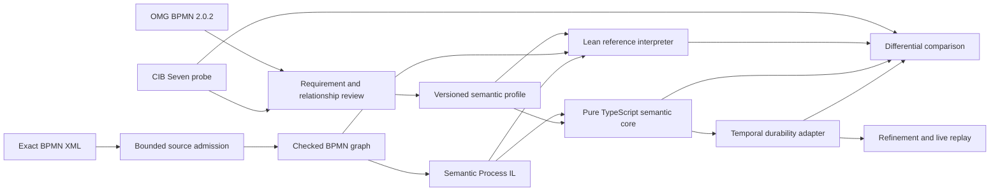

# bpmn-lean-experiment

Making BPMN execution durable, explainable, and continuously checkable.

This project builds two MIT products in one repository: a Temporal-hosted BPMN 2.0.2 execution engine whose behavior is independently defined and checked, and an API-first BPM platform on top of it. The engine roadmap follows OMG Process Execution requirements, while CIB Seven `2.2.0` orders near-term standards work and supplies a pinned oracle only for declared compatibility profiles. The platform consumes the engine's published contract and never becomes a second authority for BPMN meaning.

[PROJECT-DESIGN.md](docs/PROJECT-DESIGN.md#product-division) owns the product vision and semantic boundaries. [ARCHITECTURE.md](docs/ARCHITECTURE.md) owns the concrete modular-monolith layout and dependency direction. [IMPLEMENTATION-MAP.md](docs/IMPLEMENTATION-MAP.md) owns exact implemented and absent surfaces, and [PLAN.md](docs/PLAN.md) owns current sequencing.

## Current state

| Surface | Status |
|---|---|
| BPMN execution engine | Implemented, runnable product floor over a bounded semantic profile catalog |
| BPM platform | M1, M2, M3, and M4 closed |
| Active work | Define the M5 committed-history and diagram-position contract before implementation |
| A12 Workflows | Separate downstream product outside this repository; reusable neutral mechanisms and an optional evidence handoff are preserved without placing A12 decisions in core |

Today, the [Temporal engine runner](docs/RUNNABLE-TEMPORAL-MVP-SPEC.md) can admit exact BPMN XML, connect its Worker to an existing Temporal service, drive interactions published by a registered profile, and report final Process state. Its adapter is split by execution environment into protocol, client, Workflow, Worker, runner, and testkit packages, with no production umbrella package. Product 2 exposes deployment, admission diagnostics, definition lists, version lists, exact admitted source, exact-version start, one-shot Timer Start scheduling, one-target Message Start publication, identity-only Process-instance search, current human work, and current incident operations over confirmed Product 2 starts. The HTTP-only React workspace now includes the task inbox and typed form plus an Operations workspace with current incidents, exact Retry and root-Process Cancel, diagram highlighting, and separate action audit. Independent SQLite owners retain definition publication, Process identity, Work action state, incident action state, and audit delivery without turning any platform fact into BPMN meaning. M1, M2, and M3 remain independent regression floors; the M4 showcase proves response-loss plus platform-restart Retry, Worker-replacement Cancel, terminal corroboration, replay, private-fact exclusion, and Chromium acceptance. The [complete differential/refinement pipeline](docs/TESTING-SPEC.md#complete-differentialrefinement-pipeline) exercises every registered scenario through its declared Lean, TypeScript, compatibility, durability, mutation, and replay lanes.

## Vision and milestone plan

The near-term goal is a usable BPM platform whose public API and UI inherit the engine's checked semantics without reconstructing semantic facts. Product 2 begins as a modular monolith with business-capability modules, a small server composition root, a React web client that uses HTTP only, and independently deployed Workers. The dependency direction is executable: server to modules, modules to narrowly scoped foundation packages, and only the engine gateway to narrow engine entry points.

The showcase ladder is a dependency order, not a delivery schedule. [PLAN.md](docs/PLAN.md#showcase-milestone-ladder) owns the complete exit gates.

| Milestone | Status | Demonstration |
|---|---|---|
| M0 | Closed | Run the registered engine profile catalog through the Temporal runner |
| M1 | Closed | A third party uploads an unseen BPMN file, receives honest admission diagnostics, stores and versions it, views the diagram, and starts an admitted instance |
| M2 | Closed | Cyclic execution, four essential elements, exact-version Timer scheduling, Message Start ingress, and Process-instance search are implemented and evidence-closed |
| M3 | Closed | Boolean Process-data, User Task metadata, the real inbox, typed form, claims, completion, audit, and live/browser evidence are closure-reviewed and evidence-closed |
| M4 | Closed | Incident and exact retry, incident-scoped root cancellation, and Product 2 current operations are closure-reviewed with four-target, live Temporal, and browser evidence |
| M5 | In progress | Rebuild and explain committed execution history, diagram position, and operational views; contract discovery only |

M1 remains the first proper platform demonstration and an independent regression floor. M3 adds the real task inbox and form interaction after the engine publishes the required metadata and wider value domain.

Beyond M5, the architecture leaves explicit seams for Work, Operate, Connect, Lifecycle, Intelligence, Agents, and Administration capabilities without creating empty production packages today. These are a growth horizon, not hidden M1 scope. See [the business-module map](docs/ARCHITECTURE.md#business-modules) and [competitive scope research](docs/research/BPM-PLATFORM-COMPETITIVE-SCOPE-RESEARCH.md#dependency-ordered-roadmap).

A new machine does not need a prearranged external-source tree. The [contributor setup guide](docs/CONTRIBUTOR-SETUP-GUIDE.md) and repository-owned setup/doctor scripts provision and verify every exact external input required by the selected work scope; missing material fails the selected lane rather than reducing it. The default `verify` scope is complete for the MIT engine and never requires A12's EUPL source; downstream exact-source evidence is a separate, explicitly selected `adoption` scope.

The doctor also inventories every declared external repository and submodule, every dependency-lock owner, and every known local/external cache root. It reports canonical remotes, immutable commits or exact tags, superproject gitlinks, manifest SHA-256 values, tool locations/versions, cache presence, and cache size so a contributor or coding agent can see the whole prepared workspace rather than only the first missing item.

## Why this project exists

BPMN, CIB Seven, and Temporal solve different problems:

- BPMN 2.0.2 defines the normative notation, metamodel, and Process execution obligations.
- CIB Seven provides a mature implementation and valuable behavioral evidence, but its operational meaning is distributed across parsing, the PVM, persistence, jobs, subscriptions, and transactions.
- Temporal provides durable execution, replay, messaging, timers, Activities, and recovery, but those mechanisms do not define BPMN semantics.

A direct BPMN-to-Temporal translation risks turning SDK handlers, retries, scheduling, or replay constraints into accidental BPMN behavior. This project keeps semantic meaning in an explicit profile, Lean reference, and pure TypeScript transition system; Temporal hosts that system durably.

The product layers are intentionally one-way:

```text
BPM platform
  → selected CIB Seven compatibility profiles
    → vendor-neutral BPMN execution core
      → Temporal durability and effect hosting
```

The platform owns deployment, task and operator surfaces, history, and integration; it consumes the engine's published contract and defines no BPMN semantics. A first vertical slice may prove that the layers compose; later coverage grows by reusable BPMN mechanism, with CIB work added only when a selected compatibility question requires it. [ARCHITECTURE.md](docs/ARCHITECTURE.md) owns the concrete modular-monolith layout and dependency direction.

## Architecture



CIB contributes twice where a compatibility profile declares it: first as classified empirical input, then as the pinned behavioral oracle in differential tests. Standards-only profiles may omit CIB and use normative review plus Lean, TypeScript, and Temporal evidence without translating source into a CIB language. BPMN remains normative. CIB specificity and extensions are not mislabeled as deviations; every reviewed relationship is recorded in the prominent [CIB–BPMN register](docs/CIB-BPMN-RELATION-REGISTER.md).

The strongest parts of the approach are:

- explicit separation of exact BPMN source, checked source graph, Semantic Process program, semantic runtime state, and Temporal hosting;
- Lean as an executable semantic reference with reusable laws, not merely a model checker;
- an independently implemented TypeScript semantic core;
- CIB Seven as a pinned compatibility oracle, without copying its implementation;
- differential testing plus Temporal refinement and replay testing;
- small, evidence-closed semantic capsules instead of premature “full BPMN” claims.

## Interpreter, not code generator

The primary execution architecture is a TypeScript interpreter/evaluator:

```text
BPMN XML
  → exact source identity, bounded structural import, and profile admission
  → checked project-owned BPMN graph
  → bounded Semantic Process IL data
  → pure semantic-core transitions
  → Temporal durability and effect hosting
```

One generic Workflow hosts an admitted Semantic Process program. The project does not generate an authoritative Workflow class for each BPMN model. This keeps source/profile identity inspectable, prevents generated SDK control flow from becoming semantics, and separates parser, semantic-core, and Worker evolution.

Generated TypeScript may later be useful for diagnostics or optimization after equivalence evidence, but it is never the semantic authority by construction. The complete rationale is in [PROJECT-DESIGN.md](docs/PROJECT-DESIGN.md#interpreter-architecture), and the bounded definition contract is in [SEMANTIC-PROCESS-IL-SPEC.md](docs/SEMANTIC-PROCESS-IL-SPEC.md).

## Why Lean

Lean makes the selected operational meaning executable before it is duplicated in production code. It is most valuable when it turns a semantic risk into a reusable theorem or checked counterexample.

A representative theorem states that any mismatch in Process instance, BPMN element, or activation ordinal rejects User Task completion with exact state preservation. A nearby executable non-law demonstrates why matching only the BPMN element ID is insufficient. These results guard the identity mechanism rather than one serialized fixture.

Lean does not automatically prove the parser, CIB, TypeScript, Temporal, database, or network. Those remain distinct evidence lanes. The pipeline gives Lean the actual checked BPMN graph and Semantic Process program for every retained scenario; Lean strictly decodes both, independently recomputes lowering, rejects inequality, and only then evaluates the received program. This closes definition drift without proving parser correctness or full source-to-run preservation.

## Repository statistics

These publication statistics are refreshed only by the maintainer with `./scripts/pnpm.sh run publication-stats:update`. Tokei is available only on the maintainer's machine; it is not a contributor prerequisite or part of normal builds, tests, hooks, or CI.

### Lean declarations

<!-- publication-statistics:lean-declarations:start -->
| Metric | Count |
|---|---:|
| Public theorem declarations | 327 |
| Supporting lemma declarations | 26 |
| All declaration commands | 1,440 |
| Proof declarations / all declaration commands | 24.5% |

Supporting lemmas count `private theorem` and every explicit `lemma` command, matching the repository convention. All declaration commands count `theorem`, `lemma`, `def`, `abbrev`, `opaque`, `axiom`, `constant`, `inductive`, `structure`, `class`, and `instance` after masking Lean comments and literals.
<!-- publication-statistics:lean-declarations:end -->

### Language footprint

<!-- publication-statistics:language-footprint:start -->
| Language | Files | Code | Comments | Blanks |
|---|---:|---:|---:|---:|
| Java | 49 | 6,079 | 178 | 657 |
| TypeScript | 254 | 50,512 | 788 | 3,086 |
| Lean | 75 | 13,972 | 571 | 1,702 |
<!-- publication-statistics:language-footprint:end -->

## Quick start

Prerequisites:

- Git, `jq`, and `xmllint`;
- `curl` and either `shasum` or `sha256sum`;
- Lean through `elan`, honoring [lean-toolchain](lean-toolchain);
- Node `24.18.0`, selected through [.nvmrc](.nvmrc), [.node-version](.node-version), or the Homebrew fallback;
- pnpm `11.20.0`;
- Java 21, optionally selected with `BPMN_JAVA_HOME`;
- permission for the first Temporal test to download pinned CLI `v1.8.1` into ignored `.cache/temporal-cli/` and run a local server.

```sh
nvm install
nvm use
./scripts/setup-external-sources.sh verify
./scripts/pnpm.sh install --frozen-lockfile
./scripts/doctor.sh verify
./scripts/pnpm.sh run test:pre-push:verify
```

Useful focused gates:

```sh
./scripts/pnpm.sh run test:semantic
./scripts/pnpm.sh run test:bpmn-source
./scripts/test-cibseven-oracle.sh
./scripts/pnpm.sh run test:temporal
./scripts/pnpm.sh run test:pipeline
./scripts/pnpm.sh run test:platform-m1
./scripts/pnpm.sh run test:showcase:m1
./scripts/pnpm.sh run test:showcase:m2
./scripts/pnpm.sh run test:showcase:m3-human-work
./scripts/pnpm.sh run test:showcase:m4-incident-operations
node --test scripts/platform-product-boundary.test.ts
```

Run the local platform definition server with `./scripts/pnpm.sh run platform:serve`. It defaults to `http://127.0.0.1:3000` and stores local data under ignored `.data/platform/`. In a second terminal, run `./scripts/pnpm.sh --filter @bpmn-lean/platform-web exec vite --host 127.0.0.1` and open the printed local URL for the definition workspace. The M1, M2, and M3 browser gates share development-only Playwright and Chromium; install that test browser once with `./scripts/pnpm.sh --filter @bpmn-lean/showcase-m1-definition-deployment exec playwright install chromium`.

When a task explicitly needs the optional A12 exact-source evidence, provision and run it separately with `./scripts/setup-external-sources.sh adoption` followed by `./scripts/test-a12-adoption.sh`.

Invoke Lean through [`./scripts/lake.sh`](scripts/lake.sh) rather than `lake`. It forwards every Lake argument unchanged and is the single owner of Lean's build parallelism, pinned by `config.leanBuildThreads` in [package.json](package.json) and exported as `LEAN_NUM_THREADS`:

```sh
./scripts/lake.sh build
./scripts/lake.sh test
```

The default is deliberately conservative: this project decides finite fixtures in the Lean kernel, kernel reduction holds its terms in resident memory, and Lake otherwise sizes its build pool from the host's core count, which measured a 7978 MB peak on an 8-core machine against 2411 MB pinned. Raise it per run on a host with spare RAM, and measure rather than extrapolate, because it did not scale linearly:

```sh
LEAN_NUM_THREADS=4 ./scripts/verify.sh
```

Ordinary Lean development uses that wrapper directly and does not require Docker. Changes that can increase kernel-reduction cost need a hard memory-bounded narrow measurement before the complete Lean gate. [The contributor setup guide](docs/CONTRIBUTOR-SETUP-GUIDE.md#memory-bounded-lean-measurements) explains the platform-specific choice: native cgroups on Linux, Docker as the macOS fallback, and a verified native equivalent or container elsewhere.

The complete gate matrix and evidence boundaries are in [TESTING-SPEC.md](docs/TESTING-SPEC.md).

## Run the Temporal engine runner

Running the product surface needs far less than developing it: the full [Quick start](#quick-start) prerequisites above are for the verification gates, while the runtime path is TypeScript only and needs no Lean, Java, or reference checkout.

To run it you need:

- Node `24.18.0` and pnpm `11.20.0`, as pinned in [package.json](package.json);
- the **Temporal CLI**, which provides the local development server. Install it with `brew install temporal`, or follow [the Temporal CLI documentation](https://docs.temporal.io/cli#install). The BPMN runtime itself never starts a server or binds a server port, so an already-running Temporal service is equally fine.

```sh
./scripts/pnpm.sh install --frozen-lockfile
temporal server start-dev --headless
./scripts/pnpm.sh run mvp:run -- examples/temporal-mvp/user-task-discovery-completion.json
```

Run the server and the BPMN command in separate terminals. The maintained examples expect `localhost:7233`, Namespace `default`, and a fresh semantic Process-instance ID; edit the explicit `temporal` fields or `process.instanceId` in a copied config when either differs, because Workflow ID reuse is deliberately rejected.

One example needs no Temporal service at all and demonstrates that an unsupported model is rejected before any connection is opened:

```sh
./scripts/pnpm.sh run mvp:run -- examples/temporal-mvp/unsupported.json
```

Every registered semantic profile has at least one example in [examples/temporal-mvp](examples/temporal-mvp); pick any of them. The [engine runner specification](docs/RUNNABLE-TEMPORAL-MVP-SPEC.md#public-operating-contract) documents the supported BPMN and data subset, emitted event records, exit codes, and bounded feature set this command does and does not claim.

## Repository guide

```text
BpmnSemantics/       Lean semantic definitions, laws, conformance witnesses, and isolated experiments
contracts/           Current language-neutral JSON Schemas
docs/                Architecture, capsules, research, experiments, testing, provenance, and plan
packages/            Neutral contract types plus product-1 BPMN source, semantic core, comparator, and Temporal subsystem
platform/            Product 2 modular-monolith ownership tree and future production packages
profiles/            Reviewed semantic-profile artifacts
runners/             Pinned external semantic-oracle runners
scenarios/           Answer-free BPMN scenarios and separate content-bound evidence
scripts/             Maintained verification and infrastructure guards
showcase/            Product 2 milestone acceptance gates, never reusable production code
```

| Need | Read |
|---|---|
| Inspect and run the complete implemented catalog | [IMPLEMENTATION-MAP.md](docs/IMPLEMENTATION-MAP.md) and the [complete differential/refinement pipeline](docs/TESTING-SPEC.md#complete-differentialrefinement-pipeline) |
| Prepare a clean machine or coding agent | [CONTRIBUTOR-SETUP-GUIDE.md](docs/CONTRIBUTOR-SETUP-GUIDE.md) |
| Understand mission, authority, Lean, and interpreter decisions | [PROJECT-DESIGN.md](docs/PROJECT-DESIGN.md) |
| Understand package layout, module ownership, and deployment shape | [ARCHITECTURE.md](docs/ARCHITECTURE.md) |
| See exact current support and gaps | [IMPLEMENTATION-MAP.md](docs/IMPLEMENTATION-MAP.md) |
| Resume the next work | [PLAN.md](docs/PLAN.md) |
| Review the active semantic meaning and admission | [Capsule registry](docs/capsules/README.md), [Profile-parameterized admission spec](docs/PROFILE-PARAMETERIZED-ADMISSION-SPEC.md), [Exclusive Gateway condition spec](docs/capsules/EXCLUSIVE-GATEWAY-CONDITION-SPEC.md), and [Semantic Process IL spec](docs/SEMANTIC-PROCESS-IL-SPEC.md) |
| Understand CIB relative to BPMN | [CIB-BPMN-RELATION-REGISTER.md](docs/CIB-BPMN-RELATION-REGISTER.md) |
| Navigate all maintained documentation | [Documentation registry](docs/README.md) |
| Read an independent assessment of the architecture, assurance, and feasibility | [bpmn-lean-experiment-assessment](https://github.com/mbackschat/bpmn-lean-experiment-assessment) |

The assessment repository is a separate, explanatory and evaluative record maintained against a named commit of this tree. It is not authoritative: the documents above own every claim, and any disagreement is a defect in that record rather than in this one.

## Contributing

Read [CLAUDE.md](CLAUDE.md) or its symlink [AGENTS.md](AGENTS.md) before changing the project. They define authority boundaries, TDD and Clean Code expectations, documentation ownership, dependency approval, pre-release evolution policy, verification, and Git delivery rules.

Semantic changes begin with the smallest source-grounded separating witness and end with an honest claim boundary, independent evidence, a meaningful mutation, and an epistemic-closure review.

## License

Project-authored code and documentation are licensed under the [MIT License](LICENSE).

External standards, fixtures, reference repositories, and locally ignored research material retain their own licenses and provenance. See [SOURCES.md](docs/SOURCES.md).
