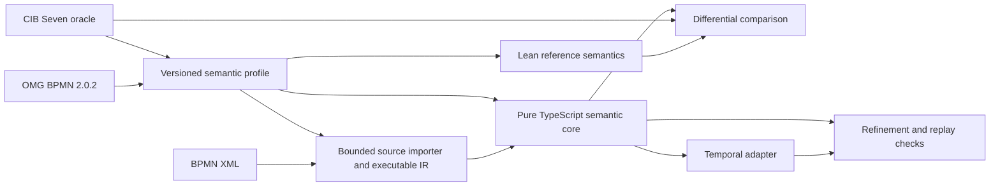

# bpmn-lean-experiment

Making BPMN execution durable, explainable, and continuously checkable.

This project is an experiment toward a Temporal-hosted BPMN 2.0.2 execution adapter whose behavior is defined independently, checked formally, and compared continuously with CIB Seven. It combines a versioned semantic profile, an executable Lean reference interpreter, a pure TypeScript semantic core, a thin Temporal durability adapter, and differential/refinement testing.

The ambition is deliberately high: not merely to translate BPMN shapes into Workflow code, but to build an auditable chain from the standard and observed engine behavior to production execution.

> **Project status:** The end-to-end `None Start Event → User Task → None End Event` experiment is executable. One content-addressed BPMN model is parsed from exact source bytes, compiled into versioned executable IR, and evaluated through CIB Seven, Lean, the pure TypeScript semantic core, and Temporal for lifecycle, exact completion, wrong activation, and stale completion. The fast gate also checks exact Query/Update refinement, duplicate-command handling, live and retained replay, cleanup, and seeded disagreements. The capsule closure and feasibility review remains next. The repository does not yet contain a general BPMN engine and makes no BPMN-conformance or immutable CIB-compatibility claim.

## Why this project exists

BPMN, CIB Seven, and Temporal solve different problems:

- BPMN 2.0.2 defines the notation, metamodel, and Process execution obligations, but many operational details require careful interpretation.
- CIB Seven supplies valuable production behavior and a large inherited regression corpus, but its semantics is distributed across parsing, the PVM, persistence, jobs, subscriptions, and transactions.
- Temporal supplies durable execution, replay, timers, messages, Activities, and recovery, but those mechanisms do not inherently define BPMN behavior.

A direct BPMN-to-Temporal translation would allow SDK mechanics, replay constraints, or ad hoc implementation choices to become accidental semantics. This project instead separates meaning from hosting and continuously checks the boundaries.

## Goal

The ultimate standards target is **OMG BPMN 2.0.2 Process Execution Conformance** for an adapter that imports executable BPMN Process diagrams, including their definitional Collaboration, and runs them durably on Temporal.

That is intentionally distinct from:

- **BPMN Complete Conformance**, which additionally covers Process Modeling, BPEL Process Execution, and Choreography Modeling;
- **CIB Seven compatibility**, which is a separately versioned claim about one pinned release, configuration, feature surface, and observation boundary;
- **Temporal correctness**, which requires replay and refinement evidence showing that durable hosting preserves semantic-core-visible BPMN behavior.

The exact claim boundary is documented in [BPMN-CONFORMANCE-TARGET.md](docs/BPMN-CONFORMANCE-TARGET.md).

## Architecture



| Component | Responsibility | Explicit boundary |
|---|---|---|
| Semantic profile | Pin the standard interpretation, CIB release/configuration, supported features, observations, and known deviations | A profile is not an engine build or an informal compatibility promise |
| BPMN source ingestion | Preserve exact bytes and identity, perform bounded structural import, normalize diagnostics, and compile admitted source to versioned project-owned IR | The private parser graph and CMOF-derived facts do not define execution behavior |
| Lean reference interpreter | Give the selected profile executable operational meaning and support machine-checked properties | Lean does not automatically verify CIB, TypeScript, Temporal, parsers, databases, or networks |
| Pure TypeScript semantic core | Implement the production semantic state transition independently and deterministically | It performs no I/O and depends on neither CIB Seven nor Temporal |
| Temporal adapter | Persist semantic state, deliver inputs, schedule declared effects/timers, and survive replay | It may add hidden durable work but may not redefine BPMN behavior |
| Assurance pipeline | Run neutral scenarios, compare canonical observations, retain regressions, and test adapter refinement | Finite testing supports bounded claims; it is not universal proof |

The pure semantic core is intentional. It prevents Temporal handler structure, Activity retries, Workflow replay, or SDK scheduling from silently becoming BPMN semantics while still allowing Temporal to provide durability.

### BPMN ingestion and execution

The target architecture is an interpreter/evaluator, not a BPMN-to-TypeScript code generator:

```text
BPMN 2 XML
  → source-preserving BPMN model
  → validation and profile admission
  → content-addressed executable IR (versioned data)
  → TypeScript semantic core evaluation
  → Temporal durability, messages, timers, and effects
```

XML parsing and normalization happen outside deterministic Workflow execution. A generic Workflow hosts an immutable executable representation and the TypeScript semantic core advances its BPMN state. Generated TypeScript may later be useful as a derived diagnostic or optimization artifact, but it is not the semantic authority. The rationale and replay consequences are recorded in [PROJECT-DESIGN.md](docs/PROJECT-DESIGN.md).

The first bounded ingestion slice now implements this path for exactly one executable `None Start Event → User Task → None End Event` Process. `bpmn-moddle@10.0.0` is isolated in `@bpmn-lean/bpmn-source`; exact bytes, hash, encoding, normalized diagnostics, and a partial CMOF-derived manifest stay outside the pure core and Temporal Workflow bundle. Unsupported elements, non-UTF-8 declarations, parser warnings, and DOCTYPE input fail closed. General BPMN compilation, source locations, extension semantics, full metamodel generation, and deployment storage remain future work.

## Assurance pipeline

Every semantic capsule is intended to travel through the same short feedback loop:

```text
BPMN/spec research + CIB probe
                ↓
profile decision + neutral scenario
                ↓
executable Lean semantics
                ↓
pure TypeScript semantic core
                ↓
Temporal adapter
                ↓
differential + refinement + replay checks
                ↺
classified, minimized disagreement
```

The systems compare canonical public consequences rather than internal data structures. Runtime-generated IDs, database rows, PVM execution counts, and Temporal Event History are not automatically part of the semantic contract.

## Current status

Milestone 0 establishes the complete fast pipeline using the smallest useful external-wait scenario:

```text
none Start Event → User Task → none End Event
```

| Surface | Current state |
|---|---|
| Planning and contracts | M0.0 through M0.6 complete; profile, scenario, observation, runner, comparison, replay, provenance, and feedback-budget contracts are executable |
| BPMN sources | Official BPMN 2.0.2 PDF and machine-readable corpus ingested locally; exact source capture, security/encoding preflight, private `bpmn-moddle@10.0.0` import, normalized diagnostics, a checked partial CMOF manifest, and the first sequential compiler are implemented |
| Lean | The sequential User Task interpreter derives the retained lifecycle trace and the interaction capsule’s successful, wrong-activation, and stale-completion traces; it proves exact completion, wrong-activation state preservation, and the element-only identity non-law |
| CIB Seven | Pinned `v2.2.0` embedded runner deploys, starts, observes, completes, rejects wrong and stale task occurrences without state change, cleans every run, and exposes a diagnostic PVM projection through a persistent JSON-lines boundary |
| TypeScript semantic core | The dependency-free sequential User Task semantic core consumes only validated project-owned IR, independently derives lifecycle, exact, wrong-activation, and stale-completion results, and rejects identity or topology mismatch |
| Temporal adapter | A full local Temporal server hosts one Workflow loop around the semantic core; exact open-task Query and acknowledged completion Update preserve the core’s projection and command outcomes, duplicate logical commands are deduplicated, and committed Signal and Update histories replay |
| Evidence | One prepared command compiles the exact BPMN source and batches four answer-free cases through one CIB engine, one Lean emitter, the semantic core, and eight isolated Temporal executions; every target agrees, retained CIB evidence agrees, seeded state and task-projection mutations are detected, four live and two committed histories replay together, cleanup is proven, and the warm budget holds |

The authoritative live checkpoint and next task are in [PLAN.md](docs/PLAN.md); exact implemented and absent surfaces are in [IMPLEMENTATION-MAP.md](docs/IMPLEMENTATION-MAP.md).

## Quick start

The current verification gate requires:

- Git;
- `jq`;
- `xmllint`;
- `shasum`;
- a Lean installation that honors the pinned [lean-toolchain](lean-toolchain), normally through `elan`.
- Node `24.18.0`, selected through the root [.nvmrc](.nvmrc), [.node-version](.node-version), or the Homebrew `node@24` keg;
- pnpm `11.17.0`, with dependencies installed by `./scripts/pnpm.sh install --frozen-lockfile`;
- permission to download and execute the pinned Temporal CLI `v1.8.1` on the first Temporal test run; it is cached under the ignored `.cache/temporal-cli/` directory;
- Homebrew Java 21 at `/opt/homebrew/opt/openjdk@21`, or `BPMN_JAVA_HOME` pointing to another Java 21 installation.

The Node wrapper uses an already active exact nvm/asdf-compatible Node first and falls back to the Homebrew keg without changing shell configuration:

```sh
nvm install
nvm use
./scripts/pnpm.sh install --frozen-lockfile
```

Run the maintained verification gate:

```sh
./scripts/verify.sh
```

The repository-local Maven wrapper downloads the approved Maven and Java dependencies on its first run. To run only the CIB oracle gate:

```sh
./scripts/test-cibseven-oracle.sh
```

Run the fast semantic gate (Lean plus TypeScript semantic core):

```sh
./scripts/pnpm.sh run test:semantic
```

Run only the BPMN source/CMOF boundary:

```sh
./scripts/pnpm.sh run test:bpmn-source
```

Run the optional local MIWG import observation gate:

```sh
./scripts/pnpm.sh run test:miwg
```

Run the focused Temporal refinement and replay gate:

```sh
./scripts/pnpm.sh run test:temporal
```

Run the complete fast pipeline:

```sh
./scripts/pnpm.sh run test:pipeline
```

Run the provisional semantic-representation spike separately:

```sh
lake build checkSemanticRepresentationSpike
lake exe checkSemanticRepresentationSpike
```

The spike is a bounded architecture experiment, not part of the approved BPMN semantic authority.

## Repository guide

```text
BpmnSemantics/       Lean contracts, executable semantic capsules, and isolated experiments
contracts/           Language-neutral profile, scenario, and canonical-result schemas
docs/                Architecture, plans, research, testing, and source provenance
packages/            BPMN source importer, TypeScript semantic core, differential comparator, and Temporal adapter
profiles/            Versioned semantic-profile artifacts
runners/             Persistent external semantic-oracle runners
scenarios/           Neutral BPMN models, stimuli, and observation requests
scripts/             Maintained verification entry points
```

Start with the [documentation registry](docs/README.md). Common routes are:

| Need | Read |
|---|---|
| Understand the mission and authority boundaries | [PROJECT-DESIGN.md](docs/PROJECT-DESIGN.md) |
| Resume implementation | [PLAN.md](docs/PLAN.md) and [IMPLEMENTATION-MAP.md](docs/IMPLEMENTATION-MAP.md) |
| Understand the first full-pipeline milestone | [MILESTONE-0-FAST-PIPELINE.md](docs/MILESTONE-0-FAST-PIPELINE.md) |
| Review the active semantic contract | [User Task interaction capsule](docs/capsules/USER-TASK-INTERACTION.md) |
| Change a shared wire format | [Shared wire contracts](contracts/README.md) |
| Understand BPMN, CIB PVM, fUML/PSSM, or Temporal research | [Research index](docs/research/README.md) |
| Review provisional architecture discriminators | [Experiment index](docs/experiments/README.md) |
| Run the correct assurance gate | [TESTING.md](docs/TESTING.md) |
| Locate pinned external sources | [SOURCES.md](docs/SOURCES.md) |

## Design principles

- Treat BPMN as the normative standard and CIB Seven as a versioned behavioral oracle.
- Compile source-preserving BPMN into an explicit executable semantic representation.
- Keep shared definitions separate from per-instance runtime state.
- Keep Lean, the semantic core, CIB Seven, and Temporal independently implemented.
- Make time, scheduler choices, multiplicity, scope, enabled inputs, and command outcomes explicit.
- Separate BPMN-visible retries and effects from Temporal transport behavior.
- Prefer small separating examples and classified counterexamples over broad unexamined implementation.
- Make no public claim larger than the profile and evidence that support it.

## Roadmap

- [x] M0.0 — durable fast-pipeline plan
- [x] M0.1 — neutral scenario and observation contracts
- [x] M0.2 — calibrated embedded CIB Seven runner
- [x] M0.3 — executable Lean semantic capsule
- [x] M0.4 — independent pure TypeScript semantic core
- [x] M0.5 — Temporal adapter and retained-history replay
- [x] M0.6 — fast differential/refinement gate with injected disagreement
- [x] First ingestion slice — exact BPMN source → versioned sequential IR → core → Temporal → differential gate
- [x] First interaction slice — exact User Task Query/Update → Lean/core/CIB/Temporal differential and live replay gate

Later milestones expand BPMN coverage one semantic capsule at a time; they do not begin with a broad engine rewrite.

## Contributing

Read [CLAUDE.md](CLAUDE.md) or its equivalent [AGENTS.md](AGENTS.md) before changing the project. The shared guide defines authority boundaries, mandatory research routes, TDD expectations, documentation ownership, dependency approval, source-checkout discipline, verification, and Git conventions.

Semantic changes begin with the smallest source-grounded separating case and end with updated evidence and an honest implementation boundary. Dependencies and profile-expanding decisions require explicit approval.

## License

Project-authored code and documentation are licensed under the [MIT License](LICENSE).

The license does not relicense external standards, fixtures, reference repositories, or locally ignored research material. Those artifacts retain their own license and provenance boundaries.
