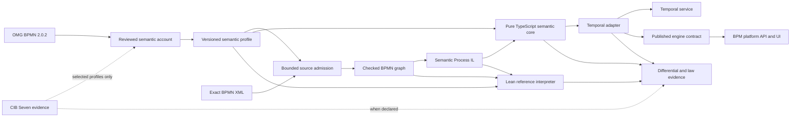
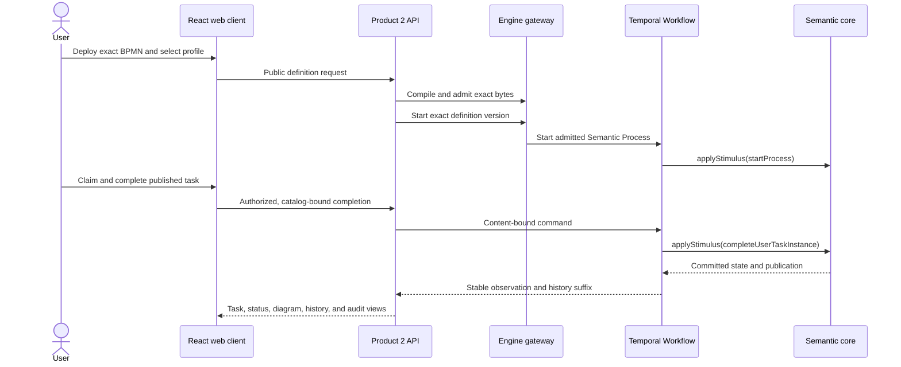

# bpmn-lean-experiment

BPMN is a portable process language. Executing it durably without letting parser behavior, retry policy, SDK control flow, or UI state quietly redefine that language is the harder problem.

This repository builds two MIT-licensed products around that boundary: a BPMN 2.0.2 execution engine hosted on Temporal, and an HTTP-first BPM platform that consumes only the engine's published contract. BPMN meaning is stated in reviewed semantic profiles, made executable in Lean, independently transcribed into a pure TypeScript evaluator, and then hosted by a Temporal adapter that adds durability without adding BPMN semantics.

[PROJECT-DESIGN.md](docs/PROJECT-DESIGN.md) owns the product and authority model. [ARCHITECTURE.md](docs/ARCHITECTURE.md) owns the concrete package and deployment shape. [`implementation-status-router`](docs/IMPLEMENTATION-MAP.md) routes exact implemented-and-absent inventories, while [PLAN.md](docs/PLAN.md) records only current work.

## Why this project exists

BPMN 2.0.2, CIB Seven, and Temporal answer different questions:

- **BPMN 2.0.2** defines the normative notation, metamodel, and Process Execution obligations.
- **CIB Seven** is a mature executable implementation and a useful empirical oracle for explicitly selected compatibility profiles, but it is not the normative standard.
- **Temporal** supplies durable execution, replay, messaging, timers, Activities, and recovery, but those mechanisms do not define BPMN behavior.

A direct BPMN-to-Temporal translation can accidentally turn Workflow handlers, retries, Event History, or SDK scheduling into process semantics. This project instead keeps the evaluator pure and explicit, then proves that the host preserves the public result. The platform is downstream again: it may present, authorize, store, and operate published facts, but it may not reconstruct missing BPMN facts from Temporal or its own database.

## Current implementation

Read [PLAN.md](docs/PLAN.md) for current execution order, root [`implementation-status-router`](docs/IMPLEMENTATION-MAP.md) for implementation routing, the [`implementation-status-owner:BPM-PLATFORM`](docs/BPM-PLATFORM-IMPLEMENTATION-MAP.md) for Product 2 status, and the [executable model corpus](model-corpus/README.md) for retained whole-model coverage. These agent-facing owners carry volatile status; this human-facing README does not duplicate it.

## Architecture at a glance



The components deliberately have different jobs:

| Component | Responsibility | Explicit boundary |
|---|---|---|
| Lean reference | Executable operational account, reusable theorems, and checked counterexamples | Does not prove the XML parser, TypeScript implementation, Temporal, database, or network |
| TypeScript semantic core | Dependency-free production evaluator for immutable Semantic Process programs | Performs no I/O and imports no Temporal, CIB, or platform code |
| BPMN source ingestion | Captures exact bytes, validates the selected profile, builds the checked graph, and lowers to the IL | Raw moddle objects never leave the package |
| Temporal adapter | Durably hosts one semantic Process instance per Workflow, carries commands, timers, effects, results, and replay | Temporal tasks, attempts, retries, and Event History never become BPMN facts |
| BPM platform | Owns deployment, identity, work, forms, operations, projections, audit, and the browser UI | Consumes only narrowed public engine entry points |

Lean and TypeScript are separately authored realizations of the same reviewed account. They are independent enough to expose transcription defects, but they are not two votes that get to choose different BPMN meanings. The complete evidence pipeline also checks source lowering, selected CIB compatibility, Temporal refinement, recovery, and replay because agreement between two evaluators alone would not cover those boundaries.

## Key decisions

- **Interpreter, not code generator.** One generic evaluator executes immutable Semantic Process data. Generated TypeScript is not an authority for a model's meaning.
- **Exact source and profile identity.** Admission binds the original BPMN bytes, digest, selected profile, and resulting checked representations. A different source or profile is a different definition.
- **Bounded, honest claims.** A profile states exactly which structure and behavior are admitted. Unsupported BPMN is rejected or preserved as declared, never silently approximated.
- **CIB is classified evidence.** CIB Seven is used only where a profile names the relationship and observation boundary. Standards-only profiles do not invent a CIB comparison.
- **Durability is below semantics.** Temporal hosts commands and recovery; the pure core decides BPMN-visible outcomes.
- **The platform stays downstream.** Product 2 may enrich human and operational workflows, but forms, claims, audit, and persistence do not leak into the BPMN core.

## Technical walkthrough

### From XML to one pure transition

The source package returns either a deterministic rejection with located diagnostics or an accepted checked graph and Semantic Process program. The semantic core then applies an explicit stimulus to an explicit runtime state:

```ts
import {
  BpmnCompilationStatus,
  compileBpmnToSemanticProcess,
} from "@bpmn-lean/bpmn-source";
import {
  StimulusKind,
  applyStimulus,
  initialState,
  observeStableState,
} from "@bpmn-lean/semantic-core";

const compilation = await compileBpmnToSemanticProcess({
  bytes,
  sourceId: "review.bpmn",
  expectedSha256: undefined,
  semanticProfile: "cibseven-2.2.0-user-task-boolean-completion-data-draft",
  sourceOverlay: null,
  limits: { maxBytes: 1024 * 1024, parserDeadlineMs: 1_000 },
});

if (compilation.status !== BpmnCompilationStatus.Accepted) {
  throw new Error(JSON.stringify(compilation.diagnostics));
}

const started = applyStimulus(compilation.semanticProcess, initialState, {
  kind: StimulusKind.StartProcess,
  commandId: "start-process",
  processId: "Process_Review",
  instanceId: "Instance_1",
  initialVariables: [],
});

const observation = observeStableState(compilation.semanticProcess, started.state);
```

`applyStimulus` is pure: equal admitted programs, states, stimuli, and closure limits produce equal results. The Temporal Workflow calls this same incremental boundary and durably retains its command/result protocol; it does not replace it with generated Workflow control flow.

### Through the browser lifecycle



The maintained [browser walkthrough](docs/BPM-PLATFORM-BROWSER-WALKTHROUGH.md) turns this sequence into hands-on exercises using the production server, web client, Temporal-hosted engine, structured expense-exception model, and incident Operations views.

## Quick start

### Run the Temporal engine

The runtime path needs Node `24.18.0`, pnpm `11.20.0`, and a Temporal service. It does not need Lean, Java, or the CIB checkout.

Start a local Temporal service in one terminal:

```sh
brew install temporal
temporal server start-dev --headless
```

Run a maintained model in another:

```sh
./scripts/pnpm.sh install --frozen-lockfile
./scripts/pnpm.sh run mvp:run -- examples/temporal-mvp/user-task-discovery-completion.json
```

The examples expect `localhost:7233`, Namespace `default`, and a fresh semantic Process-instance ID. The [runner specification](docs/RUNNABLE-TEMPORAL-MVP-SPEC.md) owns inputs, outputs, exit codes, and supported interaction shapes.

### Use the BPM platform in a browser

Start the complete evaluation distribution with one command:

```sh
./scripts/pnpm.sh run evaluation:start
```

Open [http://localhost:3000](http://localhost:3000), then follow the screenshot-backed, text-first [browser walkthrough](docs/BPM-PLATFORM-BROWSER-WALKTHROUGH.md) for definition deployment, structured task completion, incident recovery, Process inspection, and hands-on exercises. The Compose path builds the exact PostgreSQL 18 shared platform, Temporal development service, Product 1 BPMN Worker, Product 2 API/web application, and Product 2 recovery Worker. PostgreSQL and Temporal state survive ordinary stops in named Docker volumes.

```sh
./scripts/pnpm.sh run evaluation:stop
```

Use `./scripts/pnpm.sh run evaluation:reset` only when you deliberately want to remove both evaluation volumes. This distribution is an evaluation path, not a production Temporal deployment or a capacity claim.

### Prepare a contributor environment

The full verification environment additionally needs Git, `curl`, `jq`, `xmllint`, `unzip`, Lean through `elan`, and Java 21:

```sh
nvm install
nvm use
./scripts/setup-external-sources.sh verify
./scripts/pnpm.sh install --frozen-lockfile
./scripts/doctor.sh verify
./scripts/pnpm.sh run test:pre-push:verify
```

Use [`./scripts/lake.sh`](scripts/lake.sh) for every Lean build. It is the single owner of repository Lean parallelism and prevents concurrent build trees. Setup, memory-bounded Lean guidance, and clean-machine recovery are in the [contributor setup guide](docs/CONTRIBUTOR-SETUP-GUIDE.md); the complete gate matrix is in [TESTING-SPEC.md](docs/TESTING-SPEC.md).

## Repository statistics

These publication statistics are refreshed by the maintainer with `./scripts/pnpm.sh run publication-stats:update`. Tokei is a publication tool, not a contributor prerequisite or normal CI dependency.

### Lean declarations

<!-- publication-statistics:lean-declarations:start -->
| Metric | Count |
|---|---:|
| Public theorem declarations | 815 |
| Supporting lemma declarations | 93 |
| All declaration commands | 2,974 |
| Proof declarations / all declaration commands | 30.5% |

Supporting lemmas count `private theorem` and every explicit `lemma` command, matching the repository convention. All declaration commands count `theorem`, `lemma`, `def`, `abbrev`, `opaque`, `axiom`, `constant`, `inductive`, `structure`, `class`, and `instance` after masking Lean comments and literals.
<!-- publication-statistics:lean-declarations:end -->

### Language footprint

<!-- publication-statistics:language-footprint:start -->
| Language | Files | Code | Comments | Blanks |
|---|---:|---:|---:|---:|
| Java | 83 | 11,167 | 243 | 1,103 |
| TypeScript | 1,083 | 202,759 | 5,292 | 13,784 |
| Lean | 136 | 28,795 | 1,699 | 3,468 |
<!-- publication-statistics:language-footprint:end -->

## Repository guide

```text
BpmnSemantics/       Lean definitions, laws, conformance witnesses, and experiments
contracts/           Language-neutral JSON Schemas
docs/                Architecture, specifications, research, testing, and current plan
model-corpus/        Retained and classified executable whole-model corpus
packages/            Product 1 source, semantic core, comparison, API, and Temporal packages
platform/            Product 2 modular-monolith applications, modules, foundations, and UI
profiles/            Reviewed semantic-profile artifacts
runners/             Pinned adapters to external executable oracles
scenarios/           Answer-free BPMN scenarios and separate content-bound evidence
scripts/             Maintained verification and infrastructure guards
showcase/            Production-bound Product 2 acceptance harnesses
```

| Need | Read |
|---|---|
| Try the browser product | [Browser walkthrough](docs/BPM-PLATFORM-BROWSER-WALKTHROUGH.md) |
| Route to exact support and restrictions | [`implementation-status-router`](docs/IMPLEMENTATION-MAP.md) |
| Understand the semantic and product boundaries | [Project design](docs/PROJECT-DESIGN.md) |
| Understand packages and deployment | [Architecture](docs/ARCHITECTURE.md) |
| Inspect the executable model collection | [Model corpus](model-corpus/README.md) |
| Prepare a clean machine | [Contributor setup guide](docs/CONTRIBUTOR-SETUP-GUIDE.md) |
| Navigate all maintained documentation | [Documentation registry](docs/README.md) |
| Resume current work | [Plan](docs/PLAN.md) |

## Contributing

Read [CLAUDE.md](CLAUDE.md), also exposed through the [AGENTS.md](AGENTS.md) symlink, before changing the project. Semantic changes begin with the smallest source-grounded separating witness and end with an honest claim boundary, independent evidence, a meaningful mutation, and the applicable review gate.

## License

Project-authored code and documentation are licensed under the [MIT License](LICENSE). External standards, fixtures, reference repositories, and locally ignored research material retain their own licenses and provenance; see [SOURCES.md](docs/SOURCES.md).
