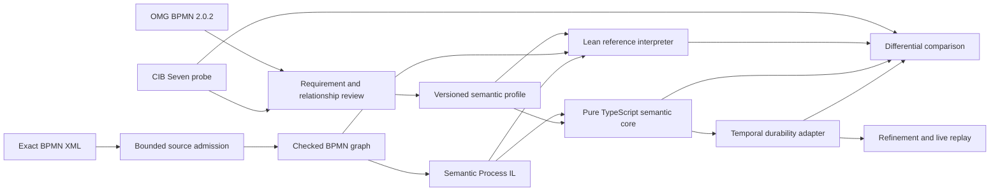

# bpmn-lean-experiment

Making BPMN execution durable, explainable, and continuously checkable.

This project explores a Temporal-hosted BPMN 2.0.2 execution adapter whose behavior is defined independently, checked formally, and compared continuously with CIB Seven. The ultimate goal is OMG BPMN Process Execution Conformance for imported executable Process diagrams—not merely translating BPMN shapes into Workflow code.

> **Status:** The bounded `None Start Event → User Task → None End Event` MVP is evidence-closed as a draft. Exact completion, wrong activation, and stale completion agree across pinned CIB Seven, an executable Lean reference interpreter, an independent pure TypeScript semantic core, and a Temporal adapter. Exact BPMN lowers through a checked project-owned graph to the bounded Semantic Process program. Lean and TypeScript independently implement the approved parallel fork/join behavior; canonical pinned-CIB evidence covers both balanced completion orders; and focused Temporal evidence covers two simultaneous waits, both ordered completion sequences, duplicate delivery, concurrent client submission, exact intermediate Query state, Update-before-Workflow completion, and live replay. The parallel four-target comparison remains open. This repository is not yet a general BPMN engine and makes no OMG conformance or immutable CIB compatibility claim.

Start with the [end-to-end MVP walkthrough](docs/MVP-WALKTHROUGH.md) to follow exact BPMN XML through source admission, checked-graph projection, Semantic Process lowering, CIB observation, Lean definitions and laws, TypeScript evaluation, Temporal Query/Update hosting, differential comparison, mutation, and replay.

## Why this project exists

BPMN, CIB Seven, and Temporal solve different problems:

- BPMN 2.0.2 defines the normative notation, metamodel, and Process execution obligations.
- CIB Seven provides a mature implementation and valuable behavioral evidence, but its operational meaning is distributed across parsing, the PVM, persistence, jobs, subscriptions, and transactions.
- Temporal provides durable execution, replay, messaging, timers, Activities, and recovery, but those mechanisms do not define BPMN semantics.

A direct BPMN-to-Temporal translation risks turning SDK handlers, retries, scheduling, or replay constraints into accidental BPMN behavior. This project keeps semantic meaning in an explicit profile, Lean reference, and pure TypeScript transition system; Temporal hosts that system durably.

## Architecture



CIB contributes twice: first as classified empirical input to the profile, then as the pinned behavioral oracle in differential tests. BPMN remains normative. CIB specificity and extensions are not mislabeled as deviations; every reviewed relationship is recorded in the prominent [CIB–BPMN register](docs/CIB-BPMN-RELATION-REGISTER.md).

The strongest parts of the approach are:

- explicit separation of exact BPMN source, checked source graph, Semantic Process program, semantic runtime state, and Temporal hosting;
- Lean as an executable semantic reference with reusable laws—not merely a model checker;
- an independently implemented TypeScript semantic core;
- CIB Seven as a pinned compatibility oracle, without copying its implementation;
- differential testing plus Temporal refinement and replay testing;
- small, evidence-closed semantic capsules instead of premature “full BPMN” claims.

## Interpreter, not code generator

The primary execution architecture is a TypeScript interpreter/evaluator:

```text
BPMN XML
  → exact source identity, bounded structural import, and profile admission
  → checked project-owned BPMN graph
  → bounded Semantic Process IL data
  → pure semantic-core transitions
  → Temporal durability and effect hosting
```

One generic Workflow hosts an admitted Semantic Process program. The project does not generate an authoritative Workflow class for each BPMN model. This keeps source/profile identity inspectable, prevents generated SDK control flow from becoming semantics, and separates parser, semantic-core, and Worker evolution.

Generated TypeScript may later be useful for diagnostics or optimization after equivalence evidence, but it is never the semantic authority by construction. The complete rationale is in [PROJECT-DESIGN.md](docs/PROJECT-DESIGN.md#interpreter-architecture), and the bounded definition contract is in [SEMANTIC-PROCESS-IL-PROPOSAL.md](docs/SEMANTIC-PROCESS-IL-PROPOSAL.md).

## Why Lean

Lean makes the selected operational meaning executable before it is duplicated in production code. It is most valuable when it turns a semantic risk into a reusable theorem or checked counterexample.

The current capsule proves that any mismatch in Process instance, BPMN element, or activation ordinal rejects User Task completion with exact state preservation. A nearby executable non-law demonstrates why matching only the BPMN element ID is insufficient. These results guard the identity mechanism rather than one serialized fixture.

Lean does not automatically prove the parser, CIB, TypeScript, Temporal, database, or network. Those remain distinct evidence lanes. The pipeline gives Lean the actual checked BPMN graph and Semantic Process program for every retained scenario; Lean strictly decodes both, independently recomputes lowering, rejects inequality, and only then evaluates the received program. This closes definition drift without proving parser correctness or full source-to-run preservation.

## Current evidence

The implemented capsule owns one exact BPMN model and three answer-free scenarios:

1. complete the exact active User Task occurrence;
2. reject a completion with the wrong activation while preserving the active state;
3. reject a stale completion after the Process has completed.

One pipeline command:

- admits the exact BPMN source, projects its checked graph, and lowers its Semantic Process program;
- runs all three scenarios through one pinned CIB Seven engine;
- obtains all three results from the Lean interpreter;
- evaluates the independent TypeScript semantic core;
- executes two isolated Temporal Workflows per scenario;
- requires exact four-target canonical agreement;
- compares fresh CIB output with content-bound retained CIB evidence;
- validates Query projections, Update outcomes, duplicate logical delivery, and cleanup;
- injects activation `2` into an observed task and requires the comparator to identify the exact disagreement;
- mutates one Semantic Process operation origin and requires Lean to reject the program as unequal to its lowering;
- replays all three live Temporal histories before the clean in-memory server shuts down.

The current pre-release contracts have one scalable representation each. Stable document kinds identify artifact roles, JSON Schema `$id` identifies the current wire schema, and semantic profile `id` identifies reviewed behavioral meaning. Prototype format branches and committed Temporal histories are deliberately absent until a durable release baseline is approved.

Exact implemented and absent surfaces are maintained in [IMPLEMENTATION-MAP.md](docs/IMPLEMENTATION-MAP.md).

## Quick start

Prerequisites:

- Git, `jq`, `xmllint`, and `shasum`;
- Lean through `elan`, honoring [lean-toolchain](lean-toolchain);
- Node `24.18.0`, selected through [.nvmrc](.nvmrc), [.node-version](.node-version), or the Homebrew fallback;
- pnpm `11.17.0`;
- Java 21, by default Homebrew `/opt/homebrew/opt/openjdk@21`;
- permission for the first Temporal test to download pinned CLI `v1.8.1` into ignored `.cache/temporal-cli/` and run a local server.

```sh
nvm install
nvm use
./scripts/pnpm.sh install --frozen-lockfile
./scripts/verify.sh
```

Useful focused gates:

```sh
./scripts/pnpm.sh run test:semantic
./scripts/pnpm.sh run test:bpmn-source
./scripts/test-cibseven-oracle.sh
./scripts/pnpm.sh run test:temporal
./scripts/pnpm.sh run test:pipeline
```

The complete gate matrix and evidence boundaries are in [TESTING-SPEC.md](docs/TESTING-SPEC.md).

## Repository guide

```text
BpmnSemantics/       Lean semantic definitions, laws, conformance witnesses, and isolated experiments
contracts/           Current language-neutral JSON Schemas
docs/                Architecture, capsules, research, experiments, testing, provenance, and plan
packages/            BPMN source boundary, TypeScript semantic core, comparator, and Temporal adapter
profiles/            Reviewed semantic-profile artifacts
runners/             Pinned external semantic-oracle runners
scenarios/           Answer-free BPMN scenarios and separate content-bound evidence
scripts/             Maintained verification and infrastructure guards
```

| Need | Read |
|---|---|
| Understand the complete MVP | [MVP-WALKTHROUGH.md](docs/MVP-WALKTHROUGH.md) |
| Understand mission, authority, Lean, and interpreter decisions | [PROJECT-DESIGN.md](docs/PROJECT-DESIGN.md) |
| See exact current support and gaps | [IMPLEMENTATION-MAP.md](docs/IMPLEMENTATION-MAP.md) |
| Resume the next work | [PLAN.md](docs/PLAN.md) |
| Review the active semantic meaning | [Parallel fork/join proposal](docs/capsules/PARALLEL-FORK-JOIN-PROPOSAL.md) and [Semantic Process IL proposal](docs/SEMANTIC-PROCESS-IL-PROPOSAL.md) |
| Understand CIB relative to BPMN | [CIB-BPMN-RELATION-REGISTER.md](docs/CIB-BPMN-RELATION-REGISTER.md) |
| Navigate all maintained documentation | [Documentation registry](docs/README.md) |

## Next

The next implementation lane is the parallel four-target comparison. It must run the answer-free A-then-B and B-then-A scenarios through exact-source CIB, the definition-bound Lean evaluator, the independent TypeScript core, and isolated Temporal executions; compare exact intermediate task projections; and retain provenance-erasure and projection mutations.

The source contract, deterministic TypeScript and Lean lowerers, exact Lean definition binding, generic Lean relation/evaluator, independent TypeScript parallel evaluator, multiple-task CIB projection with content-bound balanced evidence, and focused Temporal parallel refinement/replay witnesses are implemented. The four-target differential parallel evidence remains open. The exact red/green sequence and resume point are in [PLAN.md](docs/PLAN.md).

## Contributing

Read [CLAUDE.md](CLAUDE.md) or its symlink [AGENTS.md](AGENTS.md) before changing the project. They define authority boundaries, TDD and Clean Code expectations, documentation ownership, dependency approval, pre-release evolution policy, verification, and Git delivery rules.

Semantic changes begin with the smallest source-grounded separating witness and end with an honest claim boundary, independent evidence, a meaningful mutation, and an epistemic-closure review.

## License

Project-authored code and documentation are licensed under the [MIT License](LICENSE).

External standards, fixtures, reference repositories, and locally ignored research material retain their own licenses and provenance. See [SOURCES.md](docs/SOURCES.md).
