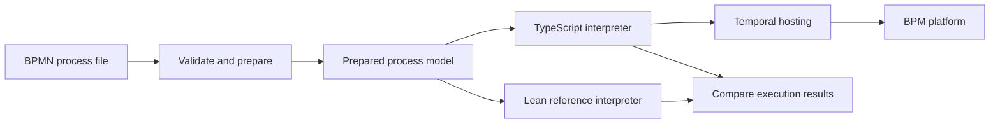
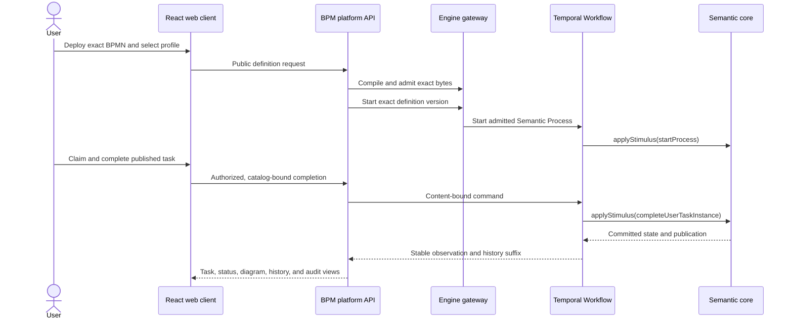

# BPMN on Temporal Workflows

This project builds a BPMN execution engine on Temporal Workflows, with Lean to make process behavior precise and prove selected guarantees. A TypeScript interpreter executes those rules; a Temporal adapter keeps processes running across waits and failures.

The goal is **BPMN Process Execution Conformance**: processes that execute according to the BPMN 2.0.2 standard. The release candidate covers a defined subset of BPMN behavior; complete conformance remains open. A BPM platform adds human work and process operations through the engine's public API.

- 🐳 **Evaluate the RC:** [Run the Docker or Rancher Desktop demo](#try-the-rc-with-docker-or-rancher-desktop). No checkout or build needed.
- 🔬 **Understand the research:** Read [the rationale and evidence](#research-approach-and-evidence) and [the architecture at a glance](#architecture-at-a-glance).
- 🛠️ **Contribute:** Follow the [engine quick start](#run-the-temporal-engine) or [prepare a contributor environment](#prepare-a-contributor-environment).

## Try the RC with Docker or Rancher Desktop

The [v0.2.0-rc.1 evaluation bundle](https://github.com/mbackschat/bpmn-lean-experiment/releases/download/v0.2.0-rc.1/mue-evaluation-v0.2.0-rc.1.tar.gz) runs the browser app and its engine from published Docker images. You need Docker Compose `2.24.4` or later, a browser, `curl`, and `shasum`. No repository checkout, Node, pnpm, Lean, Temporal installation, or image build is needed.

**🐳 1. Start your container engine.** On macOS, use Docker Desktop or [Rancher Desktop](https://docs.rancherdesktop.io/getting-started/installation/). On Linux, use Rancher Desktop or Docker Engine with the Compose plugin. In Rancher Desktop, select **dockerd (moby)** as the container engine so the same Docker commands work. Check that `docker info` succeeds and `docker compose version` shows `2.24.4` or later.

On Windows, the Docker images require Linux-container mode, and the `demo` launcher requires a Unix shell. Native PowerShell and Command Prompt cannot run it as written. Running the commands inside a WSL 2 Linux distribution with [Docker Desktop WSL integration](https://docs.docker.com/desktop/features/wsl/) is a possible route, but this project has not qualified that Windows setup.

**📦 2. Download and start the demo.** Copy these commands into a terminal:

```sh
mkdir -p bpmn-evaluation && cd bpmn-evaluation
curl --fail --location --output demo.tar.gz https://github.com/mbackschat/bpmn-lean-experiment/releases/download/v0.2.0-rc.1/mue-evaluation-v0.2.0-rc.1.tar.gz
tar -xzf demo.tar.gz
./deploy/evaluation/demo prepare
```

The last command downloads the published images, starts the stack, and prepares three interactive processes. You complete their human tasks yourself.

**🌐 3. Try a process.** Open the printed `LIVE_DEMO_READY` address. Choose **Definitions → Explore process showcases**, start a prepared process, then complete its task under **Work**.

The [browser walkthrough](docs/BPM-PLATFORM-BROWSER-WALKTHROUGH.md#zero-build-demo-machine) covers the full journey and evaluation limits. From the same directory, use `./deploy/evaluation/demo stop` when finished and `./deploy/evaluation/demo start` to resume later.

## Why this project exists

Moving BPMN processes from an engine such as CIB Seven to Temporal raises a question: **will the processes still behave as their BPMN models specify?** Parallel work, messages, timers, and cancellation must keep their meaning even when the underlying runtime changes.

- **BPMN 2.0.2** defines what the process elements mean and how they should execute.
- **CIB Seven** provides a mature implementation against which we compare selected behavior, including explicitly scoped compatibility choices.
- **Temporal** provides reliable workflow execution and recovery. The BPMN engine still has to decide how a BPMN process behaves.

The approach separates **process meaning** from **execution infrastructure**. We describe the BPMN rules in Lean, implement them in a TypeScript interpreter, and check that Temporal hosting preserves the results. This makes the rules reviewable without having to infer them from retries, queues, or runtime scheduling. The BPM platform adds human tasks, forms, and monitoring on top of the engine's public API.

## Research approach and evidence

### Why Lean and TypeScript?

**Lean helps us check the rules behind the engine.** A BPMN engine must handle more than the happy path: parallel work may finish in different orders, and a process may be cancelled while it is waiting. We write an executable model of these rules in Lean, a programming language with a mathematical proof checker. It lets us prove selected properties across all the cases a proof covers, rather than checking only the examples we can think to test.

**TypeScript puts those rules to work.** Its interpreter decides which process steps run next, what must wait, and how tasks and events change the process. Those decisions are separate from network and database operations, so they can be tested on their own and then inside a Temporal Workflow. Lean is used during development and verification; you do not need it to run the published Docker images.

**Proofs and tests answer different questions.** Lean checks properties of the model. Comparison tests check that the separately written TypeScript engine follows it, and hosting tests check its behavior on Temporal. We also review the BPMN standard and compare selected examples with CIB Seven: two implementations agreeing does not establish that their shared interpretation is correct. The [design rationale](docs/PROJECT-DESIGN.md#two-kinds-of-independence) and [verification approach](docs/TESTING-SPEC.md#evidence-lanes) explain the boundaries in more detail.

<p align="center">
  <a href="docs/assets/project-infographics/why-lean-helps.avif"></a>
</p>

The graphic connects the execution model, the running engine, and their checks. Its source notes are in the [infographics guide](docs/INFOGRAPHICS.md#infographic-1-why-lean-helps-build-a-bpmn-engine).

### Why Temporal?

Business processes may wait hours or days for people, messages, timers, or external services. Temporal records their execution so they can resume after a worker fails. It also supplies durable timers, messaging, and retried service calls, avoiding the need to build that infrastructure from scratch.

Our TypeScript interpreter runs inside a Temporal Workflow. The interpreter owns the BPMN decisions; Temporal owns durable coordination and recovery. A retried service call can still repeat an external action, so integrations must handle duplicate requests. The [Temporal research](docs/research/TEMPORAL-EXECUTION-RESEARCH.md#executive-model) explains the tradeoffs, and the [runtime diagram](#how-bpmn-executes-across-the-distributed-system) shows where each component runs.

### What has been demonstrated?

The approach already supports complete example processes and several kinds of verification:

- **A range of BPMN processes runs on the engine.** The [retained example processes](model-corpus/EXECUTABLE-MODEL-CORPUS-MAP.md) exercise human and service tasks, conditional and parallel paths, subprocesses and called processes, messages and timers, sequential and parallel review batches, and the supported compensation and transaction-cancellation cases.
- **Selected execution rules have machine-checked proofs.** These cover properties of [parallel reviews](docs/capsules/PARALLEL-MULTI-INSTANCE-SPEC.md#lean-assurance-lane), [cancellation](docs/capsules/REPEATABLE-EVENT-SUBSCRIPTIONS-SPEC.md#lean-assurance-lane), and [human-task interaction](docs/capsules/USER-TASK-INTERACTION-SPEC.md#lean-assurance-lane), helping us check difficult behavior beyond individual test runs.
- **The TypeScript engine agrees with Lean on the tested process examples.** The [comparison tests](docs/TESTING-SPEC.md#complete-differentialrefinement-pipeline) run the same tasks, messages, and timer events through both and compare the results. Selected examples also compare against CIB Seven. Tests with deliberately introduced mistakes check that the comparisons can detect incorrect behavior.
- **Processes retain progress after a worker restart.** The [hosting tests](docs/TEMPORAL-TEST-EVIDENCE-MAP.md) cover waiting tasks, messages, timers, and parallel reviews. They also check recovery when a task completion was accepted but its acknowledgement was lost, and continuation when a process outgrows its configured execution-history limit.
- **People can work through complete processes in the BPM platform.** The [three prepared interactive examples](docs/BPM-PLATFORM-BROWSER-WALKTHROUGH.md#rc-process-showcase-catalog) let users select and start a process, claim a task, fill in its form, complete the work, and inspect progress and Action history.

**This is evidence for the approach, not complete BPMN conformance.** The RC supports selected BPMN features and example journeys. It does not yet accept arbitrary BPMN models or establish that every possible execution is correct; broader coverage and production readiness remain work ahead. See [current acceptance work](docs/PLAN.md#mue-acceptance-goal) and the [`implementation-status-router`](docs/IMPLEMENTATION-MAP.md) for exact support and restrictions. The [Node/V8 investigation](docs/research/NODE-V8-CRASH-INVESTIGATION-RESEARCH.md) records an unresolved native-runtime risk.

<details>
<summary>Optional: repository statistics</summary>

#### Repository statistics

These counts describe the scale of the formal model and implementation. Several declarations can support one behavior, so their number does not measure BPMN conformance or independent guarantees.

##### Lean declarations

<!-- publication-statistics:lean-declarations:start -->
| Metric | Count |
|---|---:|
| Public theorem declarations | 4,398 |
| Supporting lemma declarations | 916 |
| All declaration commands | 10,357 |
| Proof declarations / all declaration commands | 51.3% |

Supporting lemmas count `private theorem` and every explicit `lemma` command, matching the repository convention. All declaration commands count `theorem`, `lemma`, `def`, `abbrev`, `opaque`, `axiom`, `constant`, `inductive`, `structure`, `class`, and `instance` after masking Lean comments and literals.
<!-- publication-statistics:lean-declarations:end -->

##### Language footprint

<!-- publication-statistics:language-footprint:start -->
| Language | Files | Code | Comments | Blanks |
|---|---:|---:|---:|---:|
| Java | 85 | 11,508 | 251 | 1,156 |
| TypeScript | 1,952 | 401,210 | 9,768 | 25,245 |
| Lean | 718 | 150,058 | 7,799 | 13,118 |
<!-- publication-statistics:language-footprint:end -->

Maintainers refresh these tables with `./scripts/pnpm.sh run publication-stats:update`. Tokei measures source size and is needed only for this publication step.

</details>

## Current implementation

The release candidate combines the BPMN engine with a platform for starting processes, completing human work, and following their progress. The image below shows the RC snapshot at `16c5b9f6`; final acceptance of the **Minimal Useful Engine (MUE)** remains open. For exact capability boundaries, see [`implementation-status-owner:BPM-PLATFORM`](docs/BPM-PLATFORM-IMPLEMENTATION-MAP.md) and the [executable model corpus](model-corpus/README.md).

<p align="center">
  <a href="docs/assets/project-infographics/product-2-vision.avif"></a>
</p>

The artwork uses the internal name “Product 2” for the **BPM platform**. Its source notes and refresh procedure are in the [infographics guide](docs/INFOGRAPHICS.md#infographic-3-bpm-platform-vision-and-progress).

For contributors with a prepared source checkout, `./scripts/pnpm.sh run demo:rc` offers a separate development launch. The [RC walkthrough](docs/BPM-PLATFORM-BROWSER-WALKTHROUGH.md#rc-process-showcase-catalog) explains its interactive processes, real task completion, the separate `demo:rc:automated` test launch, and evidence limits.

## Architecture at a glance


```mermaid
flowchart LR
  XML[BPMN process file] --> Import[Validate and prepare]
  Import --> Model[Prepared process model]
  Model --> Core[TypeScript interpreter]
  Core --> Host[Temporal hosting]
  Host --> Platform[BPM platform]
  Model --> Lean[Lean reference interpreter]
  Lean --> Tests[Compare execution results]
  Core --> Tests
```

Both interpreters receive the prepared process model and follow the same reviewed BPMN rules. The Lean model also carries the proofs; the TypeScript interpreter is the running engine. The platform uses the hosted engine through its public API.

| Component | What it contributes |
|---|---|
| BPMN importer | Reads the process file, checks supported features, and prepares it for execution while preserving the original XML |
| Lean model and interpreter | Makes execution rules precise, runs reference examples, and proves selected properties |
| TypeScript interpreter, called the **semantic core** | Applies those rules to running processes without network or database operations |
| Temporal adapter | Handles durable waits, messages, timers, service calls, and recovery while leaving BPMN decisions to the interpreter |
| BPM platform | Adds process deployment, a task inbox, forms, monitoring, and Action history through the engine's API |

The prepared model, called the **Semantic Process IL**, describes a process definition's fixed structure. Each running instance has its own changing state: for example, which tasks are active and what data has been collected. Completing a task changes that instance, while its definition stays intact.

The [project design](docs/PROJECT-DESIGN.md) explains the separation, and the [architecture](docs/ARCHITECTURE.md) maps it to packages and deployments.

<p align="center">
  <a href="docs/assets/project-infographics/correctness-stack.avif"></a>
</p>

This graphic shows how the different checks build confidence together. Its source notes are in the [infographics guide](docs/INFOGRAPHICS.md#infographic-2-the-projects-correctness-stack).

## Key decisions

- **Execute process models through an interpreter.** BPMN files become process data for one shared engine, rather than separately generated TypeScript workflows.
- **Keep definitions traceable.** Each definition records its original BPMN file and the selected execution rules, called a **semantic profile**. Changing either creates a different definition.
- **Make unsupported behavior visible.** The engine checks what a profile supports. It does not silently approximate an unsupported BPMN feature or invent an ordering for ambiguous concurrent work.
- **Keep BPMN and CIB compatibility distinct.** BPMN is the standard; comparisons with CIB Seven establish only the explicitly selected compatibility behavior. See the [conformance target](docs/BPMN-CONFORMANCE-TARGET.md) for the full goal.

## Technical walkthrough

### From XML to one pure transition

<details>
<summary>Optional: follow one execution step in TypeScript</summary>

The importer either reports why it cannot execute a file or returns the prepared process model. The interpreter's `applyStimulus` operation then applies an event or command to an instance's state. This example starts a process without contacting Temporal:

```ts
import {
  BpmnCompilationStatus,
  compileBpmnToSemanticProcess,
} from "@bpmn-lean/bpmn-source";
import {
  StimulusKind,
  applyStimulus,
  initialState,
  observeStableState,
} from "@bpmn-lean/semantic-core";

const compilation = await compileBpmnToSemanticProcess({
  bytes,
  sourceId: "review.bpmn",
  expectedSha256: undefined,
  semanticProfile: "cibseven-2.2.0-user-task-boolean-completion-data-draft",
  sourceOverlay: null,
  limits: { maxBytes: 1024 * 1024, parserDeadlineMs: 1_000 },
});

if (compilation.status !== BpmnCompilationStatus.Accepted) {
  throw new Error(JSON.stringify(compilation.diagnostics));
}

const started = applyStimulus(compilation.semanticProcess, initialState, {
  kind: StimulusKind.StartProcess,
  commandId: "start-process",
  processId: "Process_Review",
  instanceId: "Instance_1",
  initialVariables: [],
});

const observation = observeStableState(compilation.semanticProcess, started.state);
```

`applyStimulus` is pure: the same process, state, input, and execution limits produce the same result. The Temporal Workflow calls this same operation and records the commands and outcomes durably.

</details>

### How BPMN executes across the distributed system

<p align="center">
  <a href="docs/assets/project-infographics/bpmn-execution-on-temporal.avif"></a>
</p>

The platform stores BPMN files and its own records in PostgreSQL. A BPMN worker runs the TypeScript interpreter inside a Temporal Workflow, while the Temporal service records execution and coordinates durable work. The diagram separates these runtime responsibilities from the interpreter's BPMN decisions; its source notes are in the [infographics guide](docs/INFOGRAPHICS.md#infographic-4-how-bpmn-executes-across-temporal).

### Through the browser lifecycle

<details>
<summary>Optional: follow a process start and task completion through the APIs</summary>


```mermaid
sequenceDiagram
  actor User
  participant Web as React web client
  participant Platform as BPM platform API
  participant Engine as Engine gateway
  participant Workflow as Temporal Workflow
  participant Core as Semantic core

  User->>Web: Deploy exact BPMN and select profile
  Web->>Platform: Public definition request
  Platform->>Engine: Compile and admit exact bytes
  Platform->>Engine: Start exact definition version
  Engine->>Workflow: Start admitted Semantic Process
  Workflow->>Core: applyStimulus(startProcess)
  User->>Web: Claim and complete published task
  Web->>Platform: Authorized, catalog-bound completion
  Platform->>Workflow: Content-bound command
  Workflow->>Core: applyStimulus(completeUserTaskInstance)
  Core-->>Workflow: Committed state and publication
  Workflow-->>Platform: Stable observation and history suffix
  Platform-->>Web: Task, status, diagram, history, and audit views
```

The maintained [browser walkthrough](docs/BPM-PLATFORM-BROWSER-WALKTHROUGH.md) turns this sequence into hands-on exercises using the production server, web client, Temporal-hosted engine, structured expense-exception model, and incident Operations views.

</details>

## Contributor quick start

### Run the Temporal engine

The runtime path needs Node `24.18.0`, pnpm `11.20.0`, and a Temporal service. It does not need Lean, Java, or the CIB checkout.

Start a local Temporal service in one terminal:

```sh
brew install temporal
temporal server start-dev --headless
```

Install the workspace dependencies in another terminal:

```sh
./scripts/pnpm.sh install --frozen-lockfile
```

Follow the [engine quick start](packages/temporal-adapter/README.md#quick-start) to initialize a fresh Namespace and run a copied example configuration. The pre-created `default` Namespace is deliberately refused by fresh initialization. Existing unversioned environments retain their original Workers and data; this is not a migration path. The [runner specification](docs/RUNNABLE-TEMPORAL-MVP-SPEC.md) owns inputs, outputs, exit codes, and supported interaction shapes.

### Build the evaluation stack from source

The [Docker or Rancher Desktop test drive](#try-the-rc-with-docker-or-rancher-desktop) uses published images without a checkout. Contributors building the evaluation stack from source can initialize a separate project once:

```sh
export COMPOSE_PROJECT_NAME=bpmn-lean-evaluation-native
export BPMN_EVALUATION_NAMESPACE=bpmn-evaluation
docker compose build
docker compose up --no-build --wait temporal
docker compose run --rm --no-deps bpmn-worker initialize-fresh-namespace --retention-seconds 86400
./scripts/pnpm.sh run evaluation:start
```

Open [http://localhost:3000](http://localhost:3000). Keep those same two environment values for every lifecycle command. This source path may build locally; PostgreSQL and Temporal state survive ordinary stops in named Docker volumes. Restart with `evaluation:start` after initialization, without repeating the initializer.

```sh
./scripts/pnpm.sh run evaluation:stop
```

Use `./scripts/pnpm.sh run evaluation:reset` only when you deliberately want to remove both selected evaluation volumes, then repeat fresh initialization before starting. The new project name keeps earlier unversioned evaluation volumes separate. This distribution is an evaluation path, not a production Temporal deployment or a capacity claim.

### Prepare a contributor environment

The full verification environment additionally needs Git, `curl`, `jq`, `xmllint`, `unzip`, Lean through `elan`, and Java 21:

```sh
nvm install
nvm use
./scripts/setup-external-sources.sh verify
./scripts/pnpm.sh install --frozen-lockfile
./scripts/doctor.sh verify
./scripts/pnpm.sh run test:pre-push:verify
```

Use [`./scripts/lake.sh`](scripts/lake.sh) for every Lean build. It is the single owner of repository Lean parallelism and prevents concurrent build trees. Setup, memory-bounded Lean guidance, and clean-machine recovery are in the [contributor setup guide](docs/CONTRIBUTOR-SETUP-GUIDE.md); the complete gate matrix is in [TESTING-SPEC.md](docs/TESTING-SPEC.md).

## Repository guide

```text
BpmnSemantics/       Lean definitions, laws, conformance witnesses, and experiments
contracts/           Language-neutral JSON Schemas
docs/                Architecture, specifications, research, testing, and current plan
model-corpus/        Retained and classified executable whole-model corpus
packages/            BPMN engine source, semantic core, comparison, API, and Temporal packages
platform/            BPM platform applications, modules, foundations, and UI
profiles/            Reviewed semantic-profile artifacts
runners/             Pinned adapters to external executable oracles
scenarios/           Answer-free BPMN scenarios and separate content-bound evidence
scripts/             Maintained verification and infrastructure guards
showcase/            BPM platform acceptance harnesses
```

| Need | Read |
|---|---|
| Try a process and complete its tasks | [Browser walkthrough](docs/BPM-PLATFORM-BROWSER-WALKTHROUGH.md) |
| Check supported features and restrictions | [`implementation-status-router`](docs/IMPLEMENTATION-MAP.md) |
| Understand the approach and component responsibilities | [Project design](docs/PROJECT-DESIGN.md) |
| Understand packages and deployment | [Architecture](docs/ARCHITECTURE.md) |
| Inspect the executable model collection | [Model corpus](model-corpus/README.md) |
| Prepare a clean machine | [Contributor setup guide](docs/CONTRIBUTOR-SETUP-GUIDE.md) |
| Review dependency security and urgent fixes | [Security update procedure](docs/CONTRIBUTOR-SETUP-GUIDE.md#dependency-security-procedure) |
| Navigate all maintained documentation | [Documentation registry](docs/README.md) |
| Resume current work | [Plan](docs/PLAN.md) |

## Contributing

Read [CLAUDE.md](CLAUDE.md), also exposed through the [AGENTS.md](AGENTS.md) symlink, before changing the project. Changes to execution rules start from the BPMN standard, with tests that distinguish the intended behavior from plausible mistakes. The [testing specification](docs/TESTING-SPEC.md) defines the required checks and reviews.

## License

Project-authored code and documentation are licensed under the [MIT License](LICENSE). External standards, fixtures, reference repositories, and locally ignored research material retain their own licenses and provenance; see [SOURCES.md](docs/SOURCES.md).
