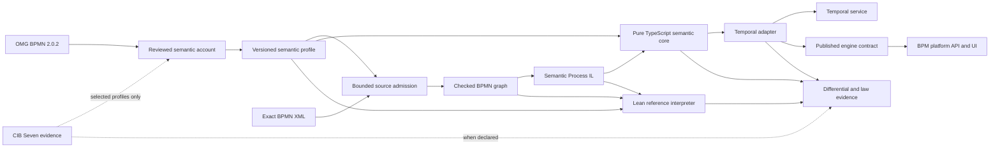
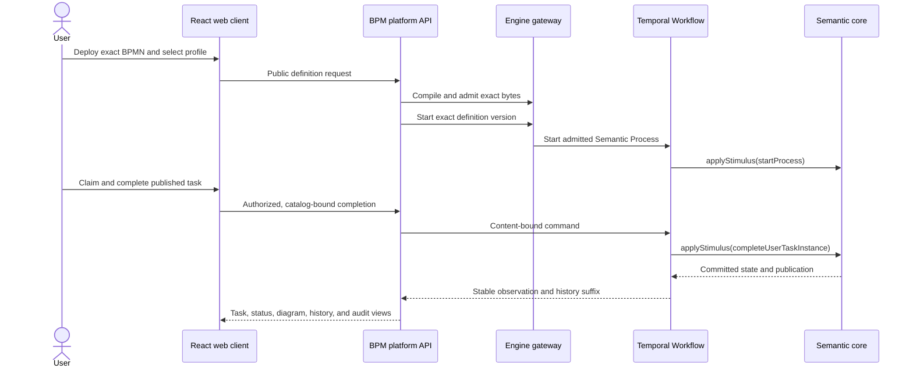

# BPMN on Temporal Workflows

This project turns reviewed BPMN 2.0.2 execution semantics into an executable Lean reference and a separately written, pure TypeScript semantic core. Lean proves selected semantic obligations; a Temporal adapter hosts the TypeScript core durably without deciding BPMN meaning.

The goal is BPMN Process Execution Conformance. The release candidate demonstrates selected profiles, not a complete conformance proof. A BPM platform consumes only the engine's published contract.

- 🐳 **Evaluate the RC:** [Run the Docker demo](#test-drive-the-release-candidate-with-docker). No checkout or build needed.
- 🔬 **Understand the research:** Read [the rationale and evidence](#research-approach-and-evidence) and [the architecture at a glance](#architecture-at-a-glance).
- 🛠️ **Contribute:** Follow the [engine quick start](#run-the-temporal-engine) or [prepare a contributor environment](#prepare-a-contributor-environment).

## Test-drive the release candidate with Docker

The [v0.2.0-rc.1 evaluation bundle](https://github.com/mbackschat/bpmn-lean-experiment/releases/download/v0.2.0-rc.1/mue-evaluation-v0.2.0-rc.1.tar.gz) runs the browser app and its engine from published Docker images. You need Docker Compose `2.24.4` or later, a browser, `curl`, and `shasum`. No repository checkout, Node, pnpm, Lean, Temporal installation, or image build is needed.

**🐳 1. Start Docker.** On macOS, use Docker Desktop or Rancher Desktop with **dockerd (moby)** selected under **Preferences → Container Engine**. On Linux, use Docker Engine with the Compose plugin. Check that `docker info` succeeds and `docker compose version` shows `2.24.4` or later.

On Windows, the Docker images require Linux-container mode, and the `demo` launcher requires a Unix shell. Native PowerShell and Command Prompt cannot run it as written. Running the commands inside a WSL 2 Linux distribution with [Docker Desktop WSL integration](https://docs.docker.com/desktop/features/wsl/) is a possible route, but this project has not qualified that Windows setup.

**📦 2. Download and start the demo.** Copy these commands into a terminal:

```sh
mkdir -p bpmn-evaluation && cd bpmn-evaluation
curl --fail --location --output demo.tar.gz https://github.com/mbackschat/bpmn-lean-experiment/releases/download/v0.2.0-rc.1/mue-evaluation-v0.2.0-rc.1.tar.gz
tar -xzf demo.tar.gz
./deploy/evaluation/demo prepare
```

The last command pulls the digest-pinned images, starts the stack, and prepares three human processes.

**🌐 3. Try a process.** Open the printed `LIVE_DEMO_READY` address. Choose **Definitions → Explore process showcases**, start a prepared process, then complete its task under **Work**.

The [browser walkthrough](docs/BPM-PLATFORM-BROWSER-WALKTHROUGH.md#zero-build-demo-machine) covers the full journey and evaluation limits. From the same directory, use `./deploy/evaluation/demo stop` when finished and `./deploy/evaluation/demo start` to resume later.

## Why this project exists

BPMN 2.0.2, CIB Seven, and Temporal answer different questions:

- **BPMN 2.0.2** defines the normative notation, metamodel, and Process Execution obligations.
- **CIB Seven** is a mature executable implementation and a useful empirical oracle for explicitly selected compatibility profiles, but it is not the normative standard.
- **Temporal** supplies durable execution, replay, messaging, timers, Activities, and recovery, but those mechanisms do not define BPMN behavior.

A direct BPMN-to-Temporal translation can accidentally turn Workflow handlers, retries, Event History, or SDK scheduling into process semantics. This project keeps the evaluator pure and explicit, then checks whether the durable host preserves its public results. The platform presents and operates published facts; it does not reconstruct missing BPMN facts from Temporal or its own database.

Some existing diagrams still say “Product 2.” That is the [architecture's internal label](docs/PROJECT-DESIGN.md#product-division) for the **BPM platform**; “Product 1” means the **BPMN engine**. This README uses the product names, and the artwork will adopt them when it is next refreshed.

## Research approach and evidence

### Why Lean and TypeScript?

Each admitted BPMN profile begins with a reviewed account of what the process means. Lean makes selected rules executable and supports quantified theorems and counterexamples before those rules spread through production code. Lean is a reference and proof tool, not a runtime dependency of the release images. A separately written, I/O-free TypeScript interpreter runs the admitted model in production and can be tested without Temporal. It executes inside a Temporal Workflow when durability is needed.

The two implementations can expose transcription errors, such as a wrong identity check. They implement the **same** reviewed account, however, so their agreement cannot rule out a mistake in that account or in source facts both receive. [The design decision](docs/PROJECT-DESIGN.md#two-kinds-of-independence) and [evidence-lane rules](docs/TESTING-SPEC.md#evidence-lanes) make that distinction explicit.

<p align="center">
  <a href="docs/assets/project-infographics/why-lean-helps.avif"></a>
</p>

The graphic shows the roles of the two interpreters and their evidence boundaries. Its dated source and exact copy are in the [infographics guide](docs/INFOGRAPHICS.md#infographic-1-why-lean-helps-build-a-bpmn-engine).

### Why Temporal?

Processes wait for people, messages, timers, and external work. We chose Temporal for durable coordination: it supplies Workflow history and replay after Worker loss, message ingress, timers, and Activities for external effects. Its TypeScript Workflow hosts the pure interpreter while the semantic core decides BPMN-visible state and outcomes. Temporal's retries, scheduling, and Event History are therefore hosting mechanisms, not BPMN rules. Activity side effects still require idempotency or reconciliation; durability alone does not make them exactly once. The [Temporal research](docs/research/TEMPORAL-EXECUTION-RESEARCH.md#executive-model) explains those tradeoffs, and the [runtime diagram](#how-bpmn-executes-across-the-distributed-system) shows where each component runs.

### What has been demonstrated?

- **A rule can be proved, not just illustrated.** For an ordinary waiting User Task, the [identity theorem](BpmnSemantics/SemanticProcess/Execution.lean) rejects a completion for the wrong occurrence with unchanged state; the [capsule](docs/capsules/USER-TASK-INTERACTION-SPEC.md) also records why matching only the BPMN element ID is insufficient. This proves that rule in the Lean account under its stated assumptions, not the whole implementation.
- **Separate implementations can catch disagreements.** [Registered, answer-free scenarios](docs/TESTING-SPEC.md#complete-differentialrefinement-pipeline) compare Lean and TypeScript results; declared CIB cases add a pinned compatibility observation, and seeded mutations check that the comparisons notice selected differences. These are finite, profile-bound checks, as defined by the [evidence lanes](docs/TESTING-SPEC.md#evidence-lanes).
- **The selected behavior survives real hosting tests.** [Temporal evidence](docs/TEMPORAL-TEST-EVIDENCE-MAP.md) exercises Worker replacement, command recovery, continuation, and replay for admitted profiles. The [RC browser walkthrough](docs/BPM-PLATFORM-BROWSER-WALKTHROUGH.md#rc-process-showcase-catalog) lets readers start and complete three interactive human processes through the platform.

Together these results demonstrate the approach on selected end-to-end slices. They do not prove arbitrary XML import, universal Lean–TypeScript equivalence, general Temporal refinement, production scale, or OMG Process Execution Conformance. [Current acceptance work](docs/PLAN.md#mue-acceptance-goal), the [`implementation-status-router`](docs/IMPLEMENTATION-MAP.md) for implemented and absent boundaries, and the [open Node/V8 crash investigation](docs/research/NODE-V8-CRASH-INVESTIGATION-RESEARCH.md) remain separate from those demonstrated results.

## Current implementation

The image below records the release-candidate snapshot at `16c5b9f6`: Alpha, Beta, and RC are reached, while final MUE acceptance remains open. For exact capability boundaries, see [`implementation-status-owner:BPM-PLATFORM`](docs/BPM-PLATFORM-IMPLEMENTATION-MAP.md) and the [executable model corpus](model-corpus/README.md); the [repository guide](#repository-guide) links to the remaining status owners.

<p align="center">
  <a href="docs/assets/project-infographics/product-2-vision.avif"></a>
</p>

Its exact inputs and refresh procedure are recorded in the [project infographics guide](docs/INFOGRAPHICS.md#infographic-3-bpm-platform-vision-and-progress).

Definitions presents Start above the diagram; optional Triggers expand below it. **Operations → Process metrics** shows step frequency and completed duration for a selected process version, also linked from Definitions.

For contributors with a prepared source checkout, `./scripts/pnpm.sh run demo:rc` offers a separate development launch. The [RC walkthrough](docs/BPM-PLATFORM-BROWSER-WALKTHROUGH.md#rc-process-showcase-catalog) explains its interactive processes, real task completion, the separate `demo:rc:automated` test launch, and evidence limits.

## Architecture at a glance


```mermaid
flowchart LR
  BPMN[OMG BPMN 2.0.2] --> Account[Reviewed semantic account]
  CIB[CIB Seven evidence] -. selected profiles only .-> Account
  Account --> Profile[Versioned semantic profile]

  XML[Exact BPMN XML] --> Source[Bounded source admission]
  Profile --> Source
  Source --> Checked[Checked BPMN graph]
  Checked --> IL[Semantic Process IL]
  IL --> Core[Pure TypeScript semantic core]
  Profile --> Core
  Core --> Adapter[Temporal adapter]
  Adapter --> Temporal[Temporal service]
  Adapter --> API[Published engine contract]
  API --> Platform[BPM platform API and UI]

  Checked --> Lean[Lean reference interpreter]
  IL --> Lean
  Profile --> Lean
  Lean --> Evidence[Differential and law evidence]
  Core --> Evidence
  Adapter --> Evidence
  CIB -. when declared .-> Evidence
```

The components deliberately have different jobs:

| Component | Responsibility | Explicit boundary |
|---|---|---|
| Lean reference | Executable operational account, reusable theorems, and checked counterexamples | Does not prove the XML parser, TypeScript implementation, Temporal, database, or network |
| TypeScript semantic core | Dependency-free production evaluator for immutable Semantic Process programs | Performs no I/O and imports no Temporal, CIB, or platform code |
| BPMN source ingestion | Captures exact bytes, validates the selected profile, builds the checked graph, and lowers to the IL | Raw moddle objects never leave the package |
| Temporal adapter | Durably hosts one semantic Process instance per Workflow, carries commands, timers, effects, results, and replay | Temporal tasks, attempts, retries, and Event History never become BPMN facts |
| BPM platform | Owns deployment, identity, work, forms, operations, projections, audit, and the browser UI | Consumes only narrowed public engine entry points |

The [research approach](#research-approach-and-evidence) explains why these components are separate and what their combined evidence can establish.

<p align="center">
  <a href="docs/assets/project-infographics/correctness-stack.avif"></a>
</p>

Each layer answers a different question, and no layer silently inherits another layer's claim. The maintained copy and regeneration inputs are in the [project infographics guide](docs/INFOGRAPHICS.md#infographic-2-the-projects-correctness-stack).

## Key decisions

- **Interpreter, not code generator.** One generic evaluator executes immutable Semantic Process data. Generated TypeScript is not an authority for a model's meaning.
- **Exact source and profile identity.** Admission binds the original BPMN bytes, digest, selected profile, and resulting checked representations. A different source or profile is a different definition.
- **Bounded, honest claims.** A profile states exactly which structure and behavior are admitted. Unsupported BPMN is rejected or preserved as declared, never silently approximated.
- **Explicit scheduling, not collection order.** Multiple enabled internal operations advance together only under an exact reviewed non-interference criterion; otherwise the evaluator reports ambiguity instead of treating Program order as BPMN meaning.
- **CIB is classified evidence.** CIB Seven is used only where a profile names the relationship and observation boundary. Standards-only profiles do not invent a CIB comparison.
- **Durability is below semantics.** Temporal hosts commands and recovery; the pure core decides BPMN-visible outcomes.
- **The platform stays downstream.** The BPM platform may enrich human and operational workflows, but forms, claims, audit, and persistence do not leak into the BPMN core.

## Technical walkthrough

### From XML to one pure transition

The source package returns either a deterministic rejection with located diagnostics or an accepted checked graph and Semantic Process program. The semantic core then applies an explicit stimulus to an explicit runtime state:

```ts
import {
  BpmnCompilationStatus,
  compileBpmnToSemanticProcess,
} from "@bpmn-lean/bpmn-source";
import {
  StimulusKind,
  applyStimulus,
  initialState,
  observeStableState,
} from "@bpmn-lean/semantic-core";

const compilation = await compileBpmnToSemanticProcess({
  bytes,
  sourceId: "review.bpmn",
  expectedSha256: undefined,
  semanticProfile: "cibseven-2.2.0-user-task-boolean-completion-data-draft",
  sourceOverlay: null,
  limits: { maxBytes: 1024 * 1024, parserDeadlineMs: 1_000 },
});

if (compilation.status !== BpmnCompilationStatus.Accepted) {
  throw new Error(JSON.stringify(compilation.diagnostics));
}

const started = applyStimulus(compilation.semanticProcess, initialState, {
  kind: StimulusKind.StartProcess,
  commandId: "start-process",
  processId: "Process_Review",
  instanceId: "Instance_1",
  initialVariables: [],
});

const observation = observeStableState(compilation.semanticProcess, started.state);
```

`applyStimulus` is pure: equal admitted programs, states, stimuli, and closure limits produce equal results. The Temporal Workflow calls this same incremental boundary and durably retains its command/result protocol; it does not replace it with generated Workflow control flow.

### How BPMN executes across the distributed system

<p align="center">
  <a href="docs/assets/project-infographics/bpmn-execution-on-temporal.avif"></a>
</p>

The BPM platform API compiles and starts exact source, PostgreSQL stores source and platform projections, the Temporal service schedules and persists durable work, and the separate BPMN Worker executes the Workflow bundle containing the Semantic Process IL, RuntimeState, and pure interpreter. The diagram's paired callout distinguishes Temporal's durability services from the semantic core's BPMN decisions. The exact copy, deployment qualifications, architectural sources, and regeneration prompts are maintained in the [project infographics guide](docs/INFOGRAPHICS.md#infographic-4-how-bpmn-executes-across-temporal).

### Through the browser lifecycle


```mermaid
sequenceDiagram
  actor User
  participant Web as React web client
  participant Platform as BPM platform API
  participant Engine as Engine gateway
  participant Workflow as Temporal Workflow
  participant Core as Semantic core

  User->>Web: Deploy exact BPMN and select profile
  Web->>Platform: Public definition request
  Platform->>Engine: Compile and admit exact bytes
  Platform->>Engine: Start exact definition version
  Engine->>Workflow: Start admitted Semantic Process
  Workflow->>Core: applyStimulus(startProcess)
  User->>Web: Claim and complete published task
  Web->>Platform: Authorized, catalog-bound completion
  Platform->>Workflow: Content-bound command
  Workflow->>Core: applyStimulus(completeUserTaskInstance)
  Core-->>Workflow: Committed state and publication
  Workflow-->>Platform: Stable observation and history suffix
  Platform-->>Web: Task, status, diagram, history, and audit views
```

The maintained [browser walkthrough](docs/BPM-PLATFORM-BROWSER-WALKTHROUGH.md) turns this sequence into hands-on exercises using the production server, web client, Temporal-hosted engine, structured expense-exception model, and incident Operations views.

## Contributor quick start

### Run the Temporal engine

The runtime path needs Node `24.18.0`, pnpm `11.20.0`, and a Temporal service. It does not need Lean, Java, or the CIB checkout.

Start a local Temporal service in one terminal:

```sh
brew install temporal
temporal server start-dev --headless
```

Install the workspace dependencies in another terminal:

```sh
./scripts/pnpm.sh install --frozen-lockfile
```

Follow the [engine quick start](packages/temporal-adapter/README.md#quick-start) to initialize a fresh Namespace and run a copied example configuration. The pre-created `default` Namespace is deliberately refused by fresh initialization. Existing unversioned environments retain their original Workers and data; this is not a migration path. The [runner specification](docs/RUNNABLE-TEMPORAL-MVP-SPEC.md) owns inputs, outputs, exit codes, and supported interaction shapes.

### Build the evaluation stack from source

The [Docker test drive](#test-drive-the-release-candidate-with-docker) uses published images without a checkout. Contributors building the evaluation stack from source can initialize a separate project once:

```sh
export COMPOSE_PROJECT_NAME=bpmn-lean-evaluation-native
export BPMN_EVALUATION_NAMESPACE=bpmn-evaluation
docker compose build
docker compose up --no-build --wait temporal
docker compose run --rm --no-deps bpmn-worker initialize-fresh-namespace --retention-seconds 86400
./scripts/pnpm.sh run evaluation:start
```

Open [http://localhost:3000](http://localhost:3000). Keep those same two environment values for every lifecycle command. This source path may build locally; PostgreSQL and Temporal state survive ordinary stops in named Docker volumes. Restart with `evaluation:start` after initialization, without repeating the initializer.

```sh
./scripts/pnpm.sh run evaluation:stop
```

Use `./scripts/pnpm.sh run evaluation:reset` only when you deliberately want to remove both selected evaluation volumes, then repeat fresh initialization before starting. The new project name keeps earlier unversioned evaluation volumes separate. This distribution is an evaluation path, not a production Temporal deployment or a capacity claim.

### Prepare a contributor environment

The full verification environment additionally needs Git, `curl`, `jq`, `xmllint`, `unzip`, Lean through `elan`, and Java 21:

```sh
nvm install
nvm use
./scripts/setup-external-sources.sh verify
./scripts/pnpm.sh install --frozen-lockfile
./scripts/doctor.sh verify
./scripts/pnpm.sh run test:pre-push:verify
```

Use [`./scripts/lake.sh`](scripts/lake.sh) for every Lean build. It is the single owner of repository Lean parallelism and prevents concurrent build trees. Setup, memory-bounded Lean guidance, and clean-machine recovery are in the [contributor setup guide](docs/CONTRIBUTOR-SETUP-GUIDE.md); the complete gate matrix is in [TESTING-SPEC.md](docs/TESTING-SPEC.md).

## Repository statistics

These publication statistics are refreshed by the maintainer with `./scripts/pnpm.sh run publication-stats:update`. Tokei is a publication tool, not a contributor prerequisite or normal CI dependency.

### Lean declarations

<!-- publication-statistics:lean-declarations:start -->
| Metric | Count |
|---|---:|
| Public theorem declarations | 4,398 |
| Supporting lemma declarations | 916 |
| All declaration commands | 10,357 |
| Proof declarations / all declaration commands | 51.3% |

Supporting lemmas count `private theorem` and every explicit `lemma` command, matching the repository convention. All declaration commands count `theorem`, `lemma`, `def`, `abbrev`, `opaque`, `axiom`, `constant`, `inductive`, `structure`, `class`, and `instance` after masking Lean comments and literals.
<!-- publication-statistics:lean-declarations:end -->

### Language footprint

<!-- publication-statistics:language-footprint:start -->
| Language | Files | Code | Comments | Blanks |
|---|---:|---:|---:|---:|
| Java | 85 | 11,508 | 251 | 1,156 |
| TypeScript | 1,952 | 400,991 | 9,768 | 25,237 |
| Lean | 718 | 150,058 | 7,799 | 13,118 |
<!-- publication-statistics:language-footprint:end -->

## Repository guide

```text
BpmnSemantics/       Lean definitions, laws, conformance witnesses, and experiments
contracts/           Language-neutral JSON Schemas
docs/                Architecture, specifications, research, testing, and current plan
model-corpus/        Retained and classified executable whole-model corpus
packages/            BPMN engine source, semantic core, comparison, API, and Temporal packages
platform/            BPM platform applications, modules, foundations, and UI
profiles/            Reviewed semantic-profile artifacts
runners/             Pinned adapters to external executable oracles
scenarios/           Answer-free BPMN scenarios and separate content-bound evidence
scripts/             Maintained verification and infrastructure guards
showcase/            BPM platform acceptance harnesses
```

| Need | Read |
|---|---|
| Try the browser product | [Browser walkthrough](docs/BPM-PLATFORM-BROWSER-WALKTHROUGH.md) |
| Route to exact support and restrictions | [`implementation-status-router`](docs/IMPLEMENTATION-MAP.md) |
| Understand the semantic and product boundaries | [Project design](docs/PROJECT-DESIGN.md) |
| Understand packages and deployment | [Architecture](docs/ARCHITECTURE.md) |
| Inspect the executable model collection | [Model corpus](model-corpus/README.md) |
| Prepare a clean machine | [Contributor setup guide](docs/CONTRIBUTOR-SETUP-GUIDE.md) |
| Review dependency security and urgent fixes | [Security update procedure](docs/CONTRIBUTOR-SETUP-GUIDE.md#dependency-security-procedure) |
| Navigate all maintained documentation | [Documentation registry](docs/README.md) |
| Resume current work | [Plan](docs/PLAN.md) |

## Contributing

Read [CLAUDE.md](CLAUDE.md), also exposed through the [AGENTS.md](AGENTS.md) symlink, before changing the project. Semantic changes begin with the smallest source-grounded separating witness and end with an honest claim boundary, independent evidence, a meaningful mutation, and the applicable review gate.

## License

Project-authored code and documentation are licensed under the [MIT License](LICENSE). External standards, fixtures, reference repositories, and locally ignored research material retain their own licenses and provenance; see [SOURCES.md](docs/SOURCES.md).
