# BPM platform browser walkthrough

## Status

Implemented and maintained as a text-first tutorial over the containerized Product 2 evaluation distribution. The screenshots are generated from the same public browser journey and illustrate stable landmarks, but the instructions remain complete when images are unavailable. This is a user guide and evaluation aid, not semantic, compatibility, performance, or production-capacity evidence.

## What you will do

This walkthrough uses one persistent evaluation topology to:

1. inspect the exact capability boundary;
2. deploy and diagram a BPMN definition;
3. start an exact definition version;
4. claim and complete a structured Human Task;
5. inspect semantic History, the terminal Diagram, and exact-version metrics;
6. create two Service Task incidents;
7. retry one incident and cancel the other Process;
8. inspect the resulting Product 2 audit records.

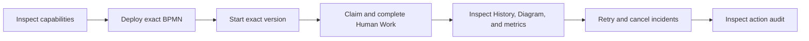

The browser talks only to the public Product 2 HTTP API. The API reaches the Temporal-hosted engine through the narrowed engine gateway, while PostgreSQL-backed recovery workers refresh projections outside request handling.

## Seven-minute guided MUE preview

Use this run of show when presenting the project rather than configuring each workflow manually. The optional audience mode composes only existing reviewed capabilities. It hides deployment controls and technical identifiers from the presenter path, but changes no BPMN meaning, authorization rule, evidence denominator, or ordinary Product 2 screen.

### Zero-build demo machine

The recommended demo-machine path is the `guided-live-demo-<commit>` artifact from a successful [Evaluation distribution workflow](../.github/workflows/evaluation-distribution.yml) run with image publication enabled. The artifact contains the Compose topology, exact database-role initialization, this guide and fallback images, the retained demonstration models, and an environment file that pins all five project images to their published OCI index digests. Each index contains `linux/amd64` and `linux/arm64`, carries the source commit and complete tracked-source-tree digest, and is published with BuildKit provenance and an SBOM. PostgreSQL and Temporal retain their separately pinned upstream digests.

Download and unpack that artifact on a host with Docker Compose `2.24.4` or later. Docker Engine and Docker Desktop work directly. On Rancher Desktop, select [**Preferences > Container Engine > dockerd (moby)**](https://docs.rancherdesktop.io/ui/preferences/container-engine/general/), which exposes the Docker API and Docker CLI used by the launcher, then confirm `docker compose version` meets the minimum. Rancher Desktop's `containerd`/`nerdctl` mode is not the supported launcher contract. No repository checkout, Node, pnpm, compiler, or image build is used on the demo machine.

While online, prepare and prove one fresh isolated stack:

```sh
./deploy/evaluation/demo prepare
./deploy/evaluation/demo status
```

`prepare` pulls only the exact recorded digests, verifies every project image's source labels, removes only the bundle's demo volumes, starts Compose with `--no-build`, and seeds five exact scenarios through public Product 1 and Product 2 interfaces. The publishing workflow logs out of GHCR and executes this same command before offering the artifact, which proves anonymous pull and exact published-image startup rather than merely proving a separately built local image.

After preparation, show-time restart performs no build, registry request, or pull:

```sh
./deploy/evaluation/demo start
./deploy/evaluation/demo status
```

Open the printed `LIVE_DEMO_AUDIENCE` URL in Chromium. `./deploy/evaluation/demo stop` stops only this demo project and retains its volumes. Transfer and prepare a proven artifact before entering an offline venue; do not substitute tags or edit its generated image environment. After a rehearsal or completed presentation, restore the exact initial audience state without a build, pull, or registry request:

```sh
./deploy/evaluation/demo reset
```

### Presenter checkout alternative

Contributors may instead prepare the exact checked-out source before the audience arrives:

```sh
./scripts/pnpm.sh run demo:prepare
./scripts/pnpm.sh run demo:status
```

This source path is deliberately an online authoring boundary. It requires a clean committed worktree, rebuilds the five project images from that exact source, labels them with the full commit and a SHA-256 over the complete tracked source tree, and may contact Docker Hub and the pnpm registry when local caches are incomplete or need metadata. It is not the zero-build demo-machine path.

After a successful preparation, show-time execution needs no image build or pull. If Docker or the demo project was stopped, restart from the matching local images and preserved demo volumes with:

```sh
./scripts/pnpm.sh run demo:start
./scripts/pnpm.sh run demo:status
```

`demo:start` checks every local project image against the current clean committed source before changing the Compose project, then uses `--no-build --pull never`. It fails rather than starting a stale or unbound image. Missing base, PostgreSQL, Temporal, or project images therefore remain a preparation failure instead of triggering an audience-time download.

Then use the four numbered controls in **Seven-minute verified walkthrough**:

1. **Expense exception, about two minutes 30 seconds.** Claim **Review exception**, inspect its BPMN Diagram, complete the realistic typed form with request reference, date, amount, cost center, and risk flags, then approve it. The pre-seeded presenter path requires no BPMN upload or semantic-profile entry.
2. **Deadline behavior, about one minute 45 seconds.** Open the naturally completed purchase-order batch and show its ordered `accepted`, `flagged`, `archived` aggregate. Then open the deadline-escalated batch, show its committed Timer command, absent partial aggregate, and terminal Diagram.
3. **Incident recovery, about one minute 45 seconds.** Open the retry-only Service Task incident, show its Diagram, and retry its retained content-bound action until the public response confirms commitment. Open the separately cancellable incident, explain the safe root scope, and confirm cancellation. An indeterminate response is demonstrated as retry-safe recovery, not presented as failure.
4. **Correctness stack, about one minute.** Show the distinct Lean reference, independently written TypeScript core, Temporal durability, and PostgreSQL projection roles. Close on the exact executable capability table and **Not a conformance claim** boundary.

Audience mode is an optional query-controlled presentation layer. Opening the ordinary origin without `?audience=demo` retains the normal Work, Definitions, Operations, and About shell.

### Claims and non-claims

- This is a guided MUE preview, not completion of the current MUE programme.
- The canonical About table demonstrates executable breadth across exact profiles. The expense-exception model demonstrates a coherent real-world Process. Neither is a single all-elements profile.
- Product 2 forms, claims, priorities, and work audit are platform behavior bound to engine-published task identity. They do not add BPMN meaning.
- The demo makes no BPMN conformance, production capacity, high-availability, or benchmark claim.

### Presenter fallback

If the browser cannot start, continue from the retained [capability boundary](assets/bpm-platform-browser-walkthrough/01-about-capability-boundary.png), [expense Process diagram](assets/bpm-platform-browser-walkthrough/02-expense-definition-diagram.png), [structured approval form](assets/bpm-platform-browser-walkthrough/04-expense-structured-form.png), [committed semantic History](assets/bpm-platform-browser-walkthrough/05-completed-process-history.png), [natural Multi-Instance completion](assets/mue-preview-alpha-demo/01-natural-completion.png), and [Timer interruption](assets/mue-preview-alpha-demo/02-timer-interruption.png) frames. These are fallback illustrations, not substitutes for the executable gates.

## Prerequisites and lifecycle

The published-bundle path requires a Docker-compatible runtime with Compose `2.24.4` or later and a browser only; that minimum is the first release supporting the `!reset` override that mechanically removes every build declaration. Rancher Desktop must use `dockerd (moby)` mode. The source-checkout path additionally requires the frozen workspace dependencies. Neither path needs Lean, Java, the CIB Seven checkout, or host PostgreSQL or Temporal installations. The ordinary evaluation commands below are contributor-oriented and may build or pull.

Start the complete evaluation distribution:

```sh
./scripts/pnpm.sh install --frozen-lockfile
./scripts/pnpm.sh run evaluation:start
```

Open [http://localhost:3000](http://localhost:3000). The shell should show Work, Definitions, Operations, and About, plus `Signed in as demo-user`.

PostgreSQL and Temporal state survive an ordinary stop. If you previously used this distribution and want the exact version numbers and empty collections described below, deliberately remove that retained evaluation state before starting:

```sh
./scripts/pnpm.sh run evaluation:reset
./scripts/pnpm.sh run evaluation:start
```

`evaluation:reset` deletes only the evaluation distribution's named PostgreSQL and Temporal volumes. Do not use it when you want to retain prior evaluation data.

## 1. Inspect the honest capability boundary

Open **About**. Confirm that **Coverage boundary** says **Not a conformance claim** and that the evidence-backed-variant summary equals the complete set of rows in the canonical executable element and semantic-variant table. Compare a standards-only row with a row carrying classified CIB Seven evidence.

The table reports exact variants rather than a percentage. BPMN requirement coverage, selected CIB compatibility, and platform functionality remain separate denominators.

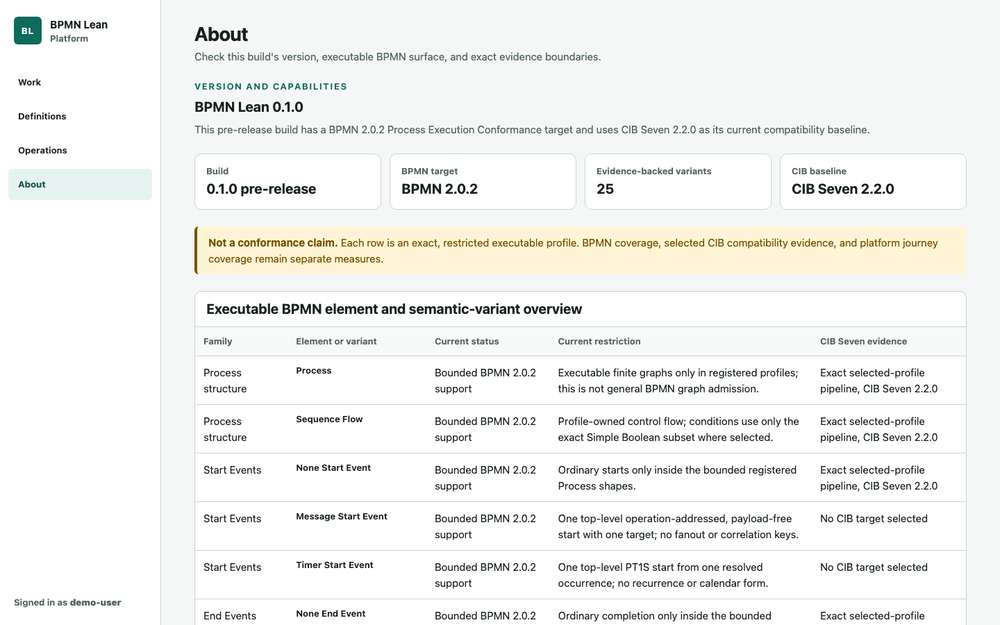

## 2. Deploy and inspect structured Human Work

1. Open **Definitions** and expand **Add BPMN definition**.
2. Select [`scenarios/expense-exception-review/process.bpmn`](../scenarios/expense-exception-review/process.bpmn).
3. Enter semantic profile ID `bpmn-2.0.2-bpmn-lean-structured-human-work-draft`.
4. Choose **Deploy definition**.

The result should say **Admitted and deployed** for `Process_ExpenseExceptionReview`, version 1 on a clean distribution. Its **Diagram** view says **Generated layout** because the admitted source intentionally contains no BPMN DI. Product 2 retains a digest-bound presentation sidecar and an exact-source-bound Human Task catalog without changing the admitted source or adding form meaning to Product 1.

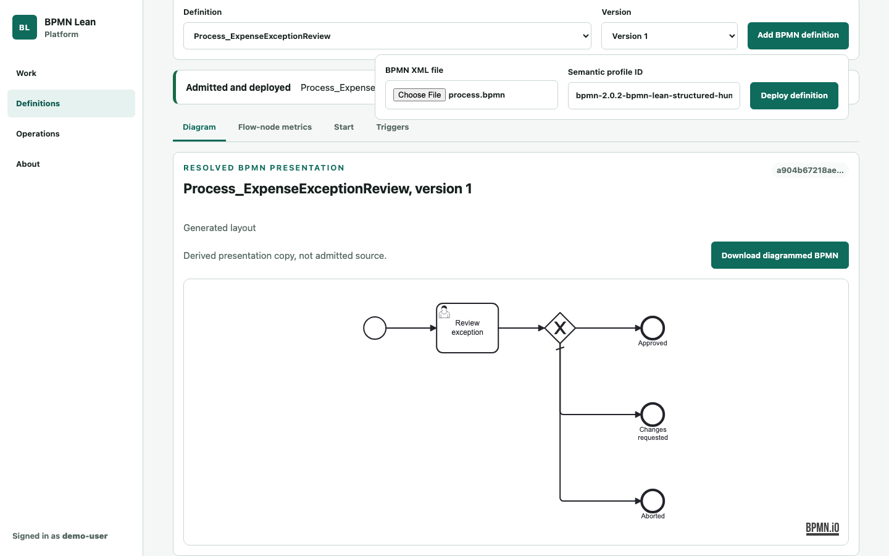

Choose **Download diagrammed BPMN** if you want a derived document that merges the exact semantic model with validated BPMN DI for use in a BPMN modeller. It is not the admitted source.

## 3. Start the exact definition version

Open the definition's **Start** view and choose **Start version 1**, or the displayed selected version if you retained earlier state. Keep the returned Process-instance ID.

The public identity binds the instance to its Process ID, definition version, exact source digest, and semantic profile. Product 2 keeps the Temporal observation locator private.

## 4. Claim the current task

1. Open **Work** and choose **Refresh** until **Review exception** appears.
2. Confirm candidate group `reviewers`, priority 80, and state **Unclaimed**.
3. Choose **Claim** and confirm **Claimed by demo-user**.
4. Select **Review exception**, then inspect **Details** and **Diagram** if desired.

Claim state, actor policy, priority, and the form catalog are Product 2 concerns. Task occurrence identity and the completion result come only from Product 1's publication.

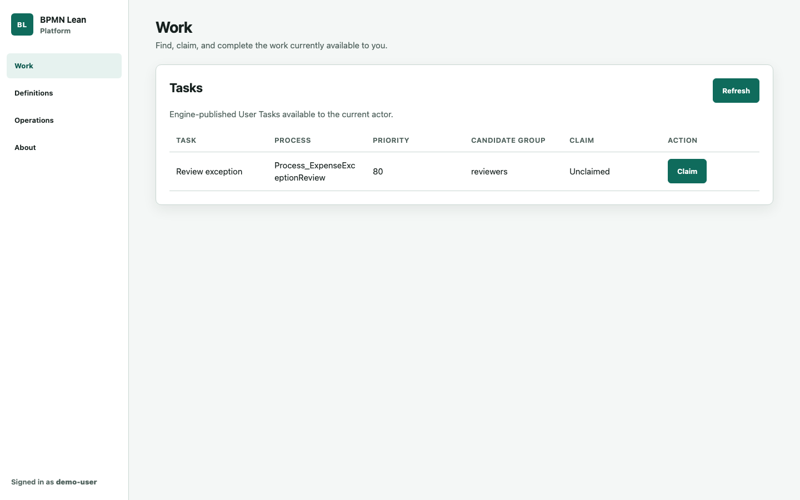

## 5. Complete the structured form

Open the task's **Form** view and enter:

- Request reference: `EXP-WALKTHROUGH-001`
- Expense date: `2026-08-17`
- Approved amount: `4250`
- Cost center: **Engineering**
- Risk flags: **Missing receipt** and **Policy exception**
- Notify requester: **True**

Choose **Approve**. A committed completion closes the detail and, after the background projection refresh, the Work collection reports **No current tasks**. If the response was transport-indeterminate, use the offered **Retry completion** control because it resubmits the retained command identity rather than creating a different completion.

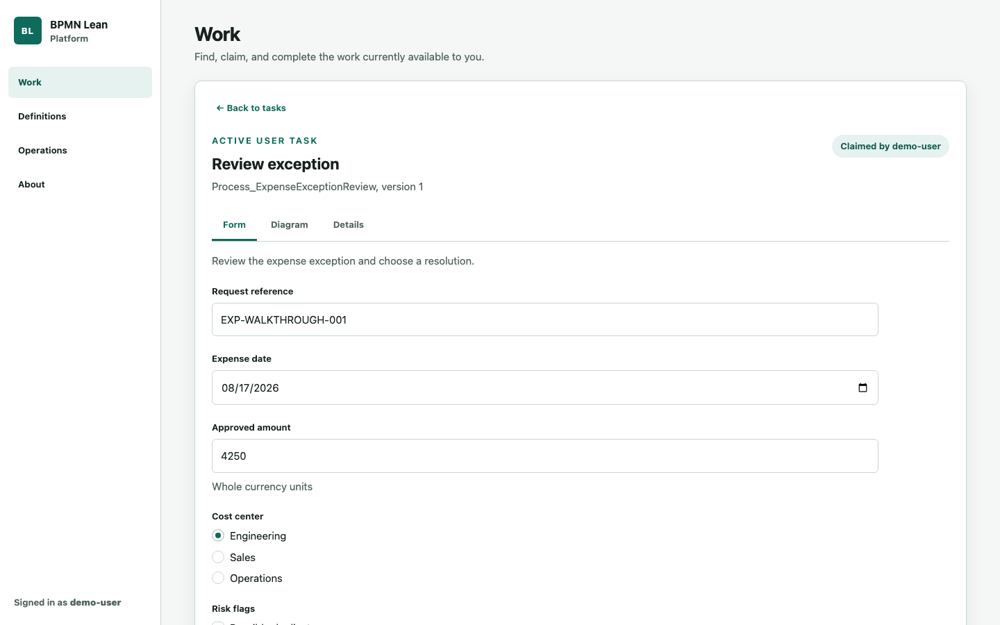

For a validation exercise, select **Abort** before entering a required resolution reason. The form should focus the missing field. Product 2 validates the exact catalog-bound request and computes one canonical typed patch before the engine atomically commits or rejects the task occurrence.

## 6. Inspect the completed Process

1. Open **Operations**, then **Process instances**.
2. Search for the retained Process-instance ID and choose **View details**.
3. Confirm status **completed**.
4. Open **History** and inspect the contiguous engine-published `completeUserTaskInstance` record for `ReviewException`.

Semantic History is published by the engine. Product 2 never reconstructs it from Temporal Event History or state differences.

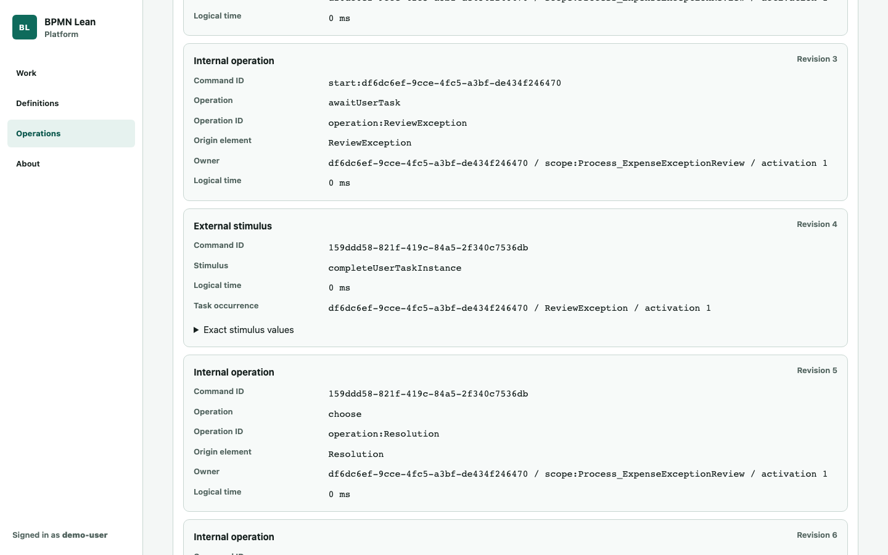

Open **Diagram** and inspect the terminal committed positions over the retained definition presentation.

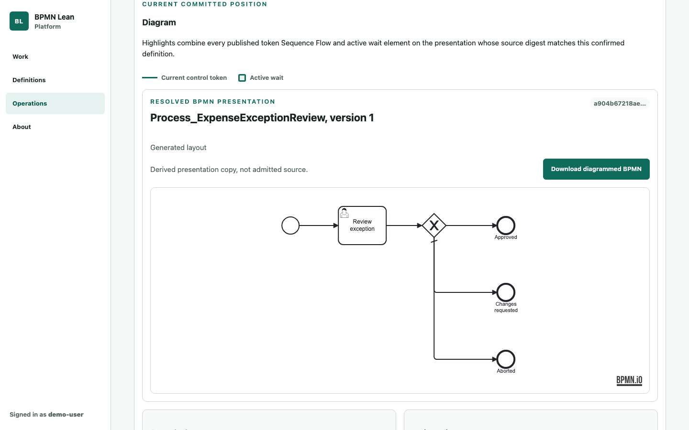

## 7. Inspect exact-version metrics

Return to **Definitions**, select `Process_ExpenseExceptionReview` and its deployed version, then open **Flow-node metrics**. Confirm **All retained evidence**, **1 Process instance**, and the frequency and completed-duration table.

Metrics come from complete engine-published flow-node occurrences for one exact-definition population. They are not transition counts or platform request durations.

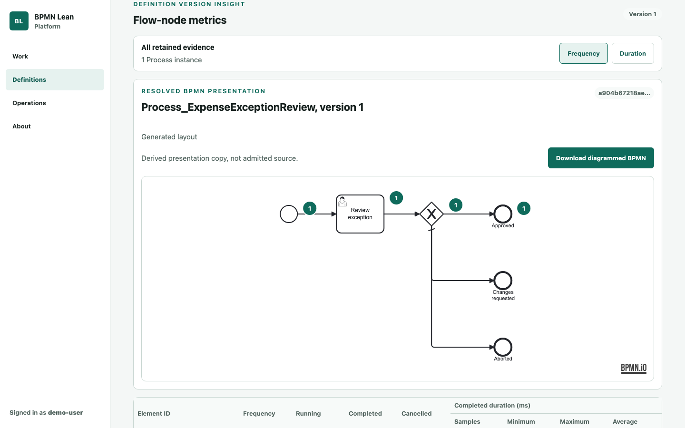

## 8. Create two independently operable incidents

Use [`scenarios/service-task-effect/process.bpmn`](../scenarios/service-task-effect/process.bpmn) twice:

1. Deploy it with profile `cibseven-2.2.0-service-task-incident-draft`, then start that exact version.
2. Deploy the same exact source with profile `cibseven-2.2.0-service-task-incident-cancellation-draft`, then start its new exact version.
3. Open **Operations**, select **Incidents**, and switch between visible Operations tabs until both current incidents appear.

The retry profile publishes only **Retry**. The cancellation profile additionally publishes **Cancel Process**. These controls reflect exact engine-published interactions rather than generic actions inferred from an error state.

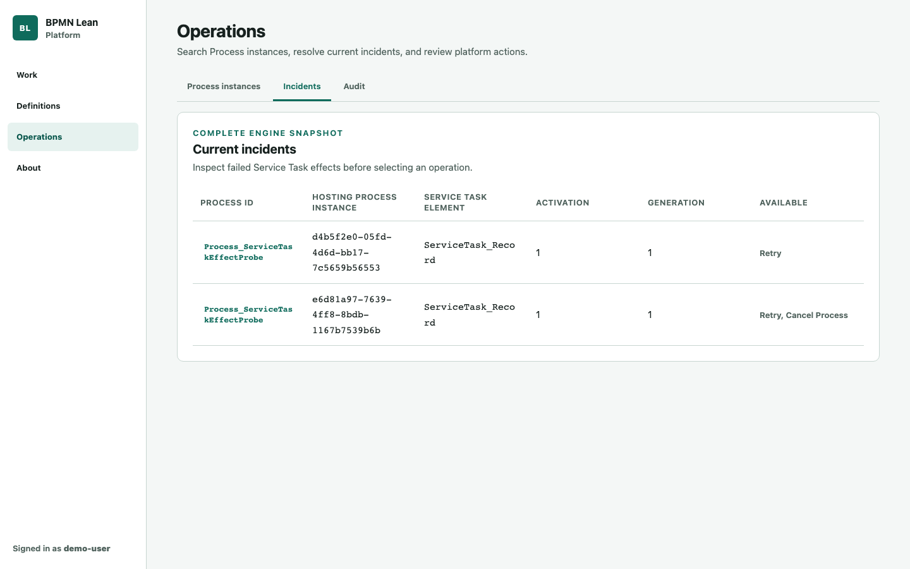

## 9. Retry and cancel

Open the retry-profile incident and choose **Retry**. If the response is transport-indeterminate, use **Submit Retry again** to retain the exact action identity. The incident should leave the current collection when the Process completes.

Open the remaining incident and choose **Cancel Process**. The confirmation dialog initially focuses **Keep Process running** and explains that cancellation removes all remaining live work. Choose **Cancel root Process** only after reviewing that scope.

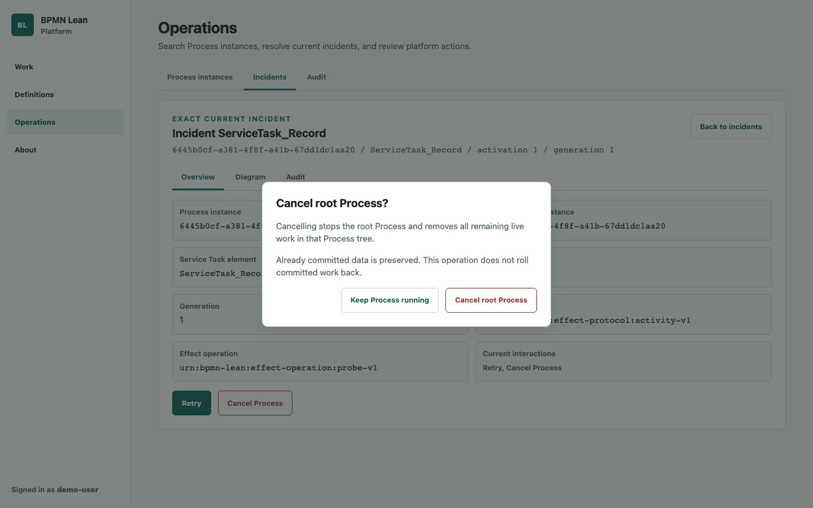

The command targets the exact incident-gated hosting root. It does not expose a Temporal Workflow ID or treat native Temporal cancellation as a BPMN fact.

## 10. Inspect incident action audit

Return to the top-level Operations collection, open **Audit**, and filter actor ID to `demo-user`. Refresh until the settled status reports the platform action records and the table shows committed Retry and Cancel Process rows.

The audit stream is Product 2 evidence with its own contiguous source order. It remains distinct from semantic History.

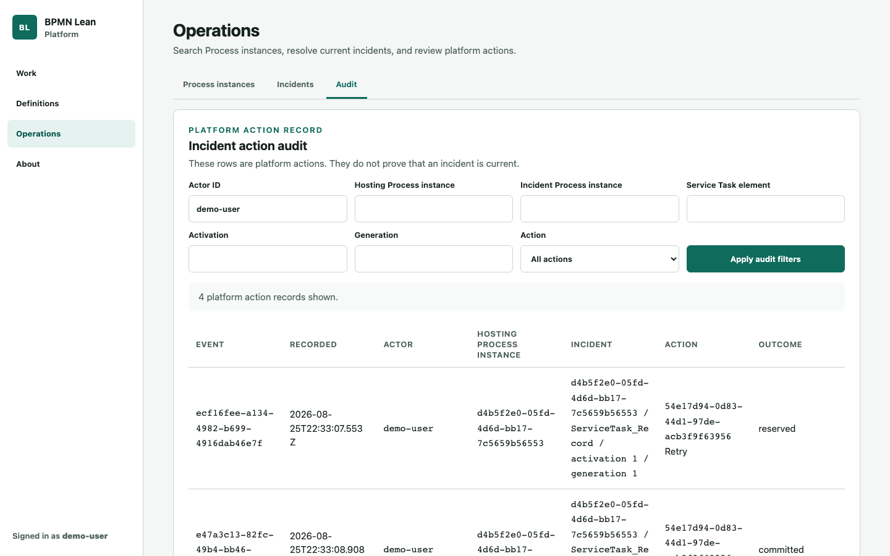

## Stop or retain the environment

Stop the containers while preserving PostgreSQL and Temporal data:

```sh
./scripts/pnpm.sh run evaluation:stop
```

Run `./scripts/pnpm.sh run evaluation:reset` later only when you deliberately want to remove both retained evaluation volumes. This Compose topology is an evaluation convenience, not a production Temporal deployment or capacity claim.

## Refresh the maintained screenshots

Readers do not need the screenshot tooling. Maintainers regenerate the complete ordered catalog explicitly after a material UI change or for a release candidate:

```sh
./scripts/pnpm.sh run walkthrough:screenshots:refresh
```

The command allocates a dynamic loopback port, starts an isolated Compose project with fresh temporary volumes, drives only public accessible UI landmarks in one Chromium browser, writes the ten 1440 by 900 images, and removes the isolated containers and volumes after success or failure. It does not reuse or delete the ordinary evaluation distribution's state.

Screenshot refresh is not part of ordinary commit CI and performs no pixel comparison. The manual or tagged [evaluation distribution workflow](../.github/workflows/evaluation-distribution.yml) can regenerate and upload the catalog as a review artifact. Direct execution against an already-running origin is an advanced package-level path documented in the [screenshot project README](../showcase/platform-browser-walkthrough/README.md).

## Troubleshooting

- **The public origin does not become healthy:** run `docker compose ps` and `docker compose logs`. Check that port 3000 is free.
- **`demo:start` refuses a cached image:** the current clean commit does not match the image labels, or a required local image is missing. Run `demo:prepare` while registry access is available; do not bypass the refusal with an unverified manual start.
- **A task or incident has not appeared yet:** use the visible refresh or tab controls. Shared reads fail closed when their bounded projection is not current; background workers repair it without request-time fleet fan-out.
- **A displayed version differs from this guide:** the evaluation volumes contain prior data. Continue with the selected exact version or deliberately reset the evaluation volumes.
- **The form is unavailable:** structured Work requires exact catalog identity and engine-published task identity to match. Missing, corrupt, or mismatched data fails closed without changing the task.
- **The Diagram says unavailable:** models outside generated-layout scope must contain complete usable source DI or remain honestly unavailable.

## Contract owners

- [BPM platform human-work specification](BPM-PLATFORM-HUMAN-WORK-SPEC.md) owns task discovery, claim, completion, and Work audit behavior.
- [Structured Human Work specification](BPM-PLATFORM-STRUCTURED-HUMAN-WORK-SPEC.md) owns catalog-bound fields, actions, validation, and typed completion.
- [Incident operations specification](BPM-PLATFORM-INCIDENT-OPERATIONS-SPEC.md) owns current incidents, Retry, Cancel, and incident audit.
- [Operator history and audit export specification](BPM-PLATFORM-OPERATOR-HISTORY-AUDIT-EXPORT-SPEC.md) owns per-instance operator history and canonical audit download.
- [Committed execution publication specification](capsules/COMMITTED-EXECUTION-PUBLICATION-SPEC.md) owns semantic History and current Diagram positions.
- [Flow-node occurrence metrics specification](capsules/FLOW-NODE-OCCURRENCE-METRICS-SPEC.md) owns frequency and duration facts.
- [Information architecture specification](BPM-PLATFORM-INFORMATION-ARCHITECTURE-SPEC.md) and [UI design specification](BPM-PLATFORM-UI-DESIGN-SPEC.md) own workspace, interaction, accessibility, and responsive behavior.
- [BPMN diagram presentation decision](BPMN-DIAGRAM-PRESENTATION-DECISION.md) owns source DI, generated sidecars, provenance, and modeller handoff.
