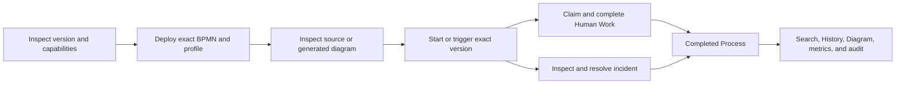

# BPM platform browser walkthrough

## Status

Implemented and maintained as a text-first tutorial over the current Product 2 browser surface. It uses the production platform server, HTTP-only web client, Temporal-hosted engine, and retained BPMN models through the existing showcase hosts. It is a user guide and hands-on learning path, not semantic, compatibility, or performance evidence. Automated documentation screenshots are deliberately deferred until the containerized evaluation topology is stable.

## What you will do

This walkthrough covers the complete current browser workflow in two independent labs:

1. inspect exact capabilities, deploy and diagram a BPMN definition, start a Process instance, claim and complete a structured Human Task, and inspect metrics, semantic History, current Diagram, operator history, and canonical downloads;
2. create real Service Task incidents, recover one with Retry, cancel another Process, and inspect incident audit.

Optional exercises cover exact-version Timer Start scheduling, Message Start publication, validation failure, conditional form input, source-authored BPMN DI, and modeller handoff.



The browser never talks directly to Temporal. It uses the public Product 2 HTTP API, which reaches the engine only through the narrowed engine gateway.

## Current browser surfaces

| Workspace | What it exposes |
|---|---|
| About | Exact package version, the 25 supported executable element or semantic variants, current restrictions, and separately classified CIB Seven evidence |
| Definitions | Deployment, admission diagnostics, versions, exact source identity, Diagram, derived diagrammed-BPMN download, exact-version Start, Timer and Message triggers, and flow-node metrics |
| Work | Priority-ranked current tasks, explicit Claim and Release, task Details and Diagram, structured forms, action-dependent input, validation, and completion |
| Operations | Confirmed Process search, current incidents, Retry and root-Process Cancel, semantic Overview, History and Diagram, incident audit, operator history, and canonical downloads |

Some engine capabilities are intentionally API- or runner-only and therefore do not appear as separate browser controls. The [implementation map](IMPLEMENTATION-MAP.md) owns that exact boundary.

## Prerequisites

Complete the [clean-clone contributor setup](CONTRIBUTOR-SETUP-GUIDE.md#clean-clone-path). The walkthrough itself does not require Lean, the CIB Seven checkout, Playwright, or a browser plugin. Its showcase host uses the pinned local Temporal test service and the configured development identity `demo-user` in candidate group `reviewers`.

Build the two Product 2 applications once:

```sh
./scripts/pnpm.sh run build:platform-server
./scripts/pnpm.sh run build:platform-web
```

Each lab stores platform data in a temporary directory and deletes it when its host stops. Complete a lab before stopping its host.

## Lab 1: deploy, work, and explain a Process

### Start the local product

In terminal 1, start the ephemeral Temporal service, production BPMN Worker, and Product 2 API server:

```sh
PLATFORM_PARSER_DEADLINE_MS=5000 \
PLATFORM_PORT=3203 \
PLATFORM_TEMPORAL_TASK_QUEUE=bpmn-m3-human-work \
./scripts/pnpm.sh run showcase:m3-human-work:host
```

Wait for `M3 Human Work showcase ready at http://127.0.0.1:3203`. The first run may take longer while the pinned Temporal test service is prepared.

In terminal 2, serve the built web application and proxy its API requests to that host:

```sh
PLATFORM_API_ORIGIN=http://127.0.0.1:3203 \
./scripts/pnpm.sh --filter @bpmn-lean/platform-web exec vite preview \
  --host 127.0.0.1 --port 4276 --strictPort
```

Open [http://127.0.0.1:4276](http://127.0.0.1:4276). The shell should show Work, Definitions, Operations, and About, plus `Signed in as demo-user`.

### Exercise 1: inspect the honest capability boundary

1. Open **About**.
2. Confirm the displayed package version and **25** capability rows.
3. Compare at least one standards-only row with one row carrying classified CIB Seven evidence.
4. Read the restriction text for a familiar element such as User Task, Exclusive Gateway, or Boundary Event.

The table reports variants rather than a percentage. BPMN requirements, selected CIB compatibility, and platform functionality remain different denominators.

### Exercise 2: deploy and inspect structured Human Work

1. Open **Definitions**.
2. Expand **Add BPMN definition**.
3. Select [`scenarios/expense-exception-review/process.bpmn`](../scenarios/expense-exception-review/process.bpmn).
4. Enter semantic profile ID `bpmn-2.0.2-bpmn-lean-structured-human-work-draft`.
5. Choose **Deploy definition**.

The result should say **Admitted and deployed** for `Process_ExpenseExceptionReview`, version 1. The selected version's **Diagram** tab should show **Generated layout** because the exact admitted source intentionally contains no BPMN DI. Product 2 generated and retained a digest-bound presentation sidecar and a separately closed Human Task catalog without changing the admitted source or adding form meaning to Product 1.

Choose **Download diagrammed BPMN**. The downloaded document combines the exact semantic model with validated BPMN DI and is suitable for a BPMN DI-capable modeller. It is a derived presentation copy, not the admitted source.

### Exercise 3: start the exact definition version

1. Open the definition's **Start** tab.
2. Choose **Start version 1**.
3. Retain the displayed Process-instance ID.

The public identity binds the instance to `Process_ExpenseExceptionReview`, version 1, its exact source digest, and its semantic profile. Product 2 keeps the Temporal observation locator private.

### Exercise 4: claim and inspect the task

1. Open **Work** and choose **Refresh** if necessary.
2. Find **Review exception**. Priority 80 places it ahead of ordinary priority-50 work. The row should show candidate group `reviewers` and state **Unclaimed**.
3. Confirm that the task name does not open a completion form while unclaimed.
4. Choose **Claim**. The row should change to **Claimed by demo-user** and the task name should become selectable.
5. Select **Review exception** to open its full-width workspace.
6. Open **Details** and inspect the public Process identity, hosting root identity, element ID, activation, candidate group, description, priority, and catalog binding.
7. Open **Diagram** and confirm that the exact `ReviewException` occurrence is highlighted.

Claim state, authorization, priority, and the form catalog are Product 2 concerns. Task occurrence identity and completion outcome come only from Product 1's publication.

### Exercise 5: explore validation and conditional input

1. Open **Form**.
2. Choose **Abort** before filling any input. The form should identify the first required field and move focus there.
3. Enter a request reference and expense date.
4. Optionally enter a whole approved amount.
5. Choose a cost center, one or more risk flags, and an explicit true-or-false notification value.
6. Choose **Abort** again. **Resolution reason** should now be visible and required.
7. Submit once without the reason and confirm that validation focuses that exact field.
8. Enter `Duplicate expense.` and choose **Abort** again.

You can instead use **Approve**, where the reason is absent, or **Request changes**, where it is required. Product 2 validates the complete catalog-bound request and computes one canonical typed patch. The engine atomically commits or rejects the exact task occurrence and follows the matching Exclusive Gateway route.

After a committed completion, the task detail closes and the inbox reports **No current tasks**.

### Exercise 6: inspect the completed Process

1. Open **Operations** and select **Process instances**.
2. Enter the retained Process-instance ID, or filter by Process ID `Process_ExpenseExceptionReview`.
3. Choose **Search**, then **View details** for the matching row.
4. In **Overview**, confirm status **completed** and choose **Download execution history** if you want the canonical execution publication.
5. In **History**, inspect the contiguous engine-published transitions including `startProcess`, `completeUserTaskInstance`, and the selected route.
6. In **Diagram**, confirm the terminal semantic positions rendered over the definition presentation.
7. In **Operator history**, inspect Work and incident-action events as separate source-ordered collections, then choose **Download operator audit**.

Semantic History is published by the engine and is never reconstructed from Temporal Event History or state differences. Operator history is Product 2 audit and remains separately ordered and independently available.

### Exercise 7: inspect definition metrics

1. Return to **Definitions** and select `Process_ExpenseExceptionReview`, version 1.
2. Open **Flow-node metrics**.
3. Compare **Frequency** and **Duration**.

Metrics are derived from complete engine-published flow-node occurrences for the exact definition population. They are not transition counts or platform request durations.

### Optional exercise: compare source-authored BPMN DI

Deploy [`scenarios/user-task-preserved-notation/process.bpmn`](../scenarios/user-task-preserved-notation/process.bpmn) with profile `bpmn-2.0.2-user-task-preserved-notation-draft`.

Its Diagram tab should say **Source layout** and retain the authored Collaboration, pool, lane, annotation, and association. This model is a notation-preservation witness, not claimable Human Work, because it intentionally publishes no assignment metadata.

### Optional exercise: use exact-version triggers

The **Triggers** tab exposes only capabilities published by the selected exact version.

- Deploy [`scenarios/timer-start-event/process.bpmn`](../scenarios/timer-start-event/process.bpmn) with profile `bpmn-2.0.2-timer-start-event-draft`. Open **Triggers**, inspect `TimerStart_PT1S`, enter a canonical future UTC whole second ending in `.000Z`, and create a schedule. Refresh it after its due instant to see the exact version's started instance.
- Deploy [`scenarios/message-start-event/process.bpmn`](../scenarios/message-start-event/process.bpmn) with profile `bpmn-2.0.2-message-start-event-draft`. Open **Triggers**, inspect the published Message, Interface, and Operation identity, then choose **Publish Message Start**. The publication ID and resulting Process-instance ID remain distinct.

These are exact-version product capabilities, not generic cron or message-broker abstractions.

## Lab 2: recover and cancel incidents

Stop both Lab 1 processes, then reuse the same browser and web port with the M4 host.

### Start the incident environment

In terminal 1:

```sh
PLATFORM_PARSER_DEADLINE_MS=5000 \
PLATFORM_PORT=3204 \
PLATFORM_TEMPORAL_TASK_QUEUE=bpmn-m4-incident-operations \
./scripts/pnpm.sh run showcase:m4-incident-operations:host
```

In terminal 2:

```sh
PLATFORM_API_ORIGIN=http://127.0.0.1:3204 \
./scripts/pnpm.sh --filter @bpmn-lean/platform-web exec vite preview \
  --host 127.0.0.1 --port 4276 --strictPort
```

Open [http://127.0.0.1:4276](http://127.0.0.1:4276).

### Exercise 8: create two independently operable incidents

Use [`scenarios/service-task-effect/process.bpmn`](../scenarios/service-task-effect/process.bpmn) twice:

1. Deploy it with profile `cibseven-2.2.0-service-task-incident-draft`, then start that exact version.
2. Deploy the same exact source with profile `cibseven-2.2.0-service-task-incident-cancellation-draft`, then start the new exact version.
3. Open **Operations**, select **Incidents**, and choose **Refresh** until both current incidents appear.

The retry profile publishes only **Retry**. The cancellation profile additionally publishes **Cancel Process**. These controls reflect exact engine-published interactions rather than generic buttons inferred from an error state.

### Exercise 9: retry one incident

1. Open the incident belonging to the retry-profile instance.
2. Inspect **Overview**, **Diagram**, and **Audit**.
3. Return to **Overview** and choose **Retry**.
4. Confirm that the incident leaves the current collection and the Process completes.

Retry is an exact content-bound semantic command. It is distinct from Temporal Activity retry and from resubmitting an unknown transport result.

### Exercise 10: cancel the other Process

1. Open the remaining incident.
2. Choose **Cancel Process**.
3. Read the confirmation dialog and choose **Cancel root Process**.
4. Confirm that no current incident remains.
5. Open the top-level **Audit** collection and filter by actor `demo-user`.

The cancellation command targets the exact incident-gated hosting root. It does not expose a Temporal Workflow ID or native cancellation as a BPMN fact.

## Edit a generated layout in a modeller

The internal generated-DI sidecar is not a standalone modeller file. Use **Download diagrammed BPMN** to obtain the merged document, edit its layout in a standards-oriented BPMN modeller, and save it.

Deploying the saved document creates a new definition version with new exact source bytes. If it contains complete usable embedded DI and still satisfies the selected semantic profile, the version resolves through **Source layout**. It never overwrites the original admitted source or mutates its generated sidecar.

## Troubleshooting

- **The API host does not start:** check whether the selected API port is already in use. If you change it, use the same origin in `PLATFORM_API_ORIGIN`.
- **The web preview reports a port conflict:** choose another preview port and open that address.
- **No task appears:** deploy and start the expense-exception model with the exact structured profile, confirm the shell says `demo-user`, and choose **Refresh**. Metadata-free User Tasks are intentionally absent from the Work inbox.
- **The form is unavailable:** structured work requires exact catalog identity and engine-published task element identity to match. Missing, corrupt, or mismatched catalogs fail closed without changing the task.
- **No incident appears:** ensure the M4 host is running, use one of the two exact incident profiles, start the matching version, and refresh Incidents after the failing effect is reported.
- **The Diagram says unavailable:** models outside the generated-layout scope must contain complete usable source DI or remain honestly unavailable.
- **The Process disappears after restart:** these walkthrough hosts intentionally use temporary data. The production server supports a configured persistent directory, while the planned evaluation Compose path will use named volumes.

## Automated evidence and future screenshots

The current production-backed browser journeys are executable now:

```sh
./scripts/pnpm.sh run test:showcase:m3-human-work
./scripts/pnpm.sh run test:showcase:m4-incident-operations
```

They verify behavior, public boundaries, keyboard and focus behavior, responsive containment, live Temporal history, and replay. They do not generate documentation images.

After shared persistence establishes the intended evaluation topology, a dedicated Playwright documentation project will drive the containerized product and write stable named screenshots for the major tutorial landmarks. Screenshot regeneration will be explicit at release candidates or after material UI changes rather than part of ordinary CI.

## Contract owners

- [BPM platform human-work specification](BPM-PLATFORM-HUMAN-WORK-SPEC.md) owns task discovery, claim, completion, and Work audit behavior.
- [Structured Human Work specification](BPM-PLATFORM-STRUCTURED-HUMAN-WORK-SPEC.md) owns catalog-bound fields, actions, validation, and typed completion.
- [Incident operations specification](BPM-PLATFORM-INCIDENT-OPERATIONS-SPEC.md) owns current incidents, Retry, Cancel, and incident audit.
- [Operator history and audit export specification](BPM-PLATFORM-OPERATOR-HISTORY-AUDIT-EXPORT-SPEC.md) owns per-instance operator history and canonical audit download.
- [Committed execution publication specification](capsules/COMMITTED-EXECUTION-PUBLICATION-SPEC.md) owns semantic History and current Diagram positions.
- [Flow-node occurrence metrics specification](capsules/FLOW-NODE-OCCURRENCE-METRICS-SPEC.md) owns frequency and duration facts.
- [Information architecture specification](BPM-PLATFORM-INFORMATION-ARCHITECTURE-SPEC.md) and [UI design specification](BPM-PLATFORM-UI-DESIGN-SPEC.md) own workspace, interaction, accessibility, and responsive behavior.
- [BPMN diagram presentation decision](BPMN-DIAGRAM-PRESENTATION-DECISION.md) owns source DI, generated sidecars, provenance, and modeller handoff.
