# BPM platform browser walkthrough

## Status

Implemented and maintained as a text-first tutorial over the containerized Product 2 evaluation distribution. The screenshots are generated from the same public browser journey and illustrate stable landmarks, but the instructions remain complete when images are unavailable. This is a user guide and evaluation aid, not semantic, compatibility, performance, or production-capacity evidence.

The hash-link navigation described below is implemented with [composed browser acceptance](BPM-PLATFORM-INFORMATION-ARCHITECTURE-SPEC.md#acceptance). The screenshots follow the current start-first Definitions journey, grouped capability overview and Operations views; the [capture record](#screenshot-capture-record) identifies their source and environment.

## What you will do

This walkthrough uses one persistent evaluation topology to:

1. inspect the exact capability boundary;
2. deploy and diagram a BPMN definition;
3. start an exact definition version;
4. claim and complete a structured Human Task;
5. inspect semantic History, the terminal Diagram, and exact-version metrics;
6. create two Service Task incidents;
7. retry one incident and cancel the other Process;
8. inspect the resulting Product 2 audit records.

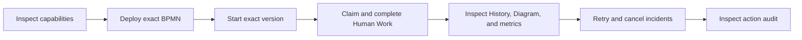
```mermaid
flowchart LR
  About[Inspect capabilities] --> Deploy[Deploy exact BPMN]
  Deploy --> Start[Start exact version]
  Start --> Work[Claim and complete Human Work]
  Work --> Operate[Inspect History, Diagram, and metrics]
  Operate --> Incidents[Retry and cancel incidents]
  Incidents --> Audit[Inspect action audit]
```

The browser talks only to the public Product 2 HTTP API. The API reaches the Temporal-hosted engine through the narrowed engine gateway, while PostgreSQL-backed recovery workers refresh projections outside request handling.

## RC process showcase catalog

From a prepared contributor checkout, run:

```sh
./scripts/pnpm.sh run demo:rc
```

Open the printed origin, normally [http://127.0.0.1:3000](http://127.0.0.1:3000). Set `PLATFORM_PORT` if that port is occupied. This command builds the current Product 2 web/runtime graph and starts a private local platform and real Temporal server. It uses an isolated fresh Namespace and temporary data; Ctrl-C stops this host and removes only its temporary state. It neither starts nor resets the persistent Compose distribution. Lean and CIB Seven are not needed to execute these browser instances; their retained evidence qualifies the engine profiles.

Open the printed **Prepared process catalog** link, or **Definitions → Explore process showcases**. The user-facing host prepares only three interactive definitions before reporting ready: request approval, parallel content/risk review, and expense-exception review. Their tasks wait for the person using Work; this launch creates no simulated-user actor. It creates no Process instances until you choose Start. Each prepared entry has its business description, **Open definition** and **Go to Start** links bound to the published version. Search by business purpose or BPMN element; **Include automated examples and engine models** changes only which retained models are visible, without claiming that every model has a browser journey. Each detail explains what to try, the exact supported element variants and limits, and the separate CIB comparison boundary.

1. Select a process and read its description and restrictions.
2. Choose **Go to Start** for a prepared entry, or **Open definition** to inspect its diagram first. On another host, an unprepared example offers **Prepare this showcase**, which deploys the exact model and opens **Ready to start** with its description and example input. Preparation alone does not run it.
3. Review the start form above the diagram, then choose **Start version …**. The diagram is available below for inspection; no tab change is needed.
4. Follow **What happens next**. For **Interactive human work**, choose **Open task inbox**, claim a task, choose **Edit task**, fill the form and complete it. On the separate automation host, **Guided simulation** Start opens the confirmed instance automatically. The isolated host supplies the declared simulated participants and integrations, so the example may already be completed when you see it. The visible status updates while it is running; choose **View execution history** to inspect the recorded sequence.
5. Choose **View instance in Operations** directly from the start result to inspect **Overview** and **History**, without searching or copying an ID. Human-work journeys also produce **Operator history**. Diagram availability follows the model's actual source/presentation boundary.

Use **Process description** from Definitions or an instance to return to its matching showcase. `Process_TerminateEnd` is the advanced repeated-application-reminder demonstration: its script finishes the review before terminating the local subprocess. It demonstrates repeated handlers and subscription cleanup, not cancellation of unfinished review work. Treat it as technical coverage evidence rather than an interactive cancellation showcase.

| Business evaluation | Interaction |
|---|---|
| Request approval; independent content and risk approvals; expense-exception resolution | Claim and complete real forms in Work |
| Ordered document review; parallel risk assessment | Simulated batch participants; inspect ordered aggregation and completion |
| External service recording; mapped service result | Simulated integrations; inspect durable completion and output mapping |
| Invoice receipt; repeated application reminders | Simulated Message producers; inspect subscription consumption and handler occurrences |
| Claim context and decision | Simulated assessor; inspect direct input/output mediation |
| Travel cancellation; reservation withdrawal | Simulated bookings and reversal effects; inspect Compensation and bounded Transaction/Cancel |

For automated testing, use the separate `demo:rc:automated` command: `./scripts/pnpm.sh run demo:rc:automated` (default port 3001). It prepares the full technical catalog and explicitly enables scripted participants; interactive examples still require the ordinary Work actions and browser tests perform those actions. Each launch owns a fresh Temporal server/Namespace, Worker queue and temporary platform store, so automation cannot consume the user demo's tasks. External service simulations are host effects and remain distinct from human task completion. Existing engine scenarios and neutral interaction plans are unchanged.

The same catalog is present in the ordinary platform. Its default list shows interactive human work. Guided preparation is disabled unless the host marker explicitly advertises automated participants; missing or old markers do not enable it. `Process_ClaimAssessment` remains an automated data-mapping fixture without a human form, so the user-facing launch neither prepares it nor lists it among its ready-to-start processes. Manually starting an uploaded matching definition on the user-facing host does not install such a participant. Restart an already-running `demo:rc` to apply this launch change; refreshing its browser alone cannot remove actors from the old server. Retained engine-only models are inspectable but offer no browser-run action. No model promises general BPMN conformance, unrestricted CIB compatibility, a live external business service, or production capacity.

## Share a view and use browser history

In the routing-enabled build, copy the browser's complete address, including the part after `#`, to return to a workspace, exact definition version and tab, selected showcase, task or Operations detail. Catalog searches and the additional-model toggle, plus submitted Operations filters, travel with the location. Browser **Back** and **Forward** revisit those selections; reloading resolves the selection against the current public API.

A link shares a view, not access rights. The recipient must use the same available platform and pass its actor authorization. A task must still be claimed before completion, and a stale or unavailable item supplies no action. Links do not contain form answers, pending commands or retry identities and never start, claim or complete work by opening them.

Drafts and exact retries survive permitted tab and workspace changes within the current browser session. Navigation that would replace an item with a pending or uncertain command stays blocked until that operation has a definite result. Reloading or opening the link elsewhere does not restore those in-memory drafts or operations. Use the displayed exact-retry control when delivery is uncertain.

## Seven-minute MUE Preview Alpha live demo

Use this run of show when presenting the project rather than evaluating each workflow manually. It combines one credible business Process with the canonical breadth view and the separate Multi-Instance proof, without implying that every reviewed semantic variant belongs to one executable profile.

### Zero-build demo machine

The recommended demo-machine path is the `mue-evaluation-v0.2.0-rc.1.tar.gz` asset of the qualified prerelease; until that release exists, a successful manual [Evaluation distribution workflow](../.github/workflows/evaluation-distribution.yml) run with image publication offers a commit-named artifact to signed-in GitHub users. The bundle contains the Compose topology, database-role initialization, this guide and fallback images, three prepared interactive human-process definitions, additional retained presentation models, and an environment file that pins all four project images to their published OCI index digests. Each index contains `linux/amd64` and `linux/arm64`, carries the source commit and complete tracked-source-tree digest, and is published with BuildKit provenance and an SBOM. PostgreSQL and Temporal retain their separately pinned upstream digests. On macOS, use Docker Desktop with Linux containers or Rancher Desktop with dockerd (moby), select the matching Docker context, and verify `docker info` plus Docker Compose `2.24.4` or later before preparing the bundle.

Download and unpack that artifact on a compatible Docker host. No repository checkout, Node, pnpm, compiler, or image build is used there. While online, prepare and prove one fresh isolated stack with:

```sh
./deploy/evaluation/demo prepare
./deploy/evaluation/demo status
```

`prepare` pulls only the exact recorded digests, verifies every project image's source labels, removes only the bundle's demo volumes, initializes its fresh `bpmn-evaluation` Namespace with one-day retention, and starts Compose with `--no-build`. It then verifies and deploys the three retained interactive human processes through the public definition API, leaving their instances unstarted for the evaluator. The default project is `bpmn-lean-evaluation-published`, separate from earlier unversioned demo volumes. The publishing workflow logs out of GHCR and executes this same command before offering the artifact, proving anonymous pull, exact published-image startup, and process admission.

After preparation, show-time restart performs no build, registry request, or pull:

```sh
./deploy/evaluation/demo start
./deploy/evaluation/demo status
```

Keep the printed `LIVE_DEMO_READY` origin open in Chromium. `./deploy/evaluation/demo stop` stops only this demo project and retains its volumes. Transfer and unpack a previously proven artifact before entering an offline venue; do not substitute tags or edit its generated image environment.

### Presenter checkout alternative

Contributors may instead prepare the exact checked-out source before the audience arrives:

```sh
./scripts/pnpm.sh run demo:prepare
./scripts/pnpm.sh run demo:status
```

This source path is deliberately an online authoring boundary. It requires a clean committed worktree, rebuilds the four project images from that exact source, labels them with the full commit and a SHA-256 over the complete tracked source tree, and may contact Docker Hub and the pnpm registry when local caches are incomplete or need metadata. It initializes a fresh `bpmn-evaluation` Namespace with one-day retention in project `bpmn-lean-live-demo-native`, preserving earlier unversioned demo projects.

After a successful preparation, show-time execution needs no image build or pull. If Docker or the demo project was stopped, restart from the matching local images and preserved demo volumes with:

```sh
./scripts/pnpm.sh run demo:start
./scripts/pnpm.sh run demo:status
```

`demo:start` checks every local project image against the current clean committed source before changing the Compose project, then uses `--no-build --pull never`. It fails rather than starting a stale or unbound image. Missing base, PostgreSQL, Temporal, or project images therefore remain a preparation failure instead of triggering an audience-time download.

Then present these acts:

1. **Honest breadth, about 45 seconds.** Open **About**. Show that the evidence-backed summary equals the complete canonical table and point out **Not a conformance claim**. Explain that each row is bound to an exact reviewed profile rather than inferred from a product screen.
2. **Real-world headline, about three minutes.** Run `./scripts/pnpm.sh run demo:mue-headline`. The headed Chromium journey deploys the retained expense-exception Process, shows its BPMN diagram, and pauses at useful forms for **Approve**, **Request changes**, and **Abort** before finishing on committed semantic History. The forms cover text, date, decimal, choice, multi-choice, boolean, conditional required input, and destructive-action confirmation.
3. **Engine Alpha proof, about two minutes.** Run `./scripts/pnpm.sh run demo:mue-preview-alpha`. The headed journey shows natural Sequential Multi-Instance completion and an interrupting Timer Boundary Event over the same mechanism, ending on the committed aggregate in both cases.
4. **Close on evidence, about one minute.** Return to the prepared Product 2 origin and use the detailed walkthrough below to show an exact definition version, engine-published History, a terminal Diagram, or incident operations according to the audience's interest.

The headline and Alpha commands are author-side headed rehearsals and each starts its own exact ephemeral Temporal-backed witness so that presenter pacing cannot mutate ordinary evidence. They require the prepared presenter checkout and its frozen development dependencies; they are not embedded in the Docker-only artifact. The published distribution supplies the same real Product 2 and Temporal topology for manual audience navigation, retained-model upload, and recovery without compiling on the demo machine.

### Claims and non-claims

- This is **MUE Preview Alpha**, not completion of the current MUE programme.
- The canonical About table demonstrates executable breadth across exact profiles. The expense-exception model demonstrates a coherent real-world Process. Neither is a single all-elements profile.
- Product 2 forms, claims, priorities, and work audit are platform behavior bound to engine-published task identity. They do not add BPMN meaning.
- The demo makes no BPMN conformance, production capacity, high-availability, or benchmark claim.

### Presenter fallback

If the headline browser cannot start, continue from the retained [capability boundary](assets/bpm-platform-browser-walkthrough/01-about-capability-boundary.png), [expense Process diagram](assets/bpm-platform-browser-walkthrough/06-definition-start-and-diagram.png), [structured approval form](assets/bpm-platform-browser-walkthrough/09-expense-structured-form.png), and [committed semantic History](assets/bpm-platform-browser-walkthrough/12-completed-process-history.png). The retired Alpha fallback images are no longer maintained; use the current platform walkthrough for UI illustrations. These are fallback illustrations, not substitutes for the executable gates.

## Prerequisites and lifecycle

The published-bundle path requires Docker with Compose `2.24.4` or later and a browser only; that minimum is the first release supporting the `!reset` override that mechanically removes every build declaration. The source-checkout path additionally requires the frozen workspace dependencies. Neither path needs Lean, Java, the CIB Seven checkout, or host PostgreSQL or Temporal installations; only the author-side headed rehearsal needs Playwright. The ordinary evaluation commands below are contributor-oriented and may build or pull.

Initialize a separate source evaluation project once:

```sh
./scripts/pnpm.sh install --frozen-lockfile
export COMPOSE_PROJECT_NAME=bpmn-lean-evaluation-native
export BPMN_EVALUATION_NAMESPACE=bpmn-evaluation
docker compose build
docker compose up --no-build --wait temporal
docker compose run --rm --no-deps bpmn-worker initialize-fresh-namespace --retention-seconds 86400
./scripts/pnpm.sh run evaluation:start
```

Open [http://localhost:3000](http://localhost:3000). The shell should show Work, Definitions, Operations, and About, plus `Signed in as demo-user`.

Keep those two environment values for every lifecycle command. PostgreSQL and Temporal state survive an ordinary stop; restart with `evaluation:start` alone. Readiness requires native Current and complete Workflow/Activity queue registration. Fresh initialization refuses an existing Namespace and is never a restart or migration operation.

To deliberately clear this selected evaluation project for the exact version numbers and empty collections described below, reset and initialize it again:

```sh
./scripts/pnpm.sh run evaluation:reset
docker compose up --no-build --wait temporal
docker compose run --rm --no-deps bpmn-worker initialize-fresh-namespace --retention-seconds 86400
./scripts/pnpm.sh run evaluation:start
```

`evaluation:reset` deletes only the evaluation distribution's named PostgreSQL and Temporal volumes. Do not use it when you want to retain prior evaluation data.

## 1. Inspect the honest capability boundary

Open **About**. Confirm that **Coverage boundary** says **Not a conformance claim**. Expand **Executable BPMN elements and variants**, then expand a family to inspect its variants and restrictions. **Expand all families** and **Collapse all families** let you switch between the full inventory and its overview. Compare a standards-only row with a row carrying classified CIB Seven evidence.

The table reports exact variants rather than a percentage. BPMN requirement coverage, selected CIB compatibility, and platform functionality remain separate denominators.

**Implementation checkpoints** identifies the historical MUE Preview Beta evidence. Its rows retain the limits recorded at that checkpoint; the executable overview describes current supported variants. Expand this section only when you need its historical checkpoint details; it stays separate from the current capability families.

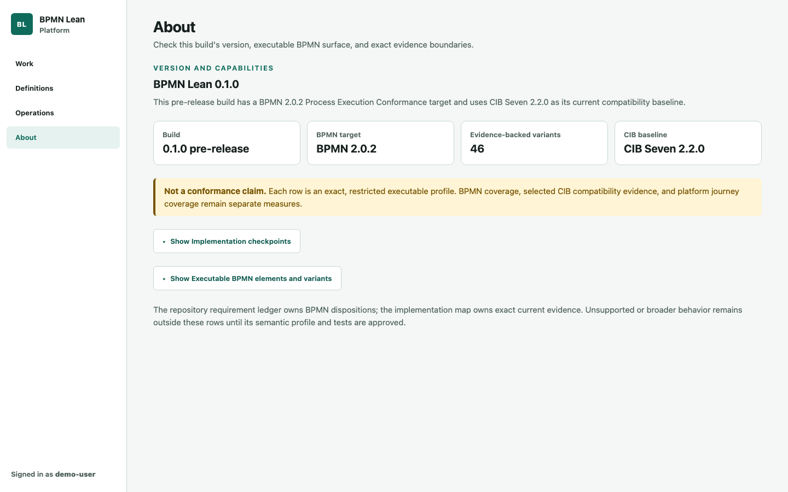

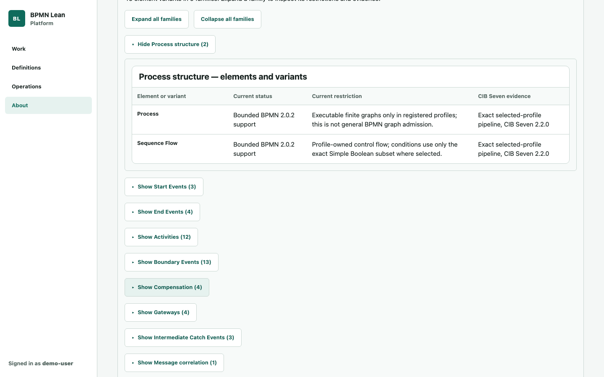

## 2. Choose a showcase or deploy your BPMN

Open **Definitions → Explore process showcases** to browse interactive examples. **Explore** opens the business description, BPMN name and ID, supported elements and what to try. The RC host pre-prepares the interactive examples; on a fresh shared evaluation host, choose **Prepare this showcase** to deploy one before starting it.

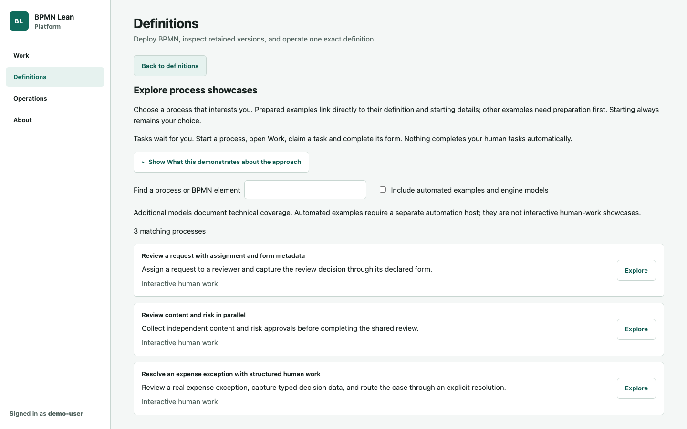

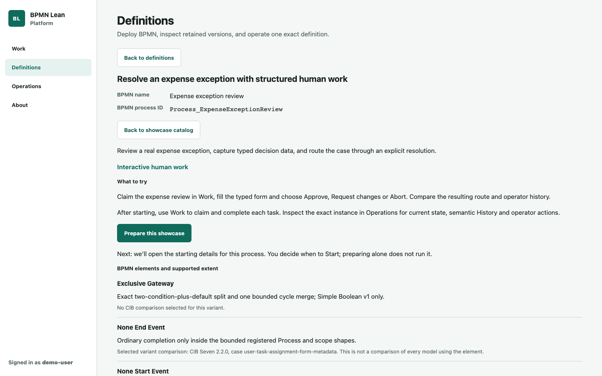

The following steps exercise the alternative upload route with the same expense-exception model. Use either preparation or upload for this run, so the version numbers remain predictable.


1. Open **Definitions** and choose **Add BPMN definition**. A modal dialog opens; **Cancel**, Escape or clicking its backdrop dismisses it before submission.
2. Select [`scenarios/expense-exception-review/process.bpmn`](../scenarios/expense-exception-review/process.bpmn).
3. Enter semantic profile ID `bpmn-2.0.2-bpmn-lean-structured-human-work-draft`.
4. Choose **Deploy definition**. Successful deployment closes the dialog.

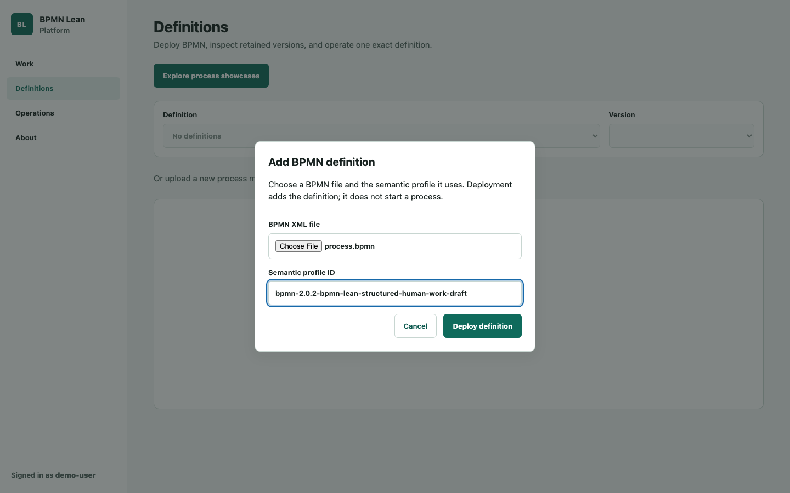

The result should say **Admitted and deployed** for `Process_ExpenseExceptionReview`, version 1 on a clean distribution. Its diagram below **Ready to start** says **Generated layout** because the admitted source intentionally contains no BPMN DI. Product 2 retains a digest-bound presentation sidecar and an exact-source-bound Human Task catalog without changing the admitted source or adding form meaning to Product 1.

**Process diagram** names the view. **BPMN process ID** identifies the technical identifier declared by the model, not a running instance or a friendly business title. Source/generated layout and the derived-copy warning remain separate provenance facts.

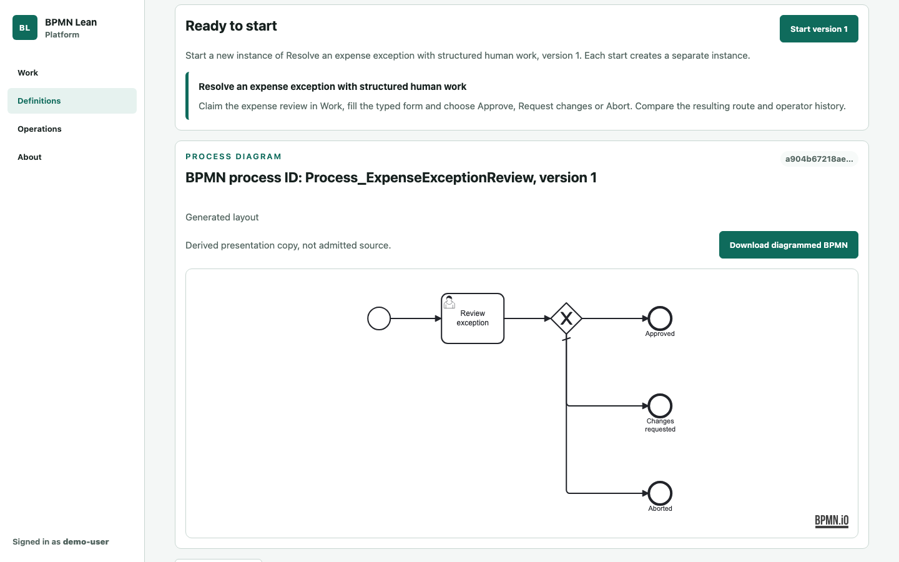

Choose **Download diagrammed BPMN** if you want a derived document that merges the exact semantic model with validated BPMN DI for use in a BPMN modeller. It is not the admitted source.

## 3. Start the exact definition version

Review the start form above the diagram, then choose **Start version 1**, or the displayed selected version if you retained earlier state. Message and schedule controls are in the collapsed **Triggers** section below the diagram. After confirmation, **View instance in Operations** opens the exact returned Process instance.

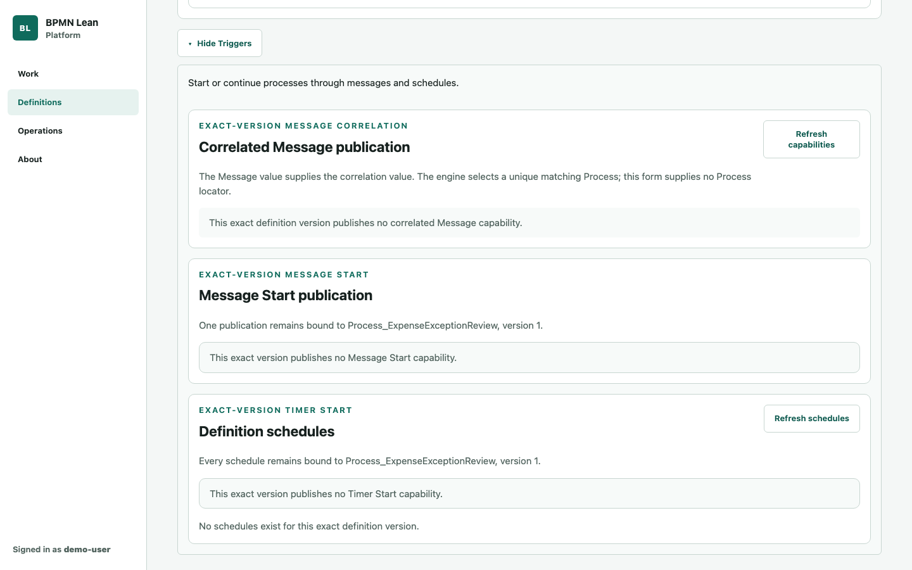

The public identity binds the instance to its Process ID, definition version, exact source digest, and semantic profile. Product 2 keeps the Temporal observation locator private.

## 4. Claim the current task

1. Open **Work** and choose **Refresh** until **Review exception** appears.
2. Confirm candidate group `reviewers`, priority 80, and state **Unclaimed**.
3. Choose **Claim** and confirm **Claimed by demo-user**.
4. Choose **Edit task** beside **Review exception**, then inspect **Details** and **Diagram** if desired. Editing opens the form; it does not approve or complete the task.

Claim state, actor policy, priority, and the form catalog are Product 2 concerns. Task occurrence identity and the completion result come only from Product 1's publication.

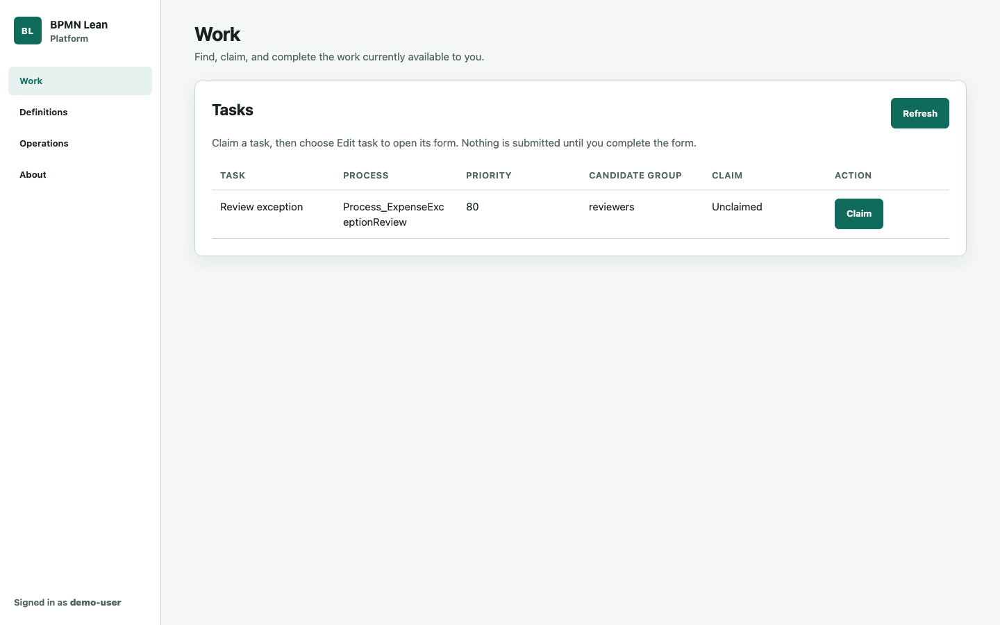

## 5. Complete the structured form

Open the task's **Form** view and enter:

- Request reference: `EXP-WALKTHROUGH-001`
- Expense date: `2026-09-28`
- Approved amount: `4250`
- Cost center: **Engineering**
- Risk flags: **Missing receipt** and **Policy exception**
- Notify requester: **True**

Choose **Approve**. A committed completion closes the detail and, after the background projection refresh, the Work collection reports **No current tasks**. If the response was transport-indeterminate, use the offered **Retry completion** control because it resubmits the retained command identity rather than creating a different completion.

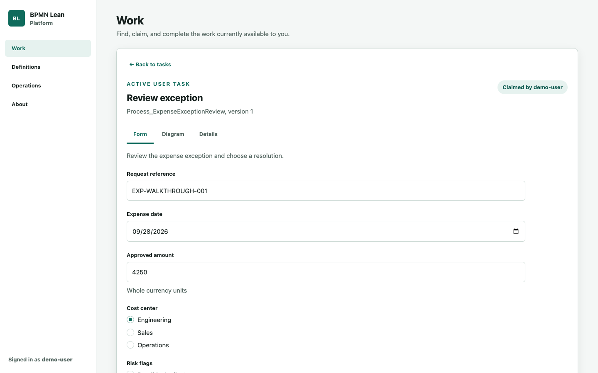

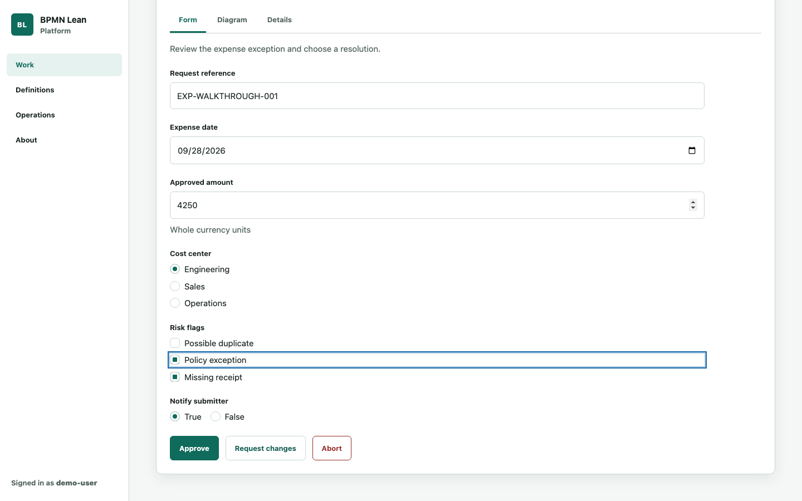

Open **Operations → Action history**, choose **Task actions** and **Apply filters** to see your claim and completion. **Show details** opens labelled information across the available width; the optional raw record remains inside a separate disclosure.

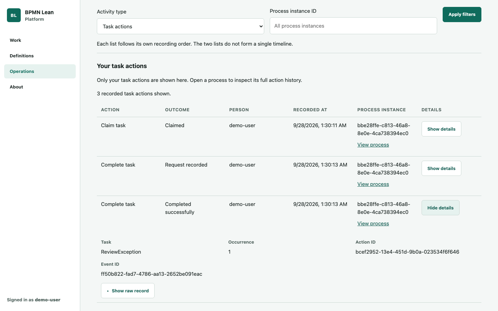

For a validation exercise, select **Abort** before entering a required resolution reason. The form should focus the missing field. Product 2 validates the exact catalog-bound request and computes one canonical typed patch before the engine atomically commits or rejects the task occurrence.

## 6. Inspect the completed Process

1. Open **Operations**, then **Process instances**.
2. Search for the retained Process-instance ID and choose **View details**.
3. Confirm status **completed**.
4. Open **History** and inspect the contiguous engine-published `completeUserTaskInstance` record for `ReviewException`.

Semantic History is published by the engine. Product 2 never reconstructs it from Temporal Event History or state differences.

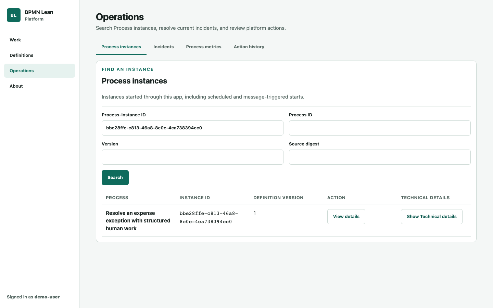

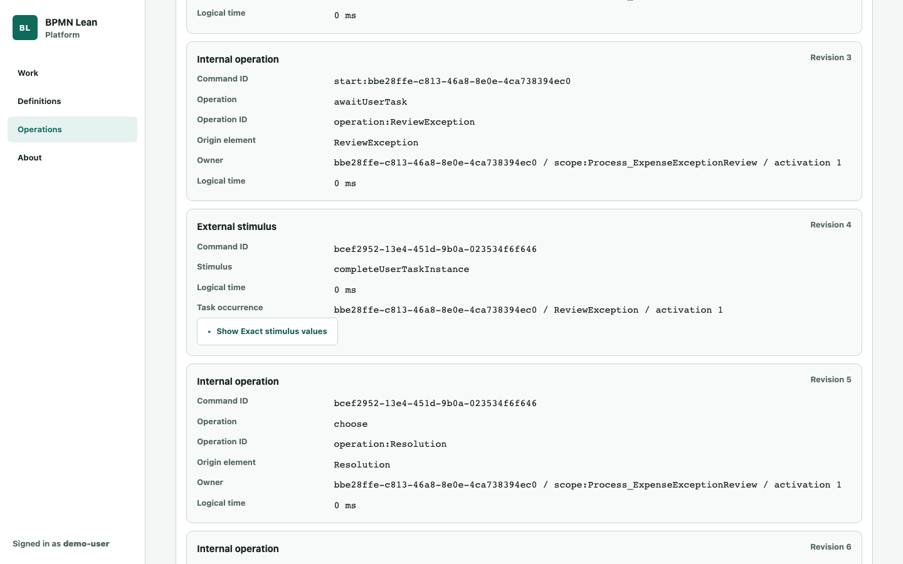

Open **Diagram** and inspect the terminal committed positions over the retained definition presentation.

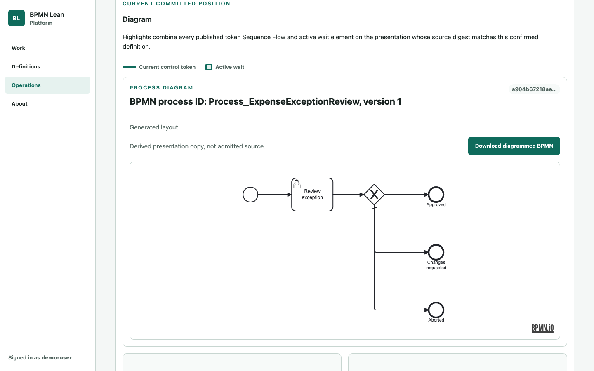

## 7. Inspect exact-version metrics

Open **Operations → Process metrics**, select `Process_ExpenseExceptionReview` and its deployed version. Alternatively, use **View process metrics** in that exact definition. Confirm **All retained evidence**, **1 Process instance**, and the frequency and completed-duration table.

Metrics come from complete engine-published flow-node occurrences for one exact-definition population. They are not transition counts or platform request durations.

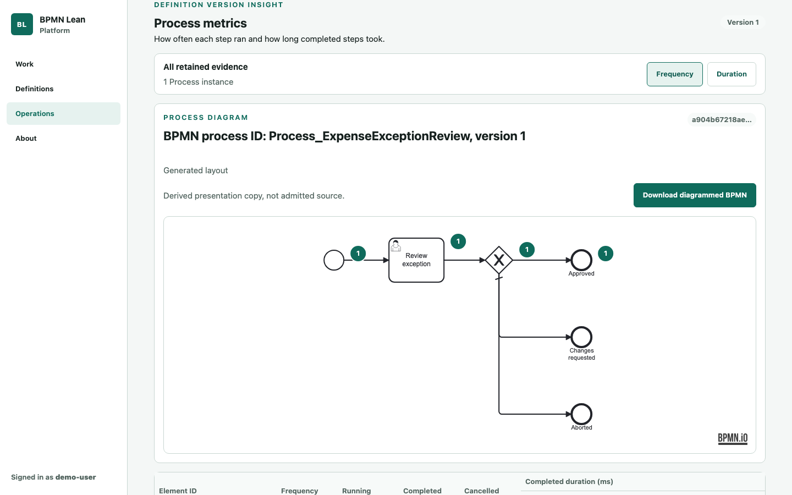

## 8. Create two independently operable incidents

Use [`scenarios/service-task-effect/process.bpmn`](../scenarios/service-task-effect/process.bpmn) twice:

1. Deploy it with profile `cibseven-2.2.0-service-task-incident-draft`, then start that exact version.
2. Deploy the same exact source with profile `cibseven-2.2.0-service-task-incident-cancellation-draft`, then start its new exact version.
3. Open **Operations**, select **Incidents**, and switch between visible Operations tabs until both current incidents appear.

The retry profile publishes only **Retry**. The cancellation profile additionally publishes **Cancel Process**. These controls reflect exact engine-published interactions rather than generic actions inferred from an error state.

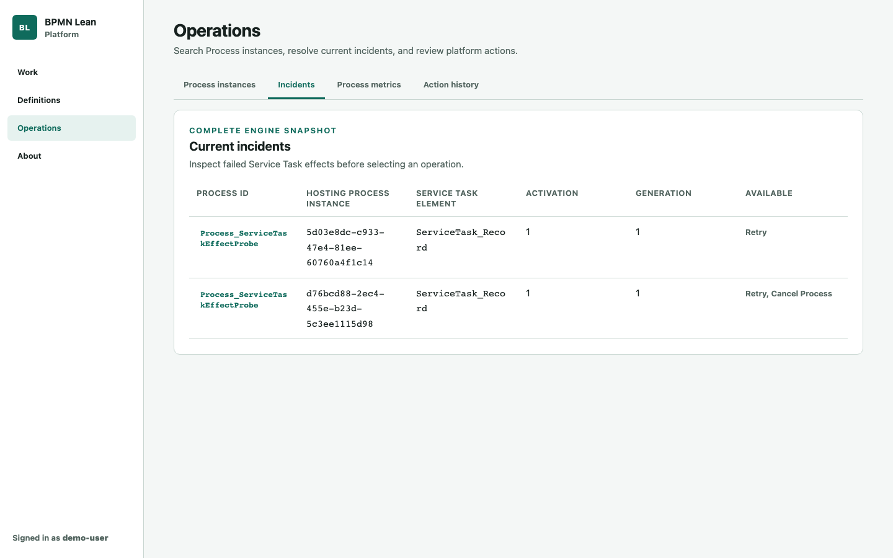

## 9. Retry and cancel

Open the retry-profile incident and choose **Retry**. If the response is transport-indeterminate, use **Submit Retry again** to retain the exact action identity. The incident should leave the current collection when the Process completes.

Open the remaining incident and choose **Cancel Process**. The confirmation dialog initially focuses **Keep Process running** and explains that cancellation removes all remaining live work. Choose **Cancel root Process** only after reviewing that scope.

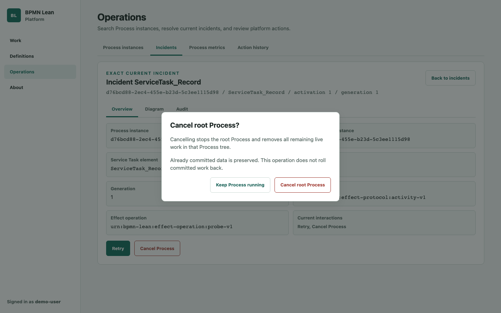

The command targets the exact incident-gated hosting root. It does not expose a Temporal Workflow ID or treat native Temporal cancellation as a BPMN fact.

## 10. Inspect Action history

Return to the top-level Operations collection and open **Action history**. Your task claims and completions appear under **Your task actions**; retries and cancellations appear under **Incident actions**. Use **Activity type** to narrow the view, optionally enter an exact **Process instance ID**, then **Apply filters**. **Refresh history** requests new first pages; each list has its own **Load more** control. Successful incident outcomes read **Completed successfully**. **View process** opens the selected instance’s full Operator history.

Each audit stream is Product 2 evidence with its own source order. Task search shows only your actions; incident search follows Operations permissions. The streams remain distinct from semantic History and are not merged into one timeline. Expand **Show details** to read the selected record below its summary; technical payloads do not occupy a narrow table column.

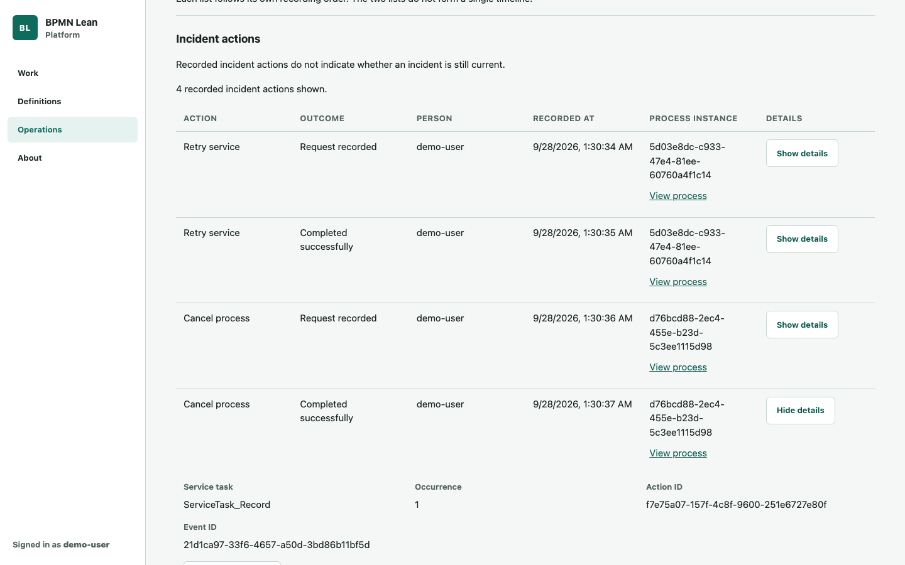

## Stop or retain the environment

Stop the containers while preserving PostgreSQL and Temporal data:

```sh
./scripts/pnpm.sh run evaluation:stop
```

Run `./scripts/pnpm.sh run evaluation:reset` later only when you deliberately want to remove both retained evaluation volumes. This Compose topology is an evaluation convenience, not a production Temporal deployment or capacity claim.

## Refresh the maintained screenshots

Readers do not need the screenshot tooling. Maintainers regenerate the complete ordered catalog explicitly after a material UI change or for a release candidate:

```sh
./scripts/pnpm.sh run walkthrough:screenshots:refresh
```

The command allocates a dynamic loopback port, starts an isolated Compose project with fresh temporary volumes, drives only public accessible UI landmarks in one Chromium browser, writes every 1440 by 900 image in the [screenshot catalog](../showcase/platform-browser-walkthrough/src/screenshot-catalog.ts), and removes the isolated containers and volumes after success or failure. It does not reuse or delete the ordinary evaluation distribution's state.

Screenshot refresh is not part of ordinary commit CI and performs no pixel comparison. The manual or tagged [evaluation distribution workflow](../.github/workflows/evaluation-distribution.yml) can regenerate and upload the catalog as a review artifact. Direct execution against an already-running origin is an advanced package-level path documented in the [screenshot project README](../showcase/platform-browser-walkthrough/README.md).

## Screenshot capture record

Refreshed on 2026-09-28 from the UI committed at `ed6e0cc6` with the subsequent stable-router security correction, using Chromium at 1440 × 900, English locale, UTC and reduced motion. Every screenshot was captured from the public UI with real starts, task actions, metrics and incident outcomes; no requests were intercepted or results fabricated.

The capture used freshly built production containers for the API, recovery worker and BPMN worker, with fresh isolated PostgreSQL 18 and Temporal services. The final public-browser journey passed, including retained-command resolution before leaving an incident. Task-owned containers and volumes were removed afterwards; reusable images were retained. This establishes a current container build and documentation capture, not a new semantic-conformance or production-capacity claim.

The expanded catalog covers the newly grouped About inventory, showcase catalog and descriptions, deployment modal, Start above Diagram, inline Triggers, task Action history and labelled instance list. Operations metrics and incident Action history replace the former Definitions metrics and narrow audit screenshots. Retired Alpha demo images are excluded from both documentation and the downloadable distribution.

## Troubleshooting

- **The public origin does not become healthy:** run `docker compose ps` and `docker compose logs`. Check that port 3000 is free.
- **`demo:start` refuses a cached image:** the current clean commit does not match the image labels, or a required local image is missing. Run `demo:prepare` while registry access is available; do not bypass the refusal with an unverified manual start.
- **A task or incident has not appeared yet:** use the visible refresh or tab controls. Shared reads fail closed when their bounded projection is not current; background workers repair it without request-time fleet fan-out.
- **A displayed version differs from this guide:** the evaluation volumes contain prior data. Continue with the selected exact version or deliberately reset the evaluation volumes.
- **The form is unavailable:** structured Work requires exact catalog identity and engine-published task identity to match. Missing, corrupt, or mismatched data fails closed without changing the task.
- **The Diagram says unavailable:** models outside generated-layout scope must contain complete usable source DI or remain honestly unavailable.

## Contract owners

- [BPM platform human-work specification](BPM-PLATFORM-HUMAN-WORK-SPEC.md) owns task discovery, claim, completion, and Work audit behavior.
- [Structured Human Work specification](BPM-PLATFORM-STRUCTURED-HUMAN-WORK-SPEC.md) owns catalog-bound fields, actions, validation, and typed completion.
- [Incident operations specification](BPM-PLATFORM-INCIDENT-OPERATIONS-SPEC.md) owns current incidents, Retry, Cancel, and incident audit.
- [Operator history and audit export specification](BPM-PLATFORM-OPERATOR-HISTORY-AUDIT-EXPORT-SPEC.md) owns per-instance operator history and canonical audit download.
- [Committed execution publication specification](capsules/COMMITTED-EXECUTION-PUBLICATION-SPEC.md) owns semantic History and current Diagram positions.
- [Flow-node occurrence metrics specification](capsules/FLOW-NODE-OCCURRENCE-METRICS-SPEC.md) owns frequency and duration facts.
- [Information architecture specification](BPM-PLATFORM-INFORMATION-ARCHITECTURE-SPEC.md) and [UI design specification](BPM-PLATFORM-UI-DESIGN-SPEC.md) own workspace, interaction, accessibility, and responsive behavior.
- [BPMN diagram presentation decision](BPMN-DIAGRAM-PRESENTATION-DECISION.md) owns source DI, generated sidecars, provenance, and modeller handoff.
