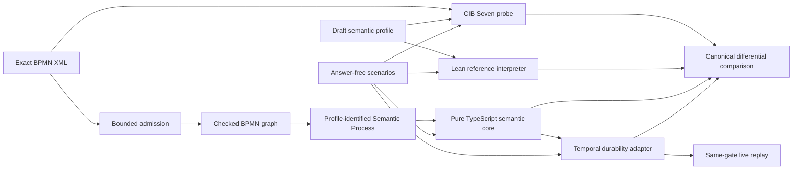

# End-to-end MVP walkthrough

This walkthrough follows one executable BPMN Process through every assurance boundary in the repository. It is the quickest way to understand why CIB Seven, Lean, the TypeScript semantic core, Temporal, and the differential harness all exist—and why none of them can replace the others.

The implemented claim is deliberately narrow:

```text
None Start Event → User Task → None End Event
```

The MVP covers lifecycle execution plus discovery and exact completion of one User Task occurrence. It also checks wrong-activation and stale-completion counterexamples. The exact implemented and absent surfaces remain owned by the [implementation map](IMPLEMENTATION-MAP.md).

## The whole path



There are two intentionally different routes:

- The production route admits exact BPMN bytes, projects a checked BPMN graph, lowers project-owned Semantic Process data, evaluates that program in the pure semantic core, and lets Temporal host the same transition system durably.
- The assurance route asks CIB Seven and Lean to derive the same public consequences independently, then compares all four targets at a deliberately small observation boundary.

This separation is the architecture’s main safeguard against one shared implementation mistake looking like agreement.

## 1. Start with exact source and answer-free commands

The source is the real [BPMN XML model](../scenarios/user-task-discovery-completion/process.bpmn), not generated TypeScript. Its SHA-256 is embedded in the [successful interaction scenario](../scenarios/user-task-discovery-completion/scenario.json), which supplies commands and requested observation kinds but no expected answer.

The exact task occurrence used for completion is:

```text
(processInstanceId = Instance_1, elementId = UserTask_Approve, activation = 1)
```

That third identity component matters. A second activation of the same BPMN element is not the same task occurrence, even though both share `UserTask_Approve`.

The [draft profile](../profiles/cibseven-2.2.0-user-task-draft/profile.json) pins the CIB version, execution environment, feature surface, and public observation boundary. Expected CIB results live in separate immutable evidence artifacts so target inputs cannot smuggle in their oracle answer.

## 2. Admit BPMN and compile data, not source code

The importer captures exact bytes and their hash before decoding, rejects oversized or non-UTF-8 input, blocks DOCTYPE and parser warnings, and keeps raw `bpmn-moddle` objects private. The bounded compiler projects a checked graph and the pure lowerer emits the project-owned serializable Semantic Process program.

The actual compiler projection is kept synchronized from its tested source:

<!-- source-fragment: packages/bpmn-source/src/semantic-process-lowering.ts#semantic-process-lowering -->
```ts
const operations = source.nodes.map((node) =>
  lowerNode(node, source.sequenceFlows)
);
const program: SemanticProcessProgram = {
  kind: SemanticProcessKind.SemanticProcess,
  identity: {
    compiler: SemanticProcessCompilerId.BpmnSourceSemanticProcess,
    ...source.identity,
  },
  processId: source.processId,
  controlPlaces: source.sequenceFlows.map((flow) => ({
    id: placeId(flow.id),
    origin: {
      kind: SemanticOriginKind.BpmnSequenceFlow,
      elementId: flow.id,
    },
  })),
  operations: operations.sort(compareIds),
};
```

The Semantic Process records source, compiler, and semantic-profile identity alongside typed operations and flow-derived control places. It is data that a generic evaluator can interpret. No BPMN-to-TypeScript generator creates a Workflow class per diagram.

This is important for Temporal replay: every Workflow receives the admitted Semantic Process program that it actually evaluates. During pre-release the gate replays its newly created histories and then discards the server state. Retained history compatibility begins only when an immutable deployment baseline is deliberately approved.

## 3. Observe the pinned CIB Seven engine

CIB Seven is the finite behavioral oracle for the declared compatibility profile. The runner deploys the exact source through public engine services, starts an instance, discovers the task, completes or rejects the requested occurrence, projects only stable semantic observations, and deletes every deployment afterward.

The test class exercises successful, wrong-activation, and stale completion. This synchronized excerpt shows the two rejection/state-preservation witnesses against one warm embedded engine:

<!-- source-fragment: runners/cibseven/src/test/java/org/bpmnlean/cibseven/CibSevenScenarioRunnerTest.java#cib-user-task-probe -->
```java
var rejected = runner.run(wrongScenario, PROJECT_ROOT);
var stale = runner.run(staleScenario, PROJECT_ROOT);

assertEquals(wrongEvidence.outcome(), rejected.outcome());
assertEquals(wrongEvidence.trace(), rejected.trace());
assertEquals(staleEvidence.outcome(), stale.outcome());
assertEquals(staleEvidence.trace(), stale.trace());
assertEquals(rejected.trace().get(2), rejected.trace().get(4));
assertEquals(stale.trace().get(4), stale.trace().get(6));
assertEquals(ScenarioProtocol.CleanupProjection.clean(), rejected.diagnostics().cleanup());
assertEquals(ScenarioProtocol.CleanupProjection.clean(), stale.diagnostics().cleanup());
```

The generated CIB task ID, database rows, and PVM execution identities are excluded from canonical comparison. They are host details, not portable BPMN task identity. A separate PVM projection remains diagnostic because it is useful for understanding CIB without making its internals the compatibility contract.

Retained evidence binds the exact scenario bytes, profile bytes, CIB revision, producer environment, stable projection identity, and canonical result. Normal verification reads that evidence; it never refreshes it.

## 4. Give the profile an executable Lean meaning

Lean holds an independent operational account: immutable model definition, runtime control state, external command admission, explicit internal-operation choice, bounded unique closure for the sequential capsule, and stable observations. The pipeline supplies the actual checked BPMN graph and Semantic Process program for each retained scenario. Lean strictly decodes and validates them, recomputes canonical lowering, rejects inequality, and executes the received program to emit the compared traces.

Lean also turns semantic review questions into general checked laws. The central User Task identity law is pulled directly from the compiling Lean module:

<!-- source-fragment: BpmnSemantics/SemanticProcess/Execution.lean#task-identity-law -->
```lean
theorem task_identity_mismatch_is_rejected
    (program : Program) (wait : UserTaskWait)
    (completionCommandId : SemanticId)
    (submittedTaskId : UserTaskInstanceId) (logicalTimeMs : Nat)
    (mismatch :
      submittedTaskId.processInstanceId ≠ wait.processInstanceId ∨
      submittedTaskId.elementId.value ≠ wait.task.id.value ∨
      submittedTaskId.activation ≠ wait.activation) :
    applyStimulus scenarioClosureLimit program
        (singletonWaitingState wait logicalTimeMs)
        (.completeUserTaskInstance completionCommandId submittedTaskId) =
      { outcome := .rejected
        state := singletonWaitingState wait logicalTimeMs
        internalStepBoundExceeded := false
        ambiguousInternalChoice := false } := by
  rcases mismatch with processMismatch | remainingMismatch
  · have noMatch : ¬ (
        (wait.processInstanceId = submittedTaskId.processInstanceId ∧
          wait.task.id = ⟨submittedTaskId.elementId.value⟩) ∧
        wait.activation = submittedTaskId.activation) := by
      intro exactMatch
      exact processMismatch exactMatch.1.1.symm
    simp [applyStimulus, admitStimulus, completeUserTask,
      singletonWaitingState, noMatch]
  · rcases remainingMismatch with elementMismatch | activationMismatch
    · have noMatch : ¬ (
          (wait.processInstanceId = submittedTaskId.processInstanceId ∧
            wait.task.id = ⟨submittedTaskId.elementId.value⟩) ∧
          wait.activation = submittedTaskId.activation) := by
        intro exactMatch
        exact elementMismatch
          (congrArg TaskDefinitionId.value exactMatch.1.2).symm
      simp [applyStimulus, admitStimulus, completeUserTask,
        singletonWaitingState, noMatch]
    · have noMatch : ¬ (
          (wait.processInstanceId = submittedTaskId.processInstanceId ∧
            wait.task.id = ⟨submittedTaskId.elementId.value⟩) ∧
          wait.activation = submittedTaskId.activation) := by
        intro exactMatch
        exact activationMismatch exactMatch.2.symm
      simp [applyStimulus, admitStimulus, completeUserTask,
        singletonWaitingState, noMatch]
```

The theorem is stronger than replaying one fixture. For any model, active Process instance, activation ordinal, command ID, and logical time, a mismatch in any task-occurrence identity component is rejected and preserves the waiting state.

The nearby checked non-law is equally important: matching the BPMN element ID alone is insufficient. That counterexample prevents the implementation from quietly collapsing occurrence identity back to an element key.

Lean does not prove that CIB, TypeScript, Temporal, XML parsing, or the network is correct. It proves properties of the explicit Lean semantics. Correspondence with the other systems remains separate evidence.

The emitter echoes the exact scenario content it executed and the exact definition binding it accepted. The harness compares the scenario echo with the admitted scenario document, requires the definition identity and lowering-equality echo, and separately mutates an operation origin to prove that a schema-valid definition drift is rejected before evaluation.

## 5. Execute the production semantics in pure TypeScript

The semantic core owns BPMN-visible state transitions. It has no CIB or Temporal dependency and performs no I/O. Temporal therefore cannot accidentally turn Workflow scheduling, retries, handler order, or replay mechanics into BPMN meaning.

Its public transition boundary is:

<!-- source-fragment: packages/semantic-core/src/semantic-process-runtime.ts#apply-stimulus -->
```ts
export function applyStimulus(
  program: SemanticProcessProgram,
  state: RuntimeState,
  stimulus: Stimulus,
  closureLimit: number = semanticProcessClosureLimit,
): CommandResult {
  validateClosureLimit(closureLimit);

  const admission = admit(program, state, stimulus);
  switch (admission.outcome) {
    case CommandOutcome.Committed: {
      const closure = closeInternal(
        program,
        admission.state,
        closureLimit,
      );
      return {
        outcome: CommandOutcome.Committed,
        state: closure.state,
        internalStepBoundExceeded: closure.hitBound,
      };
    }
    case CommandOutcome.Rejected:
      return {
        outcome: CommandOutcome.Rejected,
        state: admission.state,
        internalStepBoundExceeded: false,
      };
    default:
      return assertNever(admission.outcome);
  }
}
```

`applyStimulus` first admits or rejects the external command, then closes deterministic internal steps to the next externally stable state. Bound exhaustion is reported separately from the semantic command outcome, so a harness safety limit cannot masquerade as a BPMN incident or committed action.

The core derives open tasks and enabled interactions from current admitted state. It does not inspect future scenario commands or expected output.

## 6. Let Temporal host the same transition system durably

The Temporal Workflow stores the Semantic Process program, semantic state, trace, pending stimuli, and a command-result ledger. Query exposes the core-derived open-task projection. Update validates transport shape, queues a completion stimulus, waits for the semantic loop, and returns the core-owned command outcome.

The handler boundary is synchronized from the real Workflow:

<!-- source-fragment: packages/temporal-adapter/src/workflow-implementation.ts#temporal-semantic-boundary -->
```ts
setHandler(bpmnTraceQuery, () => [...trace]);
setHandler(
  bpmnOpenUserTasksQuery,
  () => projectOpenUserTasks(state),
);
setHandler(
  bpmnMessageDeliveryResultQuery,
  (stimulus) =>
    findMessageDeliveryResolution(
      messageDeliveryResolutions,
      stimulus,
    ) ?? null,
);
setHandler(bpmnDeliverMessageSignal, (stimulus) => {
  validateDeliverMessageSignal(stimulus);
  const accepted = acceptedStimulus(
    acceptedStimuli,
    stimulus.commandId,
  );
  const acceptance = acceptMessageDelivery(
    messageDeliveryResolutions,
    stimulus,
    accepted,
  );
  if (acceptance.enqueue) {
    acceptedStimuli.push(stimulus);
    pendingStimuli.push(stimulus);
  }
});
setHandler(
  bpmnCompleteUserTaskUpdate,
  async (stimulus) => {
    enqueueStimulus(acceptedStimuli, pendingStimuli, stimulus);
    await condition(
      () =>
        commandOutcome(commandResults, stimulus.commandId) !== undefined,
    );
    const outcome = commandOutcome(commandResults, stimulus.commandId);
    if (outcome === undefined) {
      throw ApplicationFailure.nonRetryable(
        `Semantic loop ended without an outcome for ${stimulus.commandId}`,
        "BpmnCommandOutcomeMissing",
      );
    }
    return outcome;
  },
  {
    validator: (stimulus) =>
      validateCompleteUserTaskUpdate(acceptedStimuli, stimulus),
  },
);
```

The Workflow loop calls the same semantic-core boundary used outside Temporal. A repeated exact semantic command under another Update ID is transition-free; reusing its command ID with a different payload under another Update ID is rejected as a non-retryable application failure without failing the Workflow Task. The lifecycle experiment demonstrates that Temporal’s reuse of the same Update ID is payload-blind, so the current command-ID-only Update key remains a conformance-harness mechanism rather than the proposed production identity. Temporal Update IDs, Workflow IDs, Run IDs, Workflow Tasks, and Event History remain hosting facts rather than BPMN facts.

Every primary live history is replayed in one Worker before the clean in-memory server shuts down. The exact-completion history is also inspected to require Update acceptance and completion and to exclude Signal delivery. No prototype Event History fixture or Workflow patch branch is retained.

## 7. Compare consequences and prove the comparator can fail

Each target returns the same language-neutral canonical result shape. The comparator uses CIB Seven as the declared profile reference and compares Lean, the semantic core, and Temporal without majority voting:

<!-- source-fragment: packages/differential/test/pipeline-comparison.ts#four-target-comparison -->
```js
const comparison = (() => {
  if (
    cibConfiguration?.relation === CibCaseRelation.ExactSemantic
  ) {
    return compareTargetResults(
      {
        target: DifferentialTarget.CibSeven,
        result: requiredCibResult(canonicalCib, scenario.id),
      },
      semanticCandidates,
    );
  }
  return compareTargetResults(
    {
      target: DifferentialTarget.Lean,
      result: leanResult,
    },
    semanticCandidates.filter(
      ({ target }) => target !== DifferentialTarget.Lean,
    ),
  );
})();
```

Agreement alone is weak if the projection or comparator cannot notice the semantic distinction being claimed. Every new evidence projection therefore needs a meaningful seeded mutation:

<!-- source-fragment: packages/differential/test/pipeline-comparison.ts#seeded-disagreement -->
```js
const injectedResult = mutableClone(semanticCoreResult);
pipelineCase.injectMutation(injectedResult);
const injectedReference =
  cibConfiguration?.relation === CibCaseRelation.ExactSemantic
    ? {
        target: DifferentialTarget.CibSeven,
        result: requiredCibResult(canonicalCib, scenario.id),
      } as const
    : {
        target: DifferentialTarget.Lean,
        result: leanResult,
      } as const;
const injectedDisagreement = compareTargetResults(
  injectedReference,
  [
    {
      target: DifferentialTarget.SemanticCore,
      result: injectedResult,
    },
  ],
);
```

The current batch mutates task activation from `1` to `2`. The comparator must classify the exact first differing path. This tests the sensitivity of the observation boundary rather than merely testing the happy path twice.

The complete pipeline batches three cases:

1. exact task-occurrence completion;
2. wrong activation rejected without state change;
3. stale completion rejected without state change.

CIB, Lean, and Temporal startup costs are shared across the batch, while every Temporal case is repeated under a distinct Workflow identity to expose accidental host-ID coupling.

## Run and inspect it

Install the pinned Node and workspace dependencies once:

```sh
nvm install
nvm use
./scripts/pnpm.sh install --frozen-lockfile
```

Run the prepared end-to-end pipeline:

```sh
./scripts/pnpm.sh run test:pipeline
```

Run the complete repository gate:

```sh
./scripts/verify.sh
```

Keep walkthrough excerpts synchronized after changing a tagged source region:

```sh
./scripts/pnpm.sh run sync:doc-fragments
./scripts/pnpm.sh run check:doc-fragments
```

The normal gate only checks; it never rewrites documentation. If a fragment is wrong, fix and test the source first, then synchronize the Markdown mirror.

For focused work, use the gate matrix in [TESTING-SPEC.md](TESTING-SPEC.md). The [semantic capsule](capsules/USER-TASK-INTERACTION-SPEC.md) owns the bounded meaning and evidence lanes; [PROJECT-DESIGN.md](PROJECT-DESIGN.md) explains the durable architecture and Lean’s assurance role.

## What the MVP establishes

Within one content-addressed sequential User Task slice, the repository establishes:

- exact-source admission through a checked BPMN graph into a project-owned Semantic Process program;
- one reviewed operational account realized separately in Lean and TypeScript, agreeing exactly with pinned CIB observation at the fidelity recorded in the capsule;
- strict Lean decoding, independent lowering equality, generic evaluator soundness, useful general Lean laws, and executable nearest non-laws;
- Temporal Query/Update hosting that refines the pure core for the tested cases;
- duplicate-command stability, cleanup, and same-gate live replay;
- mutation-sensitive differential evidence within the feedback budgets.

The MVP itself does not establish general BPMN parsing or execution, OMG conformance, immutable CIB compatibility, repeated occurrences of one task element, variables, assignment, forms, timers, messages, Activities, fault recovery, Search Attributes, a production task inbox, or a production Workflow lifecycle. Later capsule specs own any bounded additions and do not broaden the MVP claim retroactively.

## Additional bounded capsules

The [parallel fork/join spec](capsules/PARALLEL-FORK-JOIN-SPEC.md) covers a fork with two User Task waits and a parallel join. Its checked graph and Semantic Process lowering are executable; Lean and the independently implemented TypeScript semantic core check token multiplicity, per-incoming-flow synchronization, completion-order independence, deterministic projection, excess-token retention, stale rejection with a live sibling, and the duplicate-left/no-right non-law. Content-bound CIB evidence calibrates both balanced completion orders and the live-sibling stale witness.

The [Intermediate Catch Timer spec](capsules/INTERMEDIATE-CATCH-TIMER-SPEC.md) covers one exact `PT1S` normal-flow timer wait. Lean and the semantic core own occurrence identity, deadline, eligibility, refusal, logical-time advancement, and public observation; controlled-clock CIB evidence and a durable Temporal timer supply distinct compatibility and refinement lanes. The [Service Task effect spec](capsules/SERVICE-TASK-EFFECT-SPEC.md) adds one payload-free structured effect intent hosted by a durable Temporal Activity, with pinned-CIB retry facts kept host-specific. The [CreateDocument data spec](capsules/CREATE-DOCUMENT-DATA-SPEC.md) adds one string-only argument/result/output-mapping path with a separate synchronous CIB `2.0.0` final-state relation. The nine-case pipeline connects these capsules under their explicit target relations while preserving the [production Temporal lifecycle](TEMPORAL-PROCESS-LIFECYCLE-SPEC.md).
