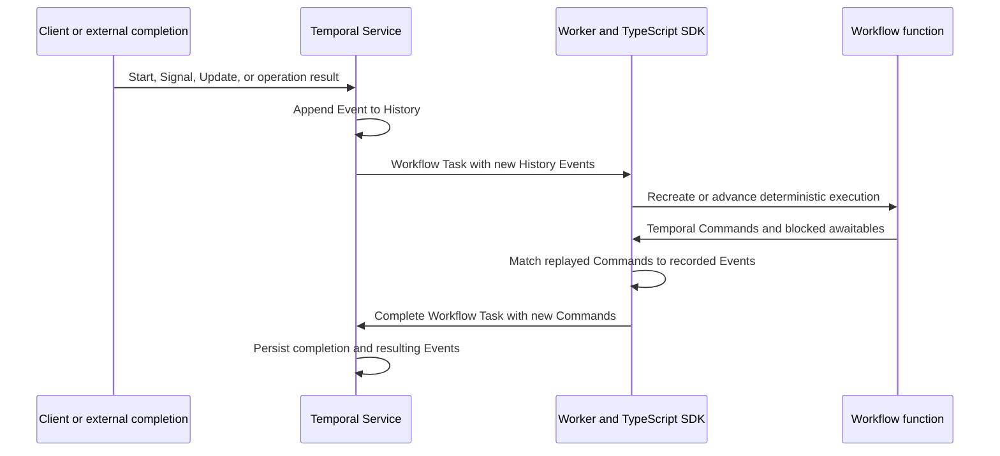

# Temporal execution model and TypeScript SDK research

## Status and purpose

This note records the Temporal mechanisms that constrain the BPMN adapter architecture. It surveys the core execution, programming, durability, interaction, visibility, testing, and lifecycle features available at the pinned references; it does not attempt to catalog Temporal Cloud commercial administration, security administration, or every Worker capacity-tuning option. It is a research baseline, not an approved Temporal dependency, BPMN mapping, retry policy, deployment strategy, or semantic-profile decision.

The central conclusion is:

> Temporal is the durable orchestration substrate for the adapter, while the versioned BPMN semantic profile, Lean interpreter, and pure TypeScript semantic core remain the authorities for BPMN behavior.

Temporal can durably remember inputs, wakeups, external-operation outcomes, and the ordered Commands produced by Workflow code. It does not supply BPMN token semantics, CIB Seven compatibility, or an automatically correct mapping from Temporal primitives to BPMN concepts.

This research inspected the official documentation at revision `16c1899a0380eaf3457a0b163b2b2b2232c39a5d`, the TypeScript SDK at revision `2595d1b62cf5c3ff1748df0df2f9b303902bb31c`, and the TypeScript samples at revision `fb0aa23d75394a132646de883842dfacdacd5aa0`. Their provenance is recorded in [SOURCES.md](SOURCES.md).

## Executive model

A Temporal Workflow is a deterministic program whose durable source of truth is its Event History. A Worker normally keeps a live Workflow instance in a cache, but that cache is only a performance optimization. After eviction, process loss, deployment, or explicit replay testing, the SDK re-executes the Workflow function from its beginning and feeds it the recorded history.

During replay, the SDK does not repeat already recorded Activities, timers, child starts, or other external actions. It resolves Workflow awaitables from recorded Events and checks that the Workflow code produces the same relevant Temporal Commands in the same order. Once replay reaches the end of the recorded history, the Workflow becomes live and newly produced Commands can be sent to the Temporal Service.



The mechanism is durable re-execution, not durable memory snapshots and not ordinary function resumption. The official [Workflow Execution](https://docs.temporal.io/workflow-execution), [Event History](https://docs.temporal.io/workflow-execution/event), [Workflow Task](https://docs.temporal.io/tasks#workflow-task), and [Command reference](https://docs.temporal.io/references/commands) documentation define these boundaries.

## Vocabulary

| Term | Precise meaning in this project |
|---|---|
| Workflow Definition | Deterministic TypeScript function and its registered handlers |
| Workflow Type | Name used to select a Workflow Definition |
| Workflow Execution | Durable execution identified by Namespace, Workflow ID, and its chain of Runs |
| Workflow Run | One Event History with one Run ID |
| Workflow Task | A unit in which a Worker advances or replays Workflow code and returns Commands |
| Event | A fact persisted by the Temporal Service in Event History |
| Temporal Command | A requested durable action emitted by Workflow execution |
| Activity Execution | A chain of Activity Task attempts for one scheduled Activity |
| project command or stimulus | A versioned input to the BPMN semantic core; never interchangeable with a Temporal Command |
| semantic transition | The pure `applyStimulus` operation in the semantic core; never interchangeable with an old Temporal “Decision” |

Older Temporal and Cadence material used “Decision Task” and “Decision” terminology. Current Temporal terminology is Workflow Task and Command. This project uses “semantic transition” for the pure core operation and always qualifies “Temporal Command.”

## Runtime architecture

The Temporal Service stores histories, creates Tasks, applies retry and timeout policies, and routes work through Task Queues. It does not execute user Workflow or Activity code.

A Worker is a user process that polls one or more Task Queues. The TypeScript Worker delegates protocol and history processing to Temporal Core, runs deterministic Workflow code in a sandboxed JavaScript environment, runs Activities in the ordinary Node.js environment, and returns Commands or Activity results to the Service.

The TypeScript SDK’s [activation sequence](https://github.com/temporalio/sdk-typescript/blob/2595d1b62cf5c3ff1748df0df2f9b303902bb31c/docs/activation.mermaid) shows the concrete boundary: Core polls a Workflow Task, creates an activation, the Node Worker decodes payloads, a Worker Thread advances the Workflow sandbox, Commands are collected, and the completion goes back through Core to the Service.

Task Queues are routing and load-balancing infrastructure, not semantic FIFO queues. Multiple pollers and partitions permit physical concurrency, and the adapter must not derive BPMN scheduling rules from Task Queue arrival order.

Task priority, fairness, rate limiting, poller tuning, eager Activity execution, and sticky execution can change latency and throughput. They must not change semantic observations, and conformance tests must remain valid with those optimizations disabled or configured differently.

Namespaces are operational isolation boundaries. Workflow identity is Namespace plus Workflow ID plus Run ID; multiple Runs connected by retry, cron, or Continue-As-New share a Workflow ID but have separate Event Histories.

## Workflow execution and replay

### What is durable

The Service durably persists Event History. History includes Workflow lifecycle Events, accepted Signals and Updates, timer Events, scheduled and completed Activities, child Workflow Events, cancellation, markers, and Workflow Task results.

Workflow local variables are reconstructed by re-executing code against that history. They are not independently persisted as a heap snapshot.

The live Workflow cache and sticky Task Queue routing avoid replaying the entire history on every Workflow Task. A Worker crash or cache eviction removes that optimization but must not change observable behavior.

### One Workflow Task

A new Workflow Task is commonly created after Workflow start, Signal or Update delivery, an Activity result or failure, a timer firing, a child result, cancellation, or retry of a failed or timed-out Workflow Task.

The Worker receives the newly available history, advances the Workflow until it is blocked or complete, and returns a batch of Temporal Commands. The Service validates the Workflow Task completion and records the resulting Events.

If the Worker dies before the Service accepts the Workflow Task completion, the new Commands are not committed and the Workflow Task can be retried. This durable boundary does not make an Activity’s external side effect transactional with Event History.

### Command matching

During replay, the SDK regenerates Commands from Workflow code and compares them with Commands implied by the recorded history. Command type, order, and relevant attributes must remain compatible.

Adding, removing, or reordering command-producing operations can therefore make old histories nondeterministic. A pure refactor is safe only when it preserves the resulting Command sequence for every retained history.

Examples of command-producing operations include scheduling or cancelling an Activity, starting or cancelling a timer, starting or signalling a child Workflow, recording a patch marker, upserting visibility data, completing or failing the Workflow, and Continue-As-New.

Nondeterminism normally fails the Workflow Task, not the Workflow Execution. The execution remains open while the Service retries the Task, which can produce an apparently stuck Workflow until compatible code is deployed or an operator intervenes.

### Deterministic TypeScript environment

TypeScript Workflow Definitions are exported asynchronous functions. Core Workflow semantics do not depend on Java-style annotations or decorators.

Workflow code runs in a deterministic sandbox. Node.js and DOM APIs are unavailable; imports that expose nondeterministic I/O must not enter the Workflow bundle. Activities are the normal boundary for I/O.

The SDK supplies deterministic replacements for time, timers, and randomness. `Date.now()` and `new Date()` represent the time at which the current Workflow Task began and advance only across Workflow progress. Workflow timers use `sleep`, `condition`, or a timer participating in `Promise.race`.

The SDK exposes `workflowInfo().unsafe.isReplaying`, but business logic must not branch on it because that would deliberately change replay behavior. The Workflow logger and Sinks have replay-aware suppression for observability.

## Temporal Commands are not BPMN transitions

A Temporal Command asks the Service to perform a durable platform action. A BPMN semantic transition changes the semantic core’s versioned semantic state.

One semantic core transition may produce no Temporal Command, one Temporal Command, or several Temporal Commands. Conversely, a Temporal Workflow Task may replay many semantic core transitions or merely deliver an operational result.

The adapter must preserve this separation:

```text
typed external stimulus
  -> adapter ingress and deduplication
  -> pure semantic transition and semantic state
  -> typed effect intent
  -> Temporal API and Temporal Command
  -> recorded result Event
  -> typed semantic core result stimulus
```

The adapter must not treat the existence or order of arbitrary Temporal Events as the canonical BPMN trace. Canonical observations come from the semantic core’s semantic state and observation contract.

## Workflows

A Workflow is the durable coordinator. It can wait for messages, timers, Activities, child Workflows, or conditions without holding an operating-system thread.

Workflow code must remain deterministic, side-effect-free except through Temporal Workflow APIs, and compatible with retained histories.

Workflow executions have no default retry policy. A Workflow retry policy is optional and creates another Run in the same Workflow Execution chain. It is usually the wrong first response to a BPMN process-level semantic failure because it re-runs the Workflow Definition rather than applying BPMN error semantics.

The TypeScript failure boundary is intentionally sharp: an explicit `ApplicationFailure` or an uncaught Temporal failure can fail the Workflow Execution, while an ordinary programming error commonly fails the current Workflow Task and is retried. Adapter code must deliberately translate semantic core terminal states into completion or a typed failure and must not rely on accidental JavaScript exceptions as business outcomes.

## Activities

Activities run nondeterministic or side-effecting code such as network calls, database access, file operations, or calls into an external service. They execute outside the deterministic Workflow sandbox.

An Activity Execution is one logical scheduled Activity plus its chain of Activity Task attempts. Its recorded completion or final failure is delivered to the Workflow.

Activities retry by default. The default policy starts at a one-second interval, uses coefficient `2.0`, caps intervals at 100 seconds, has unlimited attempts, and has no non-retryable error types. A Schedule-to-Close timeout, cancellation, or explicit maximum-attempt policy is therefore required when unbounded retry is not acceptable.

Temporal Activity retries are an infrastructure delivery and execution policy. They must remain distinct from CIB-visible job retries, BPMN error Events, incident semantics, or any retry count exposed by the semantic profile.

### Activity timeouts

| Timeout | Meaning |
|---|---|
| Schedule-to-Close | Maximum duration of the whole Activity Execution, including queueing and retries |
| Start-to-Close | Maximum duration of one Activity Task attempt |
| Schedule-to-Start | Maximum queue wait before one attempt begins; timeout is non-retryable because retrying on the same queue cannot repair capacity |
| Heartbeat | Maximum allowed gap between recorded heartbeats for a long-running attempt |

At least Start-to-Close or Schedule-to-Close must be configured. Heartbeat details can carry resumable progress into another attempt.

### Cancellation

Activity cancellation is cooperative. The Service delivers cancellation to a running Activity through heartbeats, so an Activity that never heartbeats cannot promptly observe it.

The Workflow-side cancellation type determines whether the Workflow abandons the Activity, requests cancellation and proceeds, or waits for cancellation completion. The TypeScript default waits for cancellation completion.

### Delivery guarantee and idempotency

An Activity can perform its external side effect and then crash before its completion is recorded. The Service may retry it, causing the effect to execute again.

Temporal therefore provides durable coordination and an effectively-once programming experience for Workflow progress, but it does not make arbitrary Activity effects exactly once. Activities and called services require stable idempotency keys, deduplication, or application-level reconciliation.

### Async Activity Completion

An Activity can return control without completing its execution and later be heartbeated or completed by an external process using a Task Token or execution identifiers.

Task Tokens are attempt-specific and become invalid across retries. Stable Workflow ID and Activity ID addressing can be safer for a long-lived external protocol.

### Local Activities

Local Activities run in the Workflow Worker without a separate Activity Task Queue and record their result as a marker. They are a latency optimization, not a new semantic guarantee.

If the Worker crashes before the enclosing Workflow Task completion records the marker, a Local Activity can run again. It has no Activity heartbeat, can delay Signal delivery, and should not host ordinary BPMN service-task side effects.

### Standalone Activities

Temporal can start Activities without a parent Workflow. That feature is not needed by the initial adapter because it removes the durable BPMN coordinator that this architecture is designed to refine.

## Signal, Query, and Update

Temporal’s three primary Workflow message mechanisms have different durability and response semantics.

| Mechanism | Mutates Workflow state | Recorded in Event History | Caller receives semantic result | Handler may block | Closed Workflow |
|---|---:|---:|---:|---:|---:|
| Signal | Yes | Yes | No; send completes after Service acceptance | Yes | Rejected |
| Query | No | No | Yes, read-only | No | Available during retention when a compatible Worker can answer |
| Update | Yes | Accepted and completed lifecycle is recorded | Yes | Yes | Rejected |

The official [message-passing overview](https://docs.temporal.io/workflow-message-passing) and [TypeScript message-passing guide](https://docs.temporal.io/develop/typescript/message-passing) are the primary references.

### Signals

A Signal is asynchronous durable ingress. Once accepted by the Service, its Event remains available even if no Worker is currently running.

A Signal handler cannot return a value to the caller and may run asynchronously. Caller acknowledgement proves Service acceptance, not semantic processing or BPMN command commitment.

The application must tolerate duplicate logical Signals. A versioned message envelope should carry an application command ID, profile identity, payload version, and correlation information so the adapter can perform semantic deduplication.

Signal-With-Start atomically starts a Workflow if needed and sends the Signal. It is useful for lazily addressed processes, but the handler can run before the main Workflow function has advanced past its first blocking point. TypeScript state needed by handlers must be initialized before handler registration.

### Queries

A Query is a synchronous read of reconstructed Workflow state. A Query handler must not mutate state, emit Commands, block, or perform asynchronous work.

Queries are not Events and do not become part of Event History. They require a Worker capable of running the Workflow code.

A Query can expose the semantic core’s current projection for diagnostics and tests, but it cannot be the durable authority for a canonical semantic observation. The authoritative projection must be derived from semantic state reconstructed through replay.

### Updates

An Update is a tracked request-response interaction that can mutate Workflow state and return a typed result.

An optional Update validator runs synchronously and read-only. If validation rejects the request, the accepted Update is not written into the Workflow’s history. Once accepted, Update handling and completion participate in durable Workflow execution.

The caller may wait only for acceptance or for completed handling. For a BPMN command API that needs a committed, rejected, rolled-back, failed, or unsupported result, Update is usually a better transport than Signal.

The Service deduplicates Update IDs within one Run. A process that uses Continue-As-New must carry any application-level deduplication state required across Run boundaries.

Update-With-Start and Signal-With-Start are convenience protocols, not BPMN start-Event semantics. Their use must be profiled independently.

### Handler concurrency

The TypeScript Workflow event loop is single-threaded, but asynchronous Signal and Update handlers interleave with the main Workflow and with each other at `await` points.

Single-threaded execution prevents simultaneous shared-memory writes; it does not prevent logical races. Two handlers can both inspect old state, await, and then apply incompatible changes.

Synchronous handlers are atomic with respect to Workflow code execution. The safest initial adapter architecture is therefore:

1. Register narrow, synchronous handlers that validate envelopes and enqueue neutral stimuli.
2. Let one main Workflow loop consume the queue.
3. Let only that loop call the pure semantic core and mutate semantic state.
4. Let only that loop issue effect intents in a deterministic order.
5. Complete an Update only after the semantic core has produced its typed command outcome.

Before Workflow completion or Continue-As-New, the main loop must wait for `allHandlersFinished()` so accepted handler work is not silently abandoned.

## Human and user tasks

Temporal’s official [Approval pattern](https://docs.temporal.io/design-patterns/approval) demonstrates the generic human-in-the-loop mechanism: a Workflow records pending approval state, waits on a deterministic condition, and a Signal supplies a decision. That pattern is useful infrastructure evidence, but a BPMN User Task has a richer lifecycle than one approval variable.

A BPMN User Task must remain semantic state. At minimum, its semantic representation may need a stable task-instance ID, BPMN element ID, lifecycle state, form reference or form schema identity, assignee and candidate information, creation and due-time semantics, variables visible to the form, completion data schema, and command history. Multi-instance tasks mean that one process can have several open task instances for the same BPMN element.

A Workflow should wait for a semantic-core-owned condition such as “at least one semantic input is ready,” not directly encode every User Task as a bespoke language-level wait. In TypeScript, `condition()` is clean and replay-safe when its predicate is pure; the Python `wait_condition()` syntax is only an SDK-language difference, not a different durability model.

### Completion transport

A UI submission is an external command, not an Activity completion. The initial preference is a single versioned Update handler with an envelope such as `complete-user-task`, because the caller can receive the semantic core’s typed committed, rejected, rolled-back, failed, or unsupported outcome.

A global Signal name can also carry a versioned command envelope across all adapter Workflows, but Signal acknowledgement proves only Service acceptance. If Signal is chosen, the UI needs a separate Query, Workflow result, event stream, or application read model to learn the semantic outcome.

Every submission needs a stable `commandId` and task-instance ID. The semantic core must reject stale, already completed, unknown, or unauthorized task-instance commands according to the approved profile, and a duplicate transport delivery must not complete a task twice.

The handler should enqueue the submission. It should not directly set a `completed` flag or update Search Attributes, because that would bypass semantic core validation and make handler interleaving part of BPMN semantics.

### Activities are not human waits

A normal Activity should not remain running while a human thinks. It would turn a semantic User Task lifecycle into an operational Activity timeout, heartbeat, retry, and cancellation lifecycle.

Async Activity Completion can technically let an external user complete an Activity later, but the Activity Task Token is attempt-specific and retry behavior can invalidate it. This is a poor default mapping for BPMN User Tasks and obscures the distinction between task creation, claim, delegation, completion, and BPMN command outcomes.

Activities can still support a User Task by publishing a task to an external task service, synchronizing an external read model, resolving identity, sending notifications, or loading a form. Those are typed external effects around a semantic-core-owned task, not the task itself.

### Querying open tasks

A Query can return the exact open-task projection from the reconstructed semantic state for one known Workflow ID. It is appropriate for a task-detail screen or diagnostic inspection, provided the caller accepts that a compatible Worker must answer and that the response is not itself a durable Event.

Temporal’s list and describe APIs return Workflow Executions and operational pending Activities. They do not natively list BPMN User Task instances, and pending Temporal Activities must not be presented as pending BPMN User Tasks.

For a small experiment, the UI can discover candidate Workflows through Visibility and Query each candidate for exact task details. This creates an eventually consistent, potentially N+1 read path and is not a final high-volume task inbox design.

For a production task inbox, the likely architecture is:

```text
semantic-core-owned User Task state
  -> coarse Workflow-level Search Attribute projection for discovery
  -> exact Query or external task read model for task instances
  -> UI submits versioned Update command
  -> semantic core validates and commits
  -> visibility/read-model projection catches up
```

An external task read model would be a projection, not semantic authority. It must be rebuildable or reconcilable from canonical adapter observations, tolerate duplicate deliveries, and expose its consistency model.

### Search Attributes for task discovery

Search Attributes are indexed Workflow-level Visibility metadata. They can help find running Workflow Executions that may contain work for a user, but they are not Workflow variables and not per-task storage.

The old sketch `WaitingForUserInput = "true"` should use a `Bool` Search Attribute rather than `Text`. `Text` is tokenized for prose search; `Bool` represents the actual aggregate predicate. The current TypeScript SDK’s preferred typed API uses `defineSearchAttributeKey`, `TypedSearchAttributes`, and typed update pairs rather than the deprecated untyped array-shaped API.

Possible coarse projections, subject to an explicit data and access review, are:

| Search Attribute | Type | Purpose |
|---|---|---|
| `BpmnHasOpenUserTasks` | Bool | Find Workflow Executions with at least one open task |
| `BpmnOpenUserTaskCount` | Int | Coarse workload filtering and diagnostics |
| `BpmnProcessDefinitionKey` | Keyword | Exact process-definition filtering |
| `BpmnSemanticProfileId` | Keyword | Separate results from incompatible profiles |
| `BpmnTenantId` | Keyword | Tenant filtering only if the value is not sensitive and access is already isolated |
| `BpmnCandidateGroups` | KeywordList | Optional coarse candidate filtering when size, leakage, and staleness are acceptable |

Do not put task payloads, form data, user names, comments, sensitive business variables, or an unbounded list of task IDs in Search Attributes. Values are plaintext to the Visibility store and are not processed by Payload Codecs. Current defaults also limit a single value to 2 KB, total Search Attributes to 40 KB, and characters per value to 255.

The aggregate values should be derived from committed semantic state and upserted by the single main Workflow loop immediately after the relevant semantic transition. Initialization at Workflow start is useful, but it must use the semantic core’s initial projection rather than an independent flag.

Upserting a Search Attribute emits a Temporal Command and affects replay compatibility. Upserts must therefore occur at stable deterministic points and be covered by retained-history replay tests.

Visibility is intended for search and can lag Workflow state. A list filter such as `BpmnHasOpenUserTasks = true AND ExecutionStatus = "Running"` is a candidate-discovery query, not proof that a task is still completable. The UI must resolve the exact state through Query, Update, or the task read model and handle a stale result.

For a self-hosted SQL Visibility store, custom attributes are created per Namespace with a command such as:

```sh
temporal operator search-attribute create --namespace="bpmn" --name="BpmnHasOpenUserTasks" --type="Bool"
```

Temporal Cloud uses its Namespace management path or Cloud UI instead. Search-attribute provisioning is shared platform schema and should be owned and versioned by the adapter platform team rather than created ad hoc by individual Workflow Definitions.

### UI and form selection

The form reference is semantic task metadata and belongs in semantic state. A UI can obtain a task projection containing the form key or schema identity, task-instance ID, allowed command schema, and non-sensitive display data.

Search Attributes may expose a coarse form category only if global inbox filtering needs it and the value is safe. They should not carry the form model itself.

Authentication and authorization remain outside Temporal’s BPMN semantics. The adapter must still record the actor and authorization result required by the semantic profile, without placing personal data in Search Attributes.

### Initial user-task vertical slice

The following was the initial broad research sketch before the bounded interaction capsule was adopted:

1. The semantic core opens one task instance and emits a canonical `user-task-opened` observation.
2. The adapter upserts `BpmnHasOpenUserTasks = true` and a count of one.
3. Visibility eventually discovers the candidate Workflow.
4. Query returns the exact task projection for the known Workflow.
5. The UI or test harness sends a versioned Update with `commandId`, task-instance ID, actor reference, and completion variables.
6. The semantic core commits or rejects the command and the Update returns that exact typed outcome.
7. On commit, the adapter upserts the derived open-task projection and emits the canonical semantic observation.
8. Duplicate, stale, and wrong-task commands are separating tests.
9. Cache eviction and retained-history replay produce the same result and Search Attribute Commands.

The current bounded spike deliberately excludes Search Attributes, actor identity, completion variables, forms, and a global task inbox. Its narrower adopted binding follows.

### Initial User Task interaction binding

The exact-task Query is read-only and returns the semantic core’s current `openUserTasks` projection for one known Workflow ID. It is not recorded as an Event and is not canonical authority.

The completion Update carries the semantic command and returns its typed `CommandOutcome`. Its handler validates only transport shape, enqueues the command, and waits for the single main Workflow loop to apply the semantic core. The handler does not mutate semantic state directly.

The caller uses `commandId` as the Temporal Update ID. Temporal deduplicates the same Update ID within one Run, while the adapter retains an application result ledger so repeated delivery of the same semantic command returns the first result without a second transition. Cross-Run deduplication remains deferred until Continue-As-New exists.

Two different command IDs targeting the same occurrence are distinct semantic attempts. At most one can commit; a later accepted attempt is rejected by the semantic core. An attempt delivered only after the Workflow has closed is a Temporal closed-Workflow transport outcome, not a fabricated BPMN rejection.

Signal remains the retained Milestone 0 harness transport and compatibility path for pre-Update histories. New interaction histories use Update because Service acceptance alone is not the semantic result of a User Task completion command.

The implemented discovery surface is exact Query by known Workflow ID. Search Attributes and a production task inbox remain separate eventually consistent projections and must not become the source of truth for task existence or completion admission. A later proposal must name the global-discovery consumer, data-access boundary, Search Attribute registry, staleness behavior, and rebuild or reconciliation evidence before adding either.

The semantic meaning, exact task identity, observations, completion rule, witnesses, and exclusions are owned by the [User Task interaction semantic capsule](capsules/USER-TASK-INTERACTION.md).

## Decisions, concurrency, and parallelism

Temporal does not offer a BPMN-style Decision primitive. Workflow code makes deterministic control-flow decisions and emits Temporal Commands during a Workflow Task.

`Promise.all` can schedule multiple Activities or child Workflows without waiting for each one sequentially. The corresponding work can run physically in parallel on a Worker fleet.

Within one Workflow Execution, Workflow code remains single-threaded and deterministically interleaved. Separate Workflow Executions and Activities can execute physically concurrently.

Temporal history records one accepted order for external messages, timer firings, and completions, and replay reproduces that order. It does not decide what concurrent BPMN tokens mean, whether a gateway fires, or which events a semantic race permits.

The semantic core must represent enabled semantic work, multiplicity, and scheduler or race choices explicitly. The adapter may feed the order established by durable delivery as an input only where the approved profile permits that ordering rule.

Task Queue order must never become an implicit BPMN scheduler. At scale, Task Queue partitions and pollers do not provide a semantic FIFO guarantee.

## Time and timers

Temporal timers are durable minimum-duration wakeups. A Workflow can await `sleep`, await a `condition` with a timeout, or race timers against messages and operation results.

Timers consume history Events but not a dedicated sleeping thread or Worker slot. They can survive Worker and Service process restarts.

Timer precision and Event delivery order are platform facts, not automatically BPMN timer semantics. The semantic core must own timer definition interpretation, boundary attachment behavior, interruption, repetition, and the semantic winner of any allowed race.

The initial adapter should calculate a typed logical deadline in the semantic core and let the Temporal adapter implement the physical wakeup. On firing, the adapter sends a typed timer-fired stimulus back to the semantic core.

Temporal Schedules, Cron, and Start Delay are Workflow-start automation features. They are not substitutes for BPMN timer Start Events, Intermediate Catch Events, or Boundary Events.

## Cancellation scopes

TypeScript `CancellationScope` forms a tree of cancellable work. Cancellation propagates to timers, Activities, child Workflows, and triggers created inside a scope, subject to each operation’s cancellation policy.

A non-cancellable scope can perform cleanup after cancellation. A timed scope can cancel its descendants when its timeout expires.

Temporal cancellation scopes are an implementation mechanism. They do not define BPMN scopes, interrupting boundary Events, event subprocess cancellation, compensation, or transaction cancellation. Every mapping requires a semantic-core-owned semantic rule and a tested adapter refinement.

Cancellation, termination, and failure are different:

- Cancellation is a cooperative request that Workflow code can catch and clean up.
- Termination closes the Workflow immediately without Workflow cleanup.
- Failure is a Workflow result and may participate in an explicit Workflow retry policy.

Operational termination must not be presented as a normal BPMN cancellation outcome.

## Failures, retries, and timeouts

| Failure locus | Default Temporal behavior | BPMN-adapter consequence |
|---|---|---|
| Workflow Task programming or nondeterminism failure | Retry the Workflow Task while the Workflow Execution stays open | Treat as adapter defect or deployment incompatibility, never a BPMN outcome |
| Activity attempt failure | Retry according to Activity Retry Policy | Hide as infrastructure only when the approved profile permits; do not expose as CIB-visible retry |
| Exhausted or non-retryable Activity failure | Deliver `ActivityFailure` to Workflow | Translate through an explicit effect-result contract before semantic core handling |
| Workflow application failure | Close the Run as failed; retry only if a Workflow Retry Policy exists | Emit only from an explicit semantic core terminal outcome or adapter infrastructure policy |
| Workflow Execution timeout | Close or retry according to policy | Operational guard, not an implicit BPMN timer Event |
| Workflow Task timeout | Retry Workflow Task | Infrastructure only |

Retry policies have initial interval, backoff coefficient, maximum interval, maximum attempts, and non-retryable error types. Setting maximum attempts to zero means unlimited attempts.

The most dangerous default for this project is unlimited Activity retries: a permanently broken external effect could remain invisible to the semantic core forever. The Activity retry and timeout policy must therefore be an explicit adapter/profile decision before service-task behavior is implemented.

Temporal retries can be used to repair transient delivery failures below the semantic boundary. CIB-visible job retries, incidents, retries that change observable attempt counts, and BPMN error behavior must be modeled explicitly and cannot be inferred from Temporal attempt numbers.

## Child Workflows and external Workflows

A Child Workflow has an independent Event History and local state but is started by a parent Workflow Command in the same Namespace. The parent can await its start, result, cancellation, or failure and can Signal it.

The Parent Close Policy controls what happens to an open child when the parent closes. The default is termination; alternatives abandon the child or request cancellation.

A Child Workflow chain that uses Continue-As-New remains one logical child from the parent’s perspective.

Child Workflows are useful for history partitioning, independent resource limits, and separately addressable durable components. They are not automatically equivalent to a BPMN Call Activity, reusable Process, embedded subprocess, or multi-instance body.

External Workflow handles can Signal or request cancellation of another Workflow. Cross-Workflow ordering and failure must be given an explicit semantic contract before they represent BPMN Message Events or Collaboration behavior.

## Continue-As-New

Continue-As-New closes the current Run and atomically creates a new Run with the same Workflow ID, a new Run ID, and an empty Event History.

The old Run’s in-memory state does not automatically enter the new Run. Required semantic state, semantic-profile identity, model identity, logical clock, deduplication ledger, and open-effect reconciliation data must be passed explicitly in the new Run input.

Continue-As-New is the primary mechanism for bounding long-running Workflow history. The Service currently warns as histories approach limits and ultimately enforces a history size/count limit; the adapter should respond to `continueAsNewSuggested()` before the hard boundary.

Continue-As-New must be invisible at the BPMN observation boundary. It must not create a process completion, restart Event, duplicate effect, changed token identity, or changed command result.

The main loop must not call Continue-As-New from an active Signal or Update handler and should wait for all handlers to finish. Open child Workflows and external effects require explicit reconciliation because they do not become local state in the new Run.

## Versioning

This project has several independent version dimensions:

| Version | Authority and purpose |
|---|---|
| BPMN model identity | Exact admitted source model and normalized representation |
| Semantic-profile identity | Versioned CIB-compatible or standards profile |
| Semantic core semantics version | Pure implementation expected to refine the profile and Lean model |
| Adapter/history compatibility | Ability of new Workflow code to replay retained Temporal histories |
| Worker deployment version | Operational routing of Workflow Tasks to compatible code |
| Payload schema and converter version | Ability to decode historical inputs, results, failures, and carried state |

No one dimension can substitute for another.

### Patching

The TypeScript `patched(id)` API records a marker for new executions while allowing older histories without the marker to take the old branch. After all relevant old histories have passed the change, `deprecatePatch(id)` supports the removal sequence.

Patches preserve Temporal replay compatibility. They do not authorize a semantic-profile migration or reinterpret historical BPMN state.

Patch IDs become compatibility data and must be stable, reviewed, and tested against retained histories.

### Worker Versioning

Current Worker Deployment Versioning supports pinned and auto-upgrade behavior.

A pinned Workflow stays on one compatible deployment version for its Run. This favors long-lived “rainbow” deployments and reduces within-Run patching needs.

An auto-upgrade Workflow can move to the deployment’s current or ramping version and therefore requires replay-safe code changes and patching.

Continue-As-New can be a controlled upgrade boundary for a long-lived pinned Workflow, but it does not remove the need to carry exact semantic identity and state.

Worker Versioning is an operational deployment strategy, not a correctness proof. Milestone 0 should first retain exact history fixtures and require replay under the candidate adapter.

### Replay testing

The TypeScript SDK provides `Worker.runReplayHistory` and batch `runReplayHistories`. A command mismatch yields `DeterminismViolationError`; other replay failures yield `ReplayError`.

Replay tests answer “can this Workflow code reconstruct and continue this recorded Temporal history?” They do not answer “does this history implement BPMN or match CIB Seven?”

Both evidence lanes are required:

- Functional and differential tests compare canonical semantic traces.
- Replay tests compare adapter code against retained Temporal Event Histories.

## Data conversion and durable schemas

Workflow and Activity arguments, return values, message payloads, failures, memo, and other payload-bearing Events are serialized before they cross the Worker/Service boundary.

The TypeScript `DataConverter` comprises a Payload Converter, Failure Converter, and optional Payload Codecs. Codecs can compress or encrypt payloads; the default Failure Converter stores error messages and stack traces as plaintext.

The pinned SDK also exposes experimental external payload storage, replacing a large payload in history with a reference. That makes the external store part of replay availability and retention and is excluded from the initial adapter.

Converter behavior is a durable compatibility boundary because historical payloads must remain decodable during replay and inspection. A TypeScript type change alone does not migrate recorded JSON.

The same compatible converter configuration must be supplied to Workers and Clients. Cross-language or long-lived histories require explicit schema versions and compatibility tests.

Payload encryption protects Event payload contents from the Service’s persistence layer, but Search Attributes are visibility metadata and must not contain sensitive values.

## Visibility, Memo, and Search Attributes

Memo is non-indexed Workflow visibility metadata. Search Attributes are indexed metadata used to list and find Workflow Executions.

Neither is the semantic source of truth. The semantic core’s local state is reconstructed from Workflow History, and required state is passed across Continue-As-New explicitly.

Search Attribute visibility can be eventually consistent and values are exposed to the Temporal visibility system. Use it for operational discovery, never as a commit record or canonical trace.

Upserts produce Temporal Commands and therefore affect replay compatibility. Adding an upsert is not a semantically free refactor.

## Observability, logs, Sinks, and interceptors

Workflow logging is routed out of the deterministic sandbox and suppresses replay duplicates by default.

TypeScript Sinks export logs, metrics, or traces from the Workflow sandbox to the Node Worker. Sink functions cannot return values to Workflow code because a return value would make determinism depend on the external environment.

Sinks default to not running during replay, but that does not provide exactly-once or even at-most-once behavior: a Workflow Task can fail after a Sink call and retry without being classified as replay. Sinks must never perform a semantic external effect.

Interceptors can observe or wrap Client, Worker, Workflow, and Activity operations. They are suitable for telemetry and cross-cutting mechanics but must not hide semantic transitions or mutate the canonical trace.

## Schedules, Cron, and Start Delay

A Schedule is a durable Service object that starts Workflows according to calendar or interval rules and can apply overlap, catch-up, backfill, jitter, and pause policies.

Cron is the older Workflow-chain scheduling mechanism; new periodic start automation should generally prefer Schedules.

Start Delay defers the first Workflow Task once. It is not recurring scheduling.

These are process-instantiation and operations features. They must not be equated with BPMN timer-event semantics, whose meaning remains in the semantic core.

## Nexus

Nexus provides endpoint-addressed cross-Namespace operations that can be synchronous or backed by another Workflow. It adds operation retries, cancellation, and circuit-breaking concerns.

Nexus can later be evaluated for cross-domain service integration or Collaboration boundaries. It is not needed for the walking skeleton and is not inherently a BPMN Message Flow, Call Activity, or service-task contract.

Nexus operations have at-least-once delivery concerns and therefore require the same idempotency discipline as Activities.

## Workflow Streams

Workflow Streams is a newer contrib-level abstraction that composes a Workflow-local append-only log with internal Signal, Update, and Query handlers. Publishers batch Signals; subscribers long-poll with Updates and track offsets.

It is useful for non-canonical progress streaming to user interfaces. It is not a replacement for the semantic core’s canonical trace, and truncating its in-memory log does not remove already recorded Signal Events from Workflow History.

The initial adapter should not adopt Workflow Streams. The ordinary versioned runner protocol is smaller, easier to compare across Lean, TypeScript, Temporal, and CIB, and does not introduce an additional log or delivery contract.

## Operational lifecycle features

Workflow cancellation requests cooperative cleanup. Termination closes immediately. Reset terminates the current execution and creates a new Run from a selected history point using current code.

Workflow Pause is an operational feature with version and deployment constraints. While paused, the Service can still accept some Events even though it does not schedule new Workflow Tasks. It must not be used to implement BPMN suspension without a formal mapping.

Activity Operations can pause, unpause, reset, or update options for pending Activity Executions in supported server versions. These operator actions are not automatically visible as semantic inputs and must not silently alter semantic outcomes.

Operational repair can change what work executes. If such features are enabled in a conformance environment, the harness must record them separately from semantic commands.

## Feature disposition for the BPMN adapter

| Temporal feature | Initial disposition | Reason |
|---|---|---|
| Workflow | Adopt | Durable host for one semantic-core-controlled process execution |
| Event History and replay | Adopt and test directly | Fundamental durability and deployment-compatibility mechanism |
| Signal | Retained lifecycle-history ingress only | Durable asynchronous transport without a result; new User Task interaction histories use Update |
| Query | Adopted for diagnostic trace and exact known-Workflow task discovery | Convenient read-only projection, but not durable observation authority |
| Update | Adopted for the bounded User Task completion API | Durable request-response returns the semantic core’s typed command outcome |
| Durable timers | Adopt | Physical wakeup mechanism behind semantic-core-owned timer semantics |
| Activities | Adopt when external effects enter scope | I/O boundary with retries, timeouts, and idempotency obligations |
| Cancellation scopes | Adopt as adapter mechanism | Useful structured cancellation, never BPMN semantic authority |
| Continue-As-New | Plan early, implement when needed | Required for bounded history; must be observation-transparent |
| Replay tests | Adopted in M0.5 | Live and committed-history replay directly guard adapter compatibility |
| Patching | Defer until first incompatible code change | Compatibility mechanism, not needed before histories exist |
| Worker Versioning | Defer deployment choice | Production concern; does not replace replay fixtures |
| Child Workflows | Defer | Requires a proven BPMN subprocess or Call Activity mapping |
| Local Activities | Exclude initially | Optimization with weak fit for external BPMN effects |
| Schedules and Cron | Exclude from process semantics | Workflow-start automation, not BPMN timers |
| Search Attributes and Memo | Optional operational projection | Never semantic state or canonical trace |
| External payload storage | Exclude initially | Experimental and adds another replay-availability dependency |
| Sinks and interceptors | Optional observability | Not durable semantic effects |
| Nexus | Defer | Cross-Namespace service abstraction beyond walking skeleton |
| Workflow Streams | Exclude initially | Extra contrib protocol unnecessary for canonical differential testing |
| Pause, Reset, and Activity Operations | Exclude from semantics | Operator repair controls require separate evidence |

## Official TypeScript DSL-interpreter sample

The pinned official TypeScript samples include [`dsl-interpreter`](https://github.com/temporalio/samples-typescript/tree/fb0aa23d75394a132646de883842dfacdacd5aa0/dsl-interpreter). Its client parses YAML into a small data AST with `sequence`, `parallel`, and `activity` statements, then starts one generic `DSLInterpreter` Workflow with that AST as input. The Workflow recursively evaluates the data: sequences use ordered iteration, parallel branches use `Promise.all`, and leaf statements invoke Activities through a dynamic proxy. It generates no TypeScript from the YAML.

This sample supports the project’s interpreter/evaluator decision but does not define the BPMN design. It demonstrates that Temporal can durably host data-driven control flow and place external work behind Activities. It does not supply a source-preserving model, schema/profile admission, an explicit semantic state transition system, canonical observations, command outcomes, retained replay fixtures, or a safe BPMN parallel-state account; its parallel branches share and mutate one bindings object.

The project therefore adopts the sample’s broad hosting pattern while strengthening every semantic boundary: BPMN XML is compiled outside Workflow execution into immutable versioned IR data, the pure semantic core alone assigns BPMN meaning, one Workflow loop alone mutates semantic state, effects remain typed, and differential plus replay gates remain independent. The durable decision and generator exclusion are owned by [PROJECT-DESIGN.md](PROJECT-DESIGN.md).

## Camunda/CIB-to-Temporal mapping audit

Direct syntax-to-syntax translation is attractive but unsafe. The following table corrects the proposed mappings by separating BPMN meaning from a possible Temporal hosting mechanism.

| BPMN or CIB concept | Proposed Temporal analogue | Verdict | Required project interpretation |
|---|---|---|---|
| Process Definition | Workflow Definition or class | False equivalence | The BPMN model is versioned data interpreted by a generic semantic core; a Temporal Workflow Definition is adapter code and may host many model versions |
| Process Instance | Workflow Execution | Useful hosting identity, not equality | One Workflow Execution can host one semantic process instance if profile, model, and Run-chain identity are carried explicitly |
| Sequence Flow | Code order | False equivalence | Sequence Flows are model edges with conditions and token semantics evaluated by the semantic core |
| Start Event | Implicit Workflow start | Partial host mapping | Workflow start can deliver instantiation input, but BPMN Start Event type, trigger, event subprocess behavior, and multiplicity remain semantic |
| End Event | Function return | Partial host mapping | Workflow return can close the host only after semantic-core-owned End Event, terminate, error, escalation, compensation, and multi-token rules are resolved |
| Service Task | Activity | Useful effect mapping, not equality | The semantic core owns task lifecycle and effect intent; an Activity performs the external operation under an explicit retry and idempotency policy |
| User Task | UI completion Signal | Partial ingress mapping | The semantic core owns task instances and command outcomes; Update is preferred when the UI needs the outcome, while Visibility and Query support discovery and detail |
| Exclusive Gateway | `if`/`else` decision | Implementation technique only | The semantic core evaluates all relevant conditions, default-flow rules, data semantics, and selected outgoing Sequence Flow |
| Parallel Gateway | `Promise.all` or `asyncio.gather` | False equivalence | The semantic core owns token split, multiplicity, activation, and join semantics; `Promise.all` only hosts concurrent Temporal operations |
| Message Event | Signal | Partial transport mapping | Signal can carry ingress, but BPMN subscription, correlation, consumption, boundary behavior, and message-flow semantics remain semantic-core-owned |
| Receive Task | Wait for Signal or Update | Partial transport mapping | The semantic subscription and completion are semantic state; Temporal message delivery is the durable wakeup |
| Conditional Event | `condition()` or `wait_condition()` | Partial wait mapping | The semantic core owns condition subscription and evaluation semantics; the SDK condition only blocks deterministic Workflow progress |
| Timer Event | Temporal timer or await-with-timeout | Partial clock mapping | The semantic core calculates semantic timer behavior; Temporal supplies a physical durable wakeup |
| Subprocess with Error Boundary Event | `try`/`catch` | False equivalence | The semantic core owns BPMN scope, propagation, matching, interruption, token cancellation, and outgoing flow; exceptions are only adapter control flow |
| External-task topic implementation | Reusable Activity or function | Partial operational mapping | CIB job acquisition, lock, retries, incidents, completion, and failure are profile semantics and cannot be replaced by a helper function |
| Call Activity | Child Workflow | Candidate requiring proof | A child can isolate history, but model binding, input/output mapping, propagation, cancellation, and version identity require an explicit mapping |

The safe translation rule is: model elements become semantic core data and state transitions; Temporal primitives host durable waits and effects only after the semantic core has decided their semantic meaning.

## Recommended initial adapter shape

The pure TypeScript semantic core remains necessary precisely because Temporal APIs add durability semantics that should not be mistaken for BPMN semantics.

The minimum adapter should contain:

```ts
type AdapterInput =
  | { readonly kind: "command"; readonly commandId: string; readonly command: SemanticCommand }
  | { readonly kind: "timer-fired"; readonly timerId: string }
  | { readonly kind: "effect-completed"; readonly effectId: string; readonly result: EffectResult };

type AdapterState = {
  readonly profileId: string;
  readonly modelId: string;
  readonly semanticState: SemanticState;
  readonly pendingInputs: readonly AdapterInput[];
  readonly appliedCommandIds: ReadonlySet<string>;
};
```

This is a contract sketch, not approved implementation. The exact serialization of `ReadonlySet`, schema versions, Continue-As-New state, and public transport remain decisions.

One Workflow loop should:

1. Initialize versioned state before registering message handlers.
2. Accept a typed Signal or Update envelope and enqueue it synchronously.
3. Wait until an input is available.
4. Apply exactly one pure semantic transition or a documented deterministic batch.
5. Append canonical semantic observations to the harness-facing result.
6. Translate typed effect intents into Temporal timers, Activities, or child operations.
7. Feed their recorded outcomes back as typed semantic inputs.
8. Continue-As-New only at a safe quiescent boundary with all required state carried explicitly.

The semantic core should never import the Temporal SDK. The adapter should never reproduce gateway, token, scope, incident, or event-subscription semantics that belong in the semantic core.

### Milestone 0.5 and User Task interaction realization

The adapter implements this shape for only the sequential User Task capsule. The Workflow receives the neutral scenario, performs semantic deployment admission through the core, queues the start stimulus, and exposes the diagnostic `bpmn-trace` Query plus the exact `bpmn-open-user-tasks` Query. The `bpmn-complete-user-task` Update validates transport shape, queues the exact task-instance stimulus, and waits for a command-result ledger entry. One main loop alone calls the core’s incremental `advanceScenario` operation and mutates semantic state and trace.

The application command ID is the ordinary Temporal Update ID. The Workflow also records the accepted stimulus and first semantic outcome, so delivery of the same semantic command under a different Update ID returns the original result without a second transition. Reusing one command ID for a different payload fails at the adapter boundary instead of silently aliasing two commands. This ledger is Workflow-local; cross-Run deduplication remains absent until Continue-As-New is designed.

The runner starts a full local Temporal development server through CLI `v1.8.1`, starts one Worker using SDK `1.21.0`, receives deployment-time compiled project IR, observes the stable wait and exact open task through Queries, delivers lifecycle completion through the retained Signal or interaction completion through Update, and compares the Workflow result with the pure core result. One server/Worker executes the exact, wrong-activation, and stale-completion cases; the stale case additionally redelivers the first completion under a distinct Update ID. The gate fetches and replays every live history plus the committed pre-IR CLI-exported lifecycle history. A Temporal patch marker requires IR for new histories while a narrow compatibility constructor exists only during replay of the retained history. An immutable Update-history fixture, Activities, timers, Search Attributes, Continue-As-New, and general BPMN model ingestion remain absent.

## Initial replay and refinement test matrix

The first end-to-end scenario should establish the entire assurance loop, not broad BPMN coverage.

1. Start a process, reach one user-task wait, accept one versioned command, and complete.
2. Export and retain the exact Temporal Event History.
3. Replay the unchanged adapter against that history.
4. Prove that a command-preserving refactor still replays.
5. Add an intentionally reordered Temporal Command in a test fixture and prove replay rejects it.
6. Force Workflow cache eviction or Worker restart before and after the external command and compare canonical traces.
7. Deliver a duplicate logical Signal or Update and prove the semantic command is applied once.
8. Compare Signal acknowledgement with Update completion so the chosen runner contract is explicit.
9. Force Continue-As-New at an artificially low threshold and prove profile, model, state, deduplication, and trace continuity.
10. When Activities enter scope, simulate a side effect followed by lost completion and prove idempotent retry or reconciliation.

The full local Temporal development server is the preferred integration target because it exercises real server semantics. The TypeScript time-skipping test server is valuable for fast timer tests but does not implement every production feature and should not be the only refinement environment.

`Worker.runReplayHistory` should run as a separate fast gate over committed history fixtures. Live integration and retained-history replay test different invariants and both are required.

## Open decisions

The following decisions remain unapproved:

1. The exact Activity retry, timeout, heartbeat, cancellation, and idempotency policy for each effect class.
2. The state and schema carried through Continue-As-New.
3. The Worker Versioning strategy for production and the retained-history support window.
4. The mapping, if any, from child Workflows to BPMN subprocesses or Call Activities.
5. The boundary between canonical observations returned by the runner and future visibility or external read-model projections.
6. The payload-converter compatibility policy and encryption requirements.
7. The policy for operator cancellation, termination, reset, pause, and Activity Operations in conformance runs.
8. The production task-discovery architecture beyond exact Query by known Workflow ID.
9. The global command-envelope, identity, authorization, form, variable, and Search Attribute registry boundaries beyond the bounded completion command.

## Architectural invariants derived from Temporal

- A Workflow cache hit and a full replay must produce the same semantic observations.
- Only Event History and explicit Continue-As-New input can be assumed durable.
- The same retained history must reproduce compatible Temporal Commands in the same order.
- Temporal Commands, semantic commands, and BPMN transitions remain distinct types and vocabulary.
- Signal acceptance is not semantic core commitment.
- Query output is not a durable semantic fact.
- Async message handlers do not mutate semantic state directly.
- Activity effects are idempotent or explicitly reconcilable.
- Temporal retry attempts never silently become CIB-visible attempts.
- Continue-As-New is invisible at the BPMN observation boundary.
- Search Attributes, Memo, logs, Sinks, and Workflow Streams never become the semantic source of truth.
- Search Attribute task-inbox results are candidate projections and must be revalidated against exact semantic state.
- BPMN User Tasks are semantic state; Signals, Updates, Queries, Search Attributes, Activities, and UI code each provide only one surrounding mechanism.
- Worker Versioning and patching preserve replay compatibility but never authorize semantic reinterpretation.
- Every external delivery, timer race, and concurrency choice that affects BPMN behavior enters the semantic core as an explicit typed input.

## Primary sources

- Temporal concepts: [Workflows](https://docs.temporal.io/workflows), [Workflow Execution](https://docs.temporal.io/workflow-execution), [Events and Event History](https://docs.temporal.io/workflow-execution/event), [Commands](https://docs.temporal.io/references/commands), [Workers](https://docs.temporal.io/workers), and [Task Queues](https://docs.temporal.io/task-queue)
- Execution facilities: [Activities](https://docs.temporal.io/activities), [Activity Execution](https://docs.temporal.io/activity-execution), [Child Workflows](https://docs.temporal.io/child-workflows), [Continue-As-New](https://docs.temporal.io/workflow-execution/continue-as-new), and [Workflow Execution limits](https://docs.temporal.io/workflow-execution/limits)
- TypeScript programming model: [Core application](https://docs.temporal.io/develop/typescript/core-application), [Message passing](https://docs.temporal.io/develop/typescript/workflows/message-passing), [Failure detection](https://docs.temporal.io/develop/typescript/failure-detection), [Cancellation](https://docs.temporal.io/develop/typescript/cancellation), [Versioning](https://docs.temporal.io/develop/typescript/workflows/versioning), and [Testing](https://docs.temporal.io/develop/typescript/testing-suite)
- Platform features: [Retry Policies](https://docs.temporal.io/encyclopedia/retry-policies), [Schedules](https://docs.temporal.io/schedule), [Data conversion](https://docs.temporal.io/data-conversion), [Visibility](https://docs.temporal.io/visibility), [Nexus](https://docs.temporal.io/nexus), and [Workflow Streams](https://docs.temporal.io/workflow-streams)
- Human interaction and discovery: [Approval pattern](https://docs.temporal.io/design-patterns/approval), [Search Attributes](https://docs.temporal.io/search-attribute), [Visibility list filters](https://docs.temporal.io/list-filter), and [TypeScript observability and Visibility](https://docs.temporal.io/develop/typescript/platform/observability)
- Pinned implementation references: [Workflow API](https://github.com/temporalio/sdk-typescript/blob/2595d1b62cf5c3ff1748df0df2f9b303902bb31c/packages/workflow/src/workflow.ts), [Worker replay API](https://github.com/temporalio/sdk-typescript/blob/2595d1b62cf5c3ff1748df0df2f9b303902bb31c/packages/worker/src/worker.ts), [Sinks](https://github.com/temporalio/sdk-typescript/blob/2595d1b62cf5c3ff1748df0df2f9b303902bb31c/packages/worker/src/sinks.ts), [Data Converter](https://github.com/temporalio/sdk-typescript/blob/2595d1b62cf5c3ff1748df0df2f9b303902bb31c/packages/common/src/converter/data-converter.ts), [SDK activation sequence](https://github.com/temporalio/sdk-typescript/blob/2595d1b62cf5c3ff1748df0df2f9b303902bb31c/docs/activation.mermaid), and the official [TypeScript DSL interpreter](https://github.com/temporalio/samples-typescript/tree/fb0aa23d75394a132646de883842dfacdacd5aa0/dsl-interpreter)
