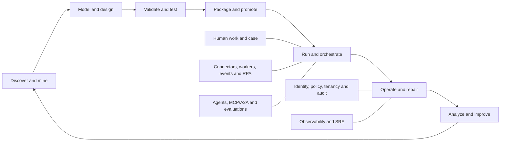
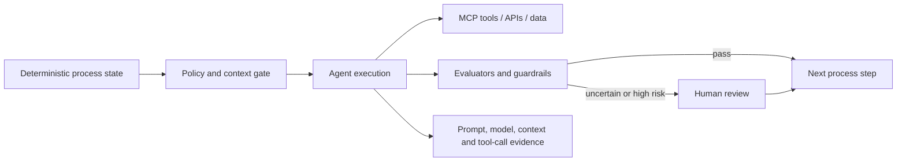
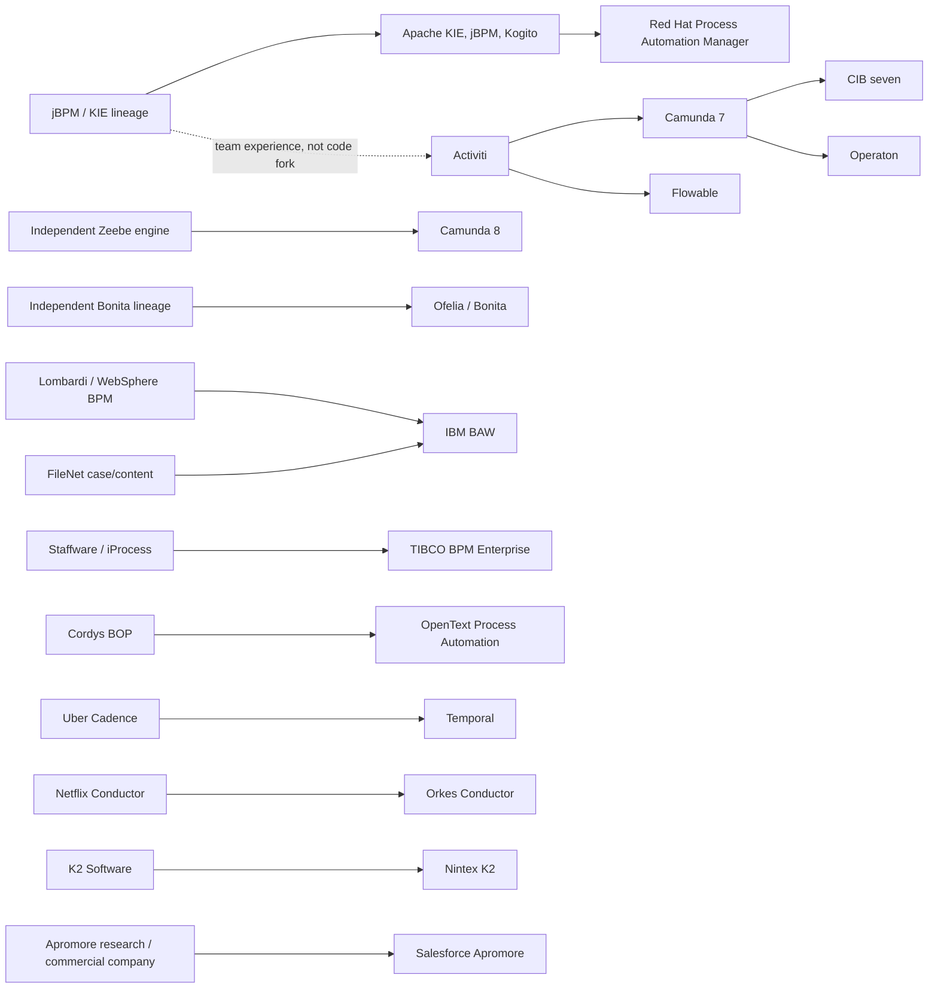

# Competitive Landscape for Enterprise Process Orchestration Platforms

## Status

**Owner-supplied, ChatGPT-generated research input imported on 2026-08-07; not project authority or an implementation claim.** It is the primary market input to the project-authored [BPM platform competitive scope research](BPM-PLATFORM-COMPETITIVE-SCOPE-RESEARCH.md). [The BPM platform proposal](../BPM-PLATFORM-PROPOSAL.md) owns the proposed first product contract, [PROJECT-DESIGN.md](../PROJECT-DESIGN.md) owns durable architecture and product boundaries, [PLAN.md](../PLAN.md) owns accepted sequencing, and the [`implementation-status-owner:BPM-PLATFORM`](../BPM-PLATFORM-IMPLEMENTATION-MAP.md) owns the exact implemented and absent surface.

## Provenance

The owner supplied `process-engine-competitive-landscape-technical-company-dossiers-2026-07-31.md`, confirmed that ChatGPT generated it for them, and authorized its inclusion in this repository. The received 1,833-line, 23,766-word source has SHA-256 `cd011669b06702771da033c6583d6bbf9f6724f38a2521cd4e3116795023e606`. The original body follows with no substantive content removed; Markdown hard breaks and the final trailing blank line are normalized to repository conventions. Vendor capability, edition, hosting, license, and recently announced feature claims still require current primary-source verification before procurement or committed implementation decisions.

---

## Technical and Vendor Dossier Edition

**Research date:** 31 July 2026

**Audience:** Product owner and product/architecture leadership for a process engine and surrounding enterprise platform

**Scope:** Process execution plus modeling, human work, case management, decisions, integration, deployment, operations, observability, migration, process intelligence/mining, and agentic orchestration

> **Evidence note.** This assessment is based primarily on public vendor documentation and product pages current at the research date. Packaging and entitlements vary by edition and contract. “Not publicly confirmed” means that sufficiently explicit official evidence was not found; it does not prove that the vendor cannot deliver the capability through services, a private API, or another edition.


> **Expanded edition — 31 July 2026.** This version retains the original feature, market and roadmap analysis and adds a product-by-product technical implementation and vendor/company dossier. Where a proprietary vendor does not disclose internals, the report deliberately describes supported architecture boundaries instead of guessing the implementation language or database.

---

## 1. Executive summary

An enterprise process product is no longer evaluated as “an engine with a modeler.” Buyers increasingly expect an **orchestration platform** spanning discovery, design, execution, human work, integration, production operations, migration, governance, and continuous improvement. The engine remains foundational, but it often disappears from procurement discussions unless runtime correctness, scale, deployment sovereignty, or migration risk becomes decisive.

The market should be read as four overlapping competitive arenas:

| Arena | What the customer is really buying | Most relevant competitors |
|---|---|---|
| **Standards-based process platforms** | BPMN/DMN execution, long-running state, human tasks, operational control, and deploy-anywhere options | Camunda, CIB seven, Flowable, Ofelia/Bonita, Apache KIE/jBPM, Red Hat Process Automation Manager, Operaton |
| **Enterprise automation suites** | Low-code workflow, case, rules, forms, data, RPA, documents, AI, mining and governance in one commercial platform | UiPath, IBM, Appian, Pega, SAP, ServiceNow, Bizagi, Decisions, Microsoft, Nintex, Salesforce, Oracle, OpenText |
| **Developer-first durable orchestration** | Reliable execution of distributed application logic without buying a business-facing BPM suite | Temporal, Orkes Conductor, AWS Step Functions, Azure Durable Functions/Durable Task Scheduler, Argo Workflows |
| **Process intelligence and mining** | Evidence-based discovery, conformance, root-cause analysis, prediction, simulation and action | Celonis, Apromore, SAP Signavio, UiPath, Appian, Pega, ServiceNow, Microsoft, IBM, CIB ins7ght |

### 1.1 Principal findings

**Camunda and Flowable are the strongest direct technical benchmarks, but for different reasons.** Camunda 8 competes through a scale-out orchestration cluster, a coherent model–task–operations–connector stack, SaaS and self-managed deployment, and a fast-growing MCP/A2A agent story. Flowable competes through embeddable open-source BPMN, CMMN and DMN engines plus a strong commercial case/work platform. CIB seven and Operaton are particularly relevant where Camunda 7 continuity, embedded Java, relational operation, or low-friction migration dominates the decision.

**UiPath is the strongest suite-displacement threat.** Maestro now combines BPMN/DMN process and case orchestration with robots, people, API integrations, external agents, monitoring, process mining, task mining, and explicit migration of live process or case instances. IBM, Appian, Pega, SAP and ServiceNow remain formidable when the procurement program is broader than the engine—for example content-intensive case management, enterprise decisioning, ERP transformation, IT workflows, RPA/IDP or a governed data/application platform.

**Migration is a family of capabilities, not one checkbox.** Vendors use “migration” for runtime upgrades, promotion between environments, conversion from a legacy product, or remapping of active instances to a changed definition. True in-flight migration requires state mapping, timer/message handling, variable transformation, human-task handling, validation, dry runs, bulk selection, auditability and safe recovery. Camunda, CIB seven, Flowable, IBM BAW, Appian, UiPath Maestro, Nintex K2 and Orkes publish comparatively explicit active-instance migration or upgrade capabilities.

**Operational intervention is part of the product.** Mature platforms expose pause/resume, retry, cancellation, variable correction, token/activity movement, migration, bulk actions and audit evidence. This is a significant differentiator for regulated or long-running processes because production defects cannot always be solved by deploying a new model and letting old instances finish.

**Agentic orchestration is becoming table stakes, but protocol support alone is not defensible.** Durable differentiation comes from deterministic boundaries around non-deterministic work: typed inputs and outputs, model/prompt/version provenance, tool allow-lists, cost and latency budgets, idempotency, human approval, policy evaluation, evaluation scores, traceability and replay-safe behavior.

**Process mining is strategically attractive, but the hardest asset is the data product.** Engine history sees only the work inside the engine. Enterprise mining needs event data from ERP, CRM, content, custom systems and desktops, plus correlation across multiple business objects. A process-engine vendor should first make its event model mining-ready, provide native operational analytics and conformance for its own runtime, and integrate with specialists before recreating a complete mining suite.

### 1.2 Threat map by buying motion

| Buying motion | Highest-threat vendors | Why they win |
|---|---|---|
| Replace or modernize a BPMN engine | Camunda, Flowable, CIB seven, Ofelia/Bonita, KIE/Red Hat | Standards, runtime maturity, human work, deployability and operational control |
| Migrate from Camunda 7 | CIB seven, Operaton, Camunda 8, Flowable | Familiar semantics/APIs or explicit conversion paths and lower perceived migration risk |
| Buy a broad automation platform | UiPath, Appian, Pega, IBM, SAP, ServiceNow | Low-code delivery, case/work experiences, RPA/IDP, integrations, governance and mining |
| Orchestrate agents, robots and people | UiPath Maestro, Camunda, Flowable, Orkes, SAP, Microsoft | Agent connectors/protocols plus deterministic workflow and human checkpoints |
| Build a microservice orchestration platform | Temporal, Orkes, Camunda, AWS Step Functions, Azure Durable | Durable execution, worker SDKs, retry/state semantics and cloud-native operation |
| Establish enterprise process intelligence | Celonis, SAP Signavio, UiPath, Apromore | Cross-system mining, conformance, task mining, simulation and action |
| Require on-premises or air-gapped operation | CIB seven, Flowable, Bonita, KIE/Red Hat, Camunda Self-Managed, IBM, Pega client-managed, UiPath Automation Suite, Nintex K2 | Customer-controlled runtime and data plane |
| Standardize on an ecosystem platform | SAP, ServiceNow, Microsoft, Salesforce, Oracle | Native data, identity, applications and integration context |

---

## 2. Product boundary and evaluation model

### 2.1 Capability stack



| Product layer | Expected components |
|---|---|
| **Design and repository** | BPMN/CMMN/DMN, forms, case plans, collaboration, versioning, validation, linting and simulation |
| **Runtime data plane** | Process engine, decisions, timers, messages/events, compensation, worker delivery, task/case services and durable state |
| **Work experience** | Task lists, work queues, forms, delegation, escalation, mobile/embedded UI, comments and attachments |
| **Integration plane** | REST/gRPC, event streaming, messaging, databases, files, SaaS connectors, custom SDKs, RPA, IDP and private connectivity |
| **Operations control plane** | Deployment management, instance cockpit, incidents, pause/resume, retry, variable repair, migration, bulk actions and audit |
| **Platform services** | SaaS/self-managed/embedded deployment, identity, tenancy, security, HA/DR, upgrades, backup and retention |
| **Lifecycle and migration** | CI/CD, immutable packages, definition versioning, environment promotion, legacy conversion and active-instance migration |
| **Intelligence plane** | Operational dashboards, business KPIs, mining, conformance, prediction, simulation, recommendations and closed-loop action |
| **Agent control plane** | Agent registry, MCP/A2A, tool policy, typed contracts, prompt/model lifecycle, evaluation, human approval and traceability |

### 2.2 Capability labels

| Label | Meaning |
|---|---|
| **Strong** | Productized, prominent and supported by explicit public evidence |
| **Available** | Present but narrower, edition-dependent, newer, or less central |
| **Limited** | Partial capability or material workaround/constraint |
| **Not publicly confirmed** | No sufficiently explicit official evidence found for the assessed behavior |
| **Not applicable** | Does not fit the product’s runtime model or market role |

A single numerical winner is intentionally avoided. An embeddable relational engine, a managed low-code suite, a durable-code runtime and a mining platform solve different buying problems. A score becomes meaningful only after target segment, deployment policy and product strategy are fixed.

---

## 3. Architectural archetypes

| Archetype | Representative products | Strengths | Structural trade-offs |
|---|---|---|---|
| **Embedded/shared relational engine** | CIB seven, Flowable OSS, KIE/jBPM, Operaton; Bonita standalone | Low footprint, Java embedding, familiar SQL HA/backup, transaction integration with application data | Shared-database contention, job-executor tuning, harder extreme horizontal scale, runtime/application coupling |
| **Partitioned distributed event-log engine** | Camunda 8/Zeebe | Horizontal throughput, independent workers, resilient long-running orchestration | More infrastructure components, distributed-system operation, no classic in-process embedding |
| **Proprietary low-code system of action** | Appian, Pega, UiPath, ServiceNow, SAP, Microsoft, Bizagi | Fast application delivery, forms/data/governance, large connector ecosystem, managed operations | Platform lock-in, edition complexity, less portable runtime and limited embedding |
| **Deterministic replay/durable code** | Temporal, Azure Durable Functions | Natural developer experience, durable retries/timers/signals, excellent distributed-application fit | Determinism/versioning constraints, no native business modeling, task/case UI must be built |
| **Task-queue/state-machine orchestration** | Orkes Conductor, AWS Step Functions | Simple service orchestration, scalable workers, visual/declarative definitions and cloud integrations | BPMN semantics, case and business-user depth vary; migration is usually less rich |
| **Kubernetes DAG/compute workflow** | Argo Workflows | GitOps-native and excellent for batch/data/ML pipelines | Not a business-process platform; weak human work, case, mining and semantic migration |
| **Mining-led action platform** | Celonis; mining modules in SAP, UiPath and others | Cross-system truth, root cause, recommendations and action | Runtime execution and repair are newer or narrower than mature process engines |

The strategic implication is that “we execute workflows” is too generic. A credible position must make an architectural promise, such as **migration-safe BPMN that runs from embedded Java to Kubernetes**, **a deterministic control plane for people, services and agents without a proprietary application platform**, or **an operationally repairable runtime whose event model is built for process intelligence**.

---

## 4. Comparison matrices

### 4.1 Standards-based and engine-centric products

| Product | Runtime and standards | Human work / case | Deployment | Operations and migration | Mining / agents | Primary differentiator |
|---|---|---|---|---|---|---|
| **Camunda 8** | BPMN/DMN; Zeebe distributed cluster | Tasklist/forms; less case-centric than Flowable/Pega | SaaS and self-managed Kubernetes/Helm | Operate, incidents, modification and explicit process-instance migration | Optimize, Connectors, MCP/A2A | Scale-out BPMN and strong business/developer collaboration |
| **CIB seven / CIB flow** | Camunda-7-derived BPMN/DMN; embedded/shared relational runtime | Tasklist, Cockpit, Admin and forms | Embedded Java, shared server, REST, containers | Strong Camunda 7 continuity; enterprise active-instance migration UI | CIB ins7ght and portfolio AI/low-code | Lowest-friction Camunda 7 continuity and EU/German-market positioning |
| **Flowable** | Open-source BPMN, CMMN and DMN plus commercial suite | Strong work and case platform | Embedded, standalone, cloud and Kubernetes/OpenShift | Process and case migration by UI/API; strong administration | AI-assisted design, MCP and agentic case capabilities | Standards breadth and case management |
| **Ofelia / Bonita** | BPMN runtime with application/data/UI development | User/admin apps, forms, delegation and case-style composition | Docker/on-premises and cloud | Mature platform update tooling; generic active-definition migration not explicit | AI connectors and Agent Orchestrator; analytics | Process-application construction with visual and coded extension |
| **Apache KIE / jBPM / Kogito** | BPMN, DMN, Drools rules and event processing | User tasks and management consoles | Embedded Java, services and Kubernetes | Process-instance migration add-on; tooling varies by generation | Rules/decisions are stronger than mining/agents | Open-source process plus mature decision/rule stack |
| **Red Hat Process Automation Manager** | Supported KIE/jBPM distribution | Business Central/KIE Server tooling | JBoss EAP and OpenShift | Supported upgrades and deployment management | No broad native mining suite | Enterprise support and OpenShift alignment |
| **Operaton** | Community continuation of Camunda 7 | Familiar web apps/APIs | Embedded/shared/standalone, Docker, Spring/Quarkus | Strong source/API migration from Camunda 7 | No broad native mining suite | Open-source continuity and Java/Jakarta modernization |
| **Activiti** | Lightweight BPMN engine and cloud components | Basic human tasks | Java/cloud components | Active project with pre-release streams | Limited suite breadth | Familiar open-source lineage; primarily a watchlist item |

### 4.2 Enterprise automation suites

| Product | Core orchestration offer | Adjacent components | Deployment posture | Active-definition migration | Process intelligence | Agentic position |
|---|---|---|---|---|---|---|
| **UiPath Maestro + Platform** | BPMN/DMN process, case and agent/robot/human orchestration | Orchestrator, robots, Action Center, Apps, Integration Service, IDP, testing | Automation Cloud or self-hosted Automation Suite | **Strong:** explicit live process/case migration and repair | Process Mining and Task Mining | Broad cross-vendor agent, robot and human coordination |
| **IBM BAW / Cloud Pak** | Structured workflow, human workflow, case and decisions | Content, rules, RPA, documents, federation and insights | Traditional and OpenShift/container deployment | **Strong:** published running-instance migration | IBM process mining/insights portfolio | Governed AI in a broad regulated-enterprise stack |
| **Appian** | Executable process models plus low-code apps/case | Data Fabric, RPA, IDP, records, APIs and documents | Appian Cloud dominant; self-managed posture requires validation | **Strong:** Process Upgrade and instance editing | Process HQ | AI embedded in low-code process/data context |
| **Pega Platform** | Case management, workflow and decisioning | RPA, Process Fabric, customer service and low-code | Pega Cloud and client-managed Kubernetes | Not publicly confirmed at Camunda/Appian granularity | Process and task mining | AI/agents grounded in case/rules context |
| **SAP Signavio + Build Process Automation** | Workflow, decisions, forms, tasks and RPA | Signavio mining/modeling, Task Center, Joule Studio, IDP | SAP BTP managed cloud | Legacy SAP workflow/RPA conversion documented; generic live remap not explicit | Strong Signavio suite | Strong SAP-context agents and MCP/tool integration |
| **ServiceNow** | Workflow Studio, Flow Designer, playbooks | App Engine, Integration Hub, RPA, Automation Center, IDP, AI agents | Managed ServiceNow cloud | Artifact promotion strong; generic running-instance remap not explicit | Native Process Mining | Agents inside a rich enterprise work/data model |
| **Bizagi** | BPMN execution and low-code process apps | Modeler, Studio, Work Portal, forms, rules, analytics, connectors | Managed cloud/PaaS; other options contract-specific | Not publicly confirmed generically | BAM/analytics and simulation | AI-assisted low-code rather than agent-runtime leadership |
| **Decisions** | Workflow and rules across systems, people and AI | ProcessMaker lineage, task/process intelligence, IDP and agents | Cloud/enterprise options; edition architecture must be checked | Not publicly confirmed | Process intelligence portfolio | Rules-governed “universal orchestration” |
| **Microsoft Power Automate** | Cloud flows, desktop flows, approvals and business process flows | Power Apps, Copilot Studio, AI Builder and connectors | Microsoft-managed cloud plus gateways/desktop execution | Solution ALM strong; active-flow remap not explicit | Native process/task mining | Deep Microsoft 365/Dynamics/Azure/Copilot integration |
| **Nintex Workflow / Automation K2** | Cloud workflow/forms; K2 for deep enterprise/on-prem workflow | Process Manager, DocGen, RPA, task mining and Insights | Cloud plus distinct K2 on-premises line | **Strong in K2:** Live Instance Management API | Process/task intelligence | Broad low-code portfolio; agent capabilities emerging |
| **Salesforce Flow / MuleSoft / Agentforce** | Flow Builder and Flow Orchestration | CRM, Data Cloud, MuleSoft integration/RPA and Agentforce | Salesforce-managed SaaS | Versioning/recovery; generic live remap not explicit | Apromore/MuleSoft partnership | Strong agent/workflow context inside CRM/Data Cloud |
| **Oracle Integration + Process Automation** | Structured/dynamic process, approvals, rules and forms | Integration adapters, RPA and human-in-loop | Oracle managed cloud | Platform migration documented; generic live remap not explicit | External analytics | Strong Oracle app/integration context |

### 4.3 Developer-first and cloud-native orchestration

| Product | Definition model | Hosting | Version/running-instance behavior | Human work | Main threat |
|---|---|---|---|---|---|
| **Temporal** | Workflow/activity code with deterministic replay | Temporal Cloud or self-hosted | Worker versioning and replay-safe evolution; no arbitrary diagram/state remap | Custom/integrated | Developers replace BPMN with durable application code |
| **Orkes Conductor** | JSON/code/visual workflow; BPMN import | Managed, customer-hosted and developer edition | Explicit API to upgrade a running workflow | Native human tasks/forms | Visual/code hybrid with strong repair and AI primitives |
| **AWS Step Functions** | Amazon States Language and Workflow Studio | AWS managed | Versions/aliases pin definitions; redrive failed Standard executions | Callback patterns only | Very low-friction AWS-native choice |
| **Azure Durable Functions** | Orchestrator/activity/entity code | Azure managed | Version-aware durable histories; no arbitrary state remap | Custom | Natural Azure Functions choice |
| **Argo Workflows** | Kubernetes CRDs for steps/DAGs | Self-managed Kubernetes | GitOps/versioned manifests, not semantic business migration | Suspend/manual gates | Absorbs technical data/ML/batch workflow use cases |

### 4.4 Process mining and intelligence

| Product | Discovery / variants | Conformance | Task mining | Simulation / prediction | Closed-loop action | Distinctive strength |
|---|---|---|---|---|---|---|
| **Celonis** | Strong and increasingly object-centric | Strong | Available | Prediction/recommendations | Action Flows and Orchestration Engine | Enterprise object-centric process intelligence |
| **Apromore** | Strong process-map and BPMN discovery | Strong BPMN/event-log conformance | Strong | Strong what-if simulation and predictive monitoring | Integrations; not a full runtime | BPMN analysis, compliance and simulation |
| **SAP Signavio** | Strong, especially in SAP transformation | Strong | Available | Simulation/transformation analysis | Connected to SAP Build | Discover-to-transform-to-automate in SAP estates |
| **UiPath** | Strong process and desktop discovery | Strong | Strong | Product/version dependent | Direct connection to Maestro and robots | Closed loop from mining to orchestration/RPA |
| **Appian Process HQ** | Embedded process/data insight | Available | Portfolio-dependent | KPI/process insight | Native Appian actions | Low-friction intelligence for Appian apps |
| **Pega Process Mining** | Process and task mining | Available | Strong | Root-cause/optimization | Connected to cases, decisions and RPA | Mining tied to case and decisioning |
| **ServiceNow Process Mining** | Native discovery in ServiceNow data | Available | Portfolio capabilities | Improvement recommendations | Direct workflow remediation | System-of-action context |
| **Microsoft Process Mining** | Native event-log mining | Available | Native | Root cause/KPIs | Power Automate/Copilot actions | Reach and citizen-developer ecosystem |
| **CIB ins7ght** | Process-data analysis/optimization | Product-specific validation | Product-specific | Product-specific | Connects to CIB process products | EU-focused adjacency |

---

## 5. Detailed competitor profiles

### 5.1 Camunda 8

**Position and components.** Camunda is the clearest benchmark for an enterprise “engine plus platform” proposition. The current stable 8.9 line combines Web/Desktop Modeler, a Zeebe-based Orchestration Cluster, Operate, Tasklist, Identity, Connectors, Optimize and management services. The product surfaces are explicit: design, execution, human work, operations, integration and analysis are separately recognizable rather than hidden inside one administration console.

**Runtime and deployment.** Zeebe is a partitioned and replicated orchestration engine. Workers pull jobs, which separates business services from the engine and fits microservice architectures. Camunda offers SaaS and self-managed deployment, with Kubernetes/Helm and documented reference architectures. Release 8.9 added relational-database secondary-storage options, addressing an important objection from customers who do not want Elasticsearch/OpenSearch for every self-managed deployment.

**Operations, migration and agents.** Operate supports incident handling and process-instance modification. Camunda exposes process-instance migration with element mappings and validation. The Camunda 7-to-8 path includes conversion and history tooling, but it remains an architectural transformation because embedded Java delegates, shared transactions and engine plugins do not map directly to remote workers. Connectors are a first-class extension model, and the 8.9 line expanded MCP and A2A support.

**Unique selling points.** Camunda combines a business-readable BPMN/DMN model with a serious distributed runtime, an increasingly complete operations stack and a credible protocol-based agent story. A competitor can differentiate through a lower operational footprint, embedded mode, richer case management, stronger legacy migration automation, or deeper mining.

**Official evidence:** [self-managed components](https://docs.camunda.io/docs/self-managed/about-self-managed/), [process-instance migration](https://docs.camunda.io/docs/components/concepts/process-instance-migration/), [Camunda 8.9 changes](https://docs.camunda.io/docs/reference/announcements-release-notes/890/whats-new-in-89/), [8.9 agentic-orchestration announcement](https://camunda.com/blog/2026/04/camunda-8-9-fastest-path-to-agentic-orchestration/).

---

### 5.2 CIB seven, CIB flow and CIB ins7ght

**Position and components.** CIB seven is highly relevant wherever customers need a maintained continuation of the Camunda 7 architecture. Its stack retains BPMN/DMN execution, Java and REST APIs, Tasklist, Cockpit, Admin, forms and web modeling. The wider portfolio adds CIB flow for low-code/cloud process applications and CIB ins7ght for process-data analysis.

**Runtime and deployment.** The architecture is relational-database-centered, with embedded, shared-engine and standalone/container deployment patterns. This is attractive to teams that value conventional SQL backup/restore, familiar transaction semantics and low infrastructure complexity over a partitioned-log runtime.

**Migration.** CIB has one of the clearest Camunda 7 continuity propositions. Public guidance covers namespace/artifact transition and OpenRewrite assistance. The enterprise Cockpit supports migration of running instances between versions/definitions, with mapping, preview and reporting.

**Unique selling points.** The strongest proposition is migration certainty: familiar semantics, a low-change operating model, explicit active-instance migration, and European/German-market support and data-sovereignty credibility. Its challenge is to match the global visibility and suite coherence of Camunda, Flowable and larger automation vendors.

**Official evidence:** [release notes](https://docs.cibseven.org/manual/latest/release-notes/), [Cockpit instance migration](https://docs.cibseven.org/manual/latest/webapps/cockpit/bpmn/process-instance-migration/), [migration from Camunda](https://docs.cibseven.org/manual/latest/update/camunda/), [CIB portfolio](https://www.cib.de/en/products/).

---

### 5.3 Flowable

**Position and components.** Flowable is the broadest direct standards-based alternative to Camunda. Its open-source foundation includes BPMN, CMMN and DMN engines. The commercial suite adds Flowable Design, Flowable Work, Flowable Hub, Flowable Inspect, case platforms and agentic case capabilities.

**Runtime and deployment.** Flowable supports embedded Java use, headless/API-driven runtime and complete work applications. Commercial deployment includes Kubernetes/OpenShift through Helm. Integration options cover REST, messaging, SQL/files and extension through Java/custom tasks.

**Migration, case and agents.** Flowable explicitly documents process and case migration, including individual, bulk and mapped migrations. This is a meaningful differentiator because many vendors version cases but provide less operational control over active case instances. Public material also describes AI-assisted design, MCP support, evaluators/guardrails and agentic case patterns.

**Unique selling points.** BPMN+CMMN+DMN breadth, strong case management, embeddability, and explicit process/case migration. The key product lesson is that case management and operational lifecycle can be more defensible than another increment of BPMN syntax coverage.

**Official evidence:** [2026.1 release notes](https://documentation.flowable.com/latest/admin/release-notes/2026.1.0-release), [Helm deployment](https://documentation.flowable.com/latest/admin/cloud-deployment/helm), [process migration](https://documentation.flowable.com/latest/reactmodel/bpmn/concept/process-migration), [product introduction](https://documentation.flowable.com/latest/user/user-introduction).

---

### 5.4 Ofelia / Bonita

**Position and components.** Bonitasoft now presents its portfolio under the Ofelia brand. Bonita remains the open and extensible process-application platform, with Studio/BPA Studio, BPMN runtime, user/admin applications, UI Builder, business data model tooling, connectors/extensions and delivery tooling.

**Runtime and lifecycle.** The runtime uses relational persistence and supports Docker/on-premises and cloud deployment. Enterprise editions add clustering, resilience and security. Bonita has mature platform update tooling that preserves running work across product upgrades. The reviewed public evidence did not establish a generic operator-facing mechanism to remap arbitrary active instances to a structurally changed process definition.

**Agents and USP.** Ofelia emphasizes AI connectors, an Agent Orchestrator and a work hub around auditable processes. Bonita’s particular strength is process-based application construction: data, UI and integration are first-class alongside the model. This is commercially important because buyers often need an application, not an engine.

**Official evidence:** [release notes](https://documentation.ofelia.com/bonita/latest/release-notes), [Bonita overview](https://documentation.ofelia.com/bonita/latest/bonita-overview/what-is-bonita-index), [runtime update tooling](https://documentation.ofelia.com/bonita/latest/version-update/update-with-update-tool), [extensions](https://documentation.ofelia.com/bonita/latest/extensions-index).

---

### 5.5 Apache KIE/jBPM/Kogito and Red Hat Process Automation Manager

**Position and components.** Apache KIE combines jBPM process execution, Drools rules, DMN, event processing and cloud-native Kogito components. The April 2026 10.2.0 release continued this line. Red Hat Process Automation Manager provides the supported enterprise distribution lineage with Business Central/KIE Server and OpenShift integration.

**Runtime and migration.** KIE can run as embedded Java libraries, persistent process services or cloud-native domain services. KIE 10.2 externalized a process-instance migration add-on. The precise operations UX and supported structural changes vary across jBPM, Kogito and Red Hat generations, so it should be tested against the selected distribution.

**Unique selling points.** The rules/decision stack is the standout differentiator. KIE is attractive when explainable rules, optimization and complex event processing are peers of workflow. Its weakness is portfolio fragmentation and the additional assembly needed for a polished end-user and operations platform.

**Official evidence:** [Apache KIE](https://kie.apache.org/), [jBPM](https://kie.apache.org/components/jbpm/), [KIE 10.2.0](https://kie.apache.org/blog/kie_10_2_0_release/), [DMN](https://kie.apache.org/components/drools/drools_dmn/), [Red Hat PAM 7.13 documentation](https://docs.redhat.com/en/documentation/red_hat_process_automation_manager/7.13).

---

### 5.6 Operaton and Activiti

**Operaton** is a community-driven continuation of the Camunda 7 lineage with modernization around JDK/Jakarta, Spring Boot and Quarkus while retaining familiar engine APIs and web applications. Its competitive relevance is an open-source exit option for organizations that want to keep the relational/embedded Camunda 7 model. The risks are ecosystem scale, commercial support depth and limited native mining, agents and application breadth.

**Activiti** remains an active open-source BPMN project with Core and Cloud lines, but its public release posture contains multiple pre-release streams. It should normally be treated as a technical watchlist item or installed-base alternative rather than a top enterprise suite competitor.

**Official evidence:** [Operaton](https://operaton.org/), [Operaton docs](https://docs.operaton.org/), [Operaton releases](https://github.com/operaton/operaton/releases), [Activiti releases](https://github.com/Activiti/Activiti/releases).

---

### 5.7 UiPath Maestro and the UiPath Platform

**Position.** UiPath has evolved from an RPA vendor into one of the most important process-orchestration competitors. Maestro is the coordination layer across agents, robots, people, APIs and events; the wider platform supplies automation, integration, human work, documents, testing and intelligence.

**Component breakdown.**

| Component | Role |
|---|---|
| **Maestro** | BPMN/DMN process, case and multi-agent orchestration; monitoring and operations |
| **Orchestrator** | Robot/job/queue/package/folder operations |
| **Agents / Agent Builder** | First-party and external agents |
| **Integration Service** | Managed connectors and event/API integration |
| **Action Center / Apps** | Human tasks, approvals, forms and applications |
| **Document Understanding / IXP** | Document extraction and validation |
| **Process Mining / Task Mining** | Discovery, conformance and desktop evidence |
| **Automation Hub / Test Cloud / Insights** | Governance, reuse, testing and analytics |

**Operations and migration.** Maestro exposes pause, resume, retry, cancel, movement/repair, variable editing and action history. It explicitly documents migration of active process instances and live case plans while preserving state and audit. Automation Cloud and self-hosted Automation Suite cover managed and customer-controlled deployment.

**Unique selling points.** UiPath offers the broadest integrated combination of BPMN, case, RPA, agents, people, IDP and mining. Its installed RPA footprint and center-of-excellence relationships are strategic advantages. The main uncertainty is that Maestro is newer than mature BPM runtimes and platform breadth creates licensing/operational complexity.

**Official evidence:** [Maestro overview](https://www.uipath.com/platform/agentic-automation/business-orchestration), [process overview](https://docs.uipath.com/maestro/automation-cloud/latest/user-guide/process-overview-homepage), [process operations](https://docs.uipath.com/maestro/automation-cloud/latest/user-guide/understanding-process-operations), [live case migration](https://docs.uipath.com/maestro/automation-cloud/latest/user-guide/how-to-manage-live-case-instances-pause-migrate-and-retry), [monitoring](https://docs.uipath.com/maestro/automation-cloud/latest/user-guide/introduction-to-process-monitoring).

---

### 5.8 IBM Business Automation Workflow / Cloud Pak for Business Automation

**Position and components.** IBM remains a major competitor in regulated, content-heavy and complex case/process estates. BAW combines structured process, human workflow and case management. Cloud Pak adds decisions, content services, document processing, RPA, mining/insights and AI integration. Process Federation Server can aggregate tasks and process/case work from multiple back ends.

**Deployment and lifecycle.** IBM supports traditional and containerized OpenShift deployment, including enterprise HA/DR patterns. The platform is operationally mature but correspondingly complex. IBM publishes migration procedures for running process instances and for transitions between product generations and deployment models.

**Unique selling points.** Broad process/case/content/rules capability, mature migration, global support and federated work. The product lesson is the strategic value of a unified work hub and content/case as peers of straight-through orchestration.

**Official evidence:** [Cloud Pak for Business Automation](https://www.ibm.com/products/cloud-pak-for-business-automation), [BAW documentation](https://www.ibm.com/docs/en/baw/), [running-instance migration](https://www.ibm.com/docs/en/baw/24.0.x?topic=mrpinvbp-creating-new-version-your-process-migrate-running-instances).

---

### 5.9 Appian

**Position and components.** Appian competes as a unified low-code application and process platform. It combines executable process models, interfaces, records/Data Fabric, case tooling, RPA, intelligent document processing, integrations/APIs and Process HQ.

**Runtime, migration and operations.** Appian Cloud is central to the proposition. Process Upgrade can move active processes from a source model to a target version, and administrators can monitor/edit running processes. This is unusually explicit among low-code suites.

**Unique selling points.** Process, data, UI and case composition in one lifecycle; strong active-process upgrade; rapid application delivery. The trade-off is proprietary abstraction and platform lock-in rather than engine-level portability or embedding.

**Official evidence:** [Appian](https://appian.com/), [process modeling](https://docs.appian.com/suite/help/26.6/process_modeling.html), [Process Upgrade](https://docs.appian.com/suite/help/26.6/Process_Upgrade.html), [monitoring/editing](https://docs.appian.com/suite/help/26.6/Monitoring_and_Editing_Processes.html).

---

### 5.10 Pega

**Position and components.** Pega’s strongest proposition is dynamic case management combined with workflow, business rules, predictive/adaptive decisioning, RPA, Process Fabric, mining and low-code applications. Many enterprise “processes” are dynamic cases, so Pega is a stronger competitor than a BPMN-only comparison suggests.

**Deployment and migration.** Pega offers Pega Cloud and client-managed Kubernetes. Application/rule versioning and deployment are mature, but the reviewed public evidence did not provide the same generic active-instance remapping contract as Camunda, Appian or UiPath.

**Unique selling points.** Deep case management, decisioning, federated work and mining/RPA integration. Its trade-off is a large proprietary application platform with specialized skills and potentially high total complexity.

**Official evidence:** [Pega Process Mining](https://www.pega.com/products/platform/process-mining), [Pega RPA](https://www.pega.com/products/platform/robotic-process-automation), [client-managed Kubernetes architecture](https://docs.pega.com/bundle/platform/page/platform/deployment/client-managed-cloud/pega-kubernetes-architecture.html).

---

### 5.11 SAP Signavio and SAP Build Process Automation

**Position.** SAP has one of the strongest discover–transform–automate narratives for SAP-centric enterprises. Signavio supplies collaborative modeling, mining and transformation management; SAP Build Process Automation supplies workflow, decisions, forms, tasks, RPA, document processing and actions on SAP BTP.

**Deployment, migration and agents.** Build Process Automation is primarily a managed SAP BTP service. SAP documents migration from selected legacy Workflow Management and Intelligent RPA products, but that is not proof of arbitrary active-definition remapping. Joule Studio and agent/tool integrations strengthen the agentic proposition.

**Unique selling points.** Native SAP application semantics, strong transformation/mining context, and an integrated path from process insight to workflow/RPA. The limitation is cloud/ecosystem dependence and weaker fit as a neutral embedded runtime.

**Official evidence:** [Signavio process mining](https://www.sap.com/products/business-transformation-management/process-mining.html), [Build Process Automation features](https://www.sap.com/products/technology-platform/process-automation/features.html), [migration from Intelligent RPA](https://help.sap.com/docs/intelligent-robotic-process-automation/what-is-sap-intelligent-rpa/migrating-to-sap-build-process-automation), [SAP Build](https://pages.community.sap.com/topics/build).

---

### 5.12 ServiceNow

**Position and components.** ServiceNow competes as an enterprise system of action. Workflow Studio/Flow Designer, Process Automation Designer/playbooks, App Engine, Workflow Data Fabric/Integration Hub, RPA Hub, Automation Center, Document Intelligence, Process Mining and AI Agent Studio all operate against a shared work/data model.

**Deployment and lifecycle.** The normal posture is managed ServiceNow cloud, with MID Server for private-network connectivity. Update Sets, application repositories and Team Development support artifact movement; they should not be confused with semantic migration of active instances.

**Unique selling points.** Existing enterprise work records, identities, connector spokes, governance and native mining/agents. Its limitation is that it is a proprietary SaaS-centered application platform rather than a neutral embeddable engine.

**Official evidence:** [Workflow Data Fabric / Automation Engine](https://www.servicenow.com/products/automation-engine.html), [spokes](https://www.servicenow.com/docs/r/build-workflows/workflow-studio/spokes.html), [REST actions](https://www.servicenow.com/docs/r/build-workflows/workflow-studio/rest-request-action-designer.html), [application version transfer](https://www.servicenow.com/docs/r/application-development/team-development/c_TransferringVersions.html).

---

### 5.13 Bizagi

**Position and components.** Bizagi provides a business-friendly path from BPMN modeling through low-code application implementation to managed runtime. Modeler covers modeling/documentation/simulation, Studio supplies data/forms/rules/allocation/integration, and Automation Service/Work Portal execute and present the applications.

**Deployment and migration.** Bizagi Cloud Platform is a managed Azure-based platform with isolated environments, redundancy, backup and DR. It has mature environment/application lifecycle concepts, but generic in-flight remapping of active instances was not clearly established in the public material reviewed.

**Unique selling points.** A polished model-to-application path, strong forms/rules/data/work portal, and broad enterprise connectivity. Its limitation is lower runtime portability and infrastructure control than an embeddable engine.

**Official evidence:** [cloud architecture](https://help.bizagi.com/platform/en/cloud_platform_architecture.htm), [Automation Service infrastructure](https://help.bizagi.com/platform/en/cloud_architecture_as.htm), [Work Portal/engine architecture](https://help.bizagi.com/platform/en/suite_producta.htm), [cloud reliability](https://help.bizagi.com/platform/en/cloud_reliability_as.htm).

---

### 5.14 Decisions / ProcessMaker

**Position.** Decisions and ProcessMaker announced a merger in November 2025 and present a broader orchestration proposition across systems, people, rules, agents and process intelligence. The combined portfolio includes workflow/rules, ProcessMaker automation, Workfellow-style task/process intelligence, document processing and agent capabilities.

**Strength and risk.** Rules are central to the proposition, which is attractive for adaptive, policy-heavy work. The merger creates breadth quickly but also roadmap, integration and packaging risk. Public evidence reviewed did not establish a generic active-instance remapping facility.

**Unique selling points.** Visual rules/workflow, process intelligence, IDP and agents under a “universal orchestration” story. The product lesson is that competitors are consolidating adjacent categories rapidly; a smaller vendor needs modular architecture and strong partnerships rather than a monolith.

**Official evidence:** [merger announcement](https://decisions.com/blog/more-power-more-possibility-a-new-chapter-begins), [platform overview](https://decisions.com/platform-overview), [adaptive orchestration](https://decisions.com/reports/the-adaptive-process-orchestration-software-landscape).

---

### 5.15 Microsoft Power Automate

**Position and components.** Power Automate is a major displacement threat because of Microsoft distribution. Cloud flows, desktop flows, approvals and Dataverse business process flows combine with Power Apps, AI Builder, Copilot Studio, connectors, Managed Environments and native process/task mining.

**Deployment and migration.** The cloud control plane is Microsoft-managed; on-premises systems are reached through the data gateway and desktop automation. Solution-based ALM is strong, but public documentation does not establish generic migration of a running flow instance to a structurally changed definition.

**Unique selling points.** Microsoft 365/Dynamics/Azure reach, broad connectors, RPA, apps, mining and Copilot. The trade-offs are cloud dependence, governance/environment sprawl and weaker BPMN/runtime-repair semantics.

**Official evidence:** [Power Automate](https://learn.microsoft.com/en-us/power-automate/), [process mining](https://learn.microsoft.com/en-us/power-automate/process-mining-overview), [Process Mining MCP server](https://learn.microsoft.com/en-us/power-automate/process-mining-mcp-server-reference), [on-premises gateway](https://learn.microsoft.com/en-us/data-integration/gateway/service-gateway-onprem).

---

### 5.16 Nintex Workflow and Nintex Automation K2

**Position and components.** Nintex spans cloud workflow/forms, process management, document generation, RPA and task/process intelligence. K2 supplies a deeper enterprise/on-premises workflow lineage with SmartForms, SmartObjects, management and workspace capabilities.

**Migration and repair.** K2’s Live Instance Management API explicitly migrates active or error-state instances to another definition version and offers activity movement/repair operations. The documentation includes supported and unsupported structural scenarios. This is a strong capability, although API-centric and sensitive to product-generation boundaries.

**Unique selling points.** Cloud workflow plus mature on-premises K2, strong Microsoft/SharePoint and document heritage, and explicit instance surgery. The weakness is portfolio fragmentation, naming changes and upgrade-path complexity.

**Official evidence:** [Workflow release notes](https://help.nintex.com/en-US/platform/ReleaseNotes/NintexWorkflowCloud.htm), [K2 release notes](https://help.nintex.com/en-US/platform/ReleaseNotes/K2Five.htm), [Live Instance Management](https://help.nintex.com/en-US/k2five/devref/5.6/Content/Runtime/WF-Manage/LIM.html), [LIM scenarios](https://help.nintex.com/en-US/k2five/devref/5.6/Content/Runtime/WF-Manage/LIM-Notes.html).

---

### 5.17 Salesforce Flow, MuleSoft and Agentforce

**Position.** Salesforce competes where customer-facing workflows already live in CRM and Data Cloud. Flow Builder and Flow Orchestration coordinate staged/long-running work; MuleSoft supplies integration and RPA; Agentforce supplies agents.

**Lifecycle and mining.** The platform is managed SaaS with strong packaging/versioning and monitoring/recovery. Generic active-definition remapping was not established in public evidence. Process mining is supplied with MuleSoft/Apromore partnership rather than a deeply mature native engine.

**Unique selling points.** Immediate CRM/customer/data context, a vast ecosystem and strong agent integration. The limitation is proprietary SaaS semantics and lack of neutral BPMN runtime portability.

**Official evidence:** [Flow Orchestration](https://help.salesforce.com/s/articleView?id=platform.orchestrator_about.htm&type=5), [building orchestrations](https://help.salesforce.com/s/articleView?id=platform.orchestrator_build.htm&language=en_US&type=5), [managing orchestrations](https://help.salesforce.com/s/articleView?id=platform.orchestrator_manage.htm&language=en_US&type=5), [process mining](https://www.salesforce.com/agentforce/process-mining/), [MuleSoft/Apromore](https://www.salesforce.com/blog/process-mining-mulesoft-apromore/).

---

### 5.18 Oracle Integration, OpenText Process Automation and TIBCO BPM Enterprise

**Oracle Integration** now combines integration, process automation, human approvals, rules and RPA. Oracle’s July 2026 documentation indicates that standalone OCI Process Automation is being folded into Oracle Integration. Its strength is Oracle application/adapter context; product transition and managed-cloud dependence are risks. Sources: [process automation](https://docs.oracle.com/en-us/iaas/application-integration/doc/use-process-automation.html), [July 2026 changes](https://docs.oracle.com/en/cloud/paas/application-integration/whats-new/release-26-07-july-2026.html).

**OpenText Process Automation** is strongest in content/document-intensive process and case automation and in OpenText installed bases. Its differentiation is deep information-governance and content integration rather than cloud-native engine architecture. Source: [OpenText Process Automation](https://www.opentext.com/products/process-automation).

**TIBCO BPM Enterprise** remains relevant in TIBCO integration/event estates and legacy ActiveMatrix BPM programs. The current 5.7 line was documented in 2026. Sources: [product documentation](https://docs.tibco.com/products/tibco-bpm-enterprise), [5.7 documentation](https://docs.tibco.com/products/tibco-bpm-enterprise-5-7-0).

---

## 6. Developer-first and cloud-native competitors

### 6.1 Temporal

Temporal is the most important code-first alternative to BPMN orchestration. Application developers express workflows and activities in SDK code; the platform records durable history and replays deterministic workflow logic after failure. A self-hosted Temporal Service contains Frontend, History, Matching and internal Worker services backed by persistence and visibility stores. Temporal Cloud supplies the managed service, while Web UI/CLI provide search and debugging.

Temporal’s versioning model is fundamentally different from diagram migration. Workflow code must remain replay-compatible. Patching and Worker Versioning route old and new executions to compatible worker deployments, while Continue-As-New can establish an application-level transition boundary. Human tasks, forms, case management and mining are not native suite components and must be built or integrated.

**USP:** excellent failure semantics, timers, signals, retries, polyglot SDKs and developer ergonomics.

**Risk for a BPM platform:** engineering teams may decide that durable application code is enough and build their own user experience.

**Product lesson:** BPMN must be complemented by a first-class developer API, test harness and local development experience.

**Official evidence:** [self-hosted guide](https://docs.temporal.io/self-hosted-guide), [service configuration](https://docs.temporal.io/temporal-service/configuration), [Web UI](https://docs.temporal.io/web-ui), [worker versioning](https://docs.temporal.io/production-deployment/worker-deployments/worker-versioning).

### 6.2 Orkes Conductor

Orkes Conductor sits between developer orchestration and a visual work platform. It combines JSON/code definitions, a visual builder, worker tasks, HTTP/event/database system tasks, human tasks/forms, AI/LLM primitives and rich operational APIs. Managed clusters, customer-hosted deployments and a developer edition cover multiple operating models.

The particularly notable capability is `POST /api/workflow/{workflowId}/upgrade`, which moves a running execution to another workflow version and continues from the last running task. Operators can also pause, resume, retry, rerun, terminate, skip tasks, edit variables and update task status.

**USP:** pragmatic visual/code hybrid, explicit runtime upgrade, portable workers, human tasks and AI primitives.

**Weakness:** less business-semantic depth than BPMN/CMMN suites and no deep native mining.

**Product lesson:** a clean task-queue architecture plus strong repair APIs can make a developer orchestrator a direct business-process competitor.

**Official evidence:** [architecture](https://orkes.io/content/conductor-architecture), [visual builder](https://orkes.io/content/developer-guides/build-workflows-using-ui), [upgrade API](https://orkes.io/content/reference-docs/api/workflow/upgrade-workflow), [version behavior](https://orkes.io/content/developer-guides/workflow-version-behavior-on-execution), [workflow operations](https://orkes.io/content/reference-docs/api/workflow).

### 6.3 AWS Step Functions

AWS Step Functions is a managed state-machine service with Amazon States Language, Workflow Studio, direct AWS service integrations, retries/catches, callbacks and Distributed Map. State-machine versions and aliases pin definitions; failed Standard executions can be redriven under documented constraints. Running executions are not generically remapped onto structurally changed definitions.

**USP:** almost zero platform operation and deep AWS integration.

**Weakness:** ecosystem lock-in, no complete business work hub/case model, and limited state surgery.

**Competitive question:** “Why operate another orchestration platform when AWS already supplies one?”

**Official evidence:** [developer guide](https://docs.aws.amazon.com/step-functions/latest/dg/welcome.html), [versions](https://docs.aws.amazon.com/step-functions/latest/dg/concepts-state-machine-version.html).

### 6.4 Azure Durable Functions / Durable Task Scheduler

Azure Durable Functions provides orchestrator, activity, entity and client functions with durable checkpoints and replay. Durable Task Scheduler offers a managed backend and operational dashboard. Orchestration versioning permanently associates an instance with a version, allowing multiple worker versions to coexist; this is safe version pinning rather than arbitrary active-state remapping.

**USP:** natural extension for Azure Functions/.NET teams.

**Weakness:** human work, process modeling, case and mining require custom or Power Platform components.

**Official evidence:** [overview](https://learn.microsoft.com/en-us/azure/azure-functions/durable/durable-functions-overview), [Durable Task Scheduler](https://learn.microsoft.com/en-us/azure/azure-functions/durable/durable-task-scheduler/durable-task-scheduler), [versioning](https://learn.microsoft.com/en-us/azure/azure-functions/durable/durable-functions-versioning).

### 6.5 Argo Workflows

Argo Workflows is a Kubernetes-native workflow engine in which each step is normally a container and the definition is a custom resource. It excels in CI, data, ML and batch pipelines, supports DAGs/steps, artifacts, retries, synchronization, CronWorkflows, archive, UI/API and metrics, and aligns naturally with GitOps.

**USP:** Kubernetes-native compute orchestration.

**Weakness:** no business task inbox, forms, case management, BPMN, mining or semantic instance migration.

**Product lesson:** do not force infrastructure/data teams into business-process abstractions when a DAG is the better model.

**Official evidence:** [documentation](https://argo-workflows.readthedocs.io/), [releases](https://github.com/argoproj/argo-workflows/releases).

---

## 7. Process intelligence and mining specialists

### 7.1 Celonis

Celonis is the benchmark for enterprise process intelligence and the most important mining vendor moving toward action/orchestration. The Process Intelligence Graph represents business objects, events and relationships rather than reducing every process to one case identifier. The platform combines data integration, object-centric intelligence, dashboards, Process Copilot, Action Flows and an Orchestration Engine.

The strategic threat is upstream movement: Celonis begins with cross-system process truth and executive sponsorship for improvement, then turns detected issues into actions or orchestrated work. The execution layer is newer and less semantically mature than a dedicated BPM runtime, but the commercial position is powerful.

**USP:** object-centric enterprise process intelligence and a strong detect-to-act loop.

**Product lesson:** expose an excellent event/object model so Celonis can become a partner rather than only a competitor.

**Official evidence:** [2026 release notes](https://docs.celonis.com/en/2026-release-notes.html), [Orchestration Engine](https://docs.celonis.com/en/orchestration-engine.html), [automation](https://docs.celonis.com/en/automation.html), [Action Flows in orchestration](https://docs.celonis.com/en/adding-action-flows-to-process-orchestration.html).

### 7.2 Apromore

Apromore is especially relevant to a BPMN-oriented process engine because its strengths align with executable models: BPMN discovery from event logs, conformance checking, model comparison, compliance, task mining, predictive monitoring and what-if simulation. It can derive simulation parameters from logs and execute simulations to answer operational what-if questions.

Apromore is not a general process runtime. Its strategic value is the evidence loop: discover the actual process, compare it to the intended BPMN, simulate redesigns and hand an improved model to an execution platform.

**USP:** BPMN-centric discovery, conformance, simulation and compliance.

**Product lesson:** Apromore is a strong OEM/integration/partner candidate before building advanced mining internally.

**Official evidence:** [documentation](https://documentation.apromore.org/), [process discovery](https://documentation.apromore.org/discovery/discovermodel.html), [conformance](https://documentation.apromore.org/conformancechecking/conformancechecking.html), [task mining](https://documentation.apromore.org/taskmining/index.html), [simulation from logs](https://documentation.apromore.org/simulation/discoversimulationscenariofromlog.html).

---

## 8. Migration and lifecycle: the decisive capability family

### 8.1 Five meanings of “migration”

| Code | Dimension | Example | Required evaluation |
|---|---|---|---|
| **M1** | Platform/engine upgrade | Runtime 8.8 → 8.9 | State/database compatibility, rolling upgrade, downtime, rollback, client compatibility |
| **M2** | Artifact/environment promotion | Test → production | Immutable packages, dependency resolution, secrets/bindings, approval, rollback |
| **M3** | Legacy-product conversion | Camunda 7 → new platform | Model conversion, APIs/code, history, tasks, identities, custom extensions and semantic gaps |
| **M4** | In-flight definition migration | Active v17 instances → v18 | State/element mapping, timers/messages, variables, jobs, tasks, validation, audit |
| **M5** | Runtime repair/state surgery | Retry, skip, move token, edit variable | Authorization, safety, concurrency, idempotency, bulk handling and evidence |

### 8.2 Comparative migration matrix

| Product | M1 | M2 | M3 | M4 active-definition migration | M5 repair/intervention |
|---|---|---|---|---|---|
| Camunda 8 | Strong | Strong | Available from Camunda 7, with redesign | Strong | Strong |
| CIB seven | Strong | Strong | Strong from Camunda 7 | Strong | Available |
| Flowable | Strong | Strong | Available | Strong for process and case | Strong |
| Bonita | Strong update tooling | Strong | Available | Not publicly confirmed | Available |
| KIE/jBPM | Generation-specific | Strong | Available | Available via migration add-on | Available |
| Operaton | Strong continuity | Strong | Strong from Camunda 7 | Available through engine lineage; validate UX | Available |
| IBM BAW | Strong | Strong | Strong for IBM lineages | Strong | Strong |
| Appian | Managed/strong | Strong | Available | Strong | Strong |
| Pega | Managed/strong | Strong | Available | Not publicly confirmed generically | Available |
| UiPath Maestro | Managed/suite upgrade | Strong | Product-specific | Strong for process and case | Strong |
| Bizagi | Strong/managed | Strong | Available | Not publicly confirmed | Available |
| Decisions | Available | Strong | Portfolio-specific | Not publicly confirmed | Available |
| SAP Build | Managed | Strong | Strong from selected SAP products | Not publicly confirmed | Workflow-specific |
| ServiceNow | Managed | Strong | Available | Not publicly confirmed | Flow-specific |
| Power Automate | Managed | Strong | Available | Not publicly confirmed | Limited/flow-specific |
| Nintex K2 | Path-sensitive but available | Strong | Strong for selected lineages | Strong | Strong |
| Salesforce Flow | Managed | Strong | Available | Not publicly confirmed | Orchestration-specific |
| Temporal | Strong service/worker lifecycle | Code/CI/CD | Code rewrite | Replay-safe evolution, not arbitrary remap | Code/API mechanisms |
| Orkes Conductor | Strong | Strong | BPMN import/custom conversion | Strong pragmatic upgrade API | Strong |
| AWS Step Functions | Managed | Strong IaC | Model rewrite | No generic migration | Redrive/retry/cancel |
| Azure Durable | Managed | Strong code/IaC | Code rewrite | Version pinning, not arbitrary remap | Code-level |
| Argo | Kubernetes/GitOps | Strong | Manifest rewrite | Not applicable as business migration | Retry/resubmit/suspend |

### 8.3 Minimum viable migration service

A serious migration subsystem should be asynchronous, resumable and auditable rather than a synchronous admin button. A conceptual API:

```http
POST /v1/instance-migrations
Idempotency-Key: 7d06b2f9-...

{
  "tenantId": "acme-eu",
  "source": {"definitionId": "order-fulfilment", "version": 17},
  "target": {"definitionId": "order-fulfilment", "version": 18},
  "selection": {
    "query": "state = 'ACTIVE' and startedAt < '2026-07-01T00:00:00Z'",
    "maxInstances": 50000
  },
  "mappings": [
    {"sourceElementId": "approve-order", "targetElementId": "approve-order-v2"},
    {"sourceElementId": "legacy-check", "instruction": "terminate"}
  ],
  "variableTransform": {
    "language": "jq",
    "expression": ".customer = {id: .customerId, tier: (.tier // \"standard\")}"
  },
  "policy": {
    "dryRun": true,
    "batchSize": 250,
    "parallelism": 8,
    "onValidationFailure": "SKIP_INSTANCE",
    "onExecutionFailure": "STOP_BATCH"
  }
}
```

The dry-run plan should classify instances as migratable, migratable with warnings, or blocked. Validation must cover active scopes, multi-instance bodies, boundary events, timers, message subscriptions, jobs, incidents, human tasks, variables/schema, connector/worker type changes and child-process relationships.

The audit record should contain source and target definition digests, mapping and transformation versions, operator identity, approval, selection query, dry-run evidence, per-instance outcome, timestamps and before/after state references.

### 8.4 Differentiation opportunity: a Migration Factory

A productized migration module could combine static model/code analysis, Camunda 7/CIB/Operaton extension detection, OpenRewrite recipes, model conversion, history import, worker/connector refactoring guidance, shadow execution, dry-run compatibility, bulk migration and residual-legacy dashboards. This can create a stronger reason to switch than another generic connector catalog.

---

## 9. Operations, reliability and observability

### 9.1 Required operational views

| View | User | Required information and actions |
|---|---|---|
| **Platform/fleet health** | SRE/platform team | Node/partition/database health, queues, replication, storage, backpressure, backup, DR and upgrade state |
| **Execution operations** | Process operator/support | Instance search, diagram/state, incidents, retries, pause/resume, cancel, variables, messages/timers, migration and bulk actions |
| **Business work operations** | Supervisor/process owner | Task queues, SLA/due dates, escalations, delegation, workload, bottlenecks, milestones and KPIs |
| **Audit/compliance** | Auditor/security/risk | Definition/version provenance, interventions, actor history, authorization decisions, data access and evidence export |

A single cockpit rarely serves all four personas well. Platform telemetry, runtime repair and business workload should have distinct authorization and UX layers.

### 9.2 Intervention semantics

| Action | Contract that must be explicit |
|---|---|
| Retry | Job identity, attempt count, backoff and idempotency behavior |
| Pause | Whether in-flight jobs finish, timers continue and messages are buffered |
| Resume | Ordering, overdue timer behavior and backpressure after mass resume |
| Cancel/terminate | Compensation, children, external work and audit behavior |
| Move token / go to activity | Which scopes terminate/create and how concurrency is handled |
| Skip/complete task | Required outputs, actor attribution and downstream/boundary behavior |
| Edit variables | Schema validation, optimistic concurrency, encryption/redaction and index effects |
| Migrate | Atomicity, partial failure, mapping, task/timer/message behavior and evidence |
| Re-drive/replay | Whether external side effects execute again and how deduplication works |
| Bulk action | Selection consistency, rate limits, progress, cancellation and resumability |

### 9.3 Telemetry model

A competitive runtime should emit OpenTelemetry-compatible traces, metrics and structured logs. Important measures include command commit latency, job activation/completion latency, timer lag, message-correlation latency, unmatched-message volume, incident age, mean time to repair, active instances by version/tenant, task SLA breaches, connector error budgets, migration failure/throughput, storage growth, archival lag, and agent cost/evaluation/human-escalation rates.

Live state, operational history and analytical/audit history should be separate retention classes. A scalable product should allow independent retention, archival and query paths while preserving definition versions, variable schemas, identities and intervention evidence.

---

## 10. Integration architecture

### 10.1 Mechanisms expected by the market

| Mechanism | Typical pattern | Required product behavior |
|---|---|---|
| External workers/jobs | Camunda, Temporal, Orkes, Flowable | Lease/lock, retries, heartbeats, cancellation, backpressure, idempotency and SDKs |
| Managed connectors/actions | Camunda, UiPath, SAP, ServiceNow, Microsoft | Catalog, secrets/OAuth, private connectivity, versioning, testing, rate limits and telemetry |
| In-engine Java/service tasks | CIB seven, Flowable, KIE, Operaton, Bonita | Classloader isolation, transaction semantics, dependency governance and upgrade compatibility |
| REST/gRPC | All modern platforms | OpenAPI/gRPC, auth, timeout, retry, circuit breaker and schema mapping |
| Messaging/events | Kafka, AMQP, JMS, cloud event buses | Correlation, ordering, deduplication, dead-letter behavior and schema registry |
| Database | JDBC/SQL, CDC, virtualization | Credentials, pooling, transaction boundary, schema change and query governance |
| RPA/UI automation | UiPath, Microsoft, Pega, Nintex, SAP | Robot lifecycle, queue semantics, credentials, desktop/session availability and evidence |
| IDP/documents | UiPath, IBM, Appian, SAP, Nintex, OpenText, Decisions | Confidence, human validation, document lineage and privacy |
| Agents/tools | MCP/A2A and vendor agents | Typed contract, tool policy, prompt/model version, budget, evaluation, trace and approval |
| Human work | Task/work hub and case UI | Assignment, candidate groups, delegation, SLA/escalation, forms and identity federation |

A connector catalog is visible, but the connector runtime is the defensible component. It should provide versioned schemas, separate design/runtime metadata, tenant/environment connection bindings, secret references, OAuth/mTLS/workload identity, retry policies based on idempotency, rate limits, circuit breakers, sandboxing/signing, redaction, traces and local contract testing.

A process engine cannot make an external side effect and its own state commit globally atomic in normal enterprise conditions. The product should make its at-least-once delivery model explicit, propagate an idempotency key, classify connector operations as safe/unsafe to retry, and provide compensation/reconciliation patterns.

---

## 11. Agentic orchestration

### 11.1 Correct architectural boundary

The recommended architecture is **deterministic outer orchestration with bounded non-deterministic inner work**. The process decides when an agent may act, what context it receives, which tools it may use, what schema it must return, the budget/deadline, and when a person must approve. The agent decides how to solve the bounded task.



An agent task should be a versioned work contract, not merely a prompt string:

```json
{
  "type": "agentTask",
  "id": "investigate-claim",
  "agentRef": "claims-investigator@3",
  "inputSchema": "urn:acme:claims:investigation-input:2",
  "outputSchema": "urn:acme:claims:investigation-result:1",
  "context": {
    "businessObjects": ["claim", "policy", "customer"],
    "maximumClassification": "CONFIDENTIAL"
  },
  "tools": {
    "allow": [
      "mcp://claims/read-policy",
      "mcp://fraud/search-signals",
      "api://documents/get"
    ],
    "denySideEffects": true
  },
  "executionPolicy": {
    "deadline": "PT5M",
    "maxAttempts": 2,
    "maxCostEur": 0.80,
    "idempotencyKey": "${processInstanceId}:${elementInstanceId}"
  },
  "evaluation": {
    "required": ["schema", "groundedness", "policy"],
    "minimumScore": 0.92,
    "onFailure": "human-review"
  },
  "audit": {
    "retainPromptTemplate": true,
    "retainResolvedContextHash": true,
    "retainToolCalls": true,
    "retainModelAndVersion": true
  }
}
```

### 11.2 MCP, A2A and orchestration

MCP primarily standardizes access to tools/context. A2A primarily standardizes agent-to-agent interaction. Neither supplies durable process state, deadlines, retries, compensation, human approval, migration, business audit or production repair. Those remain platform responsibilities.

| Competitive pattern | Representative vendors | Strategic meaning |
|---|---|---|
| **Protocol-first process control** | Camunda, Flowable | BPMN/case remains the deterministic control plane; MCP/A2A connect agents and tools |
| **Suite-integrated agent workforce** | UiPath, SAP, Microsoft, ServiceNow, Salesforce | Agents inherit the suite’s identity, data, work apps, connectors and governance |
| **AI primitives in developer orchestration** | Orkes; Temporal through application code | Developers build durable agent loops with task/SDK abstractions |
| **Rules-governed adaptive work** | Decisions, Pega | Policies, decisions and cases constrain agent behavior |
| **Mining-grounded agents** | Celonis, Microsoft Process Mining, Apromore | Agents reason over process evidence and recommend/trigger actions |

A credible agent module needs an agent registry, JSON-schema contracts, MCP client/server roles, A2A adapters, tool allow-lists, read/write classification, context-policy enforcement, cost/time/token budgets, evaluators, human escalation, traceability, canary/version pinning, fallback providers, replayable test fixtures and business-outcome metrics. “We added a chatbot to the modeler” is not a product strategy.

---

## 12. Process mining and process intelligence strategy

### 12.1 Operational analytics is not mining

| Dimension | Engine operational analytics | Process mining |
|---|---|---|
| Primary data | Runtime state/history | Events from multiple systems and desktops |
| Main question | Is this instance/runtime healthy? | How is the real end-to-end process executed, and why? |
| Model | Known deployed definition | Discovered variants and object relationships |
| Typical actions | Retry, repair, migrate, scale | Redesign, automate, enforce, predict, simulate |
| Primary users | Operator, SRE, process owner | Process excellence, audit, transformation, business leadership |

Engine-native export is the fastest start but sees only orchestrated work. Cross-system extraction through APIs, database views, CDC or ETL is required for true end-to-end insight. Task mining reveals manual work that leaves no system event, but in Germany/EU it creates substantial employee-consultation, purpose-limitation, minimization, retention and security obligations.

### 12.2 Mining-ready event contract

The runtime should publish a stable, versioned envelope:

```json
{
  "specVersion": "1.1",
  "eventId": "01J42E8N1Y0K3Y3T26W5XQH21Z",
  "eventType": "process.activity.completed",
  "occurredAt": "2026-07-31T15:42:17.192Z",
  "recordedAt": "2026-07-31T15:42:17.248Z",
  "tenantId": "acme-eu",
  "engine": {
    "clusterId": "prod-eu-1",
    "productVersion": "x.y.z"
  },
  "process": {
    "definitionKey": "order-fulfilment",
    "definitionVersion": 18,
    "definitionDigest": "sha256:...",
    "instanceId": "2251799814124001",
    "parentInstanceId": null,
    "elementId": "ship-goods",
    "elementInstanceId": "2251799814124997",
    "lifecycle": "completed"
  },
  "businessObjects": [
    {"type": "SalesOrder", "id": "SO-4711"},
    {"type": "Delivery", "id": "DL-9930"}
  ],
  "actor": {
    "type": "worker",
    "id": "warehouse-service",
    "agentModel": null
  },
  "correlation": {
    "traceId": "4bf92f3577b34da6a3ce929d0e0e4736",
    "messageKeys": ["order:SO-4711"]
  },
  "metrics": {
    "processingTimeMs": 842,
    "waitingTimeMs": 12890
  },
  "dimensions": {
    "country": "DE",
    "channel": "B2B"
  },
  "dataPolicy": {
    "classification": "INTERNAL",
    "containsPersonalData": false,
    "retentionClass": "PROCESS_ANALYTICS_3Y"
  }
}
```

`businessObjects` should be an array rather than one case ID. This enables object-centric analysis of orders, items, deliveries, invoices and payments without duplicating events. The definition digest and element identity preserve conformance explainability after model changes or instance migration.

### 12.3 Capability ladder

| Stage | Capability | Product value |
|---|---|---|
| 1 | Stable event export, business-object correlation, retention/privacy | Makes the runtime observable and partner-ready |
| 2 | Operational dashboards, cycle/wait time, SLA and version comparison | Immediate operator and process-owner value |
| 3 | Variant maps and BPMN discovery | Reveals actual behavior |
| 4 | Conformance against deployed/reference models | Compliance and quality |
| 5 | Root cause, anomaly, remaining-time/outcome prediction | Prioritizes intervention |
| 6 | Resource/demand/automation simulation | De-risks redesign |
| 7 | Improvement backlog, corrective workflows and model feedback | Closes the loop |
| 8 | Agent outcome, handoff, cost and deviation mining | Enables reliable agentic operations |

### 12.4 Build, buy or partner

The recommended sequence is:

1. Build the event and semantic foundation because it touches runtime identity, business objects, migration, tenancy and privacy.
2. Build lightweight native analytics for version comparison, bottlenecks, incidents, SLAs and engine-level conformance.
3. Partner for advanced cross-system mining, task mining and simulation. Apromore aligns strongly with BPMN; Celonis addresses object-centric enterprise programs.
4. Build closed-loop change management: import discovered models, generate model-delta proposals, open governed change requests and compare outcomes.
5. Consider a full native mining suite only after the integration/event/data-model foundation is proven.

---

## 13. Product strategy implications

### 13.1 Recommended modular product architecture

| Module | Minimum product surface | Competitive references |
|---|---|---|
| **Core Runtime** | BPMN/DMN, durable state, timers/messages, compensation, worker SDKs, embedded and remote modes | Camunda, Flowable, CIB, KIE, Temporal |
| **Design & Repository** | Collaborative modeler, forms/decisions, validation, versioning, tests, reusable artifacts | Camunda, Bizagi, SAP Signavio |
| **Work & Case** | Task hub, queues, forms, delegation, SLA, comments/files, ad hoc case work and federation | Flowable, Pega, IBM, Appian |
| **Operate** | Deployment, instance search, incidents, pause/resume, repair, bulk action, audit and retention | Camunda Operate, UiPath Maestro, IBM |
| **Connect** | Connector runtime, SDK, catalog, event gateway, secrets/private networking and RPA/IDP adapters | UiPath, ServiceNow, Microsoft, Camunda |
| **Lifecycle & Migration** | CI/CD, immutable packages, compatibility checks, legacy conversion and active-instance migration | CIB, Camunda, Appian, UiPath, Nintex |
| **Intelligence** | Event export, runtime analytics, business KPIs, conformance and mining integrations | Celonis, Apromore, SAP, UiPath |
| **Agent Control** | Agent registry, MCP/A2A, policies, schemas, evaluations, HITL, cost/trace controls | Camunda, Flowable, UiPath, Orkes |
| **Platform Services** | IAM, multi-tenancy, audit, SaaS/self-managed/air-gap, HA/DR, upgrades and usage metering | All enterprise leaders |

This should be modular technically and commercially. A customer should be able to deploy the core runtime and operations without the full low-code/mining suite, while higher-value modules share identity, event, repository and audit foundations.

### 13.2 Table stakes, differentiators and partner territory

| Category | Capabilities |
|---|---|
| **Table stakes** | BPMN 2.0 and DMN, human tasks/forms, REST/worker SDKs, connector framework, OIDC/RBAC, multi-tenancy, Docker/Kubernetes, HA/backup, operations cockpit, metrics/traces, CI/CD, versioning and audit |
| **Defensible differentiators** | Low-friction embedded-to-cluster deployment, first-class in-flight migration, state repair with safety/audit, federated work hub, object-centric event model, agent governance, model/code contract testing and transparent runtime economics |
| **Partner first** | Full RPA, broad IDP, enterprise task mining, cross-system object-centric mining, vertical content services and hundreds of commodity SaaS connectors |
| **Avoid as undifferentiated “me too” work** | Generic chat assistant, superficial AI-generated BPMN, a connector catalog without runtime governance, dashboards that are only engine counters, and “migration” limited to import/export |

### 13.3 Four credible positioning narratives

**1. The migration-safe open process platform.** Lead with Camunda 7/CIB/Activiti/jBPM assessment, automated conversion, dual-run, history and active-instance migration. This is concrete and budgetable.

**2. The deterministic control plane for services, people and agents.** Position the engine as the durable policy/audit layer around non-deterministic agents, with protocol openness and human accountability.

**3. Deploy anywhere without changing the programming model.** Offer embedded developer mode, single-node/server mode and highly available Kubernetes with the same APIs and model semantics. This directly differentiates from SaaS-only suites and cluster-only engines.

**4. Process intelligence by design.** Make business-object correlation, conformance, version comparison and closed-loop change native rather than bolted onto history tables.

The product should choose one primary narrative and one supporting narrative. Claiming all four with equal emphasis will dilute the proposition.

### 13.4 Suggested roadmap sequence

| Horizon | Priority | Concrete outcomes |
|---|---|---|
| **0–6 months** | Foundation and competitive hygiene | Capability inventory, deployment reference architectures, unified IAM/audit, stable event envelope, OpenTelemetry, connector SDK, migration taxonomy and public compatibility matrix |
| **6–12 months** | Operations and migration | Bulk operations, safe state repair, active-instance migration with dry run, Camunda 7 analysis/conversion tooling, version-aware CI/CD and upgrade automation |
| **12–18 months** | Work/case and agent control | Federated task hub, ad hoc/case primitives, agent task contract, MCP client/server, evaluations, human approval and cost/trace controls |
| **18–24 months** | Intelligence and ecosystem | Native conformance/version analytics, mining partnerships, object-centric correlation, marketplace governance and vertical migration packs |
| **24+ months** | Closed-loop optimization | Simulation, predictive intervention, model-delta proposals, agent/process performance mining and automated governed rollout |

### 13.5 Packaging and commercial model

A practical packaging model could be:

| Package | Intended buyer | Contents |
|---|---|---|
| **Developer / Community** | Individual teams and OEM evaluation | Core runtime, modeler, local/dev operations, SDKs and limited connectors |
| **Enterprise Runtime** | Platform engineering | HA, multi-tenancy, enterprise IAM, backup/DR, security and support |
| **Operate & Migrate** | Operations and modernization programs | Full cockpit, bulk repair, active-instance migration, legacy conversion and audit |
| **Work & Case** | Business applications | Task hub, forms, case/ad hoc work, workload/SLA and federation |
| **Connect** | Integration teams | Managed connector runtime, private connectivity, marketplace and enterprise adapters |
| **Agent Control** | AI platform/process teams | Agent registry, MCP/A2A, policies, evaluations, traces, cost controls and HITL |
| **Intelligence** | Process excellence | Event warehouse/export, native analytics/conformance and mining integrations |

Metering should follow value and operational cost rather than arbitrary model counts. Potential dimensions include active process instances, completed work items, retained history volume, connector executions, agent spend under management and managed-runtime capacity. The metric must be predictable enough for long-running processes; per-step pricing can create unacceptable budget uncertainty.

---

## 14. Evaluation and RFP framework

### 14.1 Suggested weighted scorecard

| Dimension | Weight | What “excellent” means |
|---|---:|---|
| Runtime correctness and semantics | 14% | Durable execution, events/timers, compensation, idempotency, isolation and transparent failure model |
| Deployment and SRE | 13% | SaaS/self-managed fit, HA/DR, upgrade, backup, observability and predictable footprint |
| Lifecycle and migration | 14% | CI/CD, compatibility, legacy conversion, active-instance migration, state repair and audit |
| Modeling and standards | 9% | BPMN/DMN/CMMN fit, validation, collaboration, forms and testability |
| Human work and case | 9% | Task hub, assignment, SLA, delegation, case/ad hoc work and federation |
| Integration and extensibility | 10% | Worker SDKs, connector runtime, events, private connectivity, secrets and custom extensions |
| Operations UX | 8% | Search, incidents, repair, bulk operations, authorization and operator productivity |
| Security, tenancy and governance | 8% | IAM, tenant isolation, audit, policy, encryption, retention and supply-chain controls |
| Intelligence and mining | 6% | Event model, KPI/conformance, cross-system mining integration and closed-loop improvement |
| Agentic orchestration | 5% | Typed agent tasks, MCP/A2A, tools/policy, evaluation, HITL and traceability |
| Ecosystem and commercial viability | 4% | Support, partners, skills, roadmap, licensing clarity and vendor/product continuity |

Weights should be adjusted by buying motion. An OEM/embedded engine increases runtime and deployability. A business automation suite increases work/case, low-code and integration. An agent-control platform increases governance, evaluation and observability.

### 14.2 Mandatory proof-of-concept scenarios

A serious evaluation should run the same executable scenarios on each shortlisted product:

**Runtime failure and idempotency.** Invoke a service that times out after committing a side effect. Demonstrate how the engine retries, propagates an idempotency key, records uncertainty and supports reconciliation.

**Structural migration.** Start instances in parallel gateways, multi-instance activities, timers, message catches, human tasks and child processes. Deploy a changed model and migrate selected populations. Verify validation, dry run, task/timer/message behavior, partial failure, audit and rollback/compensation.

**Rolling upgrade.** Upgrade a highly available runtime with active instances, scheduled timers and workers on old/new SDK versions. Measure downtime, compatibility and operational effort.

**Backpressure and recovery.** Saturate workers or a connector dependency, observe queue growth and timer lag, then recover without a retry storm or duplicate side effects.

**Human-work continuity.** Reassign/delegate tasks, change identity group membership, migrate an active case, handle overdue SLAs and preserve comments/attachments/audit.

**Agent governance.** Change a prompt/model/tool version while executions are active; enforce cost and tool policies; force low evaluation scores; route to human review; reproduce the complete evidence trail.

**Mining loop.** Export engine and external-system events, correlate multiple business objects, discover variants, compare conformance and feed a change proposal back into the model repository.

### 14.3 High-value RFP questions

#### Runtime and architecture

1. What is the exact persistence and consistency model for process state, jobs, timers, messages and human tasks?
2. What delivery guarantee applies to external workers/connectors, and how is idempotency represented?
3. Which BPMN/DMN constructs are executable, unsupported or implemented with product-specific semantics?
4. What is the recommended maximum active-state/history footprint per cluster/tenant, and how is it evidenced?
5. Can the engine be embedded, run as a shared service, run in Kubernetes and be consumed as SaaS with one model/API?

#### Deployment and operation

1. Enumerate all mandatory production components and supported databases/search stores/message brokers.
2. Demonstrate backup/restore and disaster recovery with active timers and messages.
3. Show a rolling minor and major upgrade, including client/worker compatibility.
4. Which OpenTelemetry signals are native, and which require proprietary exporters?
5. Can operators perform safe bulk pause/resume/retry/cancel/migrate with progress and audit?

#### Migration and lifecycle

1. Distinguish platform upgrade, artifact promotion, legacy conversion, active-instance migration and state repair.
2. Show the supported structural changes for active migration, including scopes, gateways, multi-instance, events and tasks.
3. Is a dry run available, and can it assess a selected population without modifying state?
4. Can variables be transformed with a versioned and auditable mapping?
5. How are history, comments, attachments, tasks, identities and audit migrated from the legacy product?

#### Human work and case

1. Can task lists federate work from external engines/systems?
2. How are candidate users/groups, delegation, substitution, escalations and calendars modeled?
3. Does the product support ad hoc case work, milestones and plan-item migration?
4. Can forms be embedded independently of the vendor portal?
5. How are comments, files and sensitive data encrypted, retained and exported?

#### Integration and connectors

1. How are connectors versioned, signed, isolated and upgraded?
2. How are tenant/environment credentials bound without embedding secrets in models?
3. How are private networks, mTLS, workload identity and OAuth refresh handled?
4. What retry/circuit-breaker/rate-limit policies exist, and can they depend on operation idempotency?
5. Can custom workers/connectors be tested locally with contract fixtures and mocked engine behavior?

#### Intelligence and agents

1. Does every runtime event include stable definition, element, instance, tenant and business-object identity?
2. Can the product export object-centric event relationships rather than one case ID?
3. Which conformance, prediction and simulation capabilities are native versus partner-provided?
4. How are agent, model, prompt, tool, context and evaluation versions recorded for each execution?
5. Can an agent task be safely migrated while instances are active?

---

## 15. Scenario-based shortlists

| Scenario | Recommended shortlist | Rationale |
|---|---|---|
| **Modernize Camunda 7 with minimal architectural change** | CIB seven, Operaton, Flowable, plus Camunda 8 as transformation option | Separates continuity choices from a distributed-runtime redesign |
| **Cloud-scale BPMN orchestration** | Camunda 8, Flowable, UiPath Maestro | Strong runtime/platform breadth with different case/RPA/agent emphases |
| **Embedded Java/OEM process engine** | Flowable OSS, CIB seven, KIE/jBPM, Operaton, Bonita | Embeddability, relational operation and source-level control |
| **Dynamic case and regulated work** | Pega, IBM BAW, Flowable, Appian, UiPath Maestro | Strong case/human work, operations, audit and surrounding platform |
| **Agent/robot/human orchestration** | UiPath Maestro, Camunda, Flowable, Orkes, SAP Build | Deterministic control plus agent/robot/tool ecosystems |
| **Developer microservice orchestration** | Temporal, Orkes, Camunda 8, AWS Step Functions/Azure Durable by cloud | Durable SDK/task models and strong failure semantics |
| **SAP transformation** | SAP Signavio + Build, with Camunda/UiPath as neutral alternatives | Native SAP process context versus ecosystem-neutral orchestration |
| **Enterprise process mining** | Celonis, Apromore, SAP Signavio, UiPath | Object-centric enterprise scale versus BPMN/simulation and execution integration |
| **Strict self-managed/sovereign deployment** | CIB seven, Flowable, Camunda Self-Managed, KIE/Red Hat, IBM, UiPath Automation Suite, Nintex K2 | Customer-controlled runtime/data plane and mature enterprise operation |

---

## 16. Market signals to monitor

The competitive map will change quickly. Product management should maintain a quarterly evidence register for:

| Signal | Why it matters |
|---|---|
| Camunda’s relational secondary-storage maturity and self-managed footprint | Could remove a key operational objection |
| Flowable’s agentic case evolution and commercial packaging | May make it the strongest standards+case+agent alternative |
| UiPath Maestro runtime maturity, adoption and active-migration behavior | Determines whether suite breadth converts into a durable BPM replacement |
| Celonis Orchestration Engine scope | Could turn process intelligence into a direct execution competitor |
| Decisions/ProcessMaker portfolio integration | Merger synergies may create a broader mid-market platform |
| Ofelia/Bonita packaging after rebranding | Could clarify or complicate the process-app/agent proposition |
| Open protocols such as MCP/A2A and emerging governance standards | Reduces proprietary connector advantage and raises policy/evidence requirements |
| EU AI Act implementation, data sovereignty and employee-monitoring rules | Directly affects agent governance, task mining and deployment choices |
| Major cloud durable-execution services | They can absorb technical orchestration without a separate platform |
| Camunda 7 continuation ecosystems | CIB seven, Operaton and others may retain customers longer than migration forecasts assume |

---

## 17. Recommended strategic direction

For a product similar to Camunda/CIB seven, the strongest defensible direction is not to imitate every low-code suite. It is to become the **open, deploy-anywhere, migration-safe orchestration plane** and integrate deeply with surrounding application, mining, RPA, IDP and agent ecosystems.

The core competitive promise should be:

> **Long-running processes remain operable and evolvable in production. Services, people, robots and agents can be coordinated through open contracts. Customers retain deployment and integration control without losing a coherent design, work, operations and intelligence lifecycle.**

The highest-value roadmap investments are therefore:

1. **Active-instance migration and state repair with first-class safety and audit.**
2. **One runtime model from embedded development through self-managed HA and managed cloud.**
3. **A governed connector/worker runtime rather than only a connector catalog.**
4. **A federated human-work and case layer.**
5. **An object-centric event model and native conformance/version analytics.**
6. **Agent work contracts, policies, evaluations and human escalation around MCP/A2A.**
7. **A migration factory for Camunda 7 and adjacent installed bases.**

This combination creates a clearer competitive wedge than “another BPMN engine,” while avoiding the capital-intensive attempt to reproduce the full breadth of UiPath, SAP, ServiceNow, Microsoft or IBM.

---

## Appendix A: Research limitations

This is a product-landscape assessment, not a contractual feature certification. Before procurement or roadmap commitments:

* Verify edition-level entitlements, regional availability and supported deployment topology.
* Require executable proof for active-instance migration rather than accepting “versioning” or “upgrade” terminology.
* Test failure semantics with real side effects, not only happy-path demos.
* Ask vendors to separate native capability, partner capability and professional-services customization.
* Validate current licensing metrics, support lifecycle, deprecation notices and upgrade constraints.
* Re-check all agent and AI claims because this area is changing faster than the underlying workflow engines.

## Appendix B: Glossary

| Term | Meaning |
|---|---|
| **BPMN** | Business Process Model and Notation; graphical standard for process modeling/execution |
| **DMN** | Decision Model and Notation; standard for decision requirements and tables |
| **CMMN** | Case Management Model and Notation; standard for less prescriptive/ad hoc work |
| **BAM** | Business Activity Monitoring; runtime/business KPI visibility |
| **IDP** | Intelligent Document Processing |
| **MCP** | Model Context Protocol; protocol for exposing tools/resources to AI applications |
| **A2A** | Agent-to-Agent protocol/interoperability pattern |
| **HITL** | Human in the loop |
| **RPA** | Robotic Process Automation |
| **CDC** | Change Data Capture |
| **Object-centric mining** | Mining that correlates events to multiple business objects rather than one case ID |
| **State surgery** | Controlled production intervention such as moving tokens, editing variables or skipping work |
| **Deterministic replay** | Reconstructing workflow state by replaying recorded history against deterministic code |
| **Process federation** | Presenting tasks/work from multiple execution back ends in one work hub |

---

# Appendix C: Technical implementation and vendor/company dossiers

## C.1 How to read the implementation evidence

Product comparisons often mix four very different kinds of statement. This appendix labels each profile so that a historical ancestor is not accidentally presented as today’s code and a public SDK is not mistaken for proof of a proprietary server implementation.

| Code | Evidence class | What may safely be concluded |
|---|---|---|
| **O — Open implementation** | Current relevant source is publicly inspectable. | Language, modules, persistence adapters and execution algorithms can be verified, subject to edition differences. |
| **A — Architecture disclosed** | The vendor documents deployable components, data services and supported topology. | Operational shape and dependencies can be compared, while hidden core algorithms remain unknown. |
| **B — Boundary disclosed** | Only APIs, deployment/service boundaries and observable behavior are public. | State ownership and integration constraints are comparable; language/database guesses are not justified. |
| **H — Historical lineage** | A predecessor, fork or acquisition is known. | Migration heritage matters, but it does not prove the current commercial product still uses the same code. |

Most profiles combine two classes. For example, Temporal is `O/A/H`: its server is open, its cloud service is documented but managed, and its Cadence heritage is historically relevant. Apromore is `B/H`: the archived open core is historical evidence, not a reliable description of Salesforce’s current commercial service.

## C.2 Lineage and stewardship map



The dotted Activiti edge is intentionally different: Activiti’s initial team brought jBPM experience, but Activiti was a new implementation rather than a source-code fork. Camunda 8 is likewise not “Camunda 7 distributed”; it replaced the execution core with Zeebe and a different worker/state architecture.

## C.3 Cross-product implementation matrix

The matrix is intentionally compact. The detailed dossiers below carry caveats about editions, historical lines and undisclosed internals.

| # | Product / steward | Evidence | Runtime basis | Durable state | Deployment boundary |
|---:|---|:---:|---|---|---|
| 1 | Camunda 8 — Camunda | `O/A` | Independent Java-based Zeebe distributed engine; BPMN/DMN; external workers | Partitioned replicated log and local materialized state; secondary read/analytics stores | SaaS or self-managed Kubernetes/Helm; not a classic embedded engine |
| 2 | CIB seven — CIB Group | `O` | Direct Camunda 7 fork; Java/JVM; BPMN/DMN; embedded/shared/standalone | Relational database through inherited command/MyBatis-style persistence | Embedded Java, Spring Boot, Quarkus, application servers and containers |
| 3 | CIB flow — CIB Group | `A/B` | Low-code process-application layer explicitly using CIB seven as its BPM engine | CIB seven workflow state plus proprietary application, form and document data | Browser/SaaS and cloud-native positioning; API-centered enterprise integration |
| 4 | CIB ins7ght — CIB Group | `A` | Engine-native operational process analytics for CIB seven | Separate analytics database populated through CIB seven REST; no Elasticsearch dependency advertised | Separately deployed analysis service coupled to CIB seven execution data |
| 5 | Flowable — Flowable AG | `O/A` | Activiti fork; Java engines for BPMN, CMMN and DMN; Spring Boot commercial server | Relational JDBC/Liquibase; Elasticsearch for indexed query/reporting; pluggable content stores | Embedded libraries, REST platform, Docker and Kubernetes/OpenShift via Helm |
| 6 | Ofelia / Bonita — Ofelia (formerly Bonitasoft) | `O/A/H` | Independent Bonita lineage; Java process engine and process-application platform | Relational process, task, identity and business-data persistence | Tomcat/server, Docker and managed/cloud options; Java extensions and REST APIs |
| 7 | Apache KIE, jBPM and Kogito — Apache Software Foundation community | `O` | Java family combining jBPM, Drools, DMN, event processing and Kogito/SonataFlow | Classic relational persistence; cloud-native services use pluggable persistence/eventing/indexing | Embedded Maven libraries, application servers, Spring Boot/Quarkus and Kubernetes/OpenShift |
| 8 | Red Hat Process Automation Manager — Red Hat / IBM | `O/H` | Historical enterprise distribution of Drools, jBPM and KIE with Business Central/KIE Server | Relational Java/Jakarta application-server architecture | Traditional servers and OpenShift; current commercial lifecycle requires verification |
| 9 | Operaton — community project | `O` | Direct Camunda 7 Community Edition fork modernized for current Java/Spring/Jakarta | Relational/MyBatis-style Camunda 7 model with job executor | Embedded, Spring Boot, application-server and container patterns |
| 10 | Activiti and Alfresco Process Services — Hyland / community | `O/H` | Java/Spring BPMN engine; team heritage from jBPM but not a jBPM code fork | Relational core engine; cloud query/audit/event services are separately deployable | Embedded/core engine or Kubernetes-oriented Activiti Cloud building blocks |
| 11 | UiPath Maestro — UiPath | `A/B` | Proprietary BPMN/DMN orchestration coordinating agents, robots, people and APIs | Managed platform state; suite depends on databases, object storage and Kubernetes services | UiPath cloud or self-managed Automation Suite on Kubernetes |
| 12 | IBM Business Automation Workflow and Cloud Pak for Business Automation — IBM | `A/H` | Proprietary Java/Jakarta workflow/case platform with Lombardi/WebSphere and FileNet heritage | Relational workflow databases plus content/case repositories and container services | Traditional WebSphere topologies and Cloud Pak on Red Hat OpenShift |
| 13 | Appian — Appian Corporation | `A` | Proprietary model-driven platform with disclosed KDB/K-derived engines and Java/search services | Paired in-memory execution/analytics engines plus relational DB, messaging and search | Appian Cloud or prescribed self-managed Kubernetes/HA topology |
| 14 | Pega Platform — Pegasystems | `A` | Proprietary Java/JVM rules, case and decisioning platform | Relational rule/data schemas plus distributed search, stream and decisioning services | Pega Cloud or supported client-managed/container/Kubernetes topology |
| 15 | SAP Signavio — SAP | `B/H` | Proprietary SaaS modeling, mining and transformation suite; not the execution runtime | SAP-managed process models, event data and analytical structures | SaaS |
| 16 | SAP Build Process Automation — SAP | `B` | Proprietary SAP BTP workflow, forms, decisions and RPA service | SAP-managed cloud state and application context; internals undisclosed | Managed SAP BTP service with private/SAP-system connectivity |
| 17 | ServiceNow Workflow Studio and Flow Designer — ServiceNow | `B` | Proprietary metadata- and record-driven workflow on the Now Platform | ServiceNow platform records and execution metadata in managed multi-tenant SaaS | ServiceNow cloud; MID Server/private connectivity for enterprise systems |
| 18 | Bizagi — Bizagi | `A` | Proprietary model-driven BPMN platform; Studio uses .NET Framework on Windows | Azure SQL operational state, Redis cache and Azure storage; read-only ODS for reporting | Managed Azure cloud; Windows authoring; package/API-based environment promotion |
| 19 | Decisions — Decisions / ProcessMaker group | `A` | Proprietary .NET low-code workflow, rules, forms and application platform | Shared relational database and replicated/shared file or object storage | Windows servers and current Linux container/Kubernetes topologies |
| 20 | ProcessMaker — Decisions / ProcessMaker group | `O/A` | Open-core PHP/Laravel process application runtime with MySQL, Redis and web stack | MySQL process/application state and Redis-backed queues/runtime services | Docker/container installation plus managed/commercial editions |
| 21 | Microsoft Power Automate — Microsoft | `A/B` | Proprietary Azure SaaS for cloud flows, RPA, approvals and Dataverse process flows | Dataverse metadata and elastic run-history tables; Microsoft-managed execution services | SaaS with on-premises gateway and Windows desktop-flow agents |
| 22 | Nintex Workflow Cloud — Nintex | `B` | Proprietary SaaS workflow, forms, document and automation platform | Vendor-managed cloud state; implementation internals undisclosed | SaaS with connectors and private-system connectivity |
| 23 | Nintex Automation K2 — Nintex | `A/H` | Proprietary .NET/Windows workflow platform with K2 Server, SmartObjects and SmartForms | SQL Server workflow/application state with Windows/IIS services | Customer-managed Windows, IIS and SQL Server topology |
| 24 | Salesforce Flow and Agentforce — Salesforce | `A/B` | Proprietary metadata-driven multi-tenant workflow and agent runtime | Salesforce data/metadata architecture, Data 360 and managed event/state services | Salesforce/Hyperforce SaaS |
| 25 | MuleSoft Anypoint Platform — Salesforce | `O/A` | Java Mule runtime with reactive/non-blocking processing and connector SDK | Message/integration state plus external stores; not primarily a human-process database | CloudHub, Runtime Fabric on Kubernetes or standalone/customer-managed runtime |
| 26 | Oracle Integration 3 Process Automation — Oracle | `B` | Proprietary OCI-managed process service integrated into Oracle Integration 3 | Oracle-managed process definitions, instances, tasks and workspace data | Managed OCI service; no embeddable or customer-operated engine |
| 27 | OpenText Process Automation / AppWorks — OpenText | `A/H` | Proprietary process/case/content platform with Cordys and AppWorks lineage | Platform-managed process/case/application metadata tied closely to content services | OpenText cloud/private cloud, sovereign and customer-managed editions depending on offer |
| 28 | TIBCO BPM Enterprise — Cloud Software Group | `A/H` | Proprietary BPM/case platform with Staffware, iProcess and ActiveMatrix BPM lineage | Relational process/case state and Kubernetes-oriented service deployment | Current 5.x Kubernetes platform with coexistence/migration from legacy 4.x lines |
| 29 | Temporal — Temporal Technologies | `O/A/H` | Open-source Go durable-execution server forked from Uber Cadence; code-first SDK workflows | Append-only workflow event histories in SQL/Cassandra; visibility in SQL/Elasticsearch/OpenSearch | Temporal Cloud or self-hosted services on Kubernetes/VMs |
| 30 | Orkes Conductor — Orkes | `O/A/H` | Netflix Conductor lineage; Java/Spring Boot server and JSON-defined worker workflows | Pluggable queues/metadata/execution stores; Redis or relational plus search/index services | Orkes Cloud or self-managed containers/Kubernetes |
| 31 | AWS Step Functions — Amazon Web Services | `B` | Proprietary managed state-machine service using Amazon States Language JSON/YAML | AWS-managed execution history and state; CloudWatch logs for Express histories | AWS regional managed service |
| 32 | Azure Durable Functions and Durable Task Scheduler — Microsoft | `O/A` | Open Durable Task Framework with deterministic replay; code-first orchestrators | Task hubs backed by Azure Storage, MSSQL, Netherite or managed Durable Task Scheduler | Azure Functions/containers with configurable backend; new managed scheduler backend |
| 33 | Argo Workflows — CNCF / Argo community | `O` | Go Kubernetes-native DAG/steps workflow controller using Workflow CRDs | Kubernetes CRDs/etcd for live state; object storage for artifacts; optional SQL offload/archive | Kubernetes only |
| 34 | Celonis Process Intelligence Platform — Celonis | `B` | Proprietary SaaS object-centric process intelligence plus action/orchestration services | Process Intelligence Graph of objects, events and relationships; physical storage undisclosed | Celonis-managed SaaS |
| 35 | Apromore — Salesforce | `B/H` | Commercial process/task mining platform; historical open core was Java/Spring-based | Event logs, discovered models, conformance/simulation and predictive analytical data | Commercial cloud/private options subject to Salesforce integration roadmap |

## C.4 Product and company dossiers

The date on every focus statement matters. “Current focus” means observable product/company direction as of **31 July 2026**, based primarily on official documentation, release notes, corporate announcements and current source repositories. It is not a prediction that every announced feature is generally available in every region or edition.

### C.4.1 Camunda 8 — Camunda

**Evidence class:** `O/A`

**Runtime basis:** Independent Java-based Zeebe distributed engine; BPMN/DMN; external workers

**State model:** Partitioned replicated log and local materialized state; secondary read/analytics stores

**Deployment boundary:** SaaS or self-managed Kubernetes/Helm; not a classic embedded engine

**Technical lineage and implementation.** Camunda’s lineage must be split in two. Camunda 7 originated as an Activiti fork and became an embeddable Java/relational engine. Camunda 8 does not execute that runtime: its write-path engine is Zeebe, an independently developed Java distributed system. Zeebe partitions process instances, replicates each partition’s log/state for failover, and materializes broker state in a local key-value store. Application code runs outside the broker as job workers, activated over gRPC or REST, rather than as Java delegates inside an engine/database transaction. Operate, Tasklist, Identity, Modeler, Connectors and Optimize form the surrounding platform; projected data is read through secondary stores instead of arbitrary queries against broker state.

**Runtime, scale and migration implications.** This architecture scales and isolates services well, but Camunda 7 extensions, plugins and shared transactions require redesign. Self-Managed is principally a Kubernetes/Helm topology, while SaaS removes cluster operation. The 8.9 line expands relational secondary-storage choices in addition to Elasticsearch/OpenSearch-based topologies. Exporters, connectors and polyglot workers are the supported extension boundaries; there is no equivalent to embedding Zeebe as a library in a line-of-business application.

**Company background.** Camunda was founded in Berlin in 2008 by Jakob Freund and Bernd Rücker. It evolved from BPM consulting and an Activiti-based distribution through Camunda 7 into a product company centered on distributed process orchestration. The company is independent and venture-backed, with a strong developer/community identity around BPMN.

**Current strategic focus — 31 July 2026.** As of July 2026, the visible investment themes are agentic orchestration, MCP and A2A connectivity, easier Camunda 7 migration, a more unified orchestration cluster and reduced self-managed operating friction. Its strategic thesis is that BPMN/DMN should govern deterministic services and non-deterministic agents in one durable control plane.

**Competitive implication.** Camunda is the primary benchmark for model-to-runtime-to-operations coherence and distributed BPMN. The principal attack points are infrastructure footprint, absence of embedded mode, Camunda 7 conversion effort, limited adaptive-case semantics and the operational complexity of self-managed platform services.

**Primary official sources:** [Camunda monorepo](https://github.com/camunda/camunda); [Self-Managed components](https://docs.camunda.io/docs/self-managed/about-self-managed/); [Camunda 8.9 changes](https://docs.camunda.io/docs/reference/announcements-release-notes/890/whats-new-in-89/); [Company background](https://camunda.com/about/); [Agentic orchestration](https://camunda.com/de/solutions/agentic-orchestration/)

### C.4.2 CIB seven — CIB Group

**Evidence class:** `O`

**Runtime basis:** Direct Camunda 7 fork; Java/JVM; BPMN/DMN; embedded/shared/standalone

**State model:** Relational database through inherited command/MyBatis-style persistence

**Deployment boundary:** Embedded Java, Spring Boot, Quarkus, application servers and containers

**Technical lineage and implementation.** CIB seven is a direct open-source continuation of the Camunda 7 code line. It retains the Java process engine, BPMN and DMN execution, repository/runtime/history services, job executor, external-task pattern, Java delegates, expressions/scripts, engine plugins and familiar Tasklist/Cockpit/Admin concepts. Public documentation covers embedded, shared and standalone engines, Spring/Spring Boot, Quarkus and application-server deployment. Runtime and history state remain relational and follow the command/context and MyBatis-style persistence model inherited from Camunda 7.

**Runtime, scale and migration implications.** Horizontal scale normally means multiple stateless engine/application nodes sharing a relational database. That gives conventional transactions, backup/restore and SQL operations, but also the familiar job-acquisition, contention and history-growth concerns. CIB documents process-instance modification, restart and migration as well as namespace/artifact conversion from Camunda, making compatibility broader than BPMN-file import alone.

**Company background.** CIB was founded in Munich in 1989 and remains a German software group. Its portfolio spans document processing, output management, workflow and applied AI, with a substantial footprint in banking and public administration. This background supports a positioning around European sovereignty, regulated deployment and German-language enterprise support.

**Current strategic focus — 31 July 2026.** Current investment moves CIB seven beyond a maintenance fork: browser-based BPMN/DMN/forms, collaboration and marketplace capabilities, current Java/Spring generations, AI-agent tasks, human-in-the-loop controls, MCP exposure and RAG based on PostgreSQL/pgvector. Camunda 7 continuity and migration assurance remain the commercial wedge.

**Competitive implication.** CIB seven is the strongest low-change threat in Camunda 7 estates. A competing migration proposition needs API/plugin/schema compatibility, automated source/configuration rewriting, active-instance migration and a credible long-term maintenance commitment—not merely model conversion.

**Primary official sources:** [Architecture](https://docs.cibseven.org/manual/latest/introduction/architecture/); [Migration from Camunda](https://docs.cibseven.org/manual/latest/update/camunda/); [CIB seven 2.2 direction](https://www.cib.de/en/cib-seven-2-2-preview-new-web-modeler-ai-agents-and-bpmn-automation/); [CIB history](https://www.cib.de/en/history/); [Source organization](https://github.com/cibseven)

### C.4.3 CIB flow — CIB Group

**Evidence class:** `A/B`

**Runtime basis:** Low-code process-application layer explicitly using CIB seven as its BPM engine

**State model:** CIB seven workflow state plus proprietary application, form and document data

**Deployment boundary:** Browser/SaaS and cloud-native positioning; API-centered enterprise integration

**Technical lineage and implementation.** CIB flow is the low-code process-application layer in the CIB portfolio. CIB explicitly identifies CIB seven as the BPM engine, so its durable workflow state inherits the Java/relational characteristics described above. The higher layer adds browser-based BPMN modeling, forms, task/work interfaces, API connections, document viewing/editing/signature and reusable modules for OCR, classification, extraction, anonymization, accessibility and knowledge search. The implementation language and persistence schema of the repository/UI/application layer are not sufficiently disclosed and should not be inferred from the engine.

**Runtime, scale and migration implications.** The product is presented as modular and cloud-native, with SaaS operation and integration through APIs. Reusable AI and document components can be orchestrated as process steps. Due diligence should verify whether self-managed customers receive all modules, how tenant isolation works, where form/document state is stored and whether components scale independently.

**Company background.** The CIB company context is the same as for CIB seven, but CIB flow addresses departments and solution teams buying a complete workflow application rather than an engine SDK. Its document-software heritage is visible in the breadth of content and signing features.

**Current strategic focus — 31 July 2026.** The current focus combines regulated low-code workflow, document-centric automation, reusable AI components and sector packages for banks and public administration. It is the suite layer that broadens CIB seven from continuity engine to end-user solution platform.

**Competitive implication.** An engine-only competitor cannot answer CIB flow. Counter-positioning must demonstrate time-to-solution for forms, tasks, documents, audit and connectors, while preserving open extension points and avoiding a proprietary low-code lock-in.

**Primary official sources:** [CIB flow](https://www.cib.de/en/flow/); [Cloud-native automation platform](https://www.cib.de/en/bpm-automatization-platform-cib-flow/); [CIB solutions](https://www.cib.de/en/solutions/)

### C.4.4 CIB ins7ght — CIB Group

**Evidence class:** `A`

**Runtime basis:** Engine-native operational process analytics for CIB seven

**State model:** Separate analytics database populated through CIB seven REST; no Elasticsearch dependency advertised

**Deployment boundary:** Separately deployed analysis service coupled to CIB seven execution data

**Technical lineage and implementation.** CIB ins7ght is operational process analytics purpose-built for CIB seven, not yet a general cross-system mining platform. Public setup material describes a connection to the CIB seven REST engine URL, a separate database owned by ins7ght and no Elasticsearch requirement. That separation protects the execution database from analytical workload and preserves history beyond runtime-retention policies.

**Runtime, scale and migration implications.** Current capabilities emphasize process/version duration, waiting time, path/accounting views, heatmaps, outliers and operational KPIs. Public evidence does not establish broad event-log ingestion, object-centric correlation, automated discovery from arbitrary systems or specialist-depth conformance/simulation.

**Company background.** CIB launched ins7ght in 2025 as the intelligence component around CIB seven and CIB flow. It extends the same German/European product portfolio into performance transparency without requiring a large mining implementation project.

**Current strategic focus — 31 July 2026.** The near-term focus is quick time-to-value from engine history: connect, retain data separately and expose process bottlenecks to operational and business users. The natural next step is broader ingestion and model-aware conformance.

**Competitive implication.** This is a useful reference architecture for an engine vendor’s first intelligence product. The differentiation opportunity is open event ingestion, object-centric business correlation, version-to-version conformance and closed-loop improvement recommendations.

**Primary official sources:** [Launch announcement](https://www.cib.de/en/cib-ins7ght-greater-efficiency-through-data-driven-process-analysis/); [Technical setup and analytics](https://www.cib.de/en/transparent-processes-with-cib-ins7ght/)

### C.4.5 Flowable — Flowable AG

**Evidence class:** `O/A`

**Runtime basis:** Activiti fork; Java engines for BPMN, CMMN and DMN; Spring Boot commercial server

**State model:** Relational JDBC/Liquibase; Elasticsearch for indexed query/reporting; pluggable content stores

**Deployment boundary:** Embedded libraries, REST platform, Docker and Kubernetes/OpenShift via Helm

**Technical lineage and implementation.** Flowable descends directly from Activiti and is maintained by engineers who built that earlier engine. Its open-source family contains Java engines for BPMN, CMMN and DMN. The commercial platform is documented as a Java/Spring Boot server with a stateless REST API, decoupled React clients, JDBC persistence managed by Liquibase, Elasticsearch for high-performance query/reporting, WebSockets and configurable content stores such as S3, Azure storage or file systems.

**Runtime, scale and migration implications.** The engines can be embedded in a Java transaction or operated behind REST with multiple stateless nodes sharing the database. This provides conventional transactional integration but requires database and job-executor tuning. CMMN is a first-class runtime rather than a BPMN workaround, and Flowable publishes individual and bulk process/case migration with mappings.

**Company background.** Flowable AG is a Swiss-headquartered product company with roots in edorasware and the mimacom/Flowable engineering organization. The businesses consolidated around the Flowable platform in 2019, combining open-source stewardship with commercial work/case applications and services.

**Current strategic focus — 31 July 2026.** The product message has shifted toward an Agentic Case Platform: governed agents inside long-running cases, human collaboration, evaluators/guardrails, enterprise content/context and MCP-enabled tools. Regulated knowledge work is the strategic center rather than generic RPA.

**Competitive implication.** Flowable is the strongest benchmark for embeddable standards plus adaptive case. Compare CMMN semantics, process and case migration, content/work UX and extension isolation—not only BPMN feature counts.

**Primary official sources:** [Platform architecture](https://documentation.flowable.com/latest/admin/installs/platform-full/); [Open-source team](https://www.flowable.com/open-source-team); [Company](https://www.flowable.com/company/about); [Process migration](https://documentation.flowable.com/latest/reactmodel/bpmn/concept/process-migration); [2026.1 release notes](https://documentation.flowable.com/latest/admin/release-notes/2026.1.0-release)

### C.4.6 Ofelia / Bonita — Ofelia (formerly Bonitasoft)

**Evidence class:** `O/A/H`

**Runtime basis:** Independent Bonita lineage; Java process engine and process-application platform

**State model:** Relational process, task, identity and business-data persistence

**Deployment boundary:** Tomcat/server, Docker and managed/cloud options; Java extensions and REST APIs

**Technical lineage and implementation.** Bonita has an independent lineage rather than descending from jBPM or Activiti. The technology began in INRIA research, passed through Bull and became the Bonitasoft product company. The open Bonita Engine is Java; current product documentation centers on Java 17, Tomcat-oriented runtime packaging, Maven-built extensions and relational databases. The platform combines BPMN with business-data models, forms/pages, applications, connectors and REST APIs. A Spring Boot starter supports selected integration scenarios, although the full product is primarily a process-application server.

**Runtime, scale and migration implications.** Enterprise editions add clustering, security and resilience. Bonita’s update tooling is mature for platform/application upgrades while preserving active work, but that is different from arbitrary token remapping between structurally changed definitions. Public documentation is much stronger on product upgrade than generic live-definition surgery.

**Company background.** Bonitasoft was formed in 2009 as the commercial home for Bonita and received a majority investment from Fortino Capital in 2022. In 2026 the company and portfolio moved under the Ofelia brand, while Bonita remains the core process-application technology.

**Current strategic focus — 31 July 2026.** Ofelia emphasizes governed agentic automation, an Agent Orchestrator, AI connectors and a work hub integrated with collaboration tools. The strategic move is from open-source BPM platform toward human-centered agentic process applications.

**Competitive implication.** Bonita is a benchmark for the application layer—data, UI and extensions—rather than extreme distributed throughput. Verify active-definition migration depth and how productized the newer agent capabilities are.

**Primary official sources:** [Bonita Engine source](https://github.com/bonitasoft/bonita-engine); [Product overview](https://documentation.ofelia.com/bonita/latest/bonita-overview/what-is-bonita-index); [Extensions](https://documentation.ofelia.com/bonita/latest/extensions-index); [Runtime update tooling](https://documentation.ofelia.com/bonita/latest/version-update/update-with-update-tool)

### C.4.7 Apache KIE, jBPM and Kogito — Apache Software Foundation community

**Evidence class:** `O`

**Runtime basis:** Java family combining jBPM, Drools, DMN, event processing and Kogito/SonataFlow

**State model:** Classic relational persistence; cloud-native services use pluggable persistence/eventing/indexing

**Deployment boundary:** Embedded Maven libraries, application servers, Spring Boot/Quarkus and Kubernetes/OpenShift

**Technical lineage and implementation.** Apache KIE is a family rather than one monolithic server. It includes Drools rules and complex-event processing, the jBPM process engine, DMN, Kogito application-generation/runtime components and related workflow projects such as SonataFlow. Classic jBPM packages process/rule assets as Maven/KJAR artifacts and can embed the engine or expose it through KIE Server and Business Central. Kogito moves toward generated, domain-specific Quarkus or Spring Boot services with event-driven supporting components.

**Runtime, scale and migration implications.** Classic jBPM persists long-running process and human-task state relationally through Java transaction/persistence infrastructure. Kogito/SonataFlow allow more modular persistence, Kafka/Knative eventing and data-index patterns. The strength is co-location of workflow, executable rules, DMN and event processing; the cost is portfolio fragmentation and the need to specify exactly which generation is being evaluated.

**Company background.** KIE is governed under the Apache Software Foundation rather than by one product company. Red Hat historically supplied much engineering and the enterprise distribution, but project governance and commercial support must now be assessed separately.

**Current strategic focus — 31 July 2026.** The 10.x line emphasizes Apache governance, current Java/Jakarta/Quarkus/Spring Boot generations, DMN evolution, user-task modernization, compact/cloud-native services and predictable community releases.

**Competitive implication.** KIE is a serious benchmark where rules and decisions are peers of workflow. A commercial alternative can differentiate through simpler assembly, coherent operations and migration tooling while respecting KIE’s embeddability and decision depth.

**Primary official sources:** [Apache KIE](https://kie.apache.org/); [jBPM](https://kie.apache.org/components/jbpm/); [KIE 10 releases](https://kie.apache.org/blog/tags/10/); [DMN](https://kie.apache.org/components/drools/drools_dmn/)

### C.4.8 Red Hat Process Automation Manager — Red Hat / IBM

**Evidence class:** `O/H`

**Runtime basis:** Historical enterprise distribution of Drools, jBPM and KIE with Business Central/KIE Server

**State model:** Relational Java/Jakarta application-server architecture

**Deployment boundary:** Traditional servers and OpenShift; current commercial lifecycle requires verification

**Technical lineage and implementation.** Red Hat Process Automation Manager (RHPAM) is the historical supported distribution built from Drools, jBPM and KIE. Its recognizable architecture includes Business Central, KIE Server, Maven/KJAR packaging, Java/Jakarta application-server services, relational persistence and OpenShift deployment support. It supplied tested combinations, security errata and enterprise support around upstream components.

**Runtime, scale and migration implications.** A material lifecycle qualification is required. Red Hat still hosts 7.13 documentation, but its current Application Services lifecycle tables no longer list Process Automation Manager. Red Hat states that products absent from active tables are no longer actively sold or have reached end of life. Contract-specific support may remain, so each installed estate must be checked directly; the product should not be treated as a strategically expanding new-logo platform.

**Company background.** Red Hat was founded in 1993 around commercial open source and was acquired by IBM in 2019 while retaining its brand and operating model. Its strategic center is RHEL, OpenShift, Ansible, application foundations and hybrid-cloud AI.

**Current strategic focus — 31 July 2026.** Visible investment is concentrated on hybrid cloud, supported runtimes, integration/developer platforms and AI infrastructure. Apache KIE remains the relevant active upstream technology; RHPAM is primarily an installed-base and migration consideration.

**Competitive implication.** RHPAM estates are a migration opportunity. A replacement needs BPMN/DMN/rule-asset conversion, Java/OpenShift deployment, human-task/workbench alternatives and active-state migration—not a generic claim of KIE compatibility.

**Primary official sources:** [RHPAM 7.13 documentation](https://docs.redhat.com/en/documentation/red_hat_process_automation_manager/7.13); [Application Services lifecycle](https://access.redhat.com/support/policy/updates/jboss_notes); [Red Hat company](https://www.redhat.com/en/about/company)

### C.4.9 Operaton — community project

**Evidence class:** `O`

**Runtime basis:** Direct Camunda 7 Community Edition fork modernized for current Java/Spring/Jakarta

**State model:** Relational/MyBatis-style Camunda 7 model with job executor

**Deployment boundary:** Embedded, Spring Boot, application-server and container patterns

**Technical lineage and implementation.** Operaton is a direct Camunda 7 Community Edition fork created after Camunda’s Community Edition end-of-life announcement. It therefore retains the Java engine, BPMN/DMN, relational schema, command/context architecture, MyBatis-style persistence, job executor, REST API, Java delegates, external tasks and web applications. Its modernization line targets current Java, Spring/Spring Boot and Jakarta generations instead of freezing old dependencies.

**Runtime, scale and migration implications.** As with Camunda 7, the engine can be embedded or run as a shared/standalone service, with multiple nodes coordinating through one relational database. The inherited APIs and schema reduce migration effort, but production conversion still requires validation of namespaces, plugins, custom serializers, database support, web-app customizations and enterprise-only Camunda features.

**Company background.** Operaton is a community-driven open-source project, not a conventional product company. There is no single balance sheet, global support organization or roadmap authority; commercial support offerings must be evaluated separately from the source project.

**Current strategic focus — 31 July 2026.** The project focuses on transparent continuity, current dependencies, security maintenance and compatibility while avoiding the status of a frozen fork.

**Competitive implication.** Operaton creates price and sovereignty pressure on commercial Camunda 7 continuation products. Commercial differentiation must come from tested migration, SLAs, security response, managed upgrades, operator tooling and a broader application/analytics layer.

**Primary official sources:** [Project origin](https://operaton.org/2024/12/10/hello-world-from-the-operaton-project/); [Documentation](https://docs.operaton.org/); [Source](https://github.com/operaton/operaton)

### C.4.10 Activiti and Alfresco Process Services — Hyland / community

**Evidence class:** `O/H`

**Runtime basis:** Java/Spring BPMN engine; team heritage from jBPM but not a jBPM code fork

**State model:** Relational core engine; cloud query/audit/event services are separately deployable

**Deployment boundary:** Embedded/core engine or Kubernetes-oriented Activiti Cloud building blocks

**Technical lineage and implementation.** Activiti was launched by Alfresco in 2010 by a team with jBPM experience. The accurate statement is team and conceptual heritage, not a jBPM code fork. Activiti Core is a Spring-friendly Java BPMN engine with relational persistence. Activiti Cloud decomposes the platform into immutable runtime bundles plus query, audit, connector, application and notification services designed for Kubernetes and event-driven integration.

**Runtime, scale and migration implications.** Cloud reference architectures use messaging such as RabbitMQ or Kafka to project query/audit data and connect external services. This creates a cloud-native shape, but fragmented release streams and a less prominent enterprise operations surface make the current complete-platform proposition harder to assess. Alfresco Process Services is the commercial installed-base product associated with the lineage.

**Company background.** Alfresco was founded in 2005 as an open-source content company and acquired by Hyland in 2020. Activiti remains an open project in that ecosystem, but workflow is no longer the center of Hyland’s market narrative.

**Current strategic focus — 31 July 2026.** Hyland’s visible strategy is intelligent content and enterprise AI context. Activiti itself remains a lightweight engine/cloud-building-block project rather than a leading suite investment area.

**Competitive implication.** Treat Activiti as an installed-base, OEM and lineage competitor. APS migration opportunities will be content-heavy and must include forms, identity, content links and active work, not only BPMN definitions.

**Primary official sources:** [Activiti](https://www.activiti.org/); [Source](https://github.com/Activiti/Activiti); [Hyland acquisition of Alfresco](https://www.hyland.com/en/company/newsroom/hyland-completes-acquisition-of-alfresco)

### C.4.11 UiPath Maestro — UiPath

**Evidence class:** `A/B`

**Runtime basis:** Proprietary BPMN/DMN orchestration coordinating agents, robots, people and APIs

**State model:** Managed platform state; suite depends on databases, object storage and Kubernetes services

**Deployment boundary:** UiPath cloud or self-managed Automation Suite on Kubernetes

**Technical lineage and implementation.** Maestro is a proprietary orchestration service inside UiPath; there is no evidence it is based on jBPM, Activiti or another public engine. Public behavior is clear: BPMN/DMN processes and cases coordinate UiPath robots, agents, human tasks, APIs and events. The wider platform adds Orchestrator, Integration Service, Action Center, Apps, Document Understanding, Process Mining, Task Mining, testing and governance. It is therefore a multi-product automation control plane rather than one embeddable engine.

**Runtime, scale and migration implications.** For customer-controlled deployment, Automation Suite is a substantial Kubernetes platform with Argo CD, Prometheus/Alertmanager/Grafana, Fluent Bit/Fluentd, Velero, Istio, policy controls, object/block/file storage, caching and SQL databases. Public Maestro operations include monitoring, repair and migration of live process/case instances—a meaningful differentiator. The core engine’s language and storage algorithms remain undisclosed.

**Company background.** UiPath was founded in Bucharest in 2005, grew from desktop/computer-vision automation into the most prominent RPA specialist, moved its headquarters to New York and listed on the NYSE as PATH in 2021.

**Current strategic focus — 31 July 2026.** The company’s explicit strategy is agentic automation: orchestrating, governing and observing agents, robots and people, with Maestro as the durable coordination layer. The 2026 Maestro Case expansion targets dynamic exception-heavy work.

**Competitive implication.** UiPath is the strongest suite threat in accounts already invested in robots, documents or mining. Counter with neutral integration, lower self-managed complexity, standards portability and precise runtime semantics while matching human work, case and migration operations.

**Primary official sources:** [Agentic platform launch](https://ir.uipath.com/news/detail/388/uipath-launches-the-first-enterprise-grade-platform-for-agentic-automation); [Maestro Case](https://ir.uipath.com/news/detail/455/uipath-introduces-maestro-case-to-orchestrate-dynamic-exception-heavy-business-processes-across-the-enterprise); [Automation Suite stack](https://docs.uipath.com/automation-suite/automation-suite/2024.10/installation-guide-eks-aks/automation-suite-stack); [About UiPath](https://www.uipath.com/about-us)

### C.4.12 IBM Business Automation Workflow and Cloud Pak for Business Automation — IBM

**Evidence class:** `A/H`

**Runtime basis:** Proprietary Java/Jakarta workflow/case platform with Lombardi/WebSphere and FileNet heritage

**State model:** Relational workflow databases plus content/case repositories and container services

**Deployment boundary:** Traditional WebSphere topologies and Cloud Pak on Red Hat OpenShift

**Technical lineage and implementation.** IBM Business Automation Workflow combines Lombardi Teamworks/WebSphere BPM process technology with FileNet content and case-management heritage. Traditional BAW is a proprietary Java/Jakarta platform on WebSphere, with Workflow Center/Server concepts, messaging engines and multiple relational databases. Cloud Pak for Business Automation packages workflow with FileNet, decisions, document processing, insights and application tooling on OpenShift through operators and custom resources.

**Runtime, scale and migration implications.** Traditional scale uses WebSphere cells/clusters, messaging and relational databases; CP4BA scales individual OpenShift services. IBM has mature upgrade and migration machinery because customers run long-lived processes and cases. Supported live-state moves depend on precise source/target topology and release; claims must be validated against the chosen 25.x path.

**Company background.** IBM traces its history to the Computing-Tabulating-Recording Company formed in 1911 and adopted the IBM name in 1924. It is a global public technology and consulting company; the 2019 Red Hat acquisition made hybrid cloud and OpenShift central.

**Current strategic focus — 31 July 2026.** IBM’s automation strategy is tied to hybrid cloud and watsonx: content-rich workflow, decisions, document understanding, governance and OpenShift deployability. BAW is strongest in regulated, content-heavy estates rather than lightweight greenfield orchestration.

**Competitive implication.** IBM is difficult to displace on installed-base breadth but vulnerable on topology complexity, cost and developer ergonomics. A challenger needs staged migration for process/case artifacts and active state plus strong content/decision integration.

**Primary official sources:** [BAW topologies](https://www.ibm.com/docs/en/baw/24.0.x?topic=environment-overview-deployment-topologies-topology-patterns); [Cloud Pak architecture](https://www.ibm.com/docs/en/cloud-paks/cp-biz-automation/25.0.0?topic=reference-cloud-pak-business-automation-architecture); [25.0 changes](https://www.ibm.com/docs/en/cloud-paks/cp-biz-automation/25.0.0?topic=notes-whats-new-in-2500); [IBM history](https://www.ibm.com/history/ctr-and-ibm)

### C.4.13 Appian — Appian Corporation

**Evidence class:** `A`

**Runtime basis:** Proprietary model-driven platform with disclosed KDB/K-derived engines and Java/search services

**State model:** Paired in-memory execution/analytics engines plus relational DB, messaging and search

**Deployment boundary:** Appian Cloud or prescribed self-managed Kubernetes/HA topology

**Technical lineage and implementation.** Appian is proprietary and not derived from a public BPM engine, but it discloses unusual internals. Self-managed installations include front-end/application services, paired in-memory backend engines, search services, a relational Appian data source, data service and messaging. The process execution and analytics engines are based on KDB/K technology and hold process models, rules, groups, instances and document metadata. Java services execute rules/activities and support OSGi plug-ins; search uses Elasticsearch-related technology.

**Runtime, scale and migration implications.** Capacity is increased by adding engine pairs under published placement/limit rules. Modern Kubernetes HA topologies also include messaging and shared-storage requirements. This differs from a normal BPM engine in which runtime state is concentrated in one relational schema. Appian Cloud is the dominant delivery model; self-managed customers operate a prescribed topology.

**Company background.** Appian was founded in 1999 in the United States and is publicly listed on Nasdaq as APPN. It grew from BPM into low-code applications and added process mining through the Lana Labs acquisition.

**Current strategic focus — 31 July 2026.** Appian positions around ‘Serious AI’ in mission-critical processes: governed AI constrained by data fabric, records, rules, security and process, with Process HQ for intelligence.

**Competitive implication.** Appian is a benchmark for end-to-end application delivery, not standards portability. Migration is hard because process, UI, data, rules and security are intertwined; a rival needs either a comparable composition layer or a deliberately open engineering alternative.

**Primary official sources:** [Enterprise architecture](https://docs.appian.com/suite/help/26.6/Enterprise_Architecture_Overview.html); [High availability](https://docs.appian.com/suite/help/26.6/high-availability.html); [Engine scaling](https://docs.appian.com/suite/help/26.6/Adding_Execution_and_Analytics_Engines.html); [Company](https://appian.com/about/explore/company.html)

### C.4.14 Pega Platform — Pegasystems

**Evidence class:** `A`

**Runtime basis:** Proprietary Java/JVM rules, case and decisioning platform

**State model:** Relational rule/data schemas plus distributed search, stream and decisioning services

**Deployment boundary:** Pega Cloud or supported client-managed/container/Kubernetes topology

**Technical lineage and implementation.** Pega is a proprietary Java/JVM platform centered on rules, cases, real-time decisioning and model-driven applications. It is not based on jBPM or a public BPMN engine. Rules and application metadata live in relational rule/data schemas and are interpreted by the Pega runtime. Modern topologies separate web/user, background-processing, search, stream, decisioning and other node roles; distributed search and stream services support the broader platform.

**Runtime, scale and migration implications.** Pega’s primary orchestration abstraction is the case type and lifecycle—stages, processes, steps, assignments, SLAs, decisions and dynamic work—rather than portable BPMN execution. This is strong for adaptive case and customer service but creates specialized skills and lock-in. Pega Cloud is prominent, while client-managed and Kubernetes deployment remain available under supported architecture patterns.

**Company background.** Pegasystems was founded in 1983 by Alan Trefler and is a public enterprise-software company. It evolved from rules/workflow into CRM, customer service, decisioning, case management and low-code applications.

**Current strategic focus — 31 July 2026.** Current strategy combines real-time decisioning, workflow/case automation and governed enterprise AI. Pega emphasizes predictable agents operating through its rules, data and case controls rather than unconstrained generative behavior.

**Competitive implication.** Pega is most threatening in regulated case work, customer journeys and next-best-action decisioning. A standards engine should emphasize neutrality, deployability and portability while adding enough case, rules and AI governance to avoid being dismissed as infrastructure only.

**Primary official sources:** [Company](https://www.pega.com/about); [Enterprise AI](https://www.pega.com/enterprise-ai); [Client-managed cloud architecture](https://docs.pega.com/bundle/platform/page/platform/deployment/client-managed-cloud/client-managed-cloud.html)

### C.4.15 SAP Signavio — SAP

**Evidence class:** `B/H`

**Runtime basis:** Proprietary SaaS modeling, mining and transformation suite; not the execution runtime

**State model:** SAP-managed process models, event data and analytical structures

**Deployment boundary:** SaaS

**Technical lineage and implementation.** SAP Signavio is a proprietary SaaS suite for modeling, collaboration, governance, journey modeling, process intelligence/mining and transformation management. It is not the transaction runtime behind SAP Build workflows. Its architectural importance is the process repository and analytical context connecting designed processes, transformation initiatives and observed event data, particularly around S/4HANA and clean-core programs. The server language and storage engines are not publicly disclosed enough for a defensible claim.

**Runtime, scale and migration implications.** Signavio ingests enterprise data, calculates variants and metrics, supports conformance/collaboration and publishes process content. The relevant integration surface is connectors, event data, process models and APIs. It can steer execution choices without itself replacing a durable process engine.

**Company background.** Signavio was founded in Berlin in 2009 and acquired by SAP in 2021. SAP, founded in Germany in 1972, is the dominant global ERP/enterprise-applications vendor; the acquisition placed Signavio at the front of its transformation portfolio.

**Current strategic focus — 31 July 2026.** Current focus is AI-assisted process transformation, S/4HANA/cloud-ERP change, process intelligence and connecting business-process context to SAP Business AI. Signavio aims to be the process system of record for transformation programs.

**Competitive implication.** Signavio is often an adjacent partner rather than a runtime replacement, but control of the repository/mining lifecycle can steer execution toward SAP. A neutral engine needs high-fidelity BPMN exchange, lifecycle APIs and mining-ready events.

**Primary official sources:** [SAP Signavio](https://www.sap.com/products/signavio.html); [SAP Business AI 2026 highlights](https://news.sap.com/2026/07/sap-business-ai-release-highlights-q2-2026/); [SAP company](https://www.sap.com/about/company.html)

### C.4.16 SAP Build Process Automation — SAP

**Evidence class:** `B`

**Runtime basis:** Proprietary SAP BTP workflow, forms, decisions and RPA service

**State model:** SAP-managed cloud state and application context; internals undisclosed

**Deployment boundary:** Managed SAP BTP service with private/SAP-system connectivity

**Technical lineage and implementation.** SAP Build Process Automation combines workflow/process automation, forms, decisions, task handling, actions/connectivity and RPA. Its lineage includes SAP Workflow Management and SAP Intelligent RPA, but the current service is proprietary and SAP does not disclose the engine language or physical state store. Designers create processes, forms, decision artifacts and actions; human work surfaces through SAP task experiences, while destinations, Event Mesh and connectivity services integrate SAP and external systems.

**Runtime, scale and migration implications.** The managed BTP model means customers control tenants, environments, transports, identities and integrations rather than the engine infrastructure. This reduces operations but limits embedding and low-level state access. The strongest advantage is native SAP application semantics, identity, business events and clean-core extension patterns.

**Company background.** The SAP company context applies: a large public enterprise-applications vendor whose installed ERP base gives Build distribution and data context unavailable to a specialist engine.

**Current strategic focus — 31 July 2026.** Build Process Automation is the workflow/action layer for clean-core extensions, increasingly combined with Joule, SAP Business AI and AI-assisted creation. The focus is SAP-centric transformation rather than neutral OEM orchestration.

**Competitive implication.** SAP wins when the workflow is mostly an SAP workflow. Compete through cross-vendor neutrality, richer repair/migration, customer-controlled deployment and better developer extension while providing excellent SAP event/API/connectivity support.

**Primary official sources:** [Product](https://www.sap.com/products/technology-platform/process-automation.html); [SAP Help](https://help.sap.com/docs/build-process-automation); [SAP Business AI 2026 highlights](https://news.sap.com/2026/07/sap-business-ai-release-highlights-q2-2026/)

### C.4.17 ServiceNow Workflow Studio and Flow Designer — ServiceNow

**Evidence class:** `B`

**Runtime basis:** Proprietary metadata- and record-driven workflow on the Now Platform

**State model:** ServiceNow platform records and execution metadata in managed multi-tenant SaaS

**Deployment boundary:** ServiceNow cloud; MID Server/private connectivity for enterprise systems

**Technical lineage and implementation.** ServiceNow workflow is native to the proprietary Now Platform rather than a public BPM engine. Flows, subflows, actions, triggers, approvals, playbooks and application logic operate on platform tables and records. Workflow Studio is the unified authoring environment around Flow Designer and related automation. IntegrationHub supplies spokes/actions; MID Server provides execution and connectivity near private systems.

**Runtime, scale and migration implications.** Execution state, business records, approvals and audit data live in the managed platform. ServiceNow does not disclose enough to name the core workflow implementation language or database design. The decisive characteristic is tight coupling to CMDB/service records, identity/ACLs and platform data—excellent productivity for IT/employee/customer workflows and correspondingly weak portability.

**Company background.** ServiceNow was founded in San Diego in 2004 by Fred Luddy and grew from IT service management into a large public workflow/application platform company.

**Current strategic focus — 31 July 2026.** ServiceNow positions the Now Platform as an enterprise AI control plane: AI agents, governance/control-tower capabilities, Workflow Data Fabric, partner agents, MCP-oriented connectivity and workflow automation over enterprise service data.

**Competitive implication.** ServiceNow is dangerous where the process belongs in ITSM/CSM/HR records. A neutral engine should integrate deeply while emphasizing cross-system ownership, BPMN portability, deploy-anywhere operation and lower platform cost for processes outside the Now data model.

**Primary official sources:** [Workflow Studio releases](https://www.servicenow.com/docs/r/store-release-notes/store-platcap-rn-flow-designer-designer.html); [Workflow Data Fabric](https://www.servicenow.com/docs/r/integrate-applications/exploring-workflow-data-fabric.html); [2026 AI partner direction](https://newsroom.servicenow.com/press-releases/details/2026/ServiceNow-enhances-global-Partner-Program-to-accelerate-AI-agent-innovation/default.aspx); [Founder background](https://www.servicenow.com/company/leadership/frederic-luddy.html)

### C.4.18 Bizagi — Bizagi

**Evidence class:** `A`

**Runtime basis:** Proprietary model-driven BPMN platform; Studio uses .NET Framework on Windows

**State model:** Azure SQL operational state, Redis cache and Azure storage; read-only ODS for reporting

**Deployment boundary:** Managed Azure cloud; Windows authoring; package/API-based environment promotion

**Technical lineage and implementation.** Bizagi is a proprietary model-driven BPMN platform with a Microsoft-oriented implementation. Bizagi Studio is a Windows desktop environment based on .NET Framework 4.8. Designers define BPMN, data, forms, rules, allocation and integrations. The managed cloud runtime is documented as a service-oriented Azure platform rather than a publicly inspectable engine.

**Runtime, scale and migration implications.** Azure SQL stores entities, cases, tasks and operational data; Redis provides distributed caching; Azure storage holds documents, metadata and logs; Key Vault protects secrets. A separate read-only Operational Data Store supports reporting without loading transactional databases. Azure Monitor/Application Insights, Log Analytics and managed Prometheus support observability. `.bex` packages and Deployment Automation APIs promote applications; this is artifact ALM, not proof of generic live-instance remapping.

**Company background.** Bizagi is a privately owned global software company founded in 1989. It built its position around BPMN modeling and model-driven process applications, with a strong enterprise presence in Latin America and Europe.

**Current strategic focus — 31 July 2026.** Current investment is governed AI agents, AI-assisted design, enterprise knowledge grounded through Azure OpenAI, event integration and cloud delivery—agentic process automation inside controlled process/data context.

**Competitive implication.** Bizagi is a benchmark for low-code process applications and managed Azure operation. It is weaker where customers require Linux-first authoring, embedding, cloud neutrality or deep state surgery.

**Primary official sources:** [Cloud architecture](https://help.bizagi.com/platform/en/cloud_platform_architecture.htm); [Studio requirements](https://help.bizagi.com/platform/en/bizagi_studio_requirements.htm); [Reliability](https://help.bizagi.com/platform/en/cloud_reliability_as.htm); [Deployment automation](https://help.bizagi.com/platform/en/deployment_automation.htm); [Enterprise knowledge/AI](https://help.bizagi.com/platform/en/mc-enterprise-knowledge.htm)

### C.4.19 Decisions — Decisions / ProcessMaker group

**Evidence class:** `A`

**Runtime basis:** Proprietary .NET low-code workflow, rules, forms and application platform

**State model:** Shared relational database and replicated/shared file or object storage

**Deployment boundary:** Windows servers and current Linux container/Kubernetes topologies

**Technical lineage and implementation.** Decisions is a proprietary .NET platform for workflows, rules, forms, integrations and application logic; it is not based on jBPM or Activiti. Public documentation confirms supported .NET generations and custom assembly loading. Its engineering model is visual composition from steps/rules with optional custom .NET libraries and service integrations.

**Runtime, scale and migration implications.** Traditional high availability uses multiple Decisions servers sharing a relational database and replicated/shared storage. Version 10 container architecture expands deployment to Linux containers and Kubernetes environments such as EKS and AKS. Custom assemblies must be recompiled and compatibility-tested across runtime generations.

**Company background.** Decisions grew as a private U.S. workflow/rules vendor serving rules-heavy industries. In November 2025 it merged with ProcessMaker; distinct product lines remain while the company promotes a broader process-orchestration/intelligence portfolio.

**Current strategic focus — 31 July 2026.** Current themes are adaptive/intelligent orchestration, governed AI, visual rule execution, container deployment, deployment governance and MCP/agent integration, including AI-assisted building while keeping workflows/rules executable and controlled.

**Competitive implication.** Decisions is strongest where complex decision logic and rapid custom application construction dominate. The merger creates breadth but also overlap and integration risk; test whether identity, deployment, operations and analytics are genuinely unified.

**Primary official sources:** [Merger background](https://decisions.com/blog/processmaker-decisions-merger-brian-reale); [HA architecture](https://documentation.decisions.com/docs/installing-a-failover-ha-server); [Containers](https://documentation.decisions.com/v10/docs/containers-overview); [Current news](https://decisions.com/news)

### C.4.20 ProcessMaker — Decisions / ProcessMaker group

**Evidence class:** `O/A`

**Runtime basis:** Open-core PHP/Laravel process application runtime with MySQL, Redis and web stack

**State model:** MySQL process/application state and Redis-backed queues/runtime services

**Deployment boundary:** Docker/container installation plus managed/commercial editions

**Technical lineage and implementation.** ProcessMaker 4 uses a different stack from the Java-engine cluster: PHP 8.1 with Laravel conventions, PHP-FPM behind Nginx, MySQL 8, Redis, Composer, Node/NPM-built front-end assets, Laravel Echo/WebSockets and Horizon queue workers. Docker is the recommended local path. The public core is AGPL while enterprise packages add commercial capabilities.

**Runtime, scale and migration implications.** The platform combines process design, screens/forms, routing, scripts, connectors, documents and APIs. MySQL stores state and Redis supports asynchronous work. Extensions can span PHP packages, scripts, connectors and front-end components. Enterprise HA, tenancy, audit, security and migration must be evaluated separately from the public repository.

**Company background.** ProcessMaker developed as a U.S.-headquartered BPM/workflow company with engineering roots in Latin America and leadership by co-founder Brian Reale. It merged with Decisions in November 2025.

**Current strategic focus — 31 July 2026.** The combined company is moving from standalone BPM toward business process orchestration across rules, people, systems, AI, process/task intelligence and document automation.

**Competitive implication.** ProcessMaker is a practical benchmark for approachable forms-centric workflow and open-core delivery. Its alternate stack can appeal to web teams but has different transaction/performance characteristics from JVM engines.

**Primary official sources:** [Core source](https://github.com/processmaker/processmaker); [Product/company](https://www.processmaker.com/); [Merger](https://decisions.com/blog/processmaker-decisions-merger-brian-reale)

### C.4.21 Microsoft Power Automate — Microsoft

**Evidence class:** `A/B`

**Runtime basis:** Proprietary Azure SaaS for cloud flows, RPA, approvals and Dataverse process flows

**State model:** Dataverse metadata and elastic run-history tables; Microsoft-managed execution services

**Deployment boundary:** SaaS with on-premises gateway and Windows desktop-flow agents

**Technical lineage and implementation.** Power Automate is a proprietary Azure service, not a BPMN engine. Its execution forms include cloud flows, Windows desktop flows, approvals and Dataverse Business Process Flows. Solution-aware definitions and connection references are stored in Dataverse metadata, and Microsoft is moving cloud-flow run metadata/history into Dataverse elastic tables for Automation Center and governance. The distributed server implementation remains undisclosed.

**Runtime, scale and migration implications.** Cloud flows execute connectors across Microsoft 365, Dynamics, Azure and third parties. On-premises gateways bridge private data; desktop agents run UI automation. Power Platform solutions/pipelines provide strong ALM but not generic migration of active executions. Microsoft deprecated Visio BPMN-to-Power-Automate export on 14 July 2026, confirming BPMN is not the strategic runtime model.

**Company background.** Microsoft was founded in 1975 and is one of the largest public technology companies. Power Platform benefits from Microsoft 365, Dynamics and Azure distribution and data context.

**Current strategic focus — 31 July 2026.** Power Automate is being integrated into a broader Copilot/agent platform with AI-assisted creation, self-healing desktop automation, centralized Automation Center, process mining and enterprise governance.

**Competitive implication.** Microsoft wins on installed-base convenience and connectors. Differentiate through BPMN semantics, deployment control, predictable cost, live repair/migration and open worker SDKs; coexistence is usually more realistic than wholesale displacement.

**Primary official sources:** [Architecture](https://learn.microsoft.com/en-us/power-platform/architecture/products/power-automate); [2026 release plan](https://learn.microsoft.com/en-us/power-platform/release-plan/2026wave1/); [Dataverse run metadata](https://learn.microsoft.com/en-us/power-automate/dataverse/cloud-flow-run-metadata); [Deprecations](https://learn.microsoft.com/en-us/power-platform/important-changes-coming)

### C.4.22 Nintex Workflow Cloud — Nintex

**Evidence class:** `B`

**Runtime basis:** Proprietary SaaS workflow, forms, document and automation platform

**State model:** Vendor-managed cloud state; implementation internals undisclosed

**Deployment boundary:** SaaS with connectors and private-system connectivity

**Technical lineage and implementation.** Nintex Workflow Cloud is a proprietary SaaS platform for visual workflows, forms, connectors, document generation, e-signature and adjacent RPA/intelligence. There is no public evidence of a named open-source engine, and server language/persistence are not disclosed. The abstraction is action-based cloud workflow rather than portable BPMN execution.

**Runtime, scale and migration implications.** Customers configure workflows, forms and connectors; Nintex manages durability, scale and upgrades. This accelerates business automation but limits control over engine internals, deployment location and state migration. Private systems are reached through supported integration mechanisms rather than an embedded runtime.

**Company background.** Nintex was founded in 2006 and became prominent in Microsoft SharePoint workflow. It expanded through acquisitions into forms, documents, signature, RPA, process mapping and K2 and is privately held with private-equity ownership history.

**Current strategic focus — 31 July 2026.** Nintex now frames the portfolio as agentic business orchestration: workflows, documents, applications and AI agents, while retaining strong Microsoft/business-user adoption. Cloud and K2 remain technically distinct lines.

**Competitive implication.** Nintex Cloud is a suite/distribution competitor rather than a technical engine benchmark. Its strengths are business completeness; weaknesses are portability, sovereignty, runtime intervention and portfolio fragmentation.

**Primary official sources:** [Company](https://www.nintex.com/company/); [Workflow Cloud releases](https://help.nintex.com/en-US/platform/ReleaseNotes/NintexWorkflowCloud.htm); [K2 acquisition](https://www.thomabravo.com/press-releases/nintex-completes-acquisition-of-k2-software-inc)

### C.4.23 Nintex Automation K2 — Nintex

**Evidence class:** `A/H`

**Runtime basis:** Proprietary .NET/Windows workflow platform with K2 Server, SmartObjects and SmartForms

**State model:** SQL Server workflow/application state with Windows/IIS services

**Deployment boundary:** Customer-managed Windows, IIS and SQL Server topology

**Technical lineage and implementation.** K2 is a distinct on-premises workflow/application platform acquired by Nintex in 2020. Its architecture is Microsoft-centric: .NET-based K2 Server, Windows/IIS-hosted SmartForms and management sites, SQL Server persistence, SmartObjects as a service/data abstraction and Service Brokers for external systems. It is not derived from jBPM or Activiti.

**Runtime, scale and migration implications.** K2 executes long-running workflows and human tasks with mature administration. Its Live Instance Management API can move active or error-state instances between workflow versions and perform activity-level intervention, with documented supported/unsupported scenarios. HA uses multiple K2 servers and resilient SQL/web infrastructure. The April 2026 5.9.1 release added locally hosted AI options and identity improvements.

**Company background.** K2 originated as an independent workflow company before Nintex acquired it. Nintex retains it as the deeper on-premises line while cloud workflow follows a separate architecture.

**Current strategic focus — 31 July 2026.** Current focus is maintaining enterprise workflow/SmartObject investments while adding local AI and modern identity/security for sovereign customers.

**Competitive implication.** K2 is a migration target in Microsoft-heavy regulated estates. Replacement must address SmartObjects, forms, human work and especially live-instance repair/migration—not only diagram import.

**Primary official sources:** [Communication architecture](https://help.nintex.com/en-US/k2five/devref/5.6/Content/Reference/CommsFlow.htm); [Live Instance Management](https://help.nintex.com/en-US/k2five/devref/5.6/Content/Runtime/WF-Manage/LIM.html); [5.9.1 local AI](https://www.nintex.com/blog/nintex-debuts-new-on-premises-ai-simplifed-identity-management-nintex-k2/); [Acquisition](https://www.thomabravo.com/press-releases/nintex-completes-acquisition-of-k2-software-inc)

### C.4.24 Salesforce Flow and Agentforce — Salesforce

**Evidence class:** `A/B`

**Runtime basis:** Proprietary metadata-driven multi-tenant workflow and agent runtime

**State model:** Salesforce data/metadata architecture, Data 360 and managed event/state services

**Deployment boundary:** Salesforce/Hyperforce SaaS

**Technical lineage and implementation.** Salesforce Flow is native to the proprietary metadata-driven multi-tenant platform. Flow definitions, subflows, invocable actions and orchestration metadata execute against CRM/platform records, Apex services, platform events and external actions. Salesforce publishes its shared multi-tenant architecture and governor-limit model but not the detailed workflow storage or server implementation. Agentforce adds agent reasoning/actions and Data 360 context.

**Runtime, scale and migration implications.** The decisive advantage is proximity to customer, sales, service and industry data. Runtime behavior is subject to transaction/governor limits; complex external coordination often delegates to MuleSoft or asynchronous platform services. Flow Orchestration handles staged/long-running work but remains proprietary and SaaS-bound.

**Company background.** Salesforce was founded in 1999 and pioneered enterprise CRM as SaaS. It is now a large public company spanning CRM, analytics, integration, collaboration, data and AI.

**Current strategic focus — 31 July 2026.** The core strategy is the Agentic Enterprise: humans and software agents working through trusted enterprise data and governed actions. The 2025 acquisitions of Apromore and Regrello deepen process intelligence and complex orchestration.

**Competitive implication.** Salesforce is strongest for customer workflows already anchored in CRM. Integrate rather than force replacement; differentiate through open cross-system orchestration, deployment control, BPMN semantics and avoidance of platform governor limits.

**Primary official sources:** [Multi-tenant architecture](https://architect.salesforce.com/docs/architect/fundamentals/guide/platform-multitenant-architecture.html); [Platform transformation](https://architect.salesforce.com/docs/architect/fundamentals/guide/platform-transformation.html); [Flow Orchestration](https://help.salesforce.com/s/articleView?id=platform.orchestrator_about.htm&type=5); [Apromore acquisition agreement](https://www.salesforce.com/news/stories/salesforce-signs-definitive-agreement-to-acquire-apromore/)

### C.4.25 MuleSoft Anypoint Platform — Salesforce

**Evidence class:** `O/A`

**Runtime basis:** Java Mule runtime with reactive/non-blocking processing and connector SDK

**State model:** Message/integration state plus external stores; not primarily a human-process database

**Deployment boundary:** CloudHub, Runtime Fabric on Kubernetes or standalone/customer-managed runtime

**Technical lineage and implementation.** MuleSoft competes for the integration/orchestration boundary rather than the human-process engine. Mule runtime is Java with a reactive, non-blocking execution engine, XML/configuration-based flows and a Java SDK for modules/connectors. Applications are packaged through Maven-oriented tooling and execute sources, processors, routers, transformations, error handlers and connectors.

**Runtime, scale and migration implications.** Deployment options include CloudHub, Runtime Fabric on Kubernetes and standalone/customer-managed runtimes. Runtime Fabric lets customers control infrastructure while Salesforce manages deployment/control-plane functions. API management, policies, observability and a broad connector ecosystem are strengths; durable human/process state is not the primary abstraction.

**Company background.** MuleSoft began in 2006 as MuleSource around the open Mule ESB project and was acquired by Salesforce in 2018. It now supplies Salesforce’s enterprise integration/API layer.

**Current strategic focus — 31 July 2026.** MuleSoft is increasingly the connectivity fabric for Agentforce and heterogeneous agents: governed APIs/actions, legacy connectivity and MCP/tool exposure.

**Competitive implication.** Do not reproduce a full iPaaS. Define a clean boundary: Mule manages APIs/integration flows; the process engine owns durable business state, human checkpoints, compensation and migration, with excellent Mule interoperability.

**Primary official sources:** [Execution engine](https://docs.mulesoft.com/mule-runtime/latest/execution-engine); [Runtime Fabric](https://docs.mulesoft.com/runtime-fabric/latest/); [Salesforce acquisition](https://www.salesforce.com/news/stories/salesforce-completes-acquisition-of-mulesoft/)

### C.4.26 Oracle Integration 3 Process Automation — Oracle

**Evidence class:** `B`

**Runtime basis:** Proprietary OCI-managed process service integrated into Oracle Integration 3

**State model:** Oracle-managed process definitions, instances, tasks and workspace data

**Deployment boundary:** Managed OCI service; no embeddable or customer-operated engine

**Technical lineage and implementation.** Oracle Process Automation is a proprietary managed service on Oracle Cloud Infrastructure. Public documentation describes visual process applications with structured/dynamic processes, forms, decisions, human tasks, business objects, REST integrations and Workspace, but does not disclose the engine language or physical persistence layer. The technically important 2026 change is product consolidation: Process Automation is enabled as an attached capability of Oracle Integration 3 Enterprise Edition in the same OCI region and compartment.

**Runtime, scale and migration implications.** Oracle operates runtime durability and scale. Deleting an attached Process Automation instance deletes its process applications and data, so lifecycle/backup boundaries must be understood. Standalone OCI Process Automation ceased to be separately available after 3 April 2026, and Oracle announced discontinuation of the Fusion-integrated Process Automation offering after 31 October 2026. Customers are being directed toward Oracle Integration 3 Enterprise Edition.

**Company background.** Oracle was founded in 1977 by Larry Ellison, Bob Miner and Ed Oates and became one of the largest database and enterprise-applications vendors. Its portfolio spans Oracle Database, OCI, Fusion Applications, industry applications and integration/middleware.

**Current strategic focus — 31 July 2026.** Oracle’s current focus is converging integration, APIs, process automation, RPA and agentic AI in OCI. Oracle Integration is the connective and automation layer for Fusion/OCI, increasingly exposing MCP-style and AI-agent integration capabilities.

**Competitive implication.** Oracle is strongest in Oracle-heavy estates and as a managed service. Opportunity exists around product-lifecycle churn, portability, self-managed/sovereign deployment, explicit migration tooling and orchestration that is not tied to an OCI integration subscription.

**Primary official sources:** [Enable Process Automation in OIC3](https://docs.oracle.com/en/cloud/paas/process-automation/admin-process-automation/enable-process-automation-oracle-integration-3.html); [July 2026 changes](https://docs.oracle.com/en/cloud/paas/application-integration/whats-new/release-26-07-july-2026.html); [Process Automation user guide](https://docs.oracle.com/en/cloud/paas/process-automation/user-process-automation/); [April 2026 changes](https://docs.oracle.com/en/cloud/paas/application-integration/whats-new/release-26-04-april-2026.html); [Oracle company](https://www.oracle.com/corporate/)

### C.4.27 OpenText Process Automation / AppWorks — OpenText

**Evidence class:** `A/H`

**Runtime basis:** Proprietary process/case/content platform with Cordys and AppWorks lineage

**State model:** Platform-managed process/case/application metadata tied closely to content services

**Deployment boundary:** OpenText cloud/private cloud, sovereign and customer-managed editions depending on offer

**Technical lineage and implementation.** OpenText Process Automation carries the lineage of Cordys Business Operations Platform, acquired by OpenText in 2013 and subsequently integrated through Process Suite and AppWorks. It is not based on jBPM. The current platform is proprietary and combines process, dynamic case management, low-code applications, rules, content and integration. OpenText exposes a Service Development Kit based on standard Java/web technologies for service extensions, but that does not prove the core engine itself is implemented entirely in Java.

**Runtime, scale and migration implications.** The key architectural value is native proximity to OpenText content repositories, records, documents and governance. Deployment options vary by edition and include OpenText-operated cloud, private/sovereign arrangements and on-premises patterns. Product naming and packaging have changed over time, so evaluations must map exact AppWorks/Process Automation versions and dependencies rather than treating the brand as one immutable architecture.

**Company background.** OpenText was founded in Canada in 1991 from University of Waterloo search/indexing technology and has grown through extensive acquisitions into a major information-management vendor. Its portfolio includes content, business networks, cybersecurity, observability and application modernization.

**Current strategic focus — 31 July 2026.** Current strategy emphasizes trusted/private AI grounded in enterprise content, information governance and content-centric automation. Process automation supplies the action layer over governed information.

**Competitive implication.** OpenText is strongest in document/records-intensive processes. Displacement requires content, records and retention integration plus migration of AppWorks entities/forms/services—not only workflow diagrams. Portfolio complexity and licensing create an opening for a simpler neutral runtime.

**Primary official sources:** [Process Automation](https://www.opentext.com/products/process-automation); [Cordys history](https://www.opentext.com/about/brands/cordys); [AppWorks SDK](https://developer.opentext.com/ce/products/appworks-platform/documentation/appworks-service-development-kit); [AppWorks platform](https://developer.opentext.com/ce/products/appworks-platform); [OpenText company](https://www.opentext.com/about)

### C.4.28 TIBCO BPM Enterprise — Cloud Software Group

**Evidence class:** `A/H`

**Runtime basis:** Proprietary BPM/case platform with Staffware, iProcess and ActiveMatrix BPM lineage

**State model:** Relational process/case state and Kubernetes-oriented service deployment

**Deployment boundary:** Current 5.x Kubernetes platform with coexistence/migration from legacy 4.x lines

**Technical lineage and implementation.** TIBCO BPM Enterprise inherits decades of workflow technology from Staffware/iProcess and ActiveMatrix BPM. The current 5.x product is a proprietary, Kubernetes-oriented BPM and case platform with Business Studio authoring, work-management services, forms, case data, APIs and administration. It is not jBPM-based. TIBCO documentation describes coexistence with 4.x and migration tooling rather than presenting 5.x as a thin repackaging of the legacy runtime.

**Runtime, scale and migration implications.** The March 2026 5.7 LTS release continues consolidation: a solution accelerator, progress toward a unified 4.x/5.x user interface, granular case permissions, Kubernetes secret management and supported operational tooling. TIBCO documents migration of active process instances between compatible definition versions in its BPM lineage. New AI-oriented features include an MCP server and AI-generated JSON form previews, but the core engine/storage implementation remains proprietary.

**Company background.** TIBCO was founded in 1997 from Teknekron technology and became known for event-driven integration, messaging, analytics and BPM. Vista Equity Partners acquired it in 2014; in 2022 it combined with Citrix under Cloud Software Group.

**Current strategic focus — 31 July 2026.** BPM investment currently centers on Kubernetes modernization, installed-base migration, case security, consolidated user experience and selectively adding AI/MCP integration. It is a modernization/support competitor rather than the market’s most visible greenfield platform.

**Competitive implication.** TIBCO estates are migration opportunities with technically serious state and integration requirements. Winning requires iProcess/AMX artifact inventory, instance-version mapping, work-list continuity and coexistence—not just BPMN conversion.

**Primary official sources:** [BPM Enterprise 5.7 concepts](https://docs.tibco.com/pub/bpme/5.7.0/doc/pdf/TIB_bpme_5.7.0_concepts_guide.pdf); [5.7 release announcement](https://support.tibco.com/external/article/138308/release-announcement-tibco-bpm-enterpris.html); [Process-instance migration](https://docs.tibco.com/pub/amx-bpm/4.3.3/doc/html/BPM_Developers_Guide/migrating-a-process-instance-to-a-different-version.htm); [Business Studio](https://docs.tibco.com/products/tibco-business-studio-bpm-edition); [Cloud Software Group](https://www.cloud.com/about-us)

### C.4.29 Temporal — Temporal Technologies

**Evidence class:** `O/A/H`

**Runtime basis:** Open-source Go durable-execution server forked from Uber Cadence; code-first SDK workflows

**State model:** Append-only workflow event histories in SQL/Cassandra; visibility in SQL/Elasticsearch/OpenSearch

**Deployment boundary:** Temporal Cloud or self-hosted services on Kubernetes/VMs

**Technical lineage and implementation.** Temporal is a code-first durable-execution platform, not a BPMN engine. It was forked from Uber’s Cadence codebase and its open server is implemented in Go. A deployment separates Frontend, History, Matching and internal Worker services. SDK workflow code is replayed deterministically from an append-only event history; activities perform non-deterministic I/O and report results. This durable-replay model makes ordinary code survive crashes while imposing determinism and versioning rules.

**Runtime, scale and migration implications.** Workflow histories are stored in supported SQL databases or Cassandra; visibility/search attributes use SQL advanced visibility or Elasticsearch/OpenSearch depending on topology. Task queues decouple workers from server partitions. Temporal supports long-running workflows, retries, signals, queries, child workflows, schedules, versioning and continue-as-new. It does not provide native BPMN, human-task applications, process mining or arbitrary token surgery; worker-versioning and code compatibility are the migration tools.

**Company background.** Temporal Technologies was founded in 2019 by Maxim Fateev and Samar Abbas, who previously created Cadence at Uber. It operates an open-source plus managed-cloud model. In February 2026 it announced a $300 million Series D at a $5 billion valuation.

**Current strategic focus — 31 July 2026.** The current strategic message is durable execution for AI agents as well as services: long-running state, tool calls, retries, human approvals and observability without building ad-hoc state machines. Cloud scale, Nexus cross-namespace operations and developer experience remain central.

**Competitive implication.** Temporal is the strongest developer-centric alternative for service and agent orchestration. A BPM product must match durable worker ergonomics, typed SDKs, testing/replay and operational clarity while differentiating through BPMN/DMN, human work, runtime migration and business visibility.

**Primary official sources:** [Server architecture](https://docs.temporal.io/temporal-service/temporal-server); [Persistence](https://docs.temporal.io/temporal-service/persistence); [Visibility](https://docs.temporal.io/self-hosted-guide/visibility); [Server source](https://github.com/temporalio/temporal); [Founder history](https://temporal.io/blog/samars-journey); [2026 Series D](https://temporal.io/blog/temporal-raises-usd300m-series-d-at-a-usd5b-valuation)

### C.4.30 Orkes Conductor — Orkes

**Evidence class:** `O/A/H`

**Runtime basis:** Netflix Conductor lineage; Java/Spring Boot server and JSON-defined worker workflows

**State model:** Pluggable queues/metadata/execution stores; Redis or relational plus search/index services

**Deployment boundary:** Orkes Cloud or self-managed containers/Kubernetes

**Technical lineage and implementation.** Conductor originated at Netflix as a microservice-orchestration engine. The current open Conductor distribution maintained by Orkes uses Java 21 and Spring Boot, JSON workflow/task definitions and polling workers in any language. Server modules separate workflow execution, queues, metadata, persistence, search/index and APIs. Storage is pluggable: deployments commonly use Redis or relational databases plus Elasticsearch/OpenSearch, depending on the distribution and scale profile.

**Runtime, scale and migration implications.** Workers poll task queues, execute external work and update task state; the server manages dependencies, retries, timeouts, subworkflows, events and compensation patterns. Orkes adds managed operation, security, observability, visual tooling and enterprise integrations. The model is graph/task orchestration rather than BPMN token semantics and has limited native business case/human-work depth.

**Company background.** Orkes was founded in 2021 by former Netflix Conductor creators and engineers. In 2023 it became the official maintainer of the project after Netflix moved away from maintaining the original repository.

**Current strategic focus — 31 July 2026.** Orkes now markets Conductor as an agentic workflow engine, adding LLM and vector-database tasks, MCP integrations, human approvals/evaluations and Agentspan observability for multi-agent flows.

**Competitive implication.** Conductor is a credible open alternative for microservices and agent pipelines. Compete through richer process semantics, migration/repair, decisions, forms/work and verifiable transactional behavior, while matching lightweight polyglot workers and simple self-hosting.

**Primary official sources:** [Conductor source](https://github.com/conductor-oss/conductor); [OSS versus Orkes](https://orkes.io/blog/differences-between-conductor-oss-vs-orkes-conductor); [Agentic workflows](https://orkes.io/blog/build-agentic-workflows-with-conductor); [Customer-success agent example](https://orkes.io/blog/how-to-build-a-customer-success-ai-agent); [Orkes](https://orkes.io/)

### C.4.31 AWS Step Functions — Amazon Web Services

**Evidence class:** `B`

**Runtime basis:** Proprietary managed state-machine service using Amazon States Language JSON/YAML

**State model:** AWS-managed execution history and state; CloudWatch logs for Express histories

**Deployment boundary:** AWS regional managed service

**Technical lineage and implementation.** AWS Step Functions is a proprietary managed workflow service described by Amazon States Language (ASL), a JSON/YAML state-machine specification. States include tasks, choices, parallel/map execution, waits, pass/succeed/fail, retries and catches. It integrates directly with many AWS APIs and invokes Lambda, ECS, Batch, SageMaker, HTTP endpoints and activities. The server implementation and database are not disclosed.

**Runtime, scale and migration implications.** Standard Workflows can run for up to one year and provide exactly-once workflow-execution semantics unless retries are explicitly introduced; complete execution history is available through the service. Express Workflows run for up to five minutes, use at-least-once execution and place history in CloudWatch Logs. State-machine definitions are versioned/aliased, but there is no generic live-instance migration or portable state export comparable to a BPM engine’s token migration.

**Company background.** AWS was launched by Amazon in 2006 and is a major global public-cloud provider. Step Functions benefits from native IAM, eventing, observability and service integrations across AWS.

**Current strategic focus — 31 July 2026.** Current focus is serverless application orchestration, high-volume data/ML workflows and generative-AI applications integrated with Bedrock and the wider AWS service catalog.

**Competitive implication.** Step Functions is compelling when work stays inside AWS. Differentiate through multi-cloud/on-premises deployment, BPMN/DMN, human work, state repair/migration, long-term cost transparency and avoidance of cloud-service lock-in.

**Primary official sources:** [Step Functions overview](https://docs.aws.amazon.com/step-functions/latest/dg/welcome.html); [Workflow types](https://docs.aws.amazon.com/step-functions/latest/dg/choosing-workflow-type.html); [Service integrations](https://docs.aws.amazon.com/step-functions/latest/dg/integrate-services.html); [Amazon States Language](https://states-language.net/); [AWS background](https://aws.amazon.com/about-aws/)

### C.4.32 Azure Durable Functions and Durable Task Scheduler — Microsoft

**Evidence class:** `O/A`

**Runtime basis:** Open Durable Task Framework with deterministic replay; code-first orchestrators

**State model:** Task hubs backed by Azure Storage, MSSQL, Netherite or managed Durable Task Scheduler

**Deployment boundary:** Azure Functions/containers with configurable backend; new managed scheduler backend

**Technical lineage and implementation.** Azure Durable Functions is built on the open Durable Task Framework. Orchestrator functions are deterministic code whose decisions are reconstructed by replaying stored history; activities perform side effects. Entities provide durable stateful objects. SDKs exist across .NET and other supported Azure Functions languages. This is a code-first durable orchestration model rather than BPMN.

**Runtime, scale and migration implications.** Each application uses a task hub that stores histories, instances, work queues and timers. Backends include the default Azure Storage provider, Netherite (Event Hubs plus Microsoft’s FASTER storage technology), MSSQL and the newer managed Durable Task Scheduler. Provider choice changes throughput, scaling and operational responsibility. Microsoft documents that task-hub data cannot be migrated between providers; Netherite support is scheduled to end in 2028, making backend lifecycle a real design concern.

**Company background.** Microsoft’s broader company background applies. Durable Task is an open-source technology embedded in Azure’s serverless platform and also used through independent worker SDK patterns.

**Current strategic focus — 31 July 2026.** The current direction is a managed Durable Task Scheduler and decoupled SDKs that make durable execution easier for services and AI agents without customers managing storage queues/tables directly.

**Competitive implication.** Durable Functions is attractive for Azure-native developers. A process product needs equivalent code-worker ergonomics and local testing while differentiating through model governance, human work, backend portability and explicit live-state migration.

**Primary official sources:** [Durable Functions overview](https://learn.microsoft.com/en-us/azure/durable-task/durable-functions/durable-functions-overview); [Task hubs](https://learn.microsoft.com/en-us/azure/durable-task/common/durable-task-hubs); [Storage providers](https://learn.microsoft.com/en-us/azure/durable-task/common/durable-task-storage-providers); [Durable Task Scheduler](https://learn.microsoft.com/en-us/azure/durable-task/scheduler/durable-task-scheduler); [Source](https://github.com/Azure/durabletask)

### C.4.33 Argo Workflows — CNCF / Argo community

**Evidence class:** `O`

**Runtime basis:** Go Kubernetes-native DAG/steps workflow controller using Workflow CRDs

**State model:** Kubernetes CRDs/etcd for live state; object storage for artifacts; optional SQL offload/archive

**Deployment boundary:** Kubernetes only

**Technical lineage and implementation.** Argo Workflows is an open-source Go workflow engine implemented as Kubernetes custom resources and controllers. A Workflow CRD contains the submitted definition and live status; the Workflow Controller reconciles it into pods and Kubernetes resources. Argo Server supplies API, authentication and UI. Workflows are expressed as DAGs or steps and are especially strong for containerized batch, data, ML and CI tasks.

**Runtime, scale and migration implications.** Kubernetes etcd therefore participates in both control and workflow state. Large workflow node status can be offloaded to PostgreSQL/MySQL, completed workflows can be archived in SQL and artifacts/logs normally use S3-compatible object storage. Controller sharding, semaphore synchronization, artifact GC and archive/offload tuning are central to scale. There is no native BPMN, human-task/case layer or process mining.

**Company background.** Argo is a CNCF project rather than a company. The project began at Applatix in 2017, was adopted and expanded by Intuit in 2018 and graduated from CNCF in 2022. Multiple vendors provide commercial support and platforms around it.

**Current strategic focus — 31 July 2026.** Current energy centers on Kubernetes-native data/ML/AI pipelines, large DAG scale, artifact handling, event integration and GitOps-adjacent automation.

**Competitive implication.** Argo is the right comparator for Kubernetes job pipelines, not office workflow. A process engine should integrate with Argo for heavy container jobs and own human/business state above it rather than trying to replace its Kubernetes specialization.

**Primary official sources:** [Architecture](https://argo-workflows.readthedocs.io/en/latest/architecture/); [Workflow concepts](https://argo-workflows.readthedocs.io/en/latest/workflow-concepts/); [Scaling](https://argo-workflows.readthedocs.io/en/latest/scaling/); [Source](https://github.com/argoproj/argo-workflows); [CNCF project](https://www.cncf.io/projects/argo/)

### C.4.34 Celonis Process Intelligence Platform — Celonis

**Evidence class:** `B`

**Runtime basis:** Proprietary SaaS object-centric process intelligence plus action/orchestration services

**State model:** Process Intelligence Graph of objects, events and relationships; physical storage undisclosed

**Deployment boundary:** Celonis-managed SaaS

**Technical lineage and implementation.** Celonis is no longer only a process-mining dashboard. Its proprietary Process Intelligence Platform creates an object-centric Process Intelligence Graph linking business objects, events and relationships across source systems; PQL supplies analytical semantics. Studio, Process Copilots, Action Flows and the Orchestration Engine turn findings into applications and coordinated actions. Celonis does not disclose enough to name the graph’s physical database or orchestration implementation language.

**Runtime, scale and migration implications.** The Orchestration Engine coordinates tasks, automations and AI around PI Graph context, while Action Flows invoke applications, messages and integrations. This is a top-down execution layer driven by observed business state rather than a general embedded BPMN runtime. Celonis’s moat is cross-system data extraction, object-centric correlation, domain knowledge and economic-value measurement.

**Company background.** Celonis was founded in Munich in 2011 by Alexander Rinke, Bastian Nominacher and Martin Klenk after university work on process mining. It became the category’s best-funded independent company and operates globally from Munich and New York.

**Current strategic focus — 31 July 2026.** Current focus is supplying trusted process context for enterprise AI, object-centric intelligence, Process Copilots, MCP-enabled access and closed-loop orchestration that can detect, decide and act.

**Competitive implication.** Celonis can move downward from intelligence into runtime. A process engine should emit mining-grade events, integrate bidirectionally and retain authoritative execution semantics. Building credible object-centric correlation and conformance is strategically important even if deep mining is partnered.

**Primary official sources:** [Orchestration Engine](https://docs.celonis.com/en/orchestration-engine.html); [Process Intelligence Platform](https://www.celonis.com/platform/); [Action Flows in orchestration](https://docs.celonis.com/en/adding-action-flows-to-process-orchestration.html); [Company](https://www.celonis.com/about-us/); [2026 release notes](https://docs.celonis.com/en/2026-release-notes.html)

### C.4.35 Apromore — Salesforce

**Evidence class:** `B/H`

**Runtime basis:** Commercial process/task mining platform; historical open core was Java/Spring-based

**State model:** Event logs, discovered models, conformance/simulation and predictive analytical data

**Deployment boundary:** Commercial cloud/private options subject to Salesforce integration roadmap

**Technical lineage and implementation.** Apromore is a specialist process-mining and simulation platform, now part of Salesforce. Current commercial internals are proprietary. A historical open `ApromoreCore` repository—archived in August 2025—shows Java 11, Spring/Spring Boot-era components, Gradle, MySQL/H2, Ehcache, Keycloak and a plug-in architecture. That repository is useful lineage evidence but must not be represented as the complete current Enterprise product architecture.

**Runtime, scale and migration implications.** Product capabilities include BPMN discovery, variant analysis, conformance checking, dashboards, simulation, predictive monitoring, task mining and connections to enterprise data. Apromore is stronger in analytical/process-improvement semantics than runtime orchestration. Post-acquisition architecture, hosting, identity and data integration should be revalidated as Salesforce combines it with Data 360, Agentforce, MuleSoft and Flow.

**Company background.** Apromore was founded from process-mining research associated with the University of Melbourne and University of Tartu and commercialized as an accessible, model-aware process-intelligence vendor. Salesforce completed its acquisition on 3 November 2025.

**Current strategic focus — 31 July 2026.** The current strategic role is process intelligence for the Agentic Enterprise: discover how work actually happens, identify/control variants, simulate improvement and supply context/feedback to Salesforce agents and automations.

**Competitive implication.** Apromore is both a potential partner and a now-strategic Salesforce competitor. Its BPMN/conformance/simulation depth is a high benchmark. Maintain open event/model interfaces and avoid depending on a partner whose owner also sells the surrounding automation stack.

**Primary official sources:** [Product documentation](https://documentation.apromore.org/); [Historical core repository](https://github.com/apromore/ApromoreCore); [Salesforce acquisition announcement](https://www.salesforce.com/news/stories/salesforce-signs-definitive-agreement-to-acquire-apromore/); [Salesforce acquisition completion](https://www.salesforce.com/news/stories/salesforce-completes-acquisition-of-apromore/)


## C.5 Cross-product architectural conclusions

### C.5.1 “Based on BPMN” describes a model, not an engine

The competitive set contains at least five incompatible execution families. The Camunda 7/CIB seven/Operaton/Flowable/Activiti cluster uses Java engines and relational state, but only some lines are direct forks. Camunda 8 uses a partitioned distributed Zeebe write path and external workers. Temporal and Durable Task rebuild decisions by replaying event histories. Step Functions and Salesforce expose managed state machines/metadata without the underlying runtime. Argo delegates work and much state coordination to Kubernetes itself. A procurement matrix that marks all of these simply “workflow supported” hides their most consequential operational differences.

### C.5.2 The state model determines migration, repair and transaction semantics

Relational embedded engines can join application transactions and permit mature SQL backup/restore, but their scale boundary is database and job-acquisition contention. Distributed-log engines isolate services and scale partitions, but embedding and arbitrary state editing become harder. Replay engines provide excellent code durability but impose determinism/versioning constraints. SaaS metadata engines deliver low operational burden but little state portability. Migration must therefore be decomposed into platform upgrade, artifact promotion, legacy conversion, live-instance remapping and state repair; no single “migration supported” checkbox is adequate.

### C.5.3 “Agentic” has converged as the marketing focus, not as one architecture

Camunda, Flowable, UiPath, Pega, ServiceNow, Salesforce, Orkes, Temporal, SAP, Microsoft, Oracle, Celonis and others now present agent orchestration prominently. The implementations differ materially: agents may be external workers, case participants, platform-native records, code-first workflows, graph tasks or mining-triggered actions. Competitive evaluation must test durable checkpoints, tool permissions, model/version pinning, prompt/context retention, human approval, budget/timeout controls, evaluation traces, replay and incident repair—not whether a product page mentions agents or MCP.

### C.5.4 Company stewardship changes product risk

Open-source projects with no single vendor reduce license dependence but shift support and roadmap risk to the adopter. Large-suite vendors offer balance-sheet continuity but regularly consolidate, rename or retire services; Oracle’s 2026 Process Automation consolidation is a current example. Acquisitions can broaden a suite while changing partner neutrality: Apromore’s acquisition by Salesforce and ProcessMaker’s merger with Decisions materially alter ecosystem strategy. Company background is therefore not decorative—it affects lifecycle, support, integration priorities and exit options.

### C.5.5 The best product opening is a coherent middle layer

The strongest strategic opening is not “another BPMN engine.” It is a deploy-anywhere orchestration platform that combines a technically lean durable core with first-class human/case work, decisions, open workers/connectors, migration and repair tooling, operational telemetry, mining-grade event contracts and governed agent execution. The market currently forces customers to choose between developer durability, low-code completeness, suite integration, process intelligence and sovereignty. Coherence across those boundaries is a stronger differentiator than matching every vendor’s peripheral feature.

## C.6 Due-diligence questions derived from the dossiers

A serious technical evaluation should require vendors to demonstrate, using an identical long-running reference process, the following evidence: the exact authoritative state store; failover behavior during a commit; worker/message delivery semantics; version deployment and rollback; migration of live instances across structurally changed models; state repair after an incompatible variable or connector change; tenant and encryption boundaries; upgrade paths across two major releases; event export suitable for object-centric mining; and execution of an AI-agent step with versioned model/prompt/tool policy, human approval and a reproducible audit trail.

For proprietary products, request a component and dependency bill of materials even when source is unavailable. For open products, verify that the evaluated commercial edition actually uses the public components and identify every closed control-plane, UI, connector, identity and analytics dependency. For acquired products, require a written roadmap for identity, hosting, licensing, APIs and lifecycle—not just an acquisition press release.
