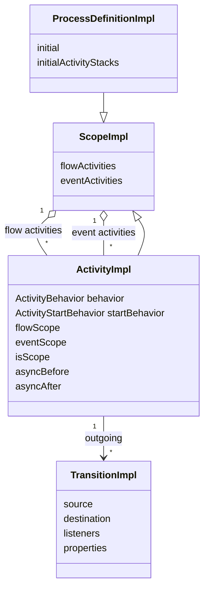
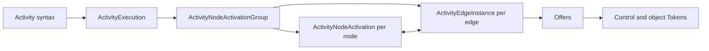
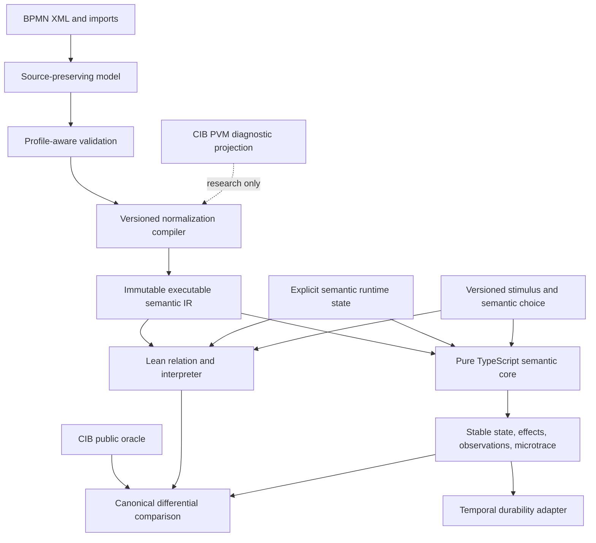

# Semantic representations and execution models

**Status:** Research result with provisional project consequences

**Scope:** CIB Seven BPMN Model API, deployment parser, PVM definition and runtime representations, fUML Activity execution, PSSM State Machine execution, and candidate consequences for the project’s BPMN source model, Lean semantics, pure TypeScript semantic core, and Temporal adapter.

**Decision status:** No production parser, IR schema, token model, scope algebra, or scheduling semantics is selected by this document. Executable discriminators are recorded separately in [Semantic representation spikes](../experiments/SEMANTIC-REPRESENTATION-SPIKES.md).

## Executive result

The premise that CIB Seven has two BPMN representations is directionally right but incomplete. Four representations matter:

| Layer | CIB Seven shape | Lifetime | Primary purpose |
|---|---|---|---|
| Authoring and interchange | Typed BPMN Model API objects over a W3C DOM | While reading, editing, validating, or serializing a model | XML fidelity, namespaces, extensions, BPMN-DI, fluent construction |
| Deployment parsing | Lightweight SAX-built `Element` tree | One deployment compilation | Schema validation, source positions, reference resolution, semantic compilation |
| Executable definition | `ProcessDefinitionImpl`, `ScopeImpl`, `ActivityImpl`, and `TransitionImpl` graph with behavior objects | Shared by deployed Process instances | Resolved topology, operational scopes, compiled conditions/listeners/jobs, fast execution |
| Runtime instance | `PvmExecutionImpl`/`ExecutionEntity` tree plus Tasks, Jobs, subscriptions, variables, incidents, and persistence state | One Process instance | Concurrency, waiting, scope lifecycle, command and transaction state |

The PVM is not a rewrapped XML tree. CIB’s deployment parser is a compiler that validates, resolves, normalizes, sometimes introduces operational structures, and attaches executable behavior.

fUML and PSSM reinforce the architectural separation but use more explicit semantic runtime models. fUML creates node activations, edge instances, offers, and tokens for each Activity execution. PSSM creates a semantic activation hierarchy and a separate active configuration, then performs global run-to-completion event selection.

The strongest provisional project conclusion is:

> Use a source-preserving model for import and diagnostics, compile it into a versioned immutable data-only executable IR, and execute that IR against separate explicit runtime state through a transition relation and bounded executable closure. Preserve provenance, multiplicity, edge-arrival identity, and ownership relations until evidence justifies projection.

## Representation pipeline in CIB Seven


There is no direct object handoff from the Model API builder to the PVM. Deployment serializes the model instance to bytes, and the engine parses those bytes through its separate deployment parser.

## CIB Seven Model API

### What it looks like

[`ModelInstanceImpl`](https://github.com/cibseven/cibseven/blob/5a45b47ea22688d774de97277c3ff7013f54fdd2/model-api/xml-model/src/main/java/org/cibseven/bpm/model/xml/impl/ModelInstanceImpl.java) owns a DOM document and a model-type registry. [`ModelElementInstanceImpl`](https://github.com/cibseven/cibseven/blob/5a45b47ea22688d774de97277c3ff7013f54fdd2/model-api/xml-model/src/main/java/org/cibseven/bpm/model/xml/impl/instance/ModelElementInstanceImpl.java) combines a typed model element, its `ModelElementType`, and its [`DomElement`](https://github.com/cibseven/cibseven/blob/5a45b47ea22688d774de97277c3ff7013f54fdd2/model-api/xml-model/src/main/java/org/cibseven/bpm/model/xml/instance/DomElement.java). [`DomElementImpl`](https://github.com/cibseven/cibseven/blob/5a45b47ea22688d774de97277c3ff7013f54fdd2/model-api/xml-model/src/main/java/org/cibseven/bpm/model/xml/impl/instance/DomElementImpl.java) wraps `org.w3c.dom.Element`.

The BPMN element classes register XML attributes, references, child collections, inheritance, and vendor extensions. For example, [`FlowNodeImpl`](https://github.com/cibseven/cibseven/blob/5a45b47ea22688d774de97277c3ff7013f54fdd2/model-api/bpmn-model/src/main/java/org/cibseven/bpm/model/bpmn/impl/instance/FlowNodeImpl.java) registers incoming and outgoing references, while [`SequenceFlowImpl`](https://github.com/cibseven/cibseven/blob/5a45b47ea22688d774de97277c3ff7013f54fdd2/model-api/bpmn-model/src/main/java/org/cibseven/bpm/model/bpmn/impl/instance/SequenceFlowImpl.java) registers `sourceRef` and `targetRef`.

The builder therefore operates on a typed façade whose mutations immediately affect a live XML document.

### Public builder example

```java
import org.cibseven.bpm.model.bpmn.Bpmn;
import org.cibseven.bpm.model.bpmn.BpmnModelInstance;
import org.cibseven.bpm.model.bpmn.instance.UserTask;
import org.cibseven.bpm.model.xml.instance.DomElement;

BpmnModelInstance model =
    Bpmn.createExecutableProcess("Process_SequentialUserTask")
        .name("Sequential approval")
        .startEvent("Start_None")
        .userTask("UserTask_Approve")
        .name("Approve request")
        .endEvent("End_None")
        .done();

UserTask task = model.getModelElementById("UserTask_Approve");
DomElement xmlElement = task.getDomElement();

assert xmlElement.getLocalName().equals("userTask");
assert xmlElement.getAttribute("id").equals("UserTask_Approve");

String xml = Bpmn.convertToString(model);
```

The call to `userTask` does not create an `ActivityImpl`. It creates a typed BPMN element backed by a DOM node, creates the connecting Sequence Flow, and updates BPMN-DI through the builder machinery.

### Deployment boundary

```java
repositoryService
    .createDeployment()
    .addModelInstance("sequential-user-task.bpmn", model)
    .deploy();
```

[`DeploymentBuilderImpl.addModelInstance`](https://github.com/cibseven/cibseven/blob/5a45b47ea22688d774de97277c3ff7013f54fdd2/engine/src/main/java/org/cibseven/bpm/engine/impl/repository/DeploymentBuilderImpl.java) calls `Bpmn.writeModelToStream`, stores the resulting bytes as a deployment resource, and hands those bytes to the normal deployer path.

When a caller later requests the deployed `BpmnModelInstance`, [`BpmnModelInstanceCache`](https://github.com/cibseven/cibseven/blob/5a45b47ea22688d774de97277c3ff7013f54fdd2/engine/src/main/java/org/cibseven/bpm/engine/impl/persistence/deploy/cache/BpmnModelInstanceCache.java) reparses the original resource. The public model and PVM definition coexist but are not views over the same object graph.

### Why DOM is appropriate here

The authoring layer needs properties that are mostly irrelevant to execution:

- XML namespace and prefix handling
- unknown extension preservation
- BPMN-DI shapes and waypoints
- source-compatible child structure
- mutable editing
- validation and serialization
- round-trip behavior

A live DOM is a defensible implementation choice for this problem. It is a poor candidate for the project’s executable semantic authority because DOM mutation, XML ordering, namespace concerns, and host object identity would leak into Lean, semantic core determinism, and Temporal serialization.

## CIB Seven deployment parse tree

The engine does not compile through the public Model API. [`BpmnParser`](https://github.com/cibseven/cibseven/blob/5a45b47ea22688d774de97277c3ff7013f54fdd2/engine/src/main/java/org/cibseven/bpm/engine/impl/bpmn/parser/BpmnParser.java) uses the engine’s generic SAX parser and builds [`org.cibseven.bpm.engine.impl.util.xml.Element`](https://github.com/cibseven/cibseven/blob/5a45b47ea22688d774de97277c3ff7013f54fdd2/engine/src/main/java/org/cibseven/bpm/engine/impl/util/xml/Element.java).

That element stores the namespace URI, tag, attributes, text, children, and source position. It is deliberately smaller than a standards-preserving authoring DOM.

[`BpmnParse`](https://github.com/cibseven/cibseven/blob/5a45b47ea22688d774de97277c3ff7013f54fdd2/engine/src/main/java/org/cibseven/bpm/engine/impl/bpmn/parser/BpmnParse.java) then:

- validates the schema;
- reads Processes, Collaborations, Messages, Signals, Errors, and diagram information;
- creates Process and activity definitions;
- resolves flow references and defaults;
- validates construct combinations;
- assigns scopes and start behaviors;
- attaches `ActivityBehavior` objects;
- compiles expressions and listeners;
- creates job and event declarations;
- introduces operational structures such as a multi-instance body;
- redirects or normalizes selected source constructs.

This is compiler work. Calling it deserialization hides the most important architectural boundary.

## CIB Seven PVM definition

### Shape



[`ProcessDefinitionImpl`](https://github.com/cibseven/cibseven/blob/5a45b47ea22688d774de97277c3ff7013f54fdd2/engine/src/main/java/org/cibseven/bpm/engine/impl/pvm/process/ProcessDefinitionImpl.java) is a root `ScopeImpl` with a default initial activity and cached start stacks. [`ProcessDefinitionEntity`](https://github.com/cibseven/cibseven/blob/5a45b47ea22688d774de97277c3ff7013f54fdd2/engine/src/main/java/org/cibseven/bpm/engine/impl/persistence/entity/ProcessDefinitionEntity.java) adds deployed product metadata such as version, deployment, forms, authorization, history configuration, and tenant state.

[`ActivityImpl`](https://github.com/cibseven/cibseven/blob/5a45b47ea22688d774de97277c3ff7013f54fdd2/engine/src/main/java/org/cibseven/bpm/engine/impl/pvm/process/ActivityImpl.java) is both an executable activity and a possible nested scope. It contains ordered incoming and outgoing [`TransitionImpl`](https://github.com/cibseven/cibseven/blob/5a45b47ea22688d774de97277c3ff7013f54fdd2/engine/src/main/java/org/cibseven/bpm/engine/impl/pvm/process/TransitionImpl.java) objects, behavior and start-behavior strategies, async flags, properties, and scope relations.

### Flow scope and event scope

[`ScopeImpl`](https://github.com/cibseven/cibseven/blob/5a45b47ea22688d774de97277c3ff7013f54fdd2/engine/src/main/java/org/cibseven/bpm/engine/impl/pvm/process/ScopeImpl.java) explicitly owns two collections:

- flow activities for which it is the `flowScope`;
- event-listener activities for which it is the `eventScope`.

This is special because a containment tree alone cannot answer every lifecycle question. Normal control flow, event installation, interruption, cancellation, and nested execution can have different ownership relations.

The immediate lesson is not “copy these two Java fields.” It is “do not assume one parent relation is enough.” BPMN may ultimately require an explicit relation vocabulary covering source containment, executable flow scope, event scope, variable ownership, cancellation region, and compensation ownership.

### Behavior objects

The parser attaches a behavior strategy to each activity. Examples include:

- [`ExclusiveGatewayActivityBehavior`](https://github.com/cibseven/cibseven/blob/5a45b47ea22688d774de97277c3ff7013f54fdd2/engine/src/main/java/org/cibseven/bpm/engine/impl/bpmn/behavior/ExclusiveGatewayActivityBehavior.java), which selects the first condition-true outgoing transition in stored order and then the default;
- [`ParallelGatewayActivityBehavior`](https://github.com/cibseven/cibseven/blob/5a45b47ea22688d774de97277c3ff7013f54fdd2/engine/src/main/java/org/cibseven/bpm/engine/impl/bpmn/behavior/ParallelGatewayActivityBehavior.java), which counts inactive concurrent executions at the gateway;
- [`UserTaskActivityBehavior`](https://github.com/cibseven/cibseven/blob/5a45b47ea22688d774de97277c3ff7013f54fdd2/engine/src/main/java/org/cibseven/bpm/engine/impl/bpmn/behavior/UserTaskActivityBehavior.java), which creates a persistent Task and leaves the activity when signaled.

This object strategy is effective inside a mutable Java engine. It is not a good direct Lean or TypeScript IR because executable class identity, property bags, listeners, and mutable service dependencies are difficult to serialize, compare, version, and reason about.

### Diagnostic PVM projection example

The following is intentionally an internal diagnostic sketch, not a public compatibility API:

```java
record PvmFlowProjection(String id, String targetId) {}

record PvmNodeProjection(
    String id,
    String behavior,
    String flowScope,
    String eventScope,
    List<PvmFlowProjection> outgoing) {}

List<PvmNodeProjection> projection =
    processEngineConfiguration
        .getCommandExecutorTxRequired()
        .execute(commandContext -> {
          ProcessDefinitionEntity definition =
              commandContext
                .getProcessEngineConfiguration()
                .getDeploymentCache()
                .findDeployedProcessDefinitionById(processDefinitionId);

          return definition.getActivities().stream()
              .map(activity ->
                  new PvmNodeProjection(
                      activity.getId(),
                      activity.getActivityBehavior() == null
                          ? null
                          : activity.getActivityBehavior().getClass().getName(),
                      activity.getFlowScope() == null
                          ? null
                          : activity.getFlowScope().getId(),
                      activity.getEventScope() == null
                          ? null
                          : activity.getEventScope().getId(),
                      activity.getOutgoingTransitions().stream()
                          .map(transition ->
                              new PvmFlowProjection(
                                  transition.getId(),
                                  transition.getDestination().getId()))
                          .toList()))
              .toList();
        });
```

A real projector must recurse through nested flow scopes, enumerate event activities, retain outgoing order, identify defaults and synthetic nodes, and execute wholly inside the command context. It belongs to the diagnostic lane described in [Reference instrumentation](../REFERENCE-INSTRUMENTATION.md).

The first bounded implementation now exists as [PvmDefinitionProjector.java](../../runners/cibseven/src/main/java/org/bpmnlean/cibseven/PvmDefinitionProjector.java). Its M0.2 result confirms the sequential topology and behavior strategies, while also showing that ordinary flow activities have `null` PVM event scope and that CIB normalizes a None End Event’s type to `noneEndEvent`. Those internal facts are retained only in diagnostics; the corresponding public deploy/start/task/complete observations remain the compatibility evidence. The executable result and remaining limits are recorded in [Semantic representation spikes](../experiments/SEMANTIC-REPRESENTATION-SPIKES.md).

## CIB Seven runtime representation

[`PvmExecutionImpl`](https://github.com/cibseven/cibseven/blob/5a45b47ea22688d774de97277c3ff7013f54fdd2/engine/src/main/java/org/cibseven/bpm/engine/impl/pvm/runtime/PvmExecutionImpl.java) contains per-instance state: current activity and transition, parent and child executions, activity-instance identity, variables, and flags such as active, scope, concurrent, ended, and event scope. [`ExecutionEntity`](https://github.com/cibseven/cibseven/blob/5a45b47ea22688d774de97277c3ff7013f54fdd2/engine/src/main/java/org/cibseven/bpm/engine/impl/persistence/entity/ExecutionEntity.java) adds persistence behavior.

The execution tree functions as control-path and scope bookkeeping, but one execution is not one BPMN token:

- an inactive execution can be a scope container;
- a concurrent execution can represent one active path;
- an event-scope execution can exist for event handling;
- a Process or Sub-Process instance is also represented by an execution;
- execution objects participate in persistence and command mechanics.

Therefore, copying the execution tree as the project’s token semantics would import CIB implementation compromises and make normative BPMN reasoning harder.

CIB advances execution through named [`PvmAtomicOperation`](https://github.com/cibseven/cibseven/blob/5a45b47ea22688d774de97277c3ff7013f54fdd2/engine/src/main/java/org/cibseven/bpm/engine/impl/pvm/runtime/operation/PvmAtomicOperation.java) phases such as activity start, behavior execution, scope creation, transition taking, listener invocation, and activity destruction. These phase names are useful diagnostic probe points and inspiration for a microtrace vocabulary. They are not automatically the smallest normative BPMN transition relation.

### A revealing parallel-join behavior

`ParallelGatewayActivityBehavior` counts inactive concurrent executions positioned at the gateway and compares that count with the number of incoming transitions. Its source explicitly notes that it does not ensure one arrival through each incoming flow.

This means the following state can satisfy a count-based join test:

```text
incoming flows: left, right
arrivals:       left, left
missing:        right
```

The project’s executable spike retains this as a deliberate countermodel and compares it with a per-edge provenance account. This is an excellent example of why the OMG BPMN profile and CIB compatibility profile must remain separate.

## fUML execution representations

The current formal OMG release is [fUML 1.5](https://www.omg.org/spec/FUML/1.5). Its [normative specification](https://www.omg.org/spec/FUML/1.5/PDF), syntax-model XMI, semantics-model XMI, and foundational-library XMI define an executable UML subset and an execution model.

### Syntax versus semantic visitors

The syntax contains an `Activity` with `ActivityNode` and `ActivityEdge` elements. One Activity execution creates an `ActivityNodeActivation` for each node and an `ActivityEdgeInstance` for each edge. Concrete activation subclasses provide behavior for concrete syntax kinds.



This execution graph is per invocation. It references the immutable syntax graph but does not mutate syntax into runtime state.

### Concrete reference implementation API

The inspected [fUML Reference Implementation](https://github.com/ModelDriven/fUML-Reference-Implementation) is pinned in [Sources](../SOURCES.md). Its high-level environment API looks like:

```java
import fuml.semantics.commonbehavior.ParameterValueList;
import fuml.syntax.commonbehavior.Behavior;
import org.modeldriven.fuml.environment.Environment;
import org.modeldriven.fuml.environment.ExecutionEnvironment;

Environment environment = Environment.getInstance();
Behavior behavior = environment.findBehavior("ApproveOrder");

ExecutionEnvironment execution = new ExecutionEnvironment(environment);
ParameterValueList outputs = execution.execute(behavior);
```

[`Environment`](https://github.com/ModelDriven/fUML-Reference-Implementation/blob/45e506336d4cd56965d4ad3b684149245f899f3a/org.modeldriven.fuml/src/main/java/org/modeldriven/fuml/environment/Environment.java) creates a `Locus`, `Executor`, `ExecutionFactory`, primitive types, and selection/dispatch strategies. [`ExecutionEnvironment`](https://github.com/ModelDriven/fUML-Reference-Implementation/blob/45e506336d4cd56965d4ad3b684149245f899f3a/org.modeldriven.fuml/src/main/java/org/modeldriven/fuml/environment/ExecutionEnvironment.java) prepares parameters and invokes `locus.executor.execute`.

At the lower level, [`ActivityExecution`](https://github.com/ModelDriven/fUML-Reference-Implementation/blob/45e506336d4cd56965d4ad3b684149245f899f3a/org.modeldriven.fuml/src/main/java/fuml/semantics/activities/ActivityExecution.java) creates an [`ActivityNodeActivationGroup`](https://github.com/ModelDriven/fUML-Reference-Implementation/blob/45e506336d4cd56965d4ad3b684149245f899f3a/org.modeldriven.fuml/src/main/java/fuml/semantics/activities/ActivityNodeActivationGroup.java), then activates the Activity’s nodes and edges:

```java
Activity activity = (Activity) getTypes().getValue(0);

activationGroup = new ActivityNodeActivationGroup();
activationGroup.activityExecution = this;
activationGroup.activate(activity.node, activity.edge);
```

Each [`ActivityNodeActivation`](https://github.com/ModelDriven/fUML-Reference-Implementation/blob/45e506336d4cd56965d4ad3b684149245f899f3a/org.modeldriven.fuml/src/main/java/fuml/semantics/activities/ActivityNodeActivation.java) keeps its syntax node, incoming and outgoing edge instances, held tokens, group, and running state.

### Edge instances, offers, and tokens

[`ActivityEdgeInstance`](https://github.com/ModelDriven/fUML-Reference-Implementation/blob/45e506336d4cd56965d4ad3b684149245f899f3a/org.modeldriven.fuml/src/main/java/fuml/semantics/activities/ActivityEdgeInstance.java) stores pending [`Offer`](https://github.com/ModelDriven/fUML-Reference-Implementation/blob/45e506336d4cd56965d4ad3b684149245f899f3a/org.modeldriven.fuml/src/main/java/fuml/semantics/activities/Offer.java) objects. Sending an offer retains the offered [`Token`](https://github.com/ModelDriven/fUML-Reference-Implementation/blob/45e506336d4cd56965d4ad3b684149245f899f3a/org.modeldriven.fuml/src/main/java/fuml/semantics/activities/Token.java) objects until the target activation takes them. Withdrawal invalidates outstanding offers for an already-consumed token.

The concrete join activation is notably small:

```java
public boolean isReady() {
  boolean ready = true;
  int i = 1;
  while (ready & i <= incomingEdges.size()) {
    ready = incomingEdges.getValue(i - 1).hasOffer();
    i = i + 1;
  }
  return ready;
}
```

[`JoinNodeActivation`](https://github.com/ModelDriven/fUML-Reference-Implementation/blob/45e506336d4cd56965d4ad3b684149245f899f3a/org.modeldriven.fuml/src/main/java/fuml/semantics/activities/JoinNodeActivation.java) therefore retains the identity of the incoming edge supplying readiness.

### What transfers and what does not

Transferable:

- immutable syntax separated from per-execution activations;
- explicit edges and pending offers;
- token provenance and multiplicity;
- readiness checked before atomic consumption;
- visitor or transition behavior selected from syntax kind;
- execution strategies made explicit.

Not directly transferable:

- UML Activity semantics as BPMN semantics;
- object-token and pin rules;
- the mutable Java visitor hierarchy;
- fUML’s exact concurrency and termination rules;
- `Locus` as a Temporal or BPMN scope.

## PSSM execution representations

The current OMG release is [PSSM 1.0](https://www.omg.org/spec/PSSM/). Its [normative specification](https://www.omg.org/spec/PSSM/1.0/PDF) is accompanied by normative syntax-model XMI, semantics-model XMI, and a test-suite XMI.

PSSM extends fUML to executable UML State Machines. It adds two particularly important structures:

1. a semantic activation hierarchy rooted at `StateMachineExecution`, with Region, Vertex, State, Pseudostate, and Transition activations;
2. a separate `StateMachineConfiguration` containing the currently active vertex activations.

The activation hierarchy supplies execution capability. The configuration is the stable semantic state that evolves between run-to-completion steps.

### Global event acceptance

PSSM uses one State Machine event accepter that evaluates a dispatched event against the current configuration. It cannot correctly choose transitions by letting each local transition handler mutate state independently because priority, conflicts, compound transition paths, orthogonal Regions, completion events, and deferred events interact globally.

Conceptual pseudocode:

```java
StateMachineExecution execution = createExecution(stateMachine);
execution.initializeActivationTree();

while (!execution.isTerminated()) {
  EventOccurrence event = execution.eventPool().nextDispatchable();
  StateMachineConfiguration before = execution.currentConfiguration();

  TransitionSet selected =
      execution.eventAccepter().selectCompatibleTransitions(before, event);

  execution.exitSelectedConfiguration(selected);
  execution.executeEffects(selected);
  execution.enterTargetConfiguration(selected);
  execution.raiseCompletionEvents();

  assert execution.currentConfiguration().isStable();
}
```

This is explanatory pseudocode over the normative model, not a library API.

### Run-to-completion

Once an event is dispatched, the State Machine processes the resulting transition selection, exits, effects, entries, and generated completion events until it reaches a new stable configuration before dispatching the next pending event. Lowest common ancestors determine exit and entry paths across nested states.

### What transfers and what does not

Transferable:

- stable semantic configuration distinct from the full activation machinery;
- global event selection over all enabled candidates;
- explicit transition conflicts and priority;
- macrostep versus microstep separation;
- lowest-common-ancestor scope exit and entry;
- deferred and completion events as explicit state;
- a normative executable semantic model paired with a conformance test suite.

Not directly transferable:

- UML State Machine run-to-completion as universal BPMN command semantics;
- UML Region and Vertex hierarchy as BPMN scopes;
- PSSM event priority as BPMN event priority;
- state-machine completion rules as BPMN Process completion.

## Comparative view

| Concern | CIB Seven | fUML | PSSM | Project consequence to test |
|---|---|---|---|---|
| Source model | Typed DOM BPMN model | UML syntax model | UML State Machine syntax | Preserve source separately from execution |
| Deployment normalization | Imperative BPMN parser/compiler | Semantic visitors instantiated at execution | Semantic visitors instantiated for State Machine | Make compile/admission explicit and versioned |
| Shared executable definition | PVM scope/activity/transition graph | Syntax plus execution factory | Syntax plus execution factory | Prefer immutable data-only executable IR |
| Per-instance control state | Execution tree with multiple roles | Node activations, edge instances, offers, tokens | Activation tree plus active configuration | Separate scope, activity, and control-path identities |
| Event readiness | Behaviors and subscriptions | Offers on explicit edges | Global accepter over current configuration | Keep enabled inputs and selection explicit |
| Command/macrostep | Engine command plus PVM atomic operations | Activity firing/offer progression | Run-to-completion step | Define command closure independently |
| Ownership | Flow scope, event scope, execution tree | Activation groups and token holders | Region/State activation hierarchy | One parent field is probably insufficient |
| Implementation style | Mutable Java objects and persistence | Mutable semantic visitor objects | Mutable semantic visitor objects | Use serializable algebraic data and pure transition relations |

## Iterative project reflection

### First reflection: separation is necessary but not sufficient

The existing architecture already separates BPMN input, Lean, semantic core, Temporal, and observations. This research shows that each semantic implementation also needs an internal separation:

```text
source-preserving model
        ↓ compile/admit
executable semantic IR
        +
per-instance runtime state
        ↓ transition relation / executable closure
new state + effects + observations
```

Without this internal split, XML concerns leak into semantics or runtime state leaks into the shared model.

### Second reflection: normalization is a proof boundary

The compiler does more than improve runtime speed. It establishes facts that every later theorem and semantic core step assumes:

- references resolve;
- identities are unique;
- scope relations are legal;
- executable constructs are supported;
- default and conditional flows are well formed;
- synthetic operational structures have a declared meaning;
- runtime lookup order is explicit;
- event and cancellation ownership is known.

Therefore, Lean eventually needs either a verified normalizer or a validity predicate over imported IR plus evidence that the external compiler produced a valid instance. “The parser returned an object” is not a sufficient trust statement.

### Third reflection: avoid both under-modeling and CIB-shaped over-modeling

A minimal graph of node IDs and edges is likely too weak for boundary Events, Event Sub-Processes, multi-instance, compensation, and cancellation. Copying `ActivityImpl`, behavior objects, generic property bags, and `ExecutionEntity` would be too CIB-specific.

The candidate IR should carry only explicit semantic facts, but it must carry enough of them:

```ts
enum NodeKind {
  NoneStart,
  UserTask,
  NoneEnd,
  ExclusiveGateway,
  ParallelGateway,
  BoundaryEvent,
  SubProcess,
  MultiInstanceBody
}

type NodeOrigin =
  | { readonly kind: "source"; readonly elementId: string }
  | {
      readonly kind: "synthetic";
      readonly reason: string;
      readonly sourceElementIds: readonly string[];
    };

interface ScopeRelations {
  readonly containmentScope: string;
  readonly flowScope: string;
  readonly eventScope: string;
  readonly cancellationRegion: string;
}

interface ExecutableNode {
  readonly id: string;
  readonly kind: NodeKind;
  readonly origin: NodeOrigin;
  readonly scopes: ScopeRelations;
  readonly incomingFlowIds: readonly string[];
  readonly outgoingFlowIds: readonly string[];
}
```

This is a discussion type, not a selected schema. The experiment intentionally implements a smaller version.

### Fourth reflection: scope must be modeled as roles, not only a tree

CIB’s dual scopes are an early warning. A final model may need:

- source containment;
- flow ownership;
- scope-instance creation;
- event-subscription ownership;
- variable ownership;
- interruption and cancellation region;
- compensation ownership;
- Process or Sub-Process completion boundary.

Some roles may coincide for most nodes. Collapsing them because they often coincide makes the exceptional constructs painful and error-prone later. The next scope experiment should begin with a boundary Event and Event Sub-Process, not with another sequential Task.

### Fifth reflection: token provenance should be retained longer than seems necessary

The parallel-gateway witness demonstrates that counts erase causal information. Similar information loss can affect:

- inclusive-join reachability;
- event-race ownership;
- cancellation of losing branches;
- multi-instance multiplicity;
- causal trace comparison;
- canonical identity across concurrent identical elements.

An implementation may later derive compact indexes, but the formal state should not erase provenance before the relevant semantics consumes it.

### Sixth reflection: runtime identity needs three levels

At minimum, keep separate:

1. definition identity: the BPMN or synthetic executable element;
2. semantic instance identity: one scope, activity, wait, token, subscription, or effect occurrence;
3. host identity: CIB database ID, Temporal Workflow/Run ID, Activity ID, Task token, or storage row.

Only the first two belong in canonical semantic reasoning. Host IDs remain adapter diagnostics and correlation material.

### Seventh reflection: behavior belongs in the transition system, not in IR objects

CIB and fUML attach mutable behavior/visitor objects to syntax or definition nodes. For Lean and a replay-safe semantic core, a better starting point is:

```lean
inductive NodeKind
  | noneStart
  | userTask
  | noneEnd
  | parallelGateway

def step :
    Profile →
    ExecutableModel →
    RuntimeState →
    SemanticChoice →
    RuntimeState × List Effect × List MicroEvent
```

The IR says what a node is. The transition relation says what that kind may do. The executable interpreter can use enum-based pattern matching while the normative relation retains nondeterministic alternatives.

### Eighth reflection: stable configuration is a first-class contract

PSSM’s separation between activation hierarchy and active configuration suggests a useful project distinction:

- semantic state required to determine all future behavior;
- derived indexes and activation machinery used to execute efficiently;
- canonical public observation projected only at command boundaries.

The semantic core result should make closure explicit:

```ts
interface SemanticTransitionResult {
  readonly outcome:
    | "committed"
    | "rolledBack"
    | "rejected"
    | "semanticFailure"
    | "unsupported";
  readonly stableState: RuntimeState;
  readonly effects: readonly Effect[];
  readonly observations: readonly CanonicalObservation[];
  readonly microtrace?: readonly MicroEvent[];
}
```

The internal loop must distinguish stable external wait, scheduler wait, deadlock, divergence, and bound exhaustion.

### Ninth reflection: centralized selection fits Temporal replay

PSSM’s global event accepter reinforces the existing Temporal boundary. Signal or Update handlers should validate and enqueue versioned inputs. One Workflow loop should invoke the semantic core and select globally compatible semantic progress.

```ts
setHandler(completeTaskSignal, input => {
  inbox.push({ kind: "completeUserTask", ...input });
});

while (!state.isTerminal) {
  await condition(() => inbox.length > 0 || hasDueSemanticTimer(state));
  const stimulus = selectNextStimulus(state, inbox, logicalTime);
  const result = applyStimulus(profile, model, state, stimulus);
  state = result.stableState;
  await dispatchDeclaredEffects(result.effects);
}
```

The handler does not complete a BPMN Task directly. Temporal’s replay order is a durable delivery fact; the semantic core remains the authority for BPMN acceptance, correlation, races, cancellation, and command outcome.

### Tenth reflection: version every boundary that can reinterpret state

The durable identity chain likely needs:

- source resource digest;
- source-model schema version;
- compiler version;
- semantic profile version;
- executable-IR schema version;
- executable semantic digest;
- semantic core semantic version;
- adapter history/version marker.

The exact scheme is undecided. The design must prevent an old Temporal history or persisted runtime state from being silently interpreted by a different compiler or semantic profile.

## Recommended provisional architecture



Required properties of an initial candidate:

- serializable without CIB or Temporal classes;
- structurally comparable across Lean and TypeScript;
- source and synthetic provenance;
- ordered flows and explicit default relation;
- explicit multiplicity and stable identity;
- explicit ownership relations;
- explicit nondeterministic choice inputs;
- no embedded closures, listeners, database entities, or SDK handles;
- validation before execution;
- derived indexes checked against canonical facts;
- observation projection independent of host runtime.

## What not to decide yet

- DOM, `bpmn-moddle`, generated XSD classes, or another source parser
- a universal token versus activation/offer runtime model
- the final list of scope relations
- whether synthetic constructs are nodes, nested definitions, or typed normalization records
- serialized indexes versus recomputed indexes
- exact microstep granularity
- PSSM-style run-to-completion beyond command closure
- behavior of constructs outside the approved Milestone 0 profile

These choices need the discriminating experiments in [Semantic representation spikes](../experiments/SEMANTIC-REPRESENTATION-SPIKES.md), not architectural intuition alone.

## Source basis

Primary project and source evidence:

- [CIB Seven source provenance](../SOURCES.md#cib-seven)
- [fUML reference implementation provenance](../SOURCES.md#fuml-reference-implementation)
- [OMG fUML 1.5 catalog](https://www.omg.org/spec/FUML/1.5) and [normative PDF](https://www.omg.org/spec/FUML/1.5/PDF)
- [OMG PSSM 1.0 catalog](https://www.omg.org/spec/PSSM/) and [normative PDF](https://www.omg.org/spec/PSSM/1.0/PDF)
- [BPMN conformance target](../BPMN-CONFORMANCE-TARGET.md)
- [Reference instrumentation policy](../REFERENCE-INSTRUMENTATION.md)

The CIB and fUML code links point to the immutable upstream revisions recorded in [Sources](../SOURCES.md). PSSM API-like code in this document is explanatory pseudocode over its normative execution model.
