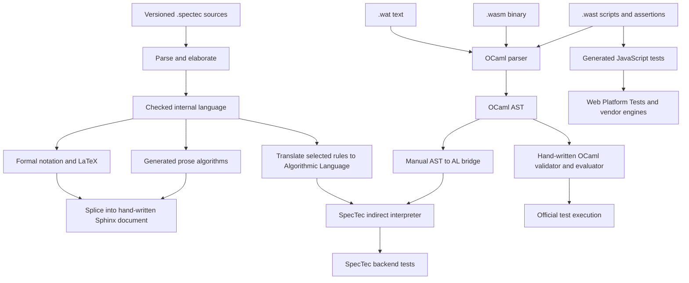

# WebAssembly semantics architecture research and BPMN transfer

**Status:** Research result and bounded recommendation; no new project architecture, dependency, generator, or semantic DSL is adopted by this document

**Inspected baseline:** WebAssembly specification repository revision [`dfa3f32a881aecc60a8c792da3c25787ccb15572`](https://github.com/WebAssembly/spec/tree/dfa3f32a881aecc60a8c792da3c25787ccb15572), plus the standalone SpecTec development repositories and experimental mechanization branches recorded in [Sources](../SOURCES.md#webassembly-specification-and-semantics-workbench), checked out on 2026-07-24

**Question:** How does WebAssembly express, execute, test, and justify its semantics, and which parts should influence this project’s BPMN → Lean → TypeScript semantic core → Temporal → differential pipeline?

## Executive result

WebAssembly does use a reference interpreter, but “the reference interpreter” now denotes two related paths:

1. a long-standing, hand-written OCaml interpreter deliberately optimized for semantic clarity rather than runtime speed;
2. a newer SpecTec workbench whose declarative semantics source is checked, rendered into formal notation and prose, translated into an Algorithmic Language, and indirectly interpreted.

The second path is not yet a fully generated, independent implementation. It copies the first interpreter into its build and still uses it for parsing and decoding, selected validation, numerics, and manual conversions between representations. Its test runner also omits some assertion kinds and designated long tests. The accurate conclusion is therefore:

> WebAssembly is progressively converging specification text, formal rules, executable algorithms, and tests around one checked semantic source, while retaining an explicit manual and legacy trusted base.

The standalone `Wasm-DSL/spectec` repository and `zilinc/spectec` fork are development incubators related to that same work, not two additional independent semantics. Their active branches explore Lean 4, Isabelle, Rocq, Agda, and other mechanization backends. Those branches materially demonstrate the potential of multi-target generation, but their placeholder definitions, admitted proof gaps, transformation pipeline, and incomplete CI make them research evidence rather than proof-producing tools that this project should adopt now.

The most useful transfer to this project is not to build a BPMN SpecTec clone. It is to make each semantic capsule a small, traceable semantics workbench:

```text
normative clause or profile decision
  → named declarative rule
  → executable Lean account and reusable laws
  → independent TypeScript semantic-core behavior
  → portable separating scenarios and assertions
  → CIB compatibility evidence
  → Temporal refinement and replay evidence
```

The current project already has most of those lanes. The next parallel-fork/join capsule is a good bounded place to test the missing connective tissue: stable rule identifiers, a declarative Lean microstep relation paired with the executable evaluator, and a rule-to-evidence matrix. A new semantic DSL or generated TypeScript implementation should be deferred.

## What WebAssembly is trying to achieve

The repository contains the core specification sources, a reference implementation, and the official test suite. Its architecture supports several distinct audiences and obligations:

- language designers need precise rules that expose ambiguity and make proposals reviewable;
- specification readers need approachable prose and compact mathematical notation;
- implementers need unambiguous validation and execution behavior;
- engine vendors need portable conformance tests independent of one implementation language;
- researchers need a formal account suitable for soundness reasoning and separate mechanization;
- maintainers need versioned specifications and repeatable generation and CI.

This is closer to a language-semantics workbench than to a production engine. The OCaml interpreter’s own stated purpose is to clarify exact semantics, not to be fast or to dictate an implementation architecture.

## The actual source-to-evidence architecture



This diagram exposes three facts that a superficial repository reading can miss:

- the specification document is partly hand-authored narrative and partly generated material spliced from SpecTec;
- the hand-written OCaml interpreter remains a separate executable reference;
- the SpecTec interpreter executes translated specification algorithms but still depends materially on the hand-written interpreter.

## Where the standalone SpecTec repositories fit

The repositories have shared lineage and periodically synchronized code:


This is a provenance relation, not a three-way validation arrangement. Agreement among these repositories is weak evidence because substantial implementation and semantic source are shared.

For this study:

- the pinned `WebAssembly/spec` revision is the baseline for current specification sources, the mature OCaml interpreter, the official tests, and integrated SpecTec behavior;
- the pinned main revisions of `Wasm-DSL/spectec` and `zilinc/spectec` document the standalone tool lineage;
- the pinned experimental branch revisions are inspected only to assess future mechanization potential;
- none of the standalone repositories is a project dependency, semantic authority, or conformance oracle.

The standalone architecture reinforces an important design lesson. SpecTec is not merely a pretty notation: it has an external language, a typed and elaborated intermediate language, numerous normalization and totalization passes, and multiple backends. That structure is valuable when many artifacts must remain synchronized, but every pass becomes part of the trusted translation surface. A shared source reduces transcription drift while increasing the importance of generator correctness, explicit unsupported cases, and backend-specific validation.

## How the semantics is expressed

### 1. Object-language syntax is explicit

SpecTec declares the WebAssembly abstract syntax and auxiliary semantic syntax as algebraic forms. Binary and text formats are specified separately from that abstract syntax.

This separation matters. Textual names are resolved to static indices, binary opcodes decode into the same abstract syntax, and execution operates on that abstract syntax plus runtime-only forms. Neither surface representation is the runtime semantics.

The BPMN analogue is:

```text
BPMN XML and BPMN-DI
  → source-preserving model
  → admitted executable IR
  → semantic runtime state
```

The analogy is not exact because BPMN normalization is substantially richer than WebAssembly name and format decoding, but it strongly supports the project’s existing decision not to evaluate raw XML or parser objects inside Temporal.

### 2. Validation is a declarative judgment

WebAssembly validity is defined by typed judgments over syntax and a context. A small representative SpecTec form is:

```spectec
relation Instr_ok: context |- instr : instrtype

rule Instr_ok/nop:
  C |- NOP : eps -> eps
```

Rules are named, premises cite their relation, and auxiliary functions factor reusable conditions. The rendered specification gives equivalent prose and formal notation.

Crucially, the specification distinguishes this declarative type system from an effective validation algorithm. The validation appendix sketches a sound and complete single-pass algorithm, while the hand-written reference interpreter implements a concrete validator. “Declarative requirement” and “chosen executable procedure” are related but not collapsed.

For this project, the corresponding separation is:

```text
BPMN/profile admission predicate
  ≠ parser success
  ≠ one compiler implementation
```

Lean can define the admitted-model predicate and laws over it. The TypeScript source package can implement the production checker/compiler. Correspondence between them must be evidenced rather than inferred.

### 3. Runtime-only structure is part of the semantic model

WebAssembly adds auxiliary syntax for stores, frames, module instances, dynamic addresses, labels, handlers, traps, and other administrative instructions. These forms are not legal source programs; they exist to state execution precisely.

One particularly useful distinction is:

- a static index is a module-local reference to a definition;
- a dynamic address identifies an allocated runtime instance in the abstract store.

That is a close analogue of this project’s identity split:

- BPMN definition identity;
- semantic occurrence or activation identity;
- CIB or Temporal host-runtime identity.

Only the first two belong in portable semantic observations. Host identities remain transport, persistence, or diagnostic correlation material.

Administrative instructions also validate the project’s source-versus-runtime distinction. A synthetic runtime construct can be semantically necessary without pretending it appeared in BPMN XML. Such constructs need provenance and an explicit projection rule so they do not leak accidentally into public observations.

### 4. Execution is small-step operational semantics

The formal semantics defines a configuration and a reduction relation. In current SpecTec:

```spectec
relation Step: config ~> config
relation Steps: config ~>* config
```

A configuration combines state with an instruction sequence. Individual rules rewrite one configuration into another. Context rules determine where a nested step may occur, and reflexive/transitive closure represents zero or more steps.

This is more than implementation pseudocode. It gives a labelled place to ask:

- which rule is enabled;
- what state it reads or changes;
- whether two rules overlap;
- which runtime forms are terminal;
- whether a valid state can get stuck;
- whether execution is deterministic.

The project already has the analogous external-command plus internal-closure shape:

```text
stable state + explicit stimulus
  → admission
  → zero or more semantic microsteps
  → stable state + effects + observations + outcome
```

The next concurrency capsule should make that relationship more explicit in Lean. An executable `applyStimulus` function is useful, but a separate inductive microstep relation can express all permitted transitions without hiding semantic choices in evaluator control flow. The bounded experiment should then prove that each evaluator step is admitted by the relation; completeness or determinism should be attempted only under exact, useful hypotheses.

### 5. Host behavior is a semantic boundary

WebAssembly distinguishes core execution from the embedder and host functions. Host functions are represented abstractly and can return, trap, or diverge. The reference test environment supplies a small `spectest` host module.

The Temporal analogy is strong but limited:

```text
BPMN semantic core declares an effect or wait
  → Temporal adapter realizes durability and delivery
  → Activity or external actor performs host work
  → explicit semantic stimulus reports the relevant result
```

Temporal Workflow tasks, Activity attempts, Event History entries, retries, and Run IDs remain hosting mechanics. They must not become BPMN facts merely because WebAssembly includes host calls in its abstract machine.

## What the reference interpreters actually do

### Hand-written OCaml reference interpreter

The `interpreter/` tree mirrors the specification’s major divisions:

| Directory | Role |
|---|---|
| `syntax` | abstract syntax and types |
| `valid` | validation |
| `runtime` | stores, instances, values, and addresses |
| `exec` | small-step evaluation and instantiation |
| `binary` | decoding and encoding |
| `text` | text parsing and printing |
| `script` | `.wast` commands and assertions |
| `host` | reference host environment |

The evaluator is intentionally “speccy”: its control and data structures are shaped to resemble the operational account. That makes it a semantic oracle and experimentation tool, not a production-engine template.

This corresponds most closely to this project’s Lean reference interpreter, with one major difference: Lean also lets the project state and machine-check reusable laws in the same environment. The OCaml interpreter executes examples and the test corpus, but running it does not prove its correspondence with the formal rules.

### SpecTec indirect interpreter

SpecTec parses its external language, elaborates it into an explicit typed internal language, applies transformation passes, and translates selected rules to an Algorithmic Language. An interpreter then executes those algorithms against a WebAssembly module or invocation.

Conceptually:

```text
semantic rules as data
  → checked and elaborated rules
  → executable algorithms
  → interpreter of those algorithms
  → WebAssembly result
```

This is an attractive direction because the executable path is closer to the source used for prose and formal notation. It also reveals the cost of generation: declarative relations do not automatically become complete, efficient, unambiguous algorithms.

The checked baseline documents and implements manual assumptions:

- rule groups are assumed to partition the intended input space, with explicit exceptions;
- `otherwise` depends on rule order and shape;
- some inverse functions must be hand-written;
- selected relations are converted to function calls and implemented manually;
- state-update translation depends on recognizable syntactic forms;
- store fields and selected runtime categories are hard-coded;
- the parser and binary decoder come from the OCaml reference interpreter;
- selected validation and numeric operations delegate to the reference interpreter;
- OCaml-AST-to-Algorithmic-Language conversion is manual.

The SpecTec backend is therefore valuable executable specification infrastructure, but it is not evidence that generation eliminates semantic engineering or trusted code.

### Test-runner boundary

The hand-written interpreter runs the official `.wast` corpus in its own CI lane. The SpecTec interpreter has a separate backend-test lane. In the inspected baseline, the SpecTec runner:

- skips designated long-running files;
- treats several assertion forms as ignored/pass-through cases;
- uses the reference validator for current module validation;
- relies on the reference parser and decoder.

Those are limitations of the newer indirect-interpreter path, not of the official WebAssembly test corpus or the mature OCaml interpreter. They demonstrate why generated and manual bridges need an explicit capability and trust inventory.

## How executable conformance tests work

The `.wast` script language is larger than the WebAssembly object language. It can define modules, instantiate and register them, invoke exports, inspect globals, and assert outcomes such as:

- successful return values;
- traps and exceptions;
- resource exhaustion;
- malformed binary or text;
- statically invalid modules;
- linking failure;
- instantiation failure.

The scripts are portable specification tests rather than unit tests for OCaml classes. They can also be converted to JavaScript and then Web Platform Tests, allowing browser and engine implementations to run the same behavioral cases.

This is an excellent model for a neutral BPMN assertion vocabulary, with one deliberate project-specific adjustment:

```text
answer-free scenario artifact
  + separately bound assertion/evidence artifact
  → target runner
  → canonical observation
  → verifier-only comparison
```

WebAssembly scripts colocate actions and expected outcomes. This project keeps expected answers out of runner inputs because it uses multiple differential lanes and a legacy compatibility oracle. A future BPMN assertion artifact may bind a scenario digest to expected relations or outcomes, but runners must not receive it as semantic input.

The WebAssembly outcome vocabulary also supports the project’s insistence that these remain distinct:

- parse or decoding failure;
- static invalidity or profile rejection;
- linking or deployment failure;
- runtime semantic failure;
- resource or closure-bound exhaustion;
- harness or infrastructure failure.

## Proof and assurance boundary

The rendered WebAssembly specification states preservation, progress, and soundness theorems. It cites separate machine-verified formalizations of earlier and official semantics. The inspected specification repository itself does not contain a current Coq or Isabelle backend, nor a local proof-assistant gate that proves the current SpecTec sources sound.

SpecTec’s integrated README lists proof-assistant definitions as artifacts its domain knowledge could support. The current official baseline does not include a proof-assistant backend or a local proof-assistant gate. The standalone development repositories do contain experimental Lean 4, Isabelle, Rocq, and Agda branches, so “roadmap only” would now be too strong; the capability is under active development but is not part of the official integrated baseline.

The inspected Lean branch generates substantial Lean syntax, definitions, and inductive relations, which demonstrates that a declarative semantics can eliminate large amounts of repetitive transcription. It also exposes the unfinished trust boundary:

- unspecified or unsupported functions may become `opaque` declarations with inhabitant-based placeholder bodies;
- an inspected typing bridge contains an explicit `sorry`;
- generated artifacts depend on a long sequence of representation-changing passes and name rewrites;
- generated-text tests exist, but the inspected CI workflow does not run the generated Lean project through `lake build`;
- compiling generated declarations would establish elaboration and type correctness, not correspondence of every generated definition with its SpecTec source or the desired usefulness of downstream theorems.

These are normal signs of an experimental backend, not a criticism of its direction. They matter here because this project uses Lean for semantic review and theorem design, not merely as another output syntax.

Therefore:

- mathematical notation is not itself a machine-checked proof;
- a passing reference interpreter is not a proof of the formal rules;
- a generated interpreter is not correct merely because it came from a checked DSL;
- a conformance suite establishes finite behavioral evidence, not universal semantic equivalence.

This sharpens Lean’s real advantage in this project. Lean can keep executable examples, the reference evaluator, declarative relations, checked non-laws, and quantified theorems together. It still cannot prove the production XML compiler, TypeScript implementation, Temporal host, or CIB oracle correct without explicit correspondence models and evidence.

## What the experimental mechanization work changes

It increases confidence in a possible later automation path but does not change the immediate architecture.

Hand-authored Lean remains the better starting point for BPMN capsules because:

- the hard problem is selecting and reviewing operational meaning from OMG requirements, CIB behavior, and explicit profile decisions—not transcribing a settled formal language;
- theorem statements, hypotheses, negative witnesses, and semantic data structures require proof-oriented judgment;
- the TypeScript semantic core must remain independently implemented for differential evidence;
- a generator that fills unsupported meaning with arbitrary inhabitants would be actively unsafe for executable semantic authority.

After several structurally different capsules expose stable repetition and measured drift, a bounded generator could be reconsidered for mechanical artifacts such as:

- syntax or wire-type declarations;
- stable rule indexes and traceability tables;
- serialization and diagnostic views;
- proof and test skeletons that still require explicit completion;
- documentation fragments derived from reviewed semantic metadata.

Any such experiment must emit a visible unsupported/axiom inventory, reject rather than invent missing semantics, record source and generator digests, compile every generated Lean artifact, seed mutations across the generation bridge, and leave reusable laws under direct review. It must not generate both the Lean authority and TypeScript semantic implementation from one unchecked source.

## Translation to this project

| WebAssembly architecture | BPMN project analogue | Important difference |
|---|---|---|
| Binary and text formats | BPMN XML plus namespaces, extensions, and BPMN-DI | BPMN has one normative XML interchange surface but much richer model structure and extension behavior |
| Abstract syntax | Source-preserving model and executable IR | BPMN needs a larger validation and normalization boundary before execution |
| Declarative validation judgments | BPMN/profile admission predicate | BPMN 2.0.2 does not supply an implementation-ready type system |
| Runtime auxiliary syntax | Explicit semantic runtime state and synthetic administrative constructs | BPMN state includes long-lived waits, scopes, subscriptions, races, effects, and compensation |
| Small-step reduction | Semantic microstep relation and internal closure | BPMN commands end at stable externally observable boundaries rather than function return alone |
| Static indices versus dynamic addresses | Definition IDs versus semantic occurrence IDs | Temporal and CIB add a third host-identity layer that canonical semantics must hide |
| Host functions and embedder | Temporal adapter, Activities, users, and external systems | Durable retries, delivery, and workflow history create a larger refinement obligation |
| Hand-written reference interpreter | Executable Lean reference interpreter | Lean also supports machine-checked project laws |
| SpecTec declarative source and indirect interpreter | Capsules plus a possible Lean relation/evaluator pairing | The project does not own the OMG standard and must preserve independent TypeScript implementation |
| `.wast` scripts | Neutral scenarios plus separate assertions and evidence | Expected answers stay verifier-only in this project |
| Engine/browser test consumers | TypeScript core, Temporal adapter, CIB oracle, and future adapters | CIB is an external compatibility oracle with no direct WebAssembly counterpart |
| Preservation and progress | State invariants, stable closure, identity preservation, and refinement laws | BPMN also needs liveness/fairness assumptions and effect-boundary reasoning |
| Versioned spec directories | Versioned BPMN/CIB semantic profiles and IR/history versions | The OMG version, CIB profile, compiler, semantic core, and Temporal history evolve independently |

## What should transfer now

### Stable semantic rule identities

Every material rule in the next capsule should have a durable identifier that survives renaming of functions and test files. For example:

```text
PAR-FORK-01      one arrival creates one activation per outgoing flow
PAR-JOIN-01      join readiness requires provenance from every incoming flow
PAR-JOIN-02      firing consumes exactly the admitted arrivals
TASK-COMPLETE-01 exact occurrence identity is required for completion
```

These examples are proposed naming shapes, not approved parallel semantics. The capsule should own the identifiers and map each one to its normative/profile source, Lean relation or theorem, nearest checked non-law, TypeScript test, CIB evidence, Temporal refinement evidence, and scenario.

### Declarative relation beside executable evaluator

For the next structurally distinct Lean capsule, test this minimal shape:

```lean
inductive MicroStep (profile : Profile) (model : ExecutableModel) :
    RuntimeState → SemanticChoice → RuntimeState → Prop
  | ...

def nextMicrostep? :
    Profile → ExecutableModel → RuntimeState → SemanticChoice →
    Option RuntimeState

theorem nextMicrostep_sound :
    nextMicrostep? profile model before choice = some after →
    MicroStep profile model before choice after := by
  ...
```

The example is a design sketch, not committed API. The point is to keep “what transitions are allowed” separate from “how the executable reference chooses and computes one.” Explicit `SemanticChoice` can preserve deterministic replay without erasing semantic alternatives.

### Rule-indexed evidence, not one undifferentiated support flag

The existing semantic-capsule closure already separates normative, CIB, Lean, TypeScript, and Temporal claim lanes. Add a compact rule-to-evidence matrix to the next capsule and see whether it reduces review time and catches missing links.

Start in Markdown. Do not introduce a schema, generator, or dependency until a second capsule demonstrates recurring drift or measurable maintenance cost.

### Administrative-state projection discipline

Every new runtime-only node, activation, token, subscription, or closure marker should state:

- why source syntax alone is insufficient;
- whether the construct is normative, profile-selected, or implementation-derived;
- its source or synthetic provenance;
- which observations may expose it;
- which invariants must hold when it is created, consumed, or discarded.

### Portable assertion vocabulary

Grow the existing neutral scenario and result contracts one capsule at a time toward an assertion vocabulary analogous to `.wast`, while preserving answer-free target inputs. The parallel capsule should need only:

- exact task-wait multiplicity;
- enabled or refused completion;
- both completion orders;
- join refusal after one branch;
- Process completion after both distinct incoming-flow arrivals;
- count-only duplicate-arrival negative evidence.

## What should not transfer now

### Do not introduce a general semantic DSL

The project does not author BPMN 2.0.2, and the OMG prose and metamodel are not generated from this repository. A new DSL would add another translation and trust boundary before there is evidence that capsule prose plus Lean is the limiting cost.

SpecTec’s multi-backend work makes this a more informed deferral rather than a rejection. Reconsider a small capsule intermediate representation only when at least two or three capsules demonstrate concrete cross-artifact drift that a generator could prevent.

### Do not generate the TypeScript semantic core from Lean or one shared DSL

The TypeScript core is valuable precisely because it is an independent production implementation checked against Lean. Generating both from one semantic source would make agreement cheaper but less informative: a flawed translation or assumption could be shared by construction.

Generated schemas, indexes, test boilerplate, or diagnostic views may be useful later. Generated semantic behavior must not silently replace differential independence.

### Do not imitate WebAssembly’s exact machine shape

An operand stack, instruction stream, and mostly deterministic reduction order fit WebAssembly. BPMN needs persistent scopes, multiple concurrent arrivals, stable waits, logical time, external stimuli, cancellation regions, messages, human interaction, effects, transaction outcomes, and possibly nondeterministic scheduling.

The transferable abstraction is a labelled transition system with explicit runtime configuration—not a stack machine.

### Do not treat a reference interpreter as conformance authority by itself

The Lean interpreter defines the approved project operational account. The OMG standard remains normative, and pinned CIB remains the compatibility oracle. Agreement among Lean, TypeScript, Temporal, and CIB must still be classified when the standard, profile, or observation boundary differs.

## Recommended bounded experiment

Use the planned parallel fork/two User Task waits/parallel join capsule as a transfer experiment with no new dependency.

Required additions to the capsule draft:

1. assign provisional stable rule IDs to fork, task-wait, completion, join-readiness, join-consumption, and closure rules;
2. express the incoming-flow-provenance join as a declarative Lean microstep relation;
3. retain an executable Lean evaluator with explicit completion order or semantic choice;
4. prove evaluator-step soundness against the relation for the represented parallel slice;
5. retain the count-only join as an executable checked non-law;
6. map each rule ID to the exact CIB witness, TypeScript test, Temporal refinement/replay case, and canonical observation;
7. measure added authoring time, review clarity, drift caught, Lean feedback time, and duplicated facts at capsule closure.

Success is not “the pattern looks elegant.” Keep it only if it catches a real omission, makes a theorem more reusable, or materially improves review and trace diagnosis without breaking the fast feedback budget.

The experiment should not:

- generate TypeScript transition code;
- create a general BPMN semantics language;
- formalize arbitrary BPMN XML;
- add Coq, Isabelle, SpecTec, or another dependency;
- claim correspondence between all Lean relations and production code;
- reorder the already planned parallel capsule.

## Resulting recommendation

Adopt the following as working recommendations for the next capsule, subject to its normal approval:

- stable named semantic rules;
- explicit syntax/admission/runtime layers;
- declarative Lean microsteps paired with an executable evaluator and a soundness bridge;
- rule-indexed portable evidence;
- explicit inventories for manual bridges and hidden administrative state.

Defer:

- a machine-readable capsule manifest;
- generated documentation from semantic source;
- generated test suites from individual rules;
- a general semantics DSL;
- generated Lean or TypeScript implementations;
- additional proof assistants.

This preserves the project’s strongest current property: independent evidence lanes connected by explicit contracts rather than agreement by construction.

## Source basis and inspected trust boundary

Primary upstream material:

- [WebAssembly specification repository](https://github.com/WebAssembly/spec/tree/dfa3f32a881aecc60a8c792da3c25787ccb15572)
- [SpecTec goals and language](https://github.com/WebAssembly/spec/blob/dfa3f32a881aecc60a8c792da3c25787ccb15572/spectec/README.md)
- [SpecTec interpreter design and retained reference dependencies](https://github.com/WebAssembly/spec/blob/dfa3f32a881aecc60a8c792da3c25787ccb15572/spectec/doc/Interpreter.md)
- [SpecTec backend assumptions](https://github.com/WebAssembly/spec/blob/dfa3f32a881aecc60a8c792da3c25787ccb15572/spectec/doc/Assumptions.md)
- [hand-written reference interpreter](https://github.com/WebAssembly/spec/blob/dfa3f32a881aecc60a8c792da3c25787ccb15572/interpreter/README.md)
- [current declarative execution rules](https://github.com/WebAssembly/spec/blob/dfa3f32a881aecc60a8c792da3c25787ccb15572/specification/wasm-latest/4.3-execution.instructions.spectec)
- [runtime configuration source](https://github.com/WebAssembly/spec/blob/dfa3f32a881aecc60a8c792da3c25787ccb15572/specification/wasm-latest/4.0-execution.configurations.spectec)
- [official core test-suite organization](https://github.com/WebAssembly/spec/blob/dfa3f32a881aecc60a8c792da3c25787ccb15572/test/README.md)
- [rendered execution conventions](https://webassembly.github.io/spec/core/exec/conventions.html)
- [rendered validation conventions](https://webassembly.github.io/spec/core/valid/conventions.html)
- [rendered soundness statements](https://webassembly.github.io/spec/core/appendix/properties.html)
- [standalone `Wasm-DSL/spectec` development repository](https://github.com/Wasm-DSL/spectec/tree/acc6e834ff403c82554d081237f327346190ad96)
- [`zilinc/spectec` standalone SpecTec README](https://github.com/zilinc/spectec/blob/6191426aeaa1e9a30f2372526b5d1018eb34f0ac/spectec/README.md)
- [inspected experimental Lean backend](https://github.com/zilinc/spectec/tree/40077cfe8e5879d742462f915ca2e29e4c7574ed/spectec/src/backend-lean)
- [inspected generated Lean project and explicit proof bridge](https://github.com/zilinc/spectec/tree/40077cfe8e5879d742462f915ca2e29e4c7574ed/spectec/test-lean)

The exact checkout provenance and license boundary are recorded in [Sources](../SOURCES.md#webassembly-specification-and-semantics-workbench).
